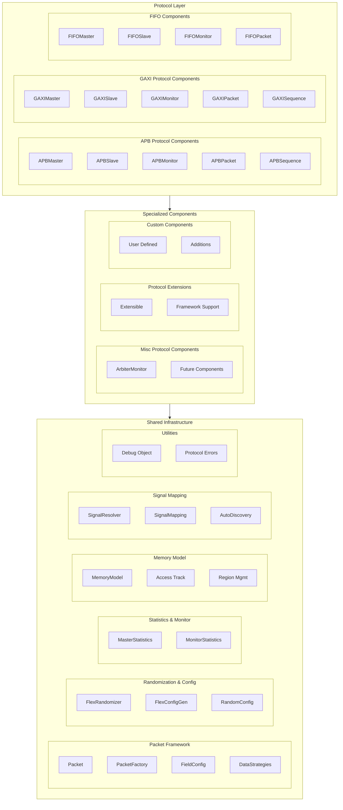

<!-- RTL Design Sherpa Documentation Header -->
<table>
<tr>
<td width="80">
  <a href="https://github.com/sean-galloway/RTLDesignSherpa">
    
  </a>
</td>
<td>
  <strong>RTL Design Sherpa</strong> · <em>Learning Hardware Design Through Practice</em><br>
  <sub>
    <a href="https://github.com/sean-galloway/RTLDesignSherpa">GitHub</a> ·
    <a href="https://github.com/sean-galloway/RTLDesignSherpa/blob/main/docs/DOCUMENTATION_INDEX.md">Documentation Index</a> ·
    <a href="https://github.com/sean-galloway/RTLDesignSherpa/blob/main/LICENSE">MIT License</a>
  </sub>
</td>
</tr>
</table>

---

<!-- End Header -->

# Components Overview

The Components directory forms the core of the CocoTBFramework, providing a comprehensive suite of verification components for multiple bus protocols and shared infrastructure. This modular architecture enables efficient verification of complex digital designs while maintaining consistency and reusability across different protocols.

## Framework Philosophy

The components framework is built on several key principles:

**Protocol Modularity**: Each protocol (APB, GAXI, FIFO) has its own dedicated components while sharing common infrastructure
**Shared Infrastructure**: Common functionality is centralized in shared components to eliminate duplication and ensure consistency
**Performance Optimization**: Components are designed for high-performance parallel testing with optimized signal handling
**Ease of Use**: Factory functions and sensible defaults make component creation straightforward
**Extensibility**: Clean interfaces allow for easy addition of new protocols and customization

## Architecture Overview

### Three-Layer Architecture

The components follow a three-layer architecture that promotes reusability and maintainability:



## Protocol Components

### APB (Advanced Peripheral Bus)
The APB components provide comprehensive support for ARM's Advanced Peripheral Bus protocol:

**Core Components**:
- **APBMaster**: Drives APB transactions with configurable timing and error injection
- **APBSlave**: Responds to APB transactions with memory backing and realistic delays
- **APBMonitor**: Observes APB protocol activity for verification and debugging

**Advanced Features**:
- Multi-slave support with address mapping
- Register map integration for systematic testing
- Error injection and protocol violation detection
- Comprehensive statistics and performance monitoring

### GAXI (Generic AXI-like)
GAXI components provide a simplified AXI-like interface that's easier to use while maintaining AXI semantics:

**Core Components**:
- **GAXIMaster**: Drives GAXI transactions with pipeline debugging and statistics
- **GAXISlave**: Receives transactions with configurable ready delays and memory operations
- **GAXIMonitor**: Observes transactions with protocol violation detection

**Key Features**:
- Simplified handshaking compared to full AXI4
- Pipeline state tracking and debugging
- Multi-signal and single-signal field modes
- High-performance optimizations with signal caching

### FIFO (First-In-First-Out)
FIFO components handle buffer and queue protocols with various interface types:

**Core Components**:
- **FIFOMaster**: Drives write transactions into FIFO with flow control
- **FIFOSlave**: Reads transactions from FIFO with configurable timing
- **FIFOMonitor**: Monitors FIFO transactions without interfering

**Specialized Features**:
- Multi-field packet support for complex data structures
- Memory model integration for data verification
- Flow control and depth monitoring
- Performance statistics and error detection

### Misc Components
Specialized components for specific verification scenarios:

**Current Components**:
- **ArbiterMonitor**: Enhanced monitoring for round-robin and weighted arbiters
- **Future Extensions**: Framework ready for additional specialized components

## Shared Infrastructure

### Packet Management Framework
The packet framework provides protocol-agnostic data handling:

**Core Classes**:
- **Packet**: Base packet class with field management and validation
- **PacketFactory**: Factory pattern for packet creation and configuration
- **FieldConfig**: Rich field configuration with validation and encoding
- **DataStrategies**: High-performance data collection and driving

**Key Features**:
- Thread-safe operations for parallel testing
- Automatic field validation and masking
- FIFO packing/unpacking support
- Performance optimization through caching

### Randomization & Configuration
Advanced randomization capabilities for directed and constrained testing:

**Components**:
- **FlexRandomizer**: Multi-mode randomization engine (constrained, sequence, custom)
- **FlexConfigGen**: Helper for creating weighted randomization profiles
- **RandomizationConfig**: High-level randomization configuration framework

**Capabilities**:
- Constrained random with weighted bins
- Sequence-based deterministic patterns
- Custom generator functions
- Object bin support for non-numeric values
- Dependency management between fields

### Statistics & Monitoring
Comprehensive performance and error tracking:

**Components**:
- **MasterStatistics**: Statistics for master/slave components (latency, throughput, errors)
- **MonitorStatistics**: Basic monitor statistics (transactions, violations)

**Features**:
- Real-time performance metrics
- Moving window averages
- Error categorization and tracking
- Protocol violation detection
- Comprehensive reporting

### Memory Modeling
High-performance memory simulation with diagnostics:

**Features**:
- NumPy-based backend for performance
- Comprehensive access tracking
- Memory region management
- Boundary checking and validation
- Coverage analysis and reporting

### Signal Mapping
Intelligent signal resolution and mapping:

**Features**:
- Pattern-based signal discovery
- Manual signal mapping override
- Prefix handling for cocotb compatibility
- Support for different naming conventions

## Design Patterns

### Factory Pattern
All protocol components use factory functions for simplified creation:

```python
# Simple component creation with sensible defaults
master = create_apb_master(dut, "APB_Master", "apb_", dut.clk)
slave = create_gaxi_slave(dut, "GAXI_Slave", "", dut.clk, field_config)

# Complete system creation
components = create_fifo_test_environment(
    dut=dut, clock=dut.clk, data_width=32, include_monitors=True
)
```

### Observer Pattern
Monitors use the observer pattern for non-intrusive transaction monitoring:

```python
# Monitor automatically observes transactions
monitor = create_apb_monitor(dut, "Monitor", "apb_", dut.clk)

# Add callbacks for real-time processing
monitor.add_callback(scoreboard.add_transaction)
monitor.add_callback(statistics_collector.update_stats)
```

### Strategy Pattern
Different strategies for data handling and randomization:

```python
# Different randomization strategies
randomizer = FlexRandomizer({
    'data': 'uniform',     # Uniform distribution
    'addr': 'weighted',    # Weighted random
    'ctrl': 'sequence'     # Sequence-based
})

# Different data strategies
component.set_data_strategy('cached')  # For performance
component.set_data_strategy('direct')  # For debugging
```

## Performance Characteristics

### Optimizations
- **40% faster data collection** through cached signal references
- **30% faster data driving** through optimized functions
- **Thread-safe caching** for parallel test execution
- **Reduced memory overhead** through efficient data structures

### Scalability
- Support for large field configurations
- Efficient memory usage in long-running tests
- Parallel component operation
- Resource-conscious design

## Integration Guidelines

### Component Creation
1. **Choose appropriate protocol** based on design interface
2. **Configure field definitions** using FieldConfig for packet structure
3. **Create components** using factory functions with sensible defaults
4. **Set up randomization** using FlexRandomizer for test patterns
5. **Integrate memory models** for data verification and tracking

### Cross-Protocol Verification
The shared infrastructure enables seamless cross-protocol verification:

```python
# Use same memory model across protocols
shared_memory = MemoryModel(num_lines=1024, bytes_per_line=4)

# Components from different protocols
apb_master = create_apb_master(dut, "APB", "apb_", clk, memory=shared_memory)
gaxi_slave = create_gaxi_slave(dut, "GAXI", "", clk, config, memory=shared_memory)

# Shared statistics and monitoring
stats_collector = MasterStatistics()
apb_master.set_statistics(stats_collector)
gaxi_slave.set_statistics(stats_collector)
```

### Test Framework Integration
Components integrate seamlessly with test frameworks:

```python
@cocotb.test()
async def comprehensive_test(dut):
    # Create components using factories
    components = create_protocol_testbench(dut, protocol='gaxi')
    
    # Run test sequences
    await components['master'].send_sequence(test_sequence)
    
    # Verify results using shared infrastructure
    stats = components['master'].get_stats()
    assert stats['success_rate_percent'] > 95
```

## Future Extensibility

The components framework is designed for easy extension:

### New Protocols
Adding new protocols follows established patterns:
1. Create protocol-specific components inheriting from base classes
2. Implement protocol-specific packet and sequence classes
3. Add factory functions for component creation
4. Integrate with shared infrastructure

### Enhanced Features
- Additional randomization modes and constraints
- Enhanced memory model features
- Advanced signal mapping capabilities
- Extended debugging and analysis tools

The components framework provides a robust, scalable foundation for verification that can adapt to evolving requirements while maintaining consistency and performance across all supported protocols.