<!-- RTL Design Sherpa Documentation Header -->
<table>
<tr>
<td width="80">
  <a href="https://github.com/sean-galloway/RTLDesignSherpa">
    
  </a>
</td>
<td>
  <strong>RTL Design Sherpa</strong> · <em>Learning Hardware Design Through Practice</em><br>
  <sub>
    <a href="https://github.com/sean-galloway/RTLDesignSherpa">GitHub</a> ·
    <a href="https://github.com/sean-galloway/RTLDesignSherpa/blob/main/docs/DOCUMENTATION_INDEX.md">Documentation Index</a> ·
    <a href="https://github.com/sean-galloway/RTLDesignSherpa/blob/main/LICENSE">MIT License</a>
  </sub>
</td>
</tr>
</table>

---

<!-- End Header -->

# FIFO Components Index

This directory contains the FIFO protocol components for the CocoTBFramework. These components provide comprehensive FIFO verification capabilities including masters, slaves, monitors, and supporting utilities.

## Directory Structure

```
CocoTBFramework/components/fifo/
├── __init__.py
├── fifo_command_handler.py
├── fifo_component_base.py
├── fifo_factories.py
├── fifo_master.py
├── fifo_monitor.py
├── fifo_monitor_base.py
├── fifo_packet.py
├── fifo_sequence.py
└── fifo_slave.py
```

## Component Documentation

### Core Components
- [**fifo_component_base.py**](fifo_component_base.md) - Unified base class for all FIFO components
- [**fifo_master.py**](fifo_master.md) - FIFO Master (writer) component for driving transactions
- [**fifo_slave.py**](fifo_slave.md) - FIFO Slave (reader) component for consuming transactions
- [**fifo_monitor.py**](fifo_monitor.md) - FIFO Monitor for observing transactions
- [**fifo_monitor_base.py**](fifo_monitor_base.md) - Base class for monitoring components

### Data and Configuration
- [**fifo_packet.py**](fifo_packet.md) - FIFO packet class for transaction data
- [**fifo_sequence.py**](fifo_sequence.md) - Sequence generator for test patterns

### Utilities and Factories
- [**fifo_factories.py**](fifo_factories.md) - Factory functions for creating FIFO components
- [**fifo_command_handler.py**](fifo_command_handler.md) - Command handler for sequence processing

## Quick Start

### Basic FIFO Test Setup
```python
# Create simple FIFO components
components = create_simple_fifo_test(dut, clock, data_width=32)
master = components['master']
slave = components['slave']
command_handler = components['command_handler']

# Create and send transactions
packet = master.create_packet(data=0xDEADBEEF)
await master.send(packet)
```

### Complete Test Environment
```python
# Create full test environment with monitors
components = create_fifo_test_environment(
    dut=dut,
    clock=clock,
    data_width=32,
    include_monitors=True
)

master = components['master']
slave = components['slave']
monitors = [components['master_monitor'], components['slave_monitor']]
scoreboard = components['scoreboard']
```

## Architecture Overview

### Component Hierarchy

```mermaid
graph TB
    Base["FIFOComponentBase<br/>(shared functionality)"]
    Master["FIFOMaster<br/>(BusDriver + base)"]
    MonBase["FIFOMonitorBase<br/>(BusMonitor + base)"]
    Monitor["FIFOMonitor<br/>(pure monitoring)"]
    Slave["FIFOSlave<br/>(monitoring + read driving)"]

    Base --> Master
    Base --> MonBase
    MonBase --> Monitor
    MonBase --> Slave
```



### Key Features
- **Unified Infrastructure**: All components share common signal resolution, data handling, and statistics
- **Flexible Signal Mapping**: Automatic signal discovery with manual override support
- **Performance Optimized**: Caching and unified data strategies for high-performance testing
- **Rich Statistics**: Comprehensive monitoring and performance tracking
- **Memory Integration**: Built-in memory model support for data verification
- **Randomization**: Integrated timing randomization with FlexRandomizer

## Usage Patterns

### Master-Slave Testing
```python
# Set up master and slave
master = create_fifo_master(dut, "Master", clock)
slave = create_fifo_slave(dut, "Slave", clock)

# Send data from master
packet = master.create_packet(data=0x12345678)
await master.send(packet)

# Slave automatically receives and processes
observed_packets = slave.get_observed_packets()
```

### Sequence-Based Testing
```python
# Create test sequence
sequence = FIFOSequence.create_pattern_test("patterns", data_width=32)

# Process sequence through command handler
command_handler = create_fifo_command_handler(master, slave)
responses = await command_handler.process_sequence(sequence)
```

### Monitoring and Verification
```python
# Set up monitors
write_monitor = create_fifo_monitor(dut, "WriteMonitor", clock, is_slave=False)
read_monitor = create_fifo_monitor(dut, "ReadMonitor", clock, is_slave=True)

# Monitor automatically observes transactions
# Access observed data through standard cocotb _recvQ
write_transactions = write_monitor._recvQ
read_transactions = read_monitor._recvQ
```

## Signal Mapping

FIFO components support both automatic signal discovery and manual mapping:

### Automatic Discovery
```python
# Components automatically discover signals
master = FIFOMaster(dut, "Master", "", clock, field_config)
```

### Manual Signal Mapping
```python
# Override signal names when needed
signal_map = {
    'write': 'wr_en',
    'full': 'fifo_full',
    'data': 'wr_data'
}
master = FIFOMaster(dut, "Master", "", clock, field_config, signal_map=signal_map)
```

## Performance Features

### Optimized Data Handling
- **Signal Caching**: Pre-resolved signal references for fast access
- **Data Strategies**: High-performance collection and driving with 40% speedup
- **Memory Integration**: NumPy-based memory model for efficient data storage

### Statistics and Monitoring
- **Real-time Metrics**: Transaction counts, throughput, latency tracking
- **Error Detection**: Protocol violations, X/Z detection, FIFO overflow/underflow
- **Coverage Analysis**: Transaction coverage and pattern analysis

## Integration

### With Shared Components
FIFO components integrate seamlessly with shared framework components:
- **FieldConfig**: For packet structure definition
- **FlexRandomizer**: For timing and data randomization
- **MemoryModel**: For data storage and verification
- **Statistics**: For performance monitoring

### With Test Framework
```python
@cocotb.test()
async def fifo_test(dut):
    # Use factory functions for easy setup
    components = create_fifo_with_monitors(dut, clock)
    
    # Run test sequences
    sequence = FIFOSequence.create_stress_test("stress", count=100)
    await components['command_handler'].process_sequence(sequence)
    
    # Verify results
    stats = components['master'].get_stats()
    assert stats['master_stats']['success_rate_percent'] > 95
```

## Navigation
- [**Back to Components**](../index.md) - Return to components directory
- [**Framework Overview**](../../index.md) - Return to main framework
