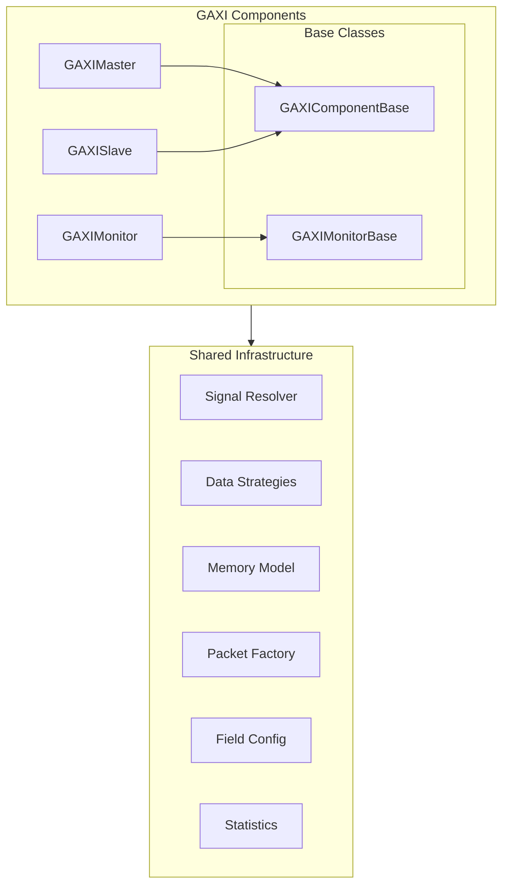
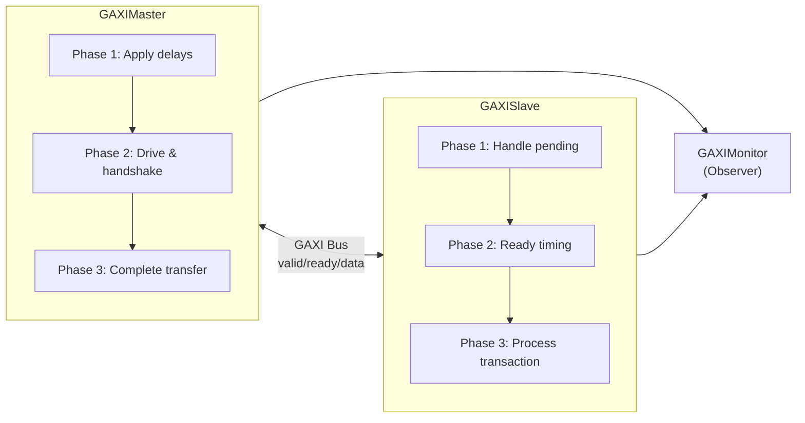
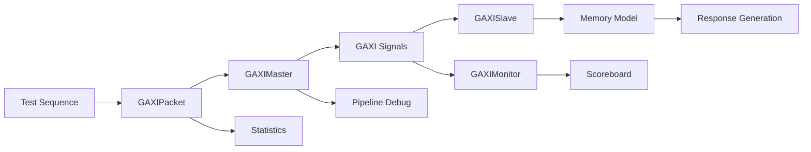

<!-- RTL Design Sherpa Documentation Header -->
<table>
<tr>
<td width="80">
  <a href="https://github.com/sean-galloway/RTLDesignSherpa">
    
  </a>
</td>
<td>
  <strong>RTL Design Sherpa</strong> · <em>Learning Hardware Design Through Practice</em><br>
  <sub>
    <a href="https://github.com/sean-galloway/RTLDesignSherpa">GitHub</a> ·
    <a href="https://github.com/sean-galloway/RTLDesignSherpa/blob/main/docs/DOCUMENTATION_INDEX.md">Documentation Index</a> ·
    <a href="https://github.com/sean-galloway/RTLDesignSherpa/blob/main/LICENSE">MIT License</a>
  </sub>
</td>
</tr>
</table>

---

<!-- End Header -->

# GAXI Components Overview

The GAXI (Generic AXI) components provide a simplified, high-performance AXI-like protocol implementation for verification environments. These components are designed to eliminate code duplication while maintaining exact timing compatibility and providing enhanced debugging capabilities.

## Architecture Overview

The GAXI component architecture follows a hierarchical design with shared base classes and unified infrastructure:



## Key Design Principles

### 1. **Unified Base Classes**
- **GAXIComponentBase**: Common functionality for all GAXI components
- **GAXIMonitorBase**: Shared monitoring capabilities for slaves and monitors
- Eliminates code duplication while preserving exact APIs

### 2. **Performance Optimization**
- Cached signal references for 40% faster data collection
- Thread-safe operation for parallel testing environments
- Optimized data strategies eliminate repeated signal lookups
- Pre-computed field validation rules

### 3. **Enhanced Debugging**
- Structured pipeline phases with state tracking
- Optional pipeline debugging with detailed transition logging
- Comprehensive statistics collection at multiple levels
- Protocol violation detection and reporting

### 4. **Flexible Configuration**
- Automatic signal discovery with manual override capability
- Multi-signal and single-signal field modes
- Configurable timing and randomization patterns
- Memory model integration for transaction processing

## Component Relationships

### Master - Slave Communication



### Data Flow Architecture



## Signal Resolution System

The GAXI components use an advanced signal resolution system:

### Automatic Discovery
- Pattern matching against DUT ports with parameter combinations
- Support for different signal naming conventions (`i_`/`o_` prefixes)
- Multi-signal mode for individual field signals
- Single-signal mode for combined data signals

### Manual Override
```python
signal_map = {
    'valid': 'master_valid_signal',
    'ready': 'slave_ready_signal', 
    'data': 'transfer_data_signal'
}
component = GAXIMaster(dut, ..., signal_map=signal_map)
```

### Mode Support
- **Single-signal mode**: All fields packed into one data signal
- **Multi-signal mode**: Individual signals for each field
- **Mixed mode**: Combination based on field configuration

## Pipeline Architecture

### GAXIMaster Pipeline
1. **Phase 1**: Apply configurable delays using randomizer
2. **Phase 2**: Drive signals and wait for ready handshake
3. **Phase 3**: Complete transfer and clean up signals

### GAXISlave Pipeline  
1. **Phase 1**: Handle pending transactions (deferred captures)
2. **Phase 2**: Apply ready delays and assert ready signal
3. **Phase 3**: Detect handshake and process transaction

### Timing Modes
- **Skid mode**: Standard pipeline with immediate data capture
- **FIFO MUX mode**: Pipeline with immediate data capture
- **FIFO FLOP mode**: Pipeline with delayed data capture (slave side only)

## Memory Integration

### Unified Memory Operations
```python
# Write to memory
success, error = component.write_to_memory_unified(packet)

# Read from memory  
success, data, error = component.read_from_memory_unified(packet)
```

### Memory Model Features
- High-performance NumPy backend
- Access tracking and coverage analysis
- Region management for logical organization
- Transaction-based read/write operations
- Boundary checking and validation

## Statistics and Monitoring

### Master Statistics
- Transaction throughput and latency metrics
- Protocol violation tracking
- Flow control and backpressure monitoring
- Error categorization and reporting

### Slave Statistics
- Transaction acceptance rates and processing times
- Protocol compliance monitoring
- Memory operation tracking
- Pipeline efficiency metrics

### Monitor Statistics
- Observed transaction counting
- Protocol violation detection
- X/Z signal violation tracking
- Coverage analysis

## Randomization and Timing

### FlexRandomizer Integration
```python
# Constrained random delays
constraints = {
    'valid_delay': ([(0, 0), (1, 5), (10, 20)], [0.6, 0.3, 0.1]),
    'ready_delay': ([(0, 2), (3, 8)], [0.8, 0.2])
}
randomizer = FlexRandomizer(constraints)
```

### Timing Profiles
- **Backtoback**: Zero delay for maximum throughput
- **Fast**: Mostly zero delay with occasional small delays
- **Constrained**: Balanced distribution for realistic testing
- **Stress**: Wide variation for corner case testing

## Error Handling and Recovery

### Pipeline Error Recovery
- Automatic signal cleanup on timeout or error
- Graceful degradation for missing signals
- Comprehensive error reporting with context
- Reset handling during operation

### Protocol Validation
- Valid/ready handshake verification
- Signal value validation (X/Z detection)
- Timing constraint checking
- Memory boundary validation

## Factory System

### Simple Component Creation
```python
# Create individual components
master = create_gaxi_master(dut, "Master", "", clock, field_config)
slave = create_gaxi_slave(dut, "Slave", "", clock, field_config)

# Create complete system
system = create_gaxi_components(dut, clock, field_config=field_config)
```

### Test Environment Setup
```python
# Complete test environment with defaults
env = create_gaxi_test_environment(dut, clock, data_width=32)
```

## Performance Characteristics

### Optimizations
- **40% faster data collection** through cached signal references
- **30% faster data driving** through cached driving functions
- **Thread-safe caching** for parallel test execution
- **Reduced memory overhead** through efficient data structures

### Scalability
- Support for large field configurations (optimized initialization)
- Efficient memory usage in long-running tests
- Parallel test execution capabilities
- Resource-conscious operation

## Integration Points

### CocoTB Integration
- Standard BusDriver/BusMonitor inheritance
- Compatible with cocotb timing and event model
- Proper signal handling and lifecycle management
- Reset and clock domain handling

### Framework Integration
- Shared component infrastructure utilization
- Scoreboard and transformer compatibility
- Statistics aggregation and reporting
- Test framework integration patterns

## Advanced Features

### Dependency Tracking
- Transaction dependency chains in sequences
- Completion-based dependency resolution
- Circular dependency detection
- Order enforcement for dependent transactions

### Debug Capabilities
- Pipeline state visualization
- Signal transition logging
- Performance bottleneck identification
- Memory access pattern analysis

### Extensibility
- Plugin architecture for custom behavior
- Callback systems for transaction processing
- Custom field configurations and packet types
- Protocol-specific extensions and modifications

The GAXI components provide a robust, high-performance foundation for AXI-like protocol verification while maintaining simplicity of use and comprehensive debugging capabilities.