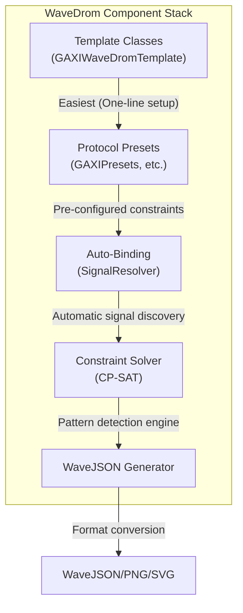

<!-- RTL Design Sherpa Documentation Header -->
<table>
<tr>
<td width="80">
  <a href="https://github.com/sean-galloway/RTLDesignSherpa">
    
  </a>
</td>
<td>
  <strong>RTL Design Sherpa</strong> · <em>Learning Hardware Design Through Practice</em><br>
  <sub>
    <a href="https://github.com/sean-galloway/RTLDesignSherpa">GitHub</a> ·
    <a href="https://github.com/sean-galloway/RTLDesignSherpa/blob/main/docs/DOCUMENTATION_INDEX.md">Documentation Index</a> ·
    <a href="https://github.com/sean-galloway/RTLDesignSherpa/blob/main/LICENSE">MIT License</a>
  </sub>
</td>
</tr>
</table>

---

<!-- End Header -->

# WaveDrom Timing Diagram Generation

**Version:** 3.0 (Auto-Binding + Protocol Presets)
**Status:** ✅ Production Ready
**Last Updated:** 2025-10-06

---

## Overview

The WaveDrom infrastructure provides automated timing diagram generation for digital protocols using constraint-based pattern detection and the WaveDrom JSON format. The system uses CP-SAT constraint solving to identify specific protocol behaviors and generate publication-quality timing diagrams.

### Key Features

✅ **Automatic Signal Discovery** - Uses SignalResolver to find signals without manual binding
✅ **Protocol-Specific Presets** - Pre-configured constraints for GAXI, APB, AXI4, AXI4-Lite, AXI-Stream
✅ **Segmented Capture** - Isolate specific scenarios for clean, deterministic waveforms
✅ **Field-Based Formatting** - Automatic hex/dec/bin formatting based on signal type
✅ **Arrow Annotations** - Show signal relationships and data flow
✅ **Labeled Groups** - Organize signals into logical interface groups

---

## Documentation Structure

### Getting Started
- **[Quick Start Guide](wavedrom_quick_start.md)** - Get running in 5 minutes
- **[Protocol Presets](wavedrom_protocol_presets.md)** - GAXI, APB, AXI4, AXIL4, AXIS examples
- **Wavedrom GAXI Example *(see TestTutorial)*** - Complete walkthrough with 6 scenarios

### Core Concepts
- **[Auto-Binding Guide](wavedrom_auto_binding.md)** - SignalResolver integration
- **[Segmented Capture](wavedrom_segmented_capture.md)** - Isolation pattern for clean waveforms
- **[Requirements & Best Practices](wavedrom_requirements.md)** - Design rules for quality diagrams

### Advanced Topics
- **Wavedrom Troubleshooting *(documentation planned)*** - Common issues and solutions
- **vcd2wavedrom2 Script *(see Scripts)*** - Convert VCD files to WaveJSON

---

## Quick Example

```python
from CocoTBFramework.tbclasses.wavedrom_user.gaxi import GAXIWaveDromTemplate

@cocotb.test()
async def my_test(dut):
    # One-line setup with automatic signal discovery
    gaxi_wave = GAXIWaveDromTemplate(
        dut=dut,
        signal_prefix="wr_",     # Finds: wr_valid, wr_ready, wr_data
        data_width=32,
        preset="comprehensive"    # Detects: handshake, back2back, stall, idle
    )

    await gaxi_wave.start_sampling()

    # Run your test transactions...
    # ...

    results = await gaxi_wave.stop_sampling()
    # WaveJSON files automatically generated in sim_build/
```

**Output:** Publication-quality timing diagrams in PNG/SVG format showing protocol behavior.

---

## Supported Protocols

| Protocol | Template Class | Status | Presets Available |
|----------|---------------|--------|-------------------|
| **GAXI** | `GAXIWaveDromTemplate` | ✅ Production | basic_handshake, comprehensive, performance, debug |
| **APB** | `APBWaveDromTemplate` | ✅ Production | basic_rw, comprehensive, debug, timing, error |
| **AXI4** | `AXI4Presets` (manual setup) | ✅ Ready | write_basic, read_basic, comprehensive, debug |
| **AXI4-Lite** | `AXIL4Presets` (manual setup) | ✅ Ready | write_basic, read_basic, comprehensive, debug |
| **AXI-Stream** | `AXISPresets` (manual setup) | ✅ Ready | basic_handshake, comprehensive, performance, debug |

*Note: AXI4/AXIL4/AXIS do not yet have Template classes but use the same setup pattern with `setup_*_constraints_with_boundaries()`*

---

## Architecture

### Component Stack



### Workflow

1. **Setup** - Create template or configure solver manually
2. **Signal Binding** - Automatic discovery via SignalResolver or manual binding
3. **Constraint Definition** - Use presets or create custom temporal patterns
4. **Capture** - Segmented sampling for each scenario
5. **Solve** - CP-SAT finds matching patterns in signal data
6. **Generate** - Create WaveJSON with formatting, arrows, groups
7. **Render** - Convert to PNG/SVG with `wavedrom-cli`

---

## File Locations

### Source Code
- **Constraint Solver**: `bin/CocoTBFramework/components/wavedrom/constraint_solver.py`
- **WaveJSON Generator**: `bin/CocoTBFramework/components/wavedrom/wavejson_gen.py`
- **Signal Binder**: `bin/CocoTBFramework/components/wavedrom/signal_binder.py`
- **Protocol Presets**:
  - `bin/CocoTBFramework/tbclasses/wavedrom_user/gaxi.py`
  - `bin/CocoTBFramework/tbclasses/wavedrom_user/apb.py`
  - `bin/CocoTBFramework/tbclasses/wavedrom_user/axi4.py`
  - `bin/CocoTBFramework/tbclasses/wavedrom_user/axil4.py`
  - `bin/CocoTBFramework/tbclasses/wavedrom_user/axis.py`

### Example Tests
- **GAXI Comprehensive**: `val/amba/test_gaxi_wavedrom_example.py`
- **Script for PNG/SVG generation**: `val/amba/wd_cmd.sh`

### Documentation
- **This directory**: `docs/markdown/CocoTBFramework/components/wavedrom/`
- **Assets**: `docs/markdown/assets/WAVES/` (generated PNG/SVG files)

---

## Next Steps

1. **New Users**: Start with [Quick Start Guide](wavedrom_quick_start.md)
2. **GAXI Users**: Follow Wavedrom GAXI Example *(see TestTutorial)*
3. **Other Protocols**: See [Protocol Presets](wavedrom_protocol_presets.md)
4. **Troubleshooting**: Check Wavedrom Troubleshooting *(documentation planned)*

---

## Version History

- **v3.0 (2025-10-06)**: Added AXI4/AXIL4/AXIS protocol presets, arrow annotations, labeled groups
- **v2.0 (2025-10-04)**: SignalResolver auto-binding integration
- **v1.5 (2025-10-05)**: Segmented capture implementation
- **v1.0 (2025-09)**: Initial constraint-based WaveDrom generation

---

## Related Documentation

- [CocoTB Framework Overview](../components_overview.md)
- [Field Configuration](../shared/components_shared_field_config.md)
- [Signal Mapping Helper](../shared/components_shared_signal_mapping_helper.md)
- TestTutorial Index *(documentation planned)*
