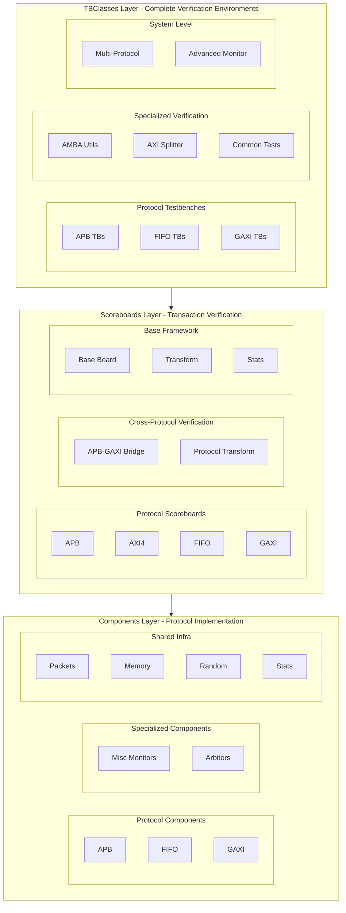

<!-- RTL Design Sherpa Documentation Header -->
<table>
<tr>
<td width="80">
  <a href="https://github.com/sean-galloway/RTLDesignSherpa">
    
  </a>
</td>
<td>
  <strong>RTL Design Sherpa</strong> · <em>Learning Hardware Design Through Practice</em><br>
  <sub>
    <a href="https://github.com/sean-galloway/RTLDesignSherpa">GitHub</a> ·
    <a href="https://github.com/sean-galloway/RTLDesignSherpa/blob/main/docs/DOCUMENTATION_INDEX.md">Documentation Index</a> ·
    <a href="https://github.com/sean-galloway/RTLDesignSherpa/blob/main/LICENSE">MIT License</a>
  </sub>
</td>
</tr>
</table>

---

<!-- End Header -->

**[← Back to Main Index](../index.md)** | **[CocoTBFramework Overview](overview.md)**

# CocoTBFramework Index

Welcome to the CocoTBFramework - a comprehensive verification framework built on top of CocoTB that provides protocol-specific components, advanced scoreboards, and complete testbench environments for digital design verification.

## Overview
- [**Framework Overview**](overview.md) - Complete architectural overview and framework philosophy

## Core Directories

### Verification Components
- [**Components**](components/components_index.md) - Protocol-specific verification components including masters, slaves, monitors, and supporting utilities
  - **APB**: Advanced Peripheral Bus protocol components
  - **FIFO**: First-In-First-Out buffer protocol components  
  - **GAXI**: Generic AXI-like protocol components
  - **Misc**: Specialized monitoring components
  - **Shared**: Common infrastructure used across all protocols

### Transaction Verification
- [**Scoreboards**](scoreboards/scoreboards_index.md) - Comprehensive transaction verification and comparison infrastructure
  - **Protocol Scoreboards**: APB, AXI4, FIFO, GAXI transaction verification
  - **Cross-Protocol**: APB-GAXI bridge verification with protocol transformation
  - **Base Framework**: Common scoreboard infrastructure and transformer support

### Complete Testbench Environments
- [**TBClasses**](tbclasses/tbclasses_index.md) - High-level testbench classes providing complete verification environments
  - **Protocol Testbenches**: APB, FIFO, GAXI testbench orchestration
  - **Specialized Verification**: AMBA utilities, AXI splitter, common testing modules
  - **Infrastructure**: Base classes, advanced monitoring, utilities

## Quick Start

### Basic Component Usage
```python
# Create protocol components
from CocoTBFramework.components.gaxi import create_gaxi_master, create_gaxi_slave
from CocoTBFramework.components.shared import FieldConfig, FlexRandomizer

# Set up field configuration
field_config = FieldConfig()
field_config.add_field("addr", 32, format="hex")
field_config.add_field("data", 32, format="hex")

# Create components
master = create_gaxi_master(dut, "Master", "", dut.clk, field_config)
slave = create_gaxi_slave(dut, "Slave", "", dut.clk, field_config)

# Send transaction
packet = master.create_packet(addr=0x1000, data=0xDEADBEEF)
await master.send(packet)
```

### Scoreboard Integration
```python
# Create scoreboard for verification
from CocoTBFramework.scoreboards.gaxi_scoreboard import GAXIScoreboard

scoreboard = GAXIScoreboard("TestSB", field_config, log=logger)

# Connect to monitors
master_monitor.add_callback(scoreboard.add_expected)
slave_monitor.add_callback(scoreboard.add_actual)

# Generate report
error_count = scoreboard.report()
assert error_count == 0, f"Verification failed with {error_count} errors"
```

### Complete Testbench
```python
# Use high-level testbench classes
from CocoTBFramework.tbclasses.gaxi.gaxi_buffer import GaxiBufferTB

@cocotb.test()
async def test_gaxi_buffer(dut):
    # Environment configuration
    os.environ['TEST_DEPTH'] = '16'
    os.environ['TEST_DATA_WIDTH'] = '32'
    
    # Create and run testbench
    tb = GaxiBufferTB(dut, wr_clk=dut.clk, wr_rstn=dut.rstn)
    await tb.initialize()
    await tb.basic_test(num_packets=100)
```

## Architecture Overview

### Three-Layer Framework Architecture



## Key Features

### 🎯 **Protocol Coverage**
- **APB**: Advanced Peripheral Bus with multi-slave support and register testing
- **FIFO**: Buffer protocols with flow control and multi-field support
- **GAXI**: Generic AXI-like interface with simplified handshaking
- **AXI4**: Full AXI4 protocol support with ID tracking and channel separation
- **Cross-Protocol**: Bridge verification and protocol transformation

### 🎲 **Advanced Randomization**
- **FlexRandomizer**: Multi-mode randomization (constrained, sequence, custom)
- **FlexConfigGen**: Profile-based randomization with weighted constraints
- **Pattern Generation**: Burst, stress, corner case, and custom patterns
- **Constraint Management**: Field dependencies and validation rules

### 📊 **Comprehensive Verification**
- **Transaction Matching**: Automatic expected vs actual comparison
- **Protocol Compliance**: Signal timing and handshake verification
- **Memory Modeling**: High-performance NumPy-backed memory simulation
- **Statistics Tracking**: Performance metrics, error analysis, coverage reporting

### 🚀 **Performance Optimization**
- **Signal Caching**: 40% faster data collection through cached references
- **Thread-Safe Operations**: Parallel test execution support
- **Memory Efficiency**: Optimized data structures and cleanup
- **Scalable Architecture**: Efficient handling of large test suites

### 🔧 **Developer Experience**
- **Factory Functions**: One-line component creation with sensible defaults
- **Environment Configuration**: Extensive environment variable support
- **Advanced Monitoring**: Real-time performance profiling and analysis
- **Comprehensive Logging**: Structured logging with configurable verbosity

## Usage Patterns

### Component-Level Testing
```python
# Direct component usage for specific protocol testing
from CocoTBFramework.components.apb import create_apb_master, create_apb_sequence

master = create_apb_master(dut, "APB_Master", "apb_", dut.clk)
sequence = create_apb_sequence(pattern="stress", num_regs=100)

for packet in sequence:
    await master.send(packet)
```

### System-Level Verification
```python
# Complete system verification with multiple protocols
from CocoTBFramework.tbclasses.misc.tbbase import TBBase
from CocoTBFramework.scoreboards.apb_gaxi_scoreboard import APBGAXIScoreboard

class SystemTestbench(TBBase):
    def __init__(self, dut):
        super().__init__(dut, "SystemTest")
        self.setup_protocols()
        self.setup_scoreboards()
        self.setup_monitoring()
    
    async def run_system_test(self):
        await self.run_cross_protocol_verification()
        self.analyze_system_performance()
```

### Cross-Protocol Bridge Testing
```python
# Verify protocol bridges with transformation
from CocoTBFramework.scoreboards.apb_gaxi_scoreboard import APBGAXIScoreboard

bridge_sb = APBGAXIScoreboard("Bridge_Verification", log=logger)

# Monitor both sides of the bridge
apb_monitor.add_callback(bridge_sb.add_apb_transaction)
gaxi_monitor.add_callback(bridge_sb.add_gaxi_command)
gaxi_monitor.add_callback(bridge_sb.add_gaxi_response)

# Verify bridge functionality
error_count = bridge_sb.report()
```

## Getting Started

### Installation and Setup
1. **Clone Framework**: Get the CocoTBFramework repository
2. **Install Dependencies**: CocoTB, NumPy, and other required packages
3. **Set Environment**: Configure PYTHONPATH and simulator settings
4. **Run Examples**: Execute provided example tests to verify setup

### Basic Workflow
1. **Choose Components**: Select appropriate protocol components for your design
2. **Configure Tests**: Set up field configurations and test parameters
3. **Create Testbench**: Use factory functions or TBClasses for complete environments
4. **Add Verification**: Integrate scoreboards for transaction checking
5. **Run and Analyze**: Execute tests and analyze results with comprehensive reporting

### Advanced Features
1. **Custom Protocols**: Extend framework for proprietary protocols
2. **Complex Scenarios**: Use TBClasses for multi-protocol system verification
3. **Performance Analysis**: Enable advanced monitoring for optimization
4. **Continuous Integration**: Integrate with CI/CD systems for automated verification

## Support and Documentation

Each directory contains comprehensive documentation including:
- **API References**: Detailed class and method documentation
- **Usage Examples**: Real-world usage patterns and best practices
- **Integration Guides**: How to integrate with existing verification flows
- **Performance Tips**: Optimization strategies for large-scale verification

The CocoTBFramework provides a complete verification ecosystem that scales from simple unit tests to complex system-level verification while maintaining consistency, performance, and ease of use across all verification scenarios.