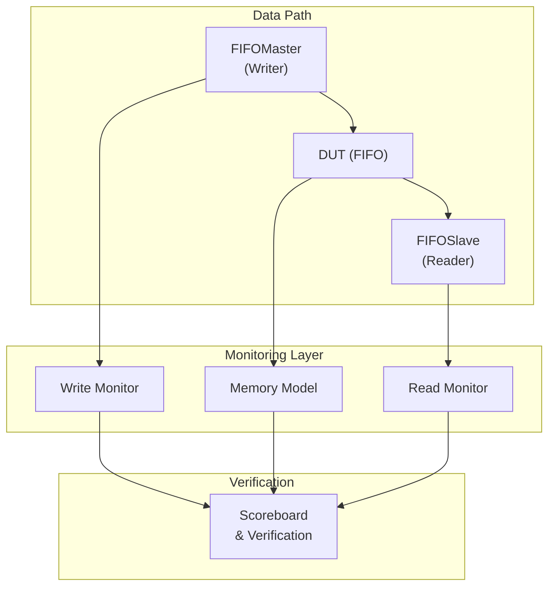

<!-- RTL Design Sherpa Documentation Header -->
<table>
<tr>
<td width="80">
  <a href="https://github.com/sean-galloway/RTLDesignSherpa">
    
  </a>
</td>
<td>
  <strong>RTL Design Sherpa</strong> · <em>Learning Hardware Design Through Practice</em><br>
  <sub>
    <a href="https://github.com/sean-galloway/RTLDesignSherpa">GitHub</a> ·
    <a href="https://github.com/sean-galloway/RTLDesignSherpa/blob/main/docs/DOCUMENTATION_INDEX.md">Documentation Index</a> ·
    <a href="https://github.com/sean-galloway/RTLDesignSherpa/blob/main/LICENSE">MIT License</a>
  </sub>
</td>
</tr>
</table>

---

<!-- End Header -->

# FIFO Testbench Components Index

This directory contains the FIFO testbench components for the CocoTBFramework. These testbenches provide comprehensive FIFO verification capabilities for various FIFO configurations and use cases.

## Directory Structure

```
CocoTBFramework/tbclasses/fifo/
├── __init__.py
├── fifo_buffer.py
├── fifo_buffer_configs.py
├── fifo_buffer_field.py
├── fifo_buffer_multi.py
├── fifo_buffer_multi_sigmap.py
└── fifo_data_collect_tb.py
```

## Testbench Documentation

### Core FIFO Testbenches
- [**fifo_buffer.py**](fifo_buffer.md) - Basic FIFO buffer testbench with single signal interface
- [**fifo_buffer_field.py**](fifo_buffer_field.md) - Multi-field FIFO testbench for complex data structures
- [**fifo_buffer_multi.py**](fifo_buffer_multi.md) - Multi-signal FIFO testbench for parallel data paths
- [**fifo_buffer_multi_sigmap.py**](fifo_buffer_multi_sigmap.md) - Multi-signal FIFO testbench with signal mapping capabilities

### Specialized Testbenches
- [**fifo_data_collect_tb.py**](fifo_data_collect_tb.md) - Data collection FIFO testbench with multiple input channels and arbitration

### Configuration Files
- [**fifo_buffer_configs.py**](fifo_buffer_configs.md) - Configuration definitions for FIFO testbench field configurations

## Quick Start

### Basic FIFO Testbench Usage
```python
from CocoTBFramework.tbclasses.fifo.fifo_buffer import FifoBufferTB

@cocotb.test()
async def test_basic_fifo(dut):
    tb = FifoBufferTB(dut)
    await tb.initialize()
    await tb.test_basic_traffic(packet_count=100)
    tb.verify_results()
```

### Multi-Field FIFO Testing
```python
from CocoTBFramework.tbclasses.fifo.fifo_buffer_field import FifoFieldBufferTB

@cocotb.test() 
async def test_field_fifo(dut):
    tb = FifoFieldBufferTB(dut, super_debug=True)
    await tb.initialize()
    await tb.test_field_isolation(100)
    await tb.test_randomized_fields(500)
    tb.verify_results()
```

### Data Collection FIFO Testing
```python
from CocoTBFramework.tbclasses.fifo.fifo_data_collect_tb import DataCollectTB

@cocotb.test()
async def test_data_collect(dut):
    tb = DataCollectTB(dut)
    await tb.initialize() 
    await tb.test_multi_channel_input(packets_per_channel=50)
    await tb.test_arbiter_fairness()
    tb.verify_results()
```

## Environment Variables

All FIFO testbenches support configuration through environment variables:

### Common Parameters
- `TEST_DEPTH`: FIFO depth (default: varies by testbench)
- `TEST_DATA_WIDTH`: Data width in bits (default: 32)
- `TEST_MODE`: Operation mode ('fifo_mux', 'fifo_simple')
- `TEST_KIND`: Clock domain ('sync', 'async')
- `TEST_CLK_WR`: Write clock period in ns (default: 10)
- `TEST_CLK_RD`: Read clock period in ns (default: 10)
- `SEED`: Random seed for reproducible tests (default: 12345)

### Multi-Field Parameters
- `TEST_ADDR_WIDTH`: Address field width in bits
- `TEST_CTRL_WIDTH`: Control field width in bits

### Data Collection Parameters
- `CHUNKS`: Number of data chunks per channel
- `ID_WIDTH`: ID field width in bits
- `OUTPUT_FIFO_DEPTH`: Output FIFO depth

## Test Categories

### Functional Tests
- **Basic Traffic**: Simple read/write operations
- **Randomized Traffic**: Random packet patterns with various traffic profiles
- **Field Isolation**: Testing individual field behavior
- **Signal Mapping**: Custom signal name mapping verification

### Stress Tests
- **High Throughput**: Maximum bandwidth testing
- **Back-to-Back**: Continuous packet streaming
- **Mixed Traffic**: Combined read/write patterns

### Edge Case Tests
- **Empty/Full Conditions**: FIFO boundary testing
- **Clock Domain Crossing**: Async FIFO verification
- **Arbitration**: Multi-channel input arbitration testing

## Architecture Overview

All FIFO testbenches follow a common architecture pattern:



## Features

### Randomization
- **FlexConfigGen Integration**: Modern randomization using FlexConfigGen profiles
- **Configurable Profiles**: 'conservative', 'moderate', 'aggressive', 'balanced' traffic patterns
- **Field-Specific Randomization**: Individual field randomization control

### Monitoring
- **Comprehensive Coverage**: Full transaction monitoring on both read and write sides
- **Memory Modeling**: Built-in memory models for data tracking
- **Error Detection**: Automatic data integrity verification

### Debugging
- **Super Debug Mode**: Enhanced logging and debug capabilities
- **Signal Mapping**: Custom signal name mapping for different DUT interfaces
- **Statistics Tracking**: Detailed test execution statistics and reporting