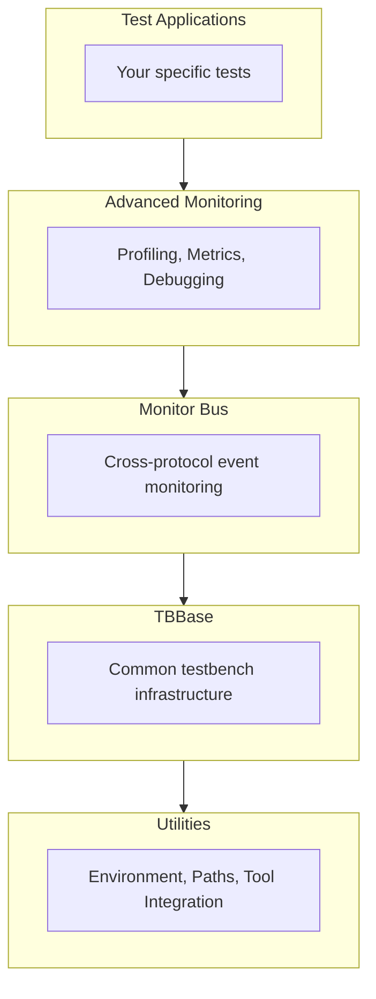

<!-- RTL Design Sherpa Documentation Header -->
<table>
<tr>
<td width="80">
  <a href="https://github.com/sean-galloway/RTLDesignSherpa">
    
  </a>
</td>
<td>
  <strong>RTL Design Sherpa</strong> · <em>Learning Hardware Design Through Practice</em><br>
  <sub>
    <a href="https://github.com/sean-galloway/RTLDesignSherpa">GitHub</a> ·
    <a href="https://github.com/sean-galloway/RTLDesignSherpa/blob/main/docs/DOCUMENTATION_INDEX.md">Documentation Index</a> ·
    <a href="https://github.com/sean-galloway/RTLDesignSherpa/blob/main/LICENSE">MIT License</a>
  </sub>
</td>
</tr>
</table>

---

<!-- End Header -->

# CocoTBFramework/tbclasses/misc Directory Index

This directory contains miscellaneous testbench classes and utilities that provide essential functionality for creating comprehensive testbenches in the CocoTBFramework. These components serve as building blocks for advanced verification environments.

## Directory Structure

```
CocoTBFramework/tbclasses/misc/
├── advanced_monitoring.py
├── monbus_components.py
├── tbbase.py
└── utilities.py
```

## Overview
- [**Overview**](tbclasses_misc_overview.md) - Complete overview of the misc utilities directory

## Component Documentation

### Core Testbench Infrastructure
- [**tbbase.py**](tbclasses_misc_tbbase.md) - Base testbench class providing common infrastructure and utilities for all testbenches
- [**utilities.py**](tbclasses_misc_utilities.md) - Common utilities for path management, environment setup, and waveform viewing

### Advanced Monitoring and Analysis
- [**advanced_monitoring.py**](tbclasses_misc_advanced_monitoring.md) - Advanced monitoring capabilities with profiling, debugging, and comprehensive reporting
- [**monbus_components.py**](tbclasses_misc_monbus_components.md) - Monitor bus components for protocol-agnostic monitoring and event tracking

## Quick Start

### Basic Testbench Setup
```python
from CocoTBFramework.tbclasses.misc.tbbase import TBBase
from CocoTBFramework.tbclasses.misc.utilities import get_paths

# Set up paths and create testbench
module, repo_root, tests_dir, log_dir, paths = get_paths({
    'rtl': 'rtl',
    'tb': 'testbench'
})

class MyTestbench(TBBase):
    def __init__(self, dut):
        super().__init__(dut, "MyTest")
        # Add your testbench-specific initialization
```

### Advanced Monitoring Integration
```python
from CocoTBFramework.tbclasses.misc.advanced_monitoring import advanced_monitoring

@cocotb.test()
async def test_with_monitoring(dut):
    with advanced_monitoring("comprehensive_test") as monitor:
        # Your test code here
        monitor.checkpoint("initialization_complete")
        # More test operations
        monitor.checkpoint("main_test_complete")
        # Final verification
```

### Monitor Bus Setup
```python
from CocoTBFramework.tbclasses.misc.monbus_components import create_monbus_master, create_monbus_slave

# Create monitor bus components
master = create_monbus_master(dut, unit_id=9, agent_id=99)
slave = create_monbus_slave(dut, expected_unit_id=9, expected_agent_id=99)

# Send monitoring packet
packet = master.create_error_packet(event_code=1, channel_id=5, data=0xDEADBEEF)
await master.send(packet)
```

## Component Features

### 🏗️ **TBBase Infrastructure**
- Common testbench initialization and setup
- Standardized logging and reporting
- Clock and reset management
- Test configuration handling
- Component lifecycle management

### 🔧 **Utilities Framework**
- Path resolution and management
- Environment variable handling
- Simulator detection and configuration
- Waveform viewer integration
- Build system integration

### 📊 **Advanced Monitoring**
- Real-time performance profiling
- Memory usage tracking
- Test execution metrics
- Checkpoint-based debugging
- Comprehensive test reporting
- Statistical analysis and visualization

### 🚌 **Monitor Bus System**
- Protocol-agnostic event monitoring
- 64-bit structured packet format
- Multiple event types (error, completion, timeout, performance, debug)
- Automatic field extraction and validation
- Cross-protocol monitoring capabilities
- Integration with any bus protocol (AXI, AHB, APB, custom)

## Architecture Overview



## Integration Patterns

### Complete Testbench Integration
```python
from CocoTBFramework.tbclasses.misc import TBBase, advanced_monitoring, create_monbus_master

class ComprehensiveTestbench(TBBase):
    def __init__(self, dut):
        super().__init__(dut, "ComprehensiveTest")
        
        # Set up monitor bus
        self.monitor_master = create_monbus_master(dut, unit_id=1, agent_id=10)
        
        # Initialize your components
        self.setup_components()
    
    async def run_monitored_test(self, test_name):
        with advanced_monitoring(test_name) as monitor:
            # Test execution with monitoring
            monitor.checkpoint("test_start")
            await self.execute_test_sequence()
            monitor.checkpoint("test_complete")
            
            # Send monitoring data
            await self.monitor_master.send_completion_packet(
                event_code=10, channel_id=1, data=self.get_test_results()
            )
```

## Navigation
- [**Back to tbclasses**](../tbclasses_index.md) - Return to main tbclasses index
- [**Back to CocoTBFramework**](../../index.md) - Return to main framework index