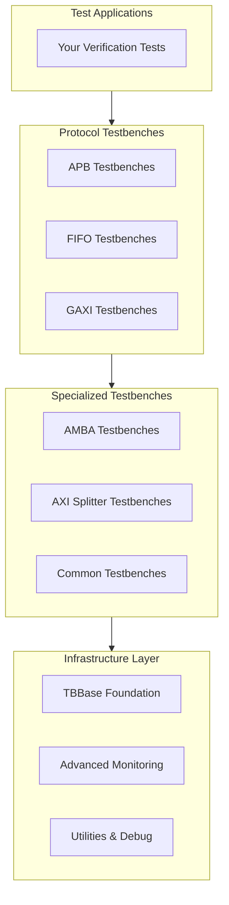

<!-- RTL Design Sherpa Documentation Header -->
<table>
<tr>
<td width="80">
  <a href="https://github.com/sean-galloway/RTLDesignSherpa">
    
  </a>
</td>
<td>
  <strong>RTL Design Sherpa</strong> · <em>Learning Hardware Design Through Practice</em><br>
  <sub>
    <a href="https://github.com/sean-galloway/RTLDesignSherpa">GitHub</a> ·
    <a href="https://github.com/sean-galloway/RTLDesignSherpa/blob/main/docs/DOCUMENTATION_INDEX.md">Documentation Index</a> ·
    <a href="https://github.com/sean-galloway/RTLDesignSherpa/blob/main/LICENSE">MIT License</a>
  </sub>
</td>
</tr>
</table>

---

<!-- End Header -->

# TBClasses Index

This directory contains testbench classes that provide high-level testbench functionality and specialized verification environments for the CocoTBFramework. These classes operate at the testbench orchestration level, managing complex verification scenarios and providing comprehensive testing capabilities.

## Overview
- [**Overview**](overview.md) - Complete overview of the tbclasses directory and testbench architecture

## Testbench Categories

### Protocol-Specific Testbenches
- [**APB Testbenches**](apb/index.md) - APB protocol testbench classes for command handling, configuration management, and register testing
- [**FIFO Testbenches**](fifo/index.md) - FIFO protocol testbench classes for buffer verification with comprehensive field and signal support
- [**GAXI Testbenches**](gaxi/index.md) - GAXI protocol testbench classes for Generic AXI-like buffer components and data collection

### Specialized Verification
- [**AMBA Testbenches**](amba/index.md) - AMBA protocol utilities including clock gating control, randomization configurations, and CDC verification
- [**AXI Splitter**](axi_splitter/index.md) - Specialized testbenches for verifying AXI transaction splitting functionality across memory boundaries

### Common Testing Modules
- [**Common Testbenches**](common/index.md) - Comprehensive testing modules for digital circuit components including arithmetic, memory, and protocol testing

### Infrastructure & Utilities
- [**Misc Utilities**](misc/index.md) - Essential testbench infrastructure including base classes, advanced monitoring, and protocol-agnostic utilities

## Quick Start

### Basic Testbench Creation
```python
from CocoTBFramework.tbclasses.misc.tbbase import TBBase

class MyTestbench(TBBase):
    def __init__(self, dut):
        super().__init__(dut, "MyTestbench")
        self.setup_components()
    
    async def run_test(self):
        await self.initialize()
        await self.execute_test_sequence()
        self.verify_results()
```

### Protocol-Specific Usage
```python
# FIFO Buffer Testbench
from CocoTBFramework.tbclasses.fifo.fifo_buffer import FifoBufferTB

@cocotb.test()
async def test_fifo_buffer(dut):
    tb = FifoBufferTB(dut)
    await tb.initialize()
    await tb.test_basic_traffic(packet_count=100)

# GAXI Buffer Testbench
from CocoTBFramework.tbclasses.gaxi.gaxi_buffer import GaxiBufferTB

@cocotb.test()
async def test_gaxi_buffer(dut):
    tb = GaxiBufferTB(dut, wr_clk=dut.clk, wr_rstn=dut.rstn)
    await tb.initialize()
    await tb.basic_test(num_packets=50)
```

### Advanced Monitoring
```python
from CocoTBFramework.tbclasses.misc.advanced_monitoring import advanced_monitoring

@cocotb.test()
async def test_with_monitoring(dut):
    with advanced_monitoring("comprehensive_test") as monitor:
        tb = MyTestbench(dut)
        await tb.run_test()
        monitor.checkpoint("test_complete")
```

## Architecture Overview

### Testbench Hierarchy



## Key Features

### 🏗️ **Infrastructure Foundation**
- **TBBase**: Common testbench base class with standardized initialization, logging, and lifecycle management
- **Utilities**: Path resolution, environment setup, simulator integration, and waveform viewer support
- **Advanced Monitoring**: Real-time performance profiling, memory tracking, and comprehensive test reporting

### 🚌 **Protocol-Specific Testbenches**

#### APB Testbenches
- **Command Handling**: APB slave command/response interface processing
- **Configuration Management**: APB-GAXI interface configurations with parameterized generation
- **Register Testing**: Systematic register verification and transaction generation

#### FIFO Testbenches
- **Buffer Verification**: Comprehensive FIFO testing with multiple configurations
- **Field-Based Testing**: Multi-field FIFO support for complex data structures
- **Multi-Signal Support**: Parallel data path verification with enhanced timing
- **Data Collection**: Multi-channel data aggregation testing with arbitration

#### GAXI Testbenches
- **Buffer Components**: GAXI buffer verification with FlexConfigGen integration
- **Field-Based Testing**: Multi-field GAXI testing with enhanced validation
- **Signal Mapping**: Custom signal mapping for non-standard interfaces
- **Data Collection**: Enhanced data collection module testing

### ⚙️ **Specialized Verification**

#### AMBA Testbenches
- **Clock Gating Control**: AXI Clock Gate Controller for power management verification
- **Randomization Configs**: Predefined configurations for APB, AXI, and AMBA protocols
- **CDC Verification**: Clock Domain Crossing testbench with sophisticated randomization

#### AXI Splitter Testbenches
- **Read Splitter**: Comprehensive testing for AXI read transaction splitting
- **Write Splitter**: Three-channel write flow verification with data distribution
- **Boundary Detection**: Automatic detection and verification of memory boundary crossings
- **Response Consolidation**: Verification of split response combination

#### Common Testing Modules
- **Arithmetic Testing**: Comprehensive modules for adders, multipliers, dividers, subtractors
- **Memory Testing**: Content Addressable Memory (CAM) verification
- **Protocol Testing**: CRC calculation circuit testing with multiple standards
- **Multi-Level Testing**: Basic, medium, and full test levels with intelligent vector generation

## Configuration Management

### Environment-Based Configuration
All testbenches support extensive configuration through environment variables:

```bash
# Common Configuration
export TEST_DEPTH=16
export TEST_DATA_WIDTH=32
export TEST_MODE=skid
export TEST_KIND=sync

# Protocol-Specific Configuration
export TEST_ADDR_WIDTH=32
export TEST_CTRL_WIDTH=8
export SEED=12345

# Test Level Configuration
export TEST_LEVEL=medium
export PARAM_N=8
```

### Field Configuration Integration
- **FieldConfig Support**: Integration with CocoTBFramework field configuration system
- **Dynamic Configuration**: Runtime configuration based on environment variables
- **Protocol Adaptation**: Automatic adaptation to different protocol requirements

## Advanced Features

### Performance Monitoring
- **Real-Time Metrics**: Transaction throughput, latency, and error rate tracking
- **Resource Analysis**: Memory usage, CPU utilization, and simulation performance
- **Statistical Reporting**: Comprehensive test execution analytics with trend analysis
- **Checkpoint System**: Structured test phase tracking with milestone analysis

### Cross-Protocol Support
- **Monitor Bus System**: Protocol-agnostic event monitoring with 64-bit structured packets
- **Universal Design**: Works with AXI, AHB, APB, and custom protocols
- **Event Classification**: Error, completion, timeout, performance, and debug events
- **Hierarchical Addressing**: Unit ID, Agent ID, Channel ID organization

### Randomization Integration
- **FlexConfigGen**: Advanced randomization with profile-based testing
- **Constrained Random**: Weighted bins and constraint-based generation
- **Pattern Generation**: Deterministic and random pattern support
- **Profile-Based Testing**: Conservative, moderate, aggressive, and balanced profiles

## Integration Patterns

### Complete Testbench Setup
```python
from CocoTBFramework.tbclasses.misc import TBBase, advanced_monitoring
from CocoTBFramework.tbclasses.fifo.fifo_buffer import FifoBufferTB
from CocoTBFramework.tbclasses.amba.amba_cg_ctrl import AxiClockGateCtrl

class ComprehensiveTestbench(TBBase):
    def __init__(self, dut):
        super().__init__(dut, "ComprehensiveTest")
        
        # Set up protocol testbench
        self.fifo_tb = FifoBufferTB(dut)
        
        # Set up power monitoring
        self.clock_gate = AxiClockGateCtrl(dut)
        
        # Configure components
        self.setup_components()
    
    async def run_comprehensive_test(self):
        with advanced_monitoring("comprehensive_test") as monitor:
            # Initialize all components
            await self.initialize()
            monitor.checkpoint("initialization_complete")
            
            # Run FIFO tests
            await self.fifo_tb.test_basic_traffic(100)
            monitor.checkpoint("fifo_test_complete")
            
            # Analyze power consumption
            power_stats = await self.clock_gate.monitor_activity(1000, 'ns')
            monitor.checkpoint("power_analysis_complete")
            
            # Verify results
            self.verify_comprehensive_results(power_stats)
```

### Multi-Protocol Testing
```python
# Combine different protocol testbenches
class MultiProtocolTB(TBBase):
    def __init__(self, dut):
        super().__init__(dut, "MultiProtocol")
        self.apb_tb = APBTestbench(dut)
        self.gaxi_tb = GAXITestbench(dut)
        self.fifo_tb = FIFOTestbench(dut)
    
    async def run_cross_protocol_test(self):
        # Run tests across multiple protocols
        await asyncio.gather(
            self.apb_tb.run_register_tests(),
            self.gaxi_tb.run_buffer_tests(),
            self.fifo_tb.run_flow_control_tests()
        )
```

## Best Practices

### Testbench Structure
1. **Inherit from TBBase** for common infrastructure and utilities
2. **Use environment variables** for configurable test parameters
3. **Implement proper initialization** and cleanup sequences
4. **Structure tests with clear phases** and checkpoints
5. **Use advanced monitoring** for performance-critical tests

### Configuration Management
1. **Set environment variables** before testbench creation
2. **Use factory functions** where available for component creation
3. **Validate configurations** during initialization
4. **Document configuration dependencies** for reproducibility

### Performance Optimization
1. **Use appropriate test levels** (basic/medium/full) based on requirements
2. **Monitor resource usage** during long-running tests
3. **Configure randomization profiles** to match test goals
4. **Enable performance monitoring** for optimization feedback

### Integration Guidelines
1. **Follow consistent naming conventions** across testbenches
2. **Use shared infrastructure** for common functionality
3. **Integrate with framework utilities** for path and environment management
4. **Document integration points** and dependencies

## Navigation
- [**Back to CocoTBFramework**](../index.md) - Return to main framework index