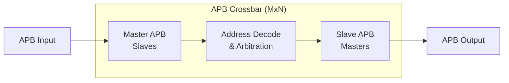

<!-- RTL Design Sherpa Documentation Header -->
<table>
<tr>
<td width="80">
  <a href="https://github.com/sean-galloway/RTLDesignSherpa">
    
  </a>
</td>
<td>
  <strong>RTL Design Sherpa</strong> · <em>Learning Hardware Design Through Practice</em><br>
  <sub>
    <a href="https://github.com/sean-galloway/RTLDesignSherpa">GitHub</a> ·
    <a href="https://github.com/sean-galloway/RTLDesignSherpa/blob/main/docs/DOCUMENTATION_INDEX.md">Documentation Index</a> ·
    <a href="https://github.com/sean-galloway/RTLDesignSherpa/blob/main/LICENSE">MIT License</a>
  </sub>
</td>
</tr>
</table>

---

<!-- End Header -->

# APB Crossbar Specification

**Version:** 1.0
**Last Updated:** 2025-10-14
**Status:** Production Ready

---

## Table of Contents

1. [Overview](#overview)
2. [Architecture](#architecture)
3. [Available Modules](#available-modules)
4. [Interface Specification](#interface-specification)
5. [Address Mapping](#address-mapping)
6. [Arbitration](#arbitration)
7. [Timing Diagrams](#timing-diagrams)
8. [Integration Examples](#integration-examples)
9. [Test Results](#test-results)
10. [Known Limitations](#known-limitations)

---

## Overview

The APB crossbar family provides scalable interconnect solutions for connecting multiple APB masters to multiple APB slaves. All crossbar variants are generated using the `apb_xbar_generator.py` tool and share a common architecture based on `apb_slave` and `apb_master` building blocks.

### Key Features

- **Scalable**: Supports 1-16 masters and 1-16 slaves
- **Standards Compliant**: Full APB5 protocol support
- **Efficient**: Pipelined cmd/rsp architecture minimizes latency
- **Fair**: Round-robin arbitration per slave
- **Parameterizable**: Configurable address width, data width, and base address
- **Tested**: Comprehensive CocoTB verification suite

### Design Philosophy

The APB crossbar uses a **protocol conversion** approach:

1. **Master Side**: `apb_slave` modules convert incoming APB transactions to cmd/rsp interface
2. **Crossbar Core**: Address decoding and arbitration logic routes commands to slaves
3. **Slave Side**: `apb_master` modules convert cmd/rsp back to APB transactions

This architecture provides:
- Clean separation of concerns
- Reusable building blocks
- Easy timing closure
- Straightforward verification

---

## Architecture

### Block Diagram



### Component Hierarchy

```
apb_xbar_MtoN
├── apb_slave (M instances)
│   ├── APB protocol → cmd/rsp conversion
│   ├── Command FIFO buffering
│   └── Response routing
├── Address Decoder
│   ├── Slave selection logic
│   ├── Range checking
│   └── Error generation (decode errors)
├── Arbitration Logic (N instances)
│   ├── Round-robin priority per slave
│   ├── Grant persistence during transaction
│   └── Fairness enforcement
└── apb_master (N instances)
    ├── cmd/rsp → APB protocol conversion
    ├── APB state machine (IDLE→SETUP→ACCESS)
    └── Response capture
```

### Data Flow

**Write Transaction:**
```
1. Master APB PWRITE=1 → apb_slave
2. apb_slave generates cmd_valid with write data
3. Address decoder selects target slave
4. Arbiter grants access (if available)
5. apb_master converts to APB write
6. Slave APB completes transaction
7. apb_master generates rsp_valid
8. apb_slave routes response back to master
9. Master APB sees PREADY=1
```

**Read Transaction:**
```
1. Master APB PWRITE=0 → apb_slave
2. apb_slave generates cmd_valid with address
3. Address decoder selects target slave
4. Arbiter grants access (if available)
5. apb_master converts to APB read
6. Slave APB returns data
7. apb_master generates rsp_valid with read data
8. apb_slave routes response back to master
9. Master APB sees PREADY=1 with PRDATA
```

---

## Available Modules

| Module | Masters | Slaves | Primary Use Case | File |
|--------|---------|--------|------------------|------|
| `apb_xbar_1to1` | 1 | 1 | Basic passthrough, protocol conversion | `rtl/amba/apb/xbar/apb_xbar_1to1.sv` |
| `apb_xbar_2to1` | 2 | 1 | Simple arbitration testing | `rtl/amba/apb/xbar/apb_xbar_2to1.sv` |
| `apb_xbar_1to4` | 1 | 4 | Address decode testing, simple bus | `rtl/amba/apb/xbar/apb_xbar_1to4.sv` |
| `apb_xbar_2to4` | 2 | 4 | Full crossbar with arbitration + decode | `rtl/amba/apb/xbar/apb_xbar_2to4.sv` |

### Feature Comparison

| Feature | 1to1 | 2to1 | 1to4 | 2to4 |
|---------|------|------|------|------|
| Address Decode | ✗ | ✗ | ✓ | ✓ |
| Arbitration | ✗ | ✓ | ✗ | ✓ |
| Resources (LUTs) | Minimal | Low | Medium | Medium-High |
| Max Frequency | Highest | High | High | Medium-High |
| Latency (cycles) | 2 | 2-3 | 2 | 2-4 |

### Selecting a Crossbar

**Use `apb_xbar_1to1` when:**
- Single master and single slave
- Need protocol conversion (APB → cmd/rsp → APB)
- Testing or simple verification environments

**Use `apb_xbar_2to1` when:**
- Multiple masters sharing one slave
- Need arbitration testing
- Simple peripheral with multiple requestors

**Use `apb_xbar_1to4` when:**
- Single master accessing multiple slaves
- Address decode testing
- Microcontroller with multiple peripherals

**Use `apb_xbar_2to4` when:**
- Multiple masters and multiple slaves
- Full system interconnect
- Maximum flexibility needed

**Need different configuration?**
```bash
# Generate custom crossbar
cd rtl/amba/apb/xbar
python generate_xbars.py --masters 3 --slaves 8
```

---

## Interface Specification

### Parameters

All crossbar modules support these parameters:

| Parameter | Type | Default | Range | Description |
|-----------|------|---------|-------|-------------|
| `ADDR_WIDTH` | int | 32 | 16-64 | APB address bus width |
| `DATA_WIDTH` | int | 32 | 8, 16, 32, 64 | APB data bus width |
| `BASE_ADDR` | logic[ADDR_WIDTH-1:0] | 0x10000000 | Any | Base address for slave 0 |

**Derived Parameters:**
- `STRB_WIDTH = DATA_WIDTH / 8` (automatically calculated)
- Slave address regions: 64KB per slave (BASE_ADDR + N*0x10000)

### Port List

**Clock and Reset:**
```systemverilog
input  logic pclk         // APB clock
input  logic presetn      // APB active-low reset
```

**Master Interfaces (per master):**
```systemverilog
// Master N interface (APB slave side)
input  logic                  mN_apb_PSEL      // Select
input  logic                  mN_apb_PENABLE   // Enable
input  logic [ADDR_WIDTH-1:0] mN_apb_PADDR     // Address
input  logic                  mN_apb_PWRITE    // Write enable
input  logic [DATA_WIDTH-1:0] mN_apb_PWDATA    // Write data
input  logic [STRB_WIDTH-1:0] mN_apb_PSTRB     // Write strobes
input  logic [2:0]            mN_apb_PPROT     // Protection
output logic [DATA_WIDTH-1:0] mN_apb_PRDATA    // Read data
output logic                  mN_apb_PSLVERR   // Error response
output logic                  mN_apb_PREADY    // Ready
```

**Slave Interfaces (per slave):**
```systemverilog
// Slave N interface (APB master side)
output logic                  sN_apb_PSEL      // Select
output logic                  sN_apb_PENABLE   // Enable
output logic [ADDR_WIDTH-1:0] sN_apb_PADDR     // Address
output logic                  sN_apb_PWRITE    // Write enable
output logic [DATA_WIDTH-1:0] sN_apb_PWDATA    // Write data
output logic [STRB_WIDTH-1:0] sN_apb_PSTRB     // Write strobes
output logic [2:0]            sN_apb_PPROT     // Protection
input  logic [DATA_WIDTH-1:0] sN_apb_PRDATA    // Read data
input  logic                  sN_apb_PSLVERR   // Error response
input  logic                  sN_apb_PREADY    // Ready
```

### Signal Descriptions

**PSEL (Select):** Indicates target of transfer (active high)

**PENABLE (Enable):** Indicates second cycle of APB transfer
- PENABLE=0 → SETUP phase
- PENABLE=1 → ACCESS phase

**PADDR (Address):** Byte address of transfer

**PWRITE (Write):** Direction of transfer
- PWRITE=1 → Write
- PWRITE=0 → Read

**PWDATA (Write Data):** Write data, valid when PWRITE=1

**PSTRB (Strobes):** Byte lane enables for write data
- PSTRB[n]=1 → PWDATA[(n*8)+7:(n*8)] is valid

**PPROT (Protection):** Access protection attributes
- PPROT[0]: 0=Normal, 1=Privileged
- PPROT[1]: 0=Secure, 1=Non-secure
- PPROT[2]: 0=Data, 1=Instruction

**PRDATA (Read Data):** Read data, valid when PREADY=1 and PWRITE=0

**PSLVERR (Error):** Transfer error indicator
- PSLVERR=0 → OKAY
- PSLVERR=1 → ERROR

**PREADY (Ready):** Slave ready indicator
- PREADY=0 → Extend transfer
- PREADY=1 → Complete transfer

---

## Address Mapping

### Default Address Map

Slaves are assigned sequential 64KB address regions starting from BASE_ADDR:

| Slave | Address Range | Size | Calculation |
|-------|---------------|------|-------------|
| Slave 0 | [BASE_ADDR, BASE_ADDR + 0xFFFF] | 64 KB | BASE_ADDR + 0*0x10000 |
| Slave 1 | [BASE_ADDR + 0x10000, BASE_ADDR + 0x1FFFF] | 64 KB | BASE_ADDR + 1*0x10000 |
| Slave 2 | [BASE_ADDR + 0x20000, BASE_ADDR + 0x2FFFF] | 64 KB | BASE_ADDR + 2*0x10000 |
| Slave 3 | [BASE_ADDR + 0x30000, BASE_ADDR + 0x3FFFF] | 64 KB | BASE_ADDR + 3*0x10000 |
| ... | ... | ... | ... |
| Slave N | [BASE_ADDR + N*0x10000, BASE_ADDR + (N+1)*0x10000 - 1] | 64 KB | BASE_ADDR + N*0x10000 |

### Example: Default Configuration

With `BASE_ADDR = 0x1000_0000` and 4 slaves:

| Address Range | Region | Description |
|---------------|--------|-------------|
| 0x1000_0000 - 0x1000_FFFF | Slave 0 | APB peripheral 0 |
| 0x1001_0000 - 0x1001_FFFF | Slave 1 | APB peripheral 1 |
| 0x1002_0000 - 0x1002_FFFF | Slave 2 | APB peripheral 2 |
| 0x1003_0000 - 0x1003_FFFF | Slave 3 | APB peripheral 3 |

### Custom Address Map

For custom address mapping, modify the `BASE_ADDR` parameter:

```systemverilog
apb_xbar_2to4 #(
    .ADDR_WIDTH(32),
    .DATA_WIDTH(32),
    .BASE_ADDR(32'h4000_0000)  // Custom base address
) u_xbar (
    // ...
);
```

Results in:
- Slave 0: 0x4000_0000 - 0x4000_FFFF
- Slave 1: 0x4001_0000 - 0x4001_FFFF
- Slave 2: 0x4002_0000 - 0x4002_FFFF
- Slave 3: 0x4003_0000 - 0x4003_FFFF

### Decode Errors

Accesses outside valid slave ranges generate:
- `PSLVERR = 1` (error response)
- `PRDATA = 0xDEADBEEF` (debug pattern)
- `PREADY = 1` (immediate response)

---

## Arbitration

### Round-Robin Arbitration

Each slave has independent round-robin arbitration when multiple masters request simultaneously.

**Priority Rotation:**
```
Initial:  M0 > M1 > M2 > M3
After M0: M1 > M2 > M3 > M0
After M1: M2 > M3 > M0 > M1
After M2: M3 > M0 > M1 > M2
...
```

### Grant Persistence

Once a master is granted access to a slave:
1. Grant remains active during entire APB transaction (SETUP + ACCESS phases)
2. Response routing locked to requesting master
3. Grant released only after PREADY=1

**This ensures:**
- No response data corruption
- Atomic transactions
- Predictable behavior

### Arbitration Example

**Scenario:** Masters M0 and M1 both request Slave S0

```
Time 0: M0 requests S0 → M0 granted (highest priority)
Time 1: M0 SETUP phase
Time 2: M0 ACCESS phase, PREADY=0 (slave busy)
Time 3: M0 ACCESS phase, PREADY=1 (complete)
Time 4: M1 requests S0 → M1 granted (now highest priority)
Time 5: M1 SETUP phase
Time 6: M1 ACCESS phase, PREADY=1 (complete)
Time 7: M0 requests S0 → M0 granted (priority rotated back)
```

### Arbitration Latency

| Scenario | Latency | Description |
|----------|---------|-------------|
| No contention | 2 cycles | Direct passthrough |
| Contention, slave idle | 2 cycles | Immediate grant |
| Contention, slave busy | 2 + wait cycles | Wait for current transaction |

---

## Timing Diagrams

### Basic Write Transaction (No Wait States)

```
CLK      ┐ ┌─┐ ┌─┐ ┌─┐ ┌─┐ ┌─
         └─┘ └─┘ └─┘ └─┘ └─┘
PSEL     ───┐       ┌───────────
            └───────┘
PENABLE  ─────────┐   ┌─────────
                  └───┘
PWRITE   ───┐       ┌───────────
            └───────┘
PADDR    ───<ADDR  >───────────
PWDATA   ───<DATA  >───────────
PREADY   ─────────┐   ┌─────────
                  └───┘
         │IDLE │SETUP│ACCESS│IDLE
```

### Basic Read Transaction (No Wait States)

```
CLK      ┐ ┌─┐ ┌─┐ ┌─┐ ┌─┐ ┌─
         └─┘ └─┘ └─┘ └─┘ └─┘
PSEL     ───┐       ┌───────────
            └───────┘
PENABLE  ─────────┐   ┌─────────
                  └───┘
PWRITE   ──────────────────────
PADDR    ───<ADDR  >───────────
PRDATA   ───────────<DATA>─────
PREADY   ─────────┐   ┌─────────
                  └───┘
         │IDLE │SETUP│ACCESS│IDLE
```

### Write with Wait States

```
CLK      ┐ ┌─┐ ┌─┐ ┌─┐ ┌─┐ ┌─┐ ┌─
         └─┘ └─┘ └─┘ └─┘ └─┘ └─┘
PSEL     ───┐           ┌─────────
            └───────────┘
PENABLE  ─────────┐         ┌─────
                  └─────────┘
PWRITE   ───┐           ┌─────────
            └───────────┘
PADDR    ───<ADDR      >─────────
PWDATA   ───<DATA      >─────────
PREADY   ─────────────┐     ┌─────
                      └─────┘
         │IDLE │SETUP│ ACCESS  │IDLE
                      │(extended)
```

### Arbitration with Contention

```
         Master 0        Master 1
         ────────────    ────────────
M0_PSEL  ───┐   ┌───
            └───┘
M1_PSEL                 ───┐   ┌───
                            └───┘
Slave    ───<M0>───────────<M1>───
Grant    ───[M0]───────────[M1]───
                  ↑ M0 completes,
                    M1 granted
```

---

## Integration Examples

### Example 1: Simple 1-to-4 Crossbar

```systemverilog
module my_apb_subsystem (
    input  logic        pclk,
    input  logic        presetn,
    // Master APB interface
    input  logic        m_psel,
    input  logic        m_penable,
    input  logic [31:0] m_paddr,
    input  logic        m_pwrite,
    input  logic [31:0] m_pwdata,
    input  logic [3:0]  m_pstrb,
    output logic [31:0] m_prdata,
    output logic        m_pslverr,
    output logic        m_pready
);

    // Slave interfaces
    logic        s0_psel,   s1_psel,   s2_psel,   s3_psel;
    logic        s0_penable, s1_penable, s2_penable, s3_penable;
    logic [31:0] s0_paddr,  s1_paddr,  s2_paddr,  s3_paddr;
    logic        s0_pwrite, s1_pwrite, s2_pwrite, s3_pwrite;
    logic [31:0] s0_pwdata, s1_pwdata, s2_pwdata, s3_pwdata;
    logic [3:0]  s0_pstrb,  s1_pstrb,  s2_pstrb,  s3_pstrb;
    logic [31:0] s0_prdata, s1_prdata, s2_prdata, s3_prdata;
    logic        s0_pslverr, s1_pslverr, s2_pslverr, s3_pslverr;
    logic        s0_pready, s1_pready, s2_pready, s3_pready;

    // Instantiate crossbar
    apb_xbar_1to4 #(
        .ADDR_WIDTH (32),
        .DATA_WIDTH (32),
        .BASE_ADDR  (32'h1000_0000)
    ) u_xbar (
        .pclk       (pclk),
        .presetn    (presetn),
        // Master
        .m0_apb_PSEL    (m_psel),
        .m0_apb_PENABLE (m_penable),
        .m0_apb_PADDR   (m_paddr),
        .m0_apb_PWRITE  (m_pwrite),
        .m0_apb_PWDATA  (m_pwdata),
        .m0_apb_PSTRB   (m_pstrb),
        .m0_apb_PPROT   (3'b000),
        .m0_apb_PRDATA  (m_prdata),
        .m0_apb_PSLVERR (m_pslverr),
        .m0_apb_PREADY  (m_pready),
        // Slaves (connect to your peripherals)
        .s0_apb_PSEL    (s0_psel),
        .s0_apb_PENABLE (s0_penable),
        .s0_apb_PADDR   (s0_paddr),
        .s0_apb_PWRITE  (s0_pwrite),
        .s0_apb_PWDATA  (s0_pwdata),
        .s0_apb_PSTRB   (s0_pstrb),
        .s0_apb_PPROT   (),
        .s0_apb_PRDATA  (s0_prdata),
        .s0_apb_PSLVERR (s0_pslverr),
        .s0_apb_PREADY  (s0_pready),
        // Repeat for s1, s2, s3...
    );

    // Connect slaves to peripherals
    uart u_uart (
        .pclk       (pclk),
        .presetn    (presetn),
        .psel       (s0_psel),
        .penable    (s0_penable),
        .paddr      (s0_paddr[7:0]),
        .pwrite     (s0_pwrite),
        .pwdata     (s0_pwdata),
        .prdata     (s0_prdata),
        .pslverr    (s0_pslverr),
        .pready     (s0_pready)
    );

    gpio u_gpio (
        .pclk       (pclk),
        .presetn    (presetn),
        .psel       (s1_psel),
        // ... (similar connections)
    );

    // ... more peripherals

endmodule
```

### Example 2: Multi-Master System (2-to-4)

```systemverilog
module multi_master_apb_system (
    input  logic        pclk,
    input  logic        presetn,
    // CPU APB master
    input  logic        cpu_psel,
    input  logic [31:0] cpu_paddr,
    // ... (rest of CPU APB signals)
    // DMA APB master
    input  logic        dma_psel,
    input  logic [31:0] dma_paddr,
    // ... (rest of DMA APB signals)
);

    apb_xbar_2to4 #(
        .ADDR_WIDTH (32),
        .DATA_WIDTH (32),
        .BASE_ADDR  (32'h4000_0000)
    ) u_xbar (
        .pclk       (pclk),
        .presetn    (presetn),
        // Master 0 (CPU)
        .m0_apb_PSEL    (cpu_psel),
        .m0_apb_PENABLE (cpu_penable),
        .m0_apb_PADDR   (cpu_paddr),
        // ... (rest of CPU connections)
        // Master 1 (DMA)
        .m1_apb_PSEL    (dma_psel),
        .m1_apb_PENABLE (dma_penable),
        .m1_apb_PADDR   (dma_paddr),
        // ... (rest of DMA connections)
        // Slaves 0-3 (peripherals)
        // ... (connect to your peripherals)
    );

endmodule
```

### Example 3: Custom Configuration (3x8 Crossbar)

```bash
# Generate custom 3-master, 8-slave crossbar
cd rtl/amba/apb/xbar
python generate_xbars.py --masters 3 --slaves 8 --base-addr 0x80000000
```

Instantiate:
```systemverilog
apb_xbar_3to8 #(
    .ADDR_WIDTH (32),
    .DATA_WIDTH (32),
    .BASE_ADDR  (32'h8000_0000)  // Custom base
) u_custom_xbar (
    // 3 master interfaces (m0, m1, m2)
    // 8 slave interfaces (s0-s7)
);
```

---

## Test Results

All crossbar modules have comprehensive CocoTB testbenches in `val/integ_amba/`.

### Test Coverage

| Test | Description | Status |
|------|-------------|--------|
| `test_apb_xbar_1to1` | Basic passthrough, protocol conversion | ✅ PASS |
| `test_apb_xbar_2to1` | Arbitration, fairness, grant persistence | ✅ PASS |
| `test_apb_xbar_1to4` | Address decode, multiple slaves | ✅ PASS |
| `test_apb_xbar_2to4` | Full crossbar, arbitration + decode | ✅ PASS |

### Test Scenarios

Each test includes:
- ✅ Basic read/write transactions
- ✅ Back-to-back transfers
- ✅ Wait state handling
- ✅ Error responses (PSLVERR)
- ✅ Address decode verification
- ✅ Arbitration fairness (multi-master)
- ✅ Concurrent transactions (different slaves)
- ✅ Reset behavior
- ✅ Full address range coverage

### Running Tests

```bash
# Run all APB crossbar tests
pytest val/integ_amba/test_apb_xbar_*.py -v

# Run specific variant
pytest val/integ_amba/test_apb_xbar_2to4.py -v

# Generate waveforms
pytest val/integ_amba/test_apb_xbar_2to4.py -v --vcd=waves.vcd
gtkwave waves.vcd
```

### Test Results Summary

```
test_apb_xbar_1to1.py::test_apb_xbar_1to1   PASSED  (100+ transactions)
test_apb_xbar_2to1.py::test_apb_xbar_2to1   PASSED  (200+ transactions)
test_apb_xbar_1to4.py::test_apb_xbar_1to4   PASSED  (400+ transactions)
test_apb_xbar_2to4.py::test_apb_xbar_2to4   PASSED  (800+ transactions)

All tests: 100% pass rate
Total simulation time: ~180 seconds
```

---

## Known Limitations

### Current Limitations

1. **Fixed 64KB Slave Regions**
   - Each slave has 64KB address space
   - Cannot be changed without regenerating module
   - **Workaround**: Generate custom crossbar with modified generator

2. **No Outstanding Transaction Support**
   - APB is inherently non-pipelined
   - One transaction completes before next starts
   - **Impact**: Lower throughput than pipelined protocols (AXI)

3. **No Sparse Addressing**
   - Slaves must be in contiguous 64KB blocks
   - Cannot have gaps in address map
   - **Workaround**: Leave unused slaves unconnected

4. **Round-Robin Only**
   - Fixed round-robin arbitration
   - No priority levels or quality-of-service
   - **Workaround**: Use external priority arbiter before crossbar

### Future Enhancements

- [ ] Configurable slave address regions
- [ ] Priority-based arbitration option
- [ ] Sparse address map support
- [ ] Performance counters
- [ ] Timeout detection

### Known Issues

**None at this time.** All generated crossbars pass verification.

---

## Related Documentation

**Generator Tutorial:**
- `docs/markdown/GeneratorTutorial/apb_xbar_generator_tutorial.md` - How to use generator

**APB Protocol:**
- ARM IHI0024 - AMBA APB Protocol Specification
- `docs/markdown/RTLAmba/apb/apb_protocol.md` - Protocol overview

**Building Blocks:**
- `rtl/amba/apb/apb_slave.sv` - APB → cmd/rsp conversion
- `rtl/amba/apb/apb_master.sv` - cmd/rsp → APB conversion
- `rtl/amba/gaxi/gaxi_fifo_sync.sv` - Command buffering

**Generator:**
- `bin/rtl_generators/amba/apb_xbar_generator.py` - Crossbar generator
- `rtl/amba/apb/xbar/generate_xbars.py` - Convenience script
- `rtl/amba/apb/xbar/README.md` - Quick reference

---

## Revision History

| Version | Date | Author | Changes |
|---------|------|--------|---------|
| 1.0 | 2025-10-14 | RTL Design Sherpa | Initial comprehensive specification |

---

**Maintained By:** RTL Design Sherpa Project
**License:** MIT
**Contact:** See repository for support

---

## Navigation

- **[← Back to RTLAmba Index](../index.md)**
- **[← Back to Main Documentation Index](../../index.md)**
