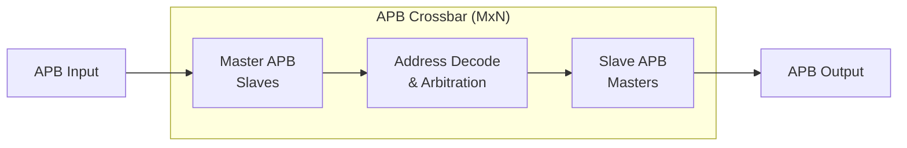

<!-- RTL Design Sherpa Documentation Header -->
<table>
<tr>
<td width="80">
  <a href="https://github.com/sean-galloway/RTLDesignSherpa">
    
  </a>
</td>
<td>
  <strong>RTL Design Sherpa</strong> · <em>Learning Hardware Design Through Practice</em><br>
  <sub>
    <a href="https://github.com/sean-galloway/RTLDesignSherpa">GitHub</a> ·
    <a href="https://github.com/sean-galloway/RTLDesignSherpa/blob/main/docs/DOCUMENTATION_INDEX.md">Documentation Index</a> ·
    <a href="https://github.com/sean-galloway/RTLDesignSherpa/blob/main/LICENSE">MIT License</a>
  </sub>
</td>
</tr>
</table>

---

<!-- End Header -->

# APB Crossbar Specification

**Version:** 1.1
**Last Updated:** 2026-07-19
**Status:** Production Ready
**Location:** `projects/components/apb_xbar/`

---

## Table of Contents

1. [Overview](#overview)
2. [Architecture](#architecture)
3. [Available Modules](#available-modules)
4. [Interface Specification](#interface-specification)
5. [Address Mapping](#address-mapping)
6. [Arbitration](#arbitration)
7. [Timing Diagrams](#timing-diagrams)
8. [Integration Examples](#integration-examples)
9. [Test Results](#test-results)
10. [Known Limitations](#known-limitations)

---

## Overview

The APB crossbar family provides scalable interconnect solutions for connecting multiple APB masters to multiple APB slaves. All crossbar variants are generated using the `apb_xbar_generator.py` tool and share a common architecture based on `apb_slave` and `apb_master` building blocks.

**Where things live.** The crossbar RTL, generator, and testbenches are in the
`apb_xbar` component area, not under `rtl/amba/apb/`:

| Artifact | Path |
|----------|------|
| Generated RTL | `projects/components/apb_xbar/rtl/` |
| Generator | `projects/components/apb_xbar/bin/apb_xbar_generator.py` |
| Convenience script | `projects/components/apb_xbar/bin/generate_xbars.py` |
| Testbenches | `projects/components/apb_xbar/dv/tests/` |
| Formal | `formal/apb_xbar/` |

The APB4 primitives they are built from (`apb_slave`, `apb_master`) do live in
`rtl/amba/apb/`, which is why this specification is published in the APB4 book.

### Key Features

- **Scalable**: Generator takes arbitrary `--masters` / `--slaves`; four
  pre-generated variants are checked in and tested
- **Standards Compliant**: AMBA 4 APB (APB4). These crossbars carry `PSTRB` and
  `PPROT`; they do **not** carry APB5 signalling
- **Efficient**: cmd/rsp architecture decouples the two APB sides
- **Fair**: Round-robin arbitration per slave, with grant held until the
  transaction completes
- **Parameterizable**: Configurable address width, data width, and base address
- **Tested**: CocoTB verification suite plus SymbiYosys formal proofs

### Design Philosophy

The APB crossbar uses a **protocol conversion** approach:

1. **Master Side**: `apb_slave` modules convert incoming APB transactions to cmd/rsp interface
2. **Crossbar Core**: Address decoding and arbitration logic routes commands to slaves
3. **Slave Side**: `apb_master` modules convert cmd/rsp back to APB transactions

This architecture provides:
- Clean separation of concerns
- Reusable building blocks
- Easy timing closure
- Straightforward verification

---

## Architecture

### Block Diagram


```mermaid
flowchart LR
    subgraph xbar["APB Crossbar (MxN)"]
        ms["Master APB<br/>Slaves"] --> dec["Address Decode<br/>& Arbitration"]
        dec --> sm["Slave APB<br/>Masters"]
    end

    apbin["APB Input"] --> ms
    sm --> apbout["APB Output"]
```

### Component Hierarchy

```
apb_xbar_MtoN
├── apb_slave (M instances)
│   ├── APB protocol → cmd/rsp conversion
│   ├── Command FIFO buffering
│   └── Response routing
├── Address Decoder
│   ├── Slave selection logic (PADDR bit slice)
│   └── Range checking (no decode-error slave -- see Known Limitations)
├── Arbitration Logic (N instances)
│   ├── Round-robin priority per slave
│   ├── Grant persistence during transaction
│   └── Fairness enforcement
└── apb_master (N instances)
    ├── cmd/rsp → APB protocol conversion
    ├── APB state machine (IDLE→SETUP→ACCESS)
    └── Response capture
```

### Data Flow

**Write Transaction:**
```
1. Master APB PWRITE=1 → apb_slave
2. apb_slave generates cmd_valid with write data
3. Address decoder selects target slave
4. Arbiter grants access (if available)
5. apb_master converts to APB write
6. Slave APB completes transaction
7. apb_master generates rsp_valid
8. apb_slave routes response back to master
9. Master APB sees PREADY=1
```

**Read Transaction:**
```
1. Master APB PWRITE=0 → apb_slave
2. apb_slave generates cmd_valid with address
3. Address decoder selects target slave
4. Arbiter grants access (if available)
5. apb_master converts to APB read
6. Slave APB returns data
7. apb_master generates rsp_valid with read data
8. apb_slave routes response back to master
9. Master APB sees PREADY=1 with PRDATA
```

---

## Available Modules

| Module | Masters | Slaves | Primary Use Case | File |
|--------|---------|--------|------------------|------|
| `apb_xbar_1to1` | 1 | 1 | Basic passthrough, protocol conversion | `projects/components/apb_xbar/rtl/apb_xbar_1to1.sv` |
| `apb_xbar_2to1` | 2 | 1 | Simple arbitration testing | `projects/components/apb_xbar/rtl/apb_xbar_2to1.sv` |
| `apb_xbar_1to4` | 1 | 4 | Address decode testing, simple bus | `projects/components/apb_xbar/rtl/apb_xbar_1to4.sv` |
| `apb_xbar_2to4` | 2 | 4 | Full crossbar with arbitration + decode | `projects/components/apb_xbar/rtl/apb_xbar_2to4.sv` |
| `apb_xbar_thin` | M | S | Fully parameterized combinational crossbar (different architecture) | `projects/components/apb_xbar/rtl/apb_xbar_thin.sv` |

`apb_xbar_thin` is **not** a generated variant and does not share this
architecture -- it is a combinational passthrough with weighted round-robin and
no cmd/rsp conversion. See [apb_xbar.md](apb_xbar.md).

### Feature Comparison

| Feature | 1to1 | 2to1 | 1to4 | 2to4 |
|---------|------|------|------|------|
| Address Decode | ✗ | ✗ | ✓ | ✓ |
| Arbitration | ✗ | ✓ | ✗ | ✓ |
| Relative Resources | Minimal | Low | Medium | Medium-High |
| Relative Max Frequency | Highest | High | High | Medium-High |

**Resource and frequency columns are relative rankings only.** No synthesis has
been run for these modules in this repository, so no LUT counts or MHz figures
are published. Treat them as an ordering, not as data.

### Latency

Every variant, including 1to1, converts APB to cmd/rsp and back:
`apb_slave` (master side) → decode/arbitration → `apb_master` (slave side). None
of them is a wire.

The dominant cost is that each APB transfer through the crossbar becomes **two**
APB transfers -- one on the master side and one on the slave side -- and the
`apb_slave` FSM alone inserts at least two wait states in its ACCESS phase (see
[apb_slave.md](apb_slave.md)). The structural contributors are:

| Stage | Cost |
|-------|------|
| `apb_slave` capture to `cmd_valid` | ≥1 cycle (registered FSM) |
| Address decode | 0 cycles (combinational) |
| Arbitration | 1 cycle when contended (`WAIT_GNT_ACK` grant handshake) |
| `apb_master` SETUP + ACCESS on the downstream slave | ≥2 cycles, plus that slave's wait states |
| Response return through `apb_slave` | ≥1 cycle |

A single-figure "cycles of latency" number is therefore misleading and is not
quoted here. Measure it for your slave's wait-state behaviour if it matters.

### Selecting a Crossbar

**Use `apb_xbar_1to1` when:**
- Single master and single slave
- Need protocol conversion (APB → cmd/rsp → APB)
- Testing or simple verification environments

**Use `apb_xbar_2to1` when:**
- Multiple masters sharing one slave
- Need arbitration testing
- Simple peripheral with multiple requestors

**Use `apb_xbar_1to4` when:**
- Single master accessing multiple slaves
- Address decode testing
- Microcontroller with multiple peripherals

**Use `apb_xbar_2to4` when:**
- Multiple masters and multiple slaves
- Full system interconnect
- Maximum flexibility needed

**Need different configuration?**
```bash
# Generate custom crossbar
cd projects/components/apb_xbar/bin
python generate_xbars.py --masters 3 --slaves 8
```

---

## Interface Specification

### Parameters

All crossbar modules support these parameters:

| Parameter | Type | Default | Range | Description |
|-----------|------|---------|-------|-------------|
| `ADDR_WIDTH` | int | 32 | 16-64 | APB address bus width |
| `DATA_WIDTH` | int | 32 | 8, 16, 32, 64 | APB data bus width |
| `BASE_ADDR` | logic[ADDR_WIDTH-1:0] | 0x10000000 | Any | Base address for slave 0 |

**Derived Parameters:**
- `STRB_WIDTH = DATA_WIDTH / 8` (automatically calculated)
- Slave address regions: 64KB per slave (BASE_ADDR + N*0x10000)

### Port List

**Clock and Reset:**
```systemverilog
input  logic pclk         // APB clock
input  logic presetn      // APB active-low reset
```

**Master Interfaces (per master):**
```systemverilog
// Master N interface (APB slave side)
input  logic                  mN_apb_PSEL      // Select
input  logic                  mN_apb_PENABLE   // Enable
input  logic [ADDR_WIDTH-1:0] mN_apb_PADDR     // Address
input  logic                  mN_apb_PWRITE    // Write enable
input  logic [DATA_WIDTH-1:0] mN_apb_PWDATA    // Write data
input  logic [STRB_WIDTH-1:0] mN_apb_PSTRB     // Write strobes
input  logic [2:0]            mN_apb_PPROT     // Protection
output logic [DATA_WIDTH-1:0] mN_apb_PRDATA    // Read data
output logic                  mN_apb_PSLVERR   // Error response
output logic                  mN_apb_PREADY    // Ready
```

**Slave Interfaces (per slave):**
```systemverilog
// Slave N interface (APB master side)
output logic                  sN_apb_PSEL      // Select
output logic                  sN_apb_PENABLE   // Enable
output logic [ADDR_WIDTH-1:0] sN_apb_PADDR     // Address
output logic                  sN_apb_PWRITE    // Write enable
output logic [DATA_WIDTH-1:0] sN_apb_PWDATA    // Write data
output logic [STRB_WIDTH-1:0] sN_apb_PSTRB     // Write strobes
output logic [2:0]            sN_apb_PPROT     // Protection
input  logic [DATA_WIDTH-1:0] sN_apb_PRDATA    // Read data
input  logic                  sN_apb_PSLVERR   // Error response
input  logic                  sN_apb_PREADY    // Ready
```

### Signal Descriptions

**PSEL (Select):** Indicates target of transfer (active high)

**PENABLE (Enable):** Indicates second cycle of APB transfer
- PENABLE=0 → SETUP phase
- PENABLE=1 → ACCESS phase

**PADDR (Address):** Byte address of transfer

**PWRITE (Write):** Direction of transfer
- PWRITE=1 → Write
- PWRITE=0 → Read

**PWDATA (Write Data):** Write data, valid when PWRITE=1

**PSTRB (Strobes):** Byte lane enables for write data
- PSTRB[n]=1 → PWDATA[(n*8)+7:(n*8)] is valid

**PPROT (Protection):** Access protection attributes
- PPROT[0]: 0=Normal, 1=Privileged
- PPROT[1]: 0=Secure, 1=Non-secure
- PPROT[2]: 0=Data, 1=Instruction

**PRDATA (Read Data):** Read data, valid when PREADY=1 and PWRITE=0

**PSLVERR (Error):** Transfer error indicator
- PSLVERR=0 → OKAY
- PSLVERR=1 → ERROR

**PREADY (Ready):** Slave ready indicator
- PREADY=0 → Extend transfer
- PREADY=1 → Complete transfer

---

## Address Mapping

### Default Address Map

Slaves are assigned sequential 64KB address regions starting from BASE_ADDR:

| Slave | Address Range | Size | Calculation |
|-------|---------------|------|-------------|
| Slave 0 | [BASE_ADDR, BASE_ADDR + 0xFFFF] | 64 KB | BASE_ADDR + 0*0x10000 |
| Slave 1 | [BASE_ADDR + 0x10000, BASE_ADDR + 0x1FFFF] | 64 KB | BASE_ADDR + 1*0x10000 |
| Slave 2 | [BASE_ADDR + 0x20000, BASE_ADDR + 0x2FFFF] | 64 KB | BASE_ADDR + 2*0x10000 |
| Slave 3 | [BASE_ADDR + 0x30000, BASE_ADDR + 0x3FFFF] | 64 KB | BASE_ADDR + 3*0x10000 |
| ... | ... | ... | ... |
| Slave N | [BASE_ADDR + N*0x10000, BASE_ADDR + (N+1)*0x10000 - 1] | 64 KB | BASE_ADDR + N*0x10000 |

### Example: Default Configuration

With `BASE_ADDR = 0x1000_0000` and 4 slaves:

| Address Range | Region | Description |
|---------------|--------|-------------|
| 0x1000_0000 - 0x1000_FFFF | Slave 0 | APB peripheral 0 |
| 0x1001_0000 - 0x1001_FFFF | Slave 1 | APB peripheral 1 |
| 0x1002_0000 - 0x1002_FFFF | Slave 2 | APB peripheral 2 |
| 0x1003_0000 - 0x1003_FFFF | Slave 3 | APB peripheral 3 |

### Custom Address Map

For custom address mapping, modify the `BASE_ADDR` parameter:

```systemverilog
apb_xbar_2to4 #(
    .ADDR_WIDTH(32),
    .DATA_WIDTH(32),
    .BASE_ADDR(32'h4000_0000)  // Custom base address
) u_xbar (
    // ...
);
```

Results in:
- Slave 0: 0x4000_0000 - 0x4000_FFFF
- Slave 1: 0x4001_0000 - 0x4001_FFFF
- Slave 2: 0x4002_0000 - 0x4002_FFFF
- Slave 3: 0x4003_0000 - 0x4003_FFFF

### Alignment Requirement

The generated decoders do not compute the slave index arithmetically -- they slice
it out of `PADDR` directly. For the 4-slave variants:

```systemverilog
addr_in_range = (cmd_paddr >= BASE_ADDR) &&
                (cmd_paddr <  (BASE_ADDR + 32'h0004_0000));
slave_sel     = cmd_paddr[17:16];
```

`BASE_ADDR` must therefore be aligned to the **total** decoded window
(`num_slaves × 64 KB`; 256 KB for the 4-slave variants). An unaligned
`BASE_ADDR` makes the range check and the index slice disagree, silently routing
transfers to the wrong slave. The generator does not check this.

### Decode Errors: Unmapped Addresses Stall

**There is no decode-error response.** The generated crossbars do not implement a
default slave, and the following statements -- which appeared in earlier revisions
of this document -- are **not** true of the RTL:

- ~~`PSLVERR = 1` on unmapped access~~
- ~~`PRDATA = 0xDEADBEEF` debug pattern~~
- ~~`PREADY = 1` immediate response~~

The string `DEADBEEF` does not appear anywhere in the crossbar RTL.

What actually happens: when `addr_in_range` is low, no `sN_cmd_valid` is asserted
and `cmd_ready` back to the master's `apb_slave` stays low:

```systemverilog
always_comb begin
    m0_cmd_ready = 1'b0;
    if (m0_cmd_valid && m0_addr_in_range) begin
        case (m0_slave_sel)
            2'd0: m0_cmd_ready = s0_cmd_ready;
            // ...
        endcase
    end
end
```

The command is never accepted, no response is ever produced, and `PREADY` is
never asserted. **The APB transfer hangs indefinitely.** There is no timeout.

**Integration requirement:** do not expose an unmapped address range to a master
through these crossbars. Either constrain the master's address map to the decoded
window, or place an address filter with a default error slave upstream. If a
master can be pointed at an arbitrary address (a CPU, a debugger), an errant
access will wedge the bus until reset.

This is tracked as a limitation, not a bug in the current tests: the CocoTB
testbenches exercise the mapped ranges only.

---

## Arbitration

### Round-Robin Arbitration

Each slave has independent round-robin arbitration when multiple masters request simultaneously.

**Priority Rotation:**
```
Initial:  M0 > M1 > M2 > M3
After M0: M1 > M2 > M3 > M0
After M1: M2 > M3 > M0 > M1
After M2: M3 > M0 > M1 > M2
...
```

### Grant Persistence

Once a master is granted access to a slave:
1. Grant remains active during entire APB transaction (SETUP + ACCESS phases)
2. Response routing locked to requesting master
3. Grant released only after PREADY=1

**This ensures:**
- No response data corruption
- Atomic transactions
- Predictable behavior

### Arbitration Example

**Scenario:** Masters M0 and M1 both request Slave S0

```
Time 0: M0 requests S0 → M0 granted (highest priority)
Time 1: M0 SETUP phase
Time 2: M0 ACCESS phase, PREADY=0 (slave busy)
Time 3: M0 ACCESS phase, PREADY=1 (complete)
Time 4: M1 requests S0 → M1 granted (now highest priority)
Time 5: M1 SETUP phase
Time 6: M1 ACCESS phase, PREADY=1 (complete)
Time 7: M0 requests S0 → M0 granted (priority rotated back)
```

### Arbitration Latency

This table describes only the **arbitration** contribution. It is additive to the
protocol-conversion cost described under [Latency](#latency); it is not the
end-to-end transfer latency.

| Scenario | Arbitration cost | Description |
|----------|------------------|-------------|
| No contention (single master) | 0 cycles | No arbiter instantiated for 1-master variants |
| Contention, slave idle | 1 cycle | Grant registered before the request propagates |
| Contention, slave busy | 1 cycle + remaining transaction | `WAIT_GNT_ACK=1` holds the grant until the current transfer completes |

---

## Timing Diagrams

### Basic Write Transaction (No Wait States)

```
CLK      ┐ ┌─┐ ┌─┐ ┌─┐ ┌─┐ ┌─
         └─┘ └─┘ └─┘ └─┘ └─┘
PSEL     ───┐       ┌───────────
            └───────┘
PENABLE  ─────────┐   ┌─────────
                  └───┘
PWRITE   ───┐       ┌───────────
            └───────┘
PADDR    ───<ADDR  >───────────
PWDATA   ───<DATA  >───────────
PREADY   ─────────┐   ┌─────────
                  └───┘
         │IDLE │SETUP│ACCESS│IDLE
```

### Basic Read Transaction (No Wait States)

```
CLK      ┐ ┌─┐ ┌─┐ ┌─┐ ┌─┐ ┌─
         └─┘ └─┘ └─┘ └─┘ └─┘
PSEL     ───┐       ┌───────────
            └───────┘
PENABLE  ─────────┐   ┌─────────
                  └───┘
PWRITE   ──────────────────────
PADDR    ───<ADDR  >───────────
PRDATA   ───────────<DATA>─────
PREADY   ─────────┐   ┌─────────
                  └───┘
         │IDLE │SETUP│ACCESS│IDLE
```

### Write with Wait States

```
CLK      ┐ ┌─┐ ┌─┐ ┌─┐ ┌─┐ ┌─┐ ┌─
         └─┘ └─┘ └─┘ └─┘ └─┘ └─┘
PSEL     ───┐           ┌─────────
            └───────────┘
PENABLE  ─────────┐         ┌─────
                  └─────────┘
PWRITE   ───┐           ┌─────────
            └───────────┘
PADDR    ───<ADDR      >─────────
PWDATA   ───<DATA      >─────────
PREADY   ─────────────┐     ┌─────
                      └─────┘
         │IDLE │SETUP│ ACCESS  │IDLE
                      │(extended)
```

### Arbitration with Contention

```
         Master 0        Master 1
         ────────────    ────────────
M0_PSEL  ───┐   ┌───
            └───┘
M1_PSEL                 ───┐   ┌───
                            └───┘
Slave    ───<M0>───────────<M1>───
Grant    ───[M0]───────────[M1]───
                  ↑ M0 completes,
                    M1 granted
```

---

## Integration Examples

### Example 1: Simple 1-to-4 Crossbar

```systemverilog
module my_apb_subsystem (
    input  logic        pclk,
    input  logic        presetn,
    // Master APB interface
    input  logic        m_psel,
    input  logic        m_penable,
    input  logic [31:0] m_paddr,
    input  logic        m_pwrite,
    input  logic [31:0] m_pwdata,
    input  logic [3:0]  m_pstrb,
    output logic [31:0] m_prdata,
    output logic        m_pslverr,
    output logic        m_pready
);

    // Slave interfaces
    logic        s0_psel,   s1_psel,   s2_psel,   s3_psel;
    logic        s0_penable, s1_penable, s2_penable, s3_penable;
    logic [31:0] s0_paddr,  s1_paddr,  s2_paddr,  s3_paddr;
    logic        s0_pwrite, s1_pwrite, s2_pwrite, s3_pwrite;
    logic [31:0] s0_pwdata, s1_pwdata, s2_pwdata, s3_pwdata;
    logic [3:0]  s0_pstrb,  s1_pstrb,  s2_pstrb,  s3_pstrb;
    logic [31:0] s0_prdata, s1_prdata, s2_prdata, s3_prdata;
    logic        s0_pslverr, s1_pslverr, s2_pslverr, s3_pslverr;
    logic        s0_pready, s1_pready, s2_pready, s3_pready;

    // Instantiate crossbar
    apb_xbar_1to4 #(
        .ADDR_WIDTH (32),
        .DATA_WIDTH (32),
        .BASE_ADDR  (32'h1000_0000)
    ) u_xbar (
        .pclk       (pclk),
        .presetn    (presetn),
        // Master
        .m0_apb_PSEL    (m_psel),
        .m0_apb_PENABLE (m_penable),
        .m0_apb_PADDR   (m_paddr),
        .m0_apb_PWRITE  (m_pwrite),
        .m0_apb_PWDATA  (m_pwdata),
        .m0_apb_PSTRB   (m_pstrb),
        .m0_apb_PPROT   (3'b000),
        .m0_apb_PRDATA  (m_prdata),
        .m0_apb_PSLVERR (m_pslverr),
        .m0_apb_PREADY  (m_pready),
        // Slaves (connect to your peripherals)
        .s0_apb_PSEL    (s0_psel),
        .s0_apb_PENABLE (s0_penable),
        .s0_apb_PADDR   (s0_paddr),
        .s0_apb_PWRITE  (s0_pwrite),
        .s0_apb_PWDATA  (s0_pwdata),
        .s0_apb_PSTRB   (s0_pstrb),
        .s0_apb_PPROT   (),
        .s0_apb_PRDATA  (s0_prdata),
        .s0_apb_PSLVERR (s0_pslverr),
        .s0_apb_PREADY  (s0_pready),
        // Repeat for s1, s2, s3...
    );

    // Connect slaves to peripherals
    uart u_uart (
        .pclk       (pclk),
        .presetn    (presetn),
        .psel       (s0_psel),
        .penable    (s0_penable),
        .paddr      (s0_paddr[7:0]),
        .pwrite     (s0_pwrite),
        .pwdata     (s0_pwdata),
        .prdata     (s0_prdata),
        .pslverr    (s0_pslverr),
        .pready     (s0_pready)
    );

    gpio u_gpio (
        .pclk       (pclk),
        .presetn    (presetn),
        .psel       (s1_psel),
        // ... (similar connections)
    );

    // ... more peripherals

endmodule
```

### Example 2: Multi-Master System (2-to-4)

```systemverilog
module multi_master_apb_system (
    input  logic        pclk,
    input  logic        presetn,
    // CPU APB master
    input  logic        cpu_psel,
    input  logic [31:0] cpu_paddr,
    // ... (rest of CPU APB signals)
    // DMA APB master
    input  logic        dma_psel,
    input  logic [31:0] dma_paddr,
    // ... (rest of DMA APB signals)
);

    apb_xbar_2to4 #(
        .ADDR_WIDTH (32),
        .DATA_WIDTH (32),
        .BASE_ADDR  (32'h4000_0000)
    ) u_xbar (
        .pclk       (pclk),
        .presetn    (presetn),
        // Master 0 (CPU)
        .m0_apb_PSEL    (cpu_psel),
        .m0_apb_PENABLE (cpu_penable),
        .m0_apb_PADDR   (cpu_paddr),
        // ... (rest of CPU connections)
        // Master 1 (DMA)
        .m1_apb_PSEL    (dma_psel),
        .m1_apb_PENABLE (dma_penable),
        .m1_apb_PADDR   (dma_paddr),
        // ... (rest of DMA connections)
        // Slaves 0-3 (peripherals)
        // ... (connect to your peripherals)
    );

endmodule
```

### Example 3: Custom Configuration (3x8 Crossbar)

```bash
# Generate custom 3-master, 8-slave crossbar
cd projects/components/apb_xbar/bin
python generate_xbars.py --masters 3 --slaves 8 --base-addr 0x80000000
```

Instantiate:
```systemverilog
apb_xbar_3to8 #(
    .ADDR_WIDTH (32),
    .DATA_WIDTH (32),
    .BASE_ADDR  (32'h8000_0000)  // Custom base
) u_custom_xbar (
    // 3 master interfaces (m0, m1, m2)
    // 8 slave interfaces (s0-s7)
);
```

---

## Test Results

All crossbar modules have CocoTB testbenches in
`projects/components/apb_xbar/dv/tests/`.

### Test Coverage

| Test | Description | Status |
|------|-------------|--------|
| `test_apb_xbar_1to1` | Basic passthrough, protocol conversion | ✅ PASS |
| `test_apb_xbar_2to1` | Arbitration, fairness, grant persistence | ✅ PASS |
| `test_apb_xbar_1to4` | Address decode, multiple slaves | ✅ PASS |
| `test_apb_xbar_2to4` | Full crossbar, arbitration + decode | ✅ PASS |

Each test drives a `*_wrap` wrapper (`rtl/wrappers/apb_xbar_*_wrap.sv`) rather
than the bare crossbar.

### Formal Verification

SymbiYosys proofs exist for all four generated variants plus `apb_xbar_thin`
under `formal/apb_xbar/`, each with `prove` and `cover` tasks.

### Test Scenarios

Each test includes:
- ✅ Basic read/write transactions
- ✅ Back-to-back transfers
- ✅ Wait state handling
- ✅ Error responses (`PSLVERR` propagated from a mapped slave)
- ✅ Address decode verification (mapped ranges)
- ✅ Arbitration fairness (multi-master)
- ✅ Concurrent transactions (different slaves)
- ✅ Reset behavior

Not covered:

- ✗ Unmapped-address access -- would hang; see [Decode Errors](#decode-errors-unmapped-addresses-stall)
- ✗ Unaligned `BASE_ADDR`

### Running Tests

```bash
source env_python

# Run all APB crossbar tests
pytest projects/components/apb_xbar/dv/tests/ -v

# Run specific variant
pytest projects/components/apb_xbar/dv/tests/test_apb_xbar_2to4.py -v
```

Build artifacts and logs are preserved under
`projects/components/apb_xbar/dv/tests/local_sim_build/` and `.../logs/`.

### Test Results Summary

Measured 2026-07-19 with Verilator:

```
test_apb_xbar_1to1.py::test_apb_xbar_1to1   PASSED
test_apb_xbar_2to1.py::test_apb_xbar_2to1   PASSED
test_apb_xbar_1to4.py::test_apb_xbar_1to4   PASSED
test_apb_xbar_2to4.py::test_apb_xbar_2to4   PASSED  (350 transactions)

4 passed in 10.14s
```

---

## Known Limitations

### Current Limitations

1. **Fixed 64KB Slave Regions**
   - Each slave has 64KB address space
   - Cannot be changed without regenerating module
   - **Workaround**: Generate custom crossbar with modified generator

2. **No Outstanding Transaction Support**
   - APB is inherently non-pipelined
   - One transaction completes before next starts
   - **Impact**: Lower throughput than pipelined protocols (AXI)

3. **No Sparse Addressing**
   - Slaves must be in contiguous 64KB blocks
   - Cannot have gaps in address map
   - `BASE_ADDR` must be aligned to the total decoded window
   - **Workaround**: Leave unused slaves unconnected

4. **Round-Robin Only**
   - Fixed round-robin arbitration
   - No priority levels or quality-of-service
   - **Workaround**: use `apb_xbar_thin`, which has weighted round-robin, or an
     external priority arbiter ahead of the crossbar

5. **Unmapped Addresses Hang the Bus**
   - No default slave, no decode-error response, no timeout
   - An access outside the decoded window never receives `PREADY`
   - **Workaround**: constrain the master's address map, or place an address
     filter with an error slave upstream
   - See [Decode Errors](#decode-errors-unmapped-addresses-stall)

### Future Enhancements

- [ ] Configurable slave address regions
- [ ] Priority-based arbitration option
- [ ] Sparse address map support
- [ ] Performance counters
- [ ] Timeout detection

### Known Issues

All generated crossbars pass their CocoTB and formal verification. The
unmapped-address stall described above is a documented architectural limitation
rather than a test failure -- the testbenches only drive mapped ranges, so it is
not caught by the current suite.

---

## Related Documentation

**Generator Tutorial:**
- `docs/markdown/GeneratorTutorial/apb_xbar_generator_tutorial.md` - How to use generator

**APB Protocol:**
- ARM IHI 0024C -- AMBA APB Protocol Specification, Version 2.0 (APB4)
- [APB module index](README.md) - Protocol overview and signal descriptions

**Building Blocks:**
- `rtl/amba/apb/apb_slave.sv` - APB → cmd/rsp conversion ([apb_slave.md](apb_slave.md))
- `rtl/amba/apb/apb_master.sv` - cmd/rsp → APB conversion ([apb_master.md](apb_master.md))
- `rtl/amba/gaxi/gaxi_skid_buffer.sv` - Command and response buffering
- `rtl/common/arbiter_round_robin.sv` - Per-slave arbitration (`WAIT_GNT_ACK=1`)

**Generator:**
- `projects/components/apb_xbar/bin/apb_xbar_generator.py` - Crossbar generator
- `projects/components/apb_xbar/bin/generate_xbars.py` - Convenience script
- `projects/components/apb_xbar/README.md` - Quick reference

---

## Revision History

| Version | Date | Author | Changes |
|---------|------|--------|---------|
| 1.0 | 2025-10-14 | RTL Design Sherpa | Initial comprehensive specification |
| 1.1 | 2026-07-19 | RTL Design Sherpa | Corrected module/test paths to the `apb_xbar` component area; APB5 claim reduced to APB4; removed unsubstantiated latency, LUT, MHz and transaction-count figures; documented that unmapped addresses stall rather than returning `PSLVERR`/`0xDEADBEEF`; added `BASE_ADDR` alignment requirement |

---

**Maintained By:** RTL Design Sherpa Project
**License:** MIT
**Contact:** See repository for support

---

## Navigation

- **[← Back to RTLAmba Index](../index.md)**
- **[← Back to Main Documentation Index](../../index.md)**
