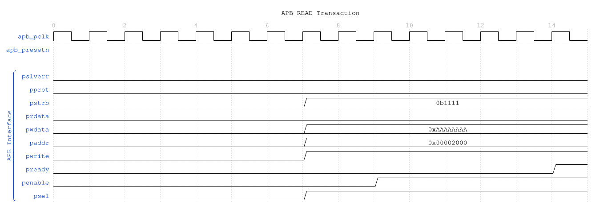
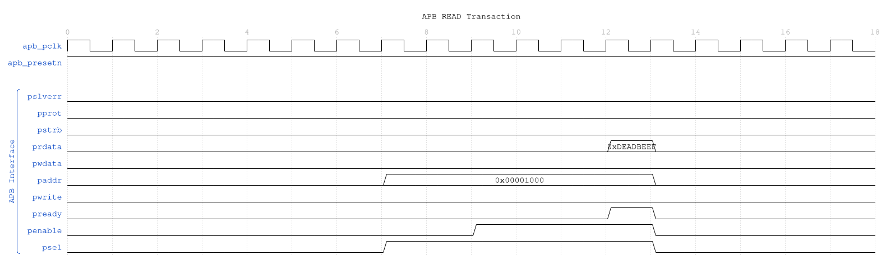
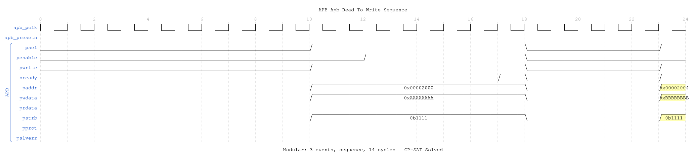

<!-- RTL Design Sherpa Documentation Header -->
<table>
<tr>
<td width="80">
  <a href="https://github.com/sean-galloway/RTLDesignSherpa">
    
  </a>
</td>
<td>
  <strong>RTL Design Sherpa</strong> · <em>Learning Hardware Design Through Practice</em><br>
  <sub>
    <a href="https://github.com/sean-galloway/RTLDesignSherpa">GitHub</a> ·
    <a href="https://github.com/sean-galloway/RTLDesignSherpa/blob/main/docs/DOCUMENTATION_INDEX.md">Documentation Index</a> ·
    <a href="https://github.com/sean-galloway/RTLDesignSherpa/blob/main/LICENSE">MIT License</a>
  </sub>
</td>
</tr>
</table>

---

<!-- End Header -->

# apb_master

An Advanced Peripheral Bus (APB) master module that provides a high-performance interface for accessing APB slave devices with command/response buffering and full APB4/APB5 protocol compliance.

## Overview

The `apb_master` module implements a complete APB master interface with integrated command and response FIFOs for improved system performance. It supports all APB4/APB5 features including write strobes, protection attributes, and error responses while providing a simple command/response interface for system integration.

## Module Declaration

```systemverilog
module apb_master #(
    parameter int ADDR_WIDTH      = 32,
    parameter int DATA_WIDTH      = 32,
    parameter int PROT_WIDTH      = 3,
    parameter int CMD_DEPTH       = 6,
    parameter int RSP_DEPTH       = 6,
    parameter int STRB_WIDTH      = DATA_WIDTH / 8,
    // Short Parameters
    parameter int AW  = ADDR_WIDTH,
    parameter int DW  = DATA_WIDTH,
    parameter int SW  = STRB_WIDTH,
    parameter int PW  = PROT_WIDTH,
    parameter int CPW = AW + DW + SW + PW + 1,  // Command packet width
    parameter int RPW = DW + 1                  // Response packet width
) (
    // Clock and Reset
    input  logic              pclk,
    input  logic              presetn,

    // APB Master Interface
    output logic              m_apb_PSEL,
    output logic              m_apb_PENABLE,
    output logic [AW-1:0]     m_apb_PADDR,
    output logic              m_apb_PWRITE,
    output logic [DW-1:0]     m_apb_PWDATA,
    output logic [SW-1:0]     m_apb_PSTRB,
    output logic [PW-1:0]     m_apb_PPROT,
    input  logic [DW-1:0]     m_apb_PRDATA,
    input  logic              m_apb_PSLVERR,
    input  logic              m_apb_PREADY,

    // Command Interface
    input  logic              cmd_valid,
    output logic              cmd_ready,
    input  logic              cmd_pwrite,
    input  logic [AW-1:0]     cmd_paddr,
    input  logic [DW-1:0]     cmd_pwdata,
    input  logic [SW-1:0]     cmd_pstrb,
    input  logic [PW-1:0]     cmd_pprot,

    // Response Interface
    output logic              rsp_valid,
    input  logic              rsp_ready,
    output logic [DW-1:0]     rsp_prdata,
    output logic              rsp_pslverr
);
```

## Parameters

| Parameter | Type | Default | Description |
|-----------|------|---------|-------------|
| ADDR_WIDTH | int | 32 | APB address bus width |
| DATA_WIDTH | int | 32 | APB data bus width |
| PROT_WIDTH | int | 3 | APB protection signal width |
| CMD_DEPTH | int | 6 | Command FIFO depth (2^6 = 64 entries) |
| RSP_DEPTH | int | 6 | Response FIFO depth (2^6 = 64 entries) |
| STRB_WIDTH | int | DATA_WIDTH/8 | Write strobe width (calculated) |

## Ports

### Clock and Reset

| Port | Width | Direction | Description |
|------|-------|-----------|-------------|
| pclk | 1 | Input | APB clock |
| presetn | 1 | Input | APB active-low reset |

### APB Master Interface

| Port | Width | Direction | Description |
|------|-------|-----------|-------------|
| m_apb_PSEL | 1 | Output | APB select signal |
| m_apb_PENABLE | 1 | Output | APB enable signal |
| m_apb_PADDR | ADDR_WIDTH | Output | APB address |
| m_apb_PWRITE | 1 | Output | APB write/read indicator |
| m_apb_PWDATA | DATA_WIDTH | Output | APB write data |
| m_apb_PSTRB | STRB_WIDTH | Output | APB write strobes |
| m_apb_PPROT | PROT_WIDTH | Output | APB protection attributes |
| m_apb_PRDATA | DATA_WIDTH | Input | APB read data |
| m_apb_PSLVERR | 1 | Input | APB slave error |
| m_apb_PREADY | 1 | Input | APB ready |

### Command Interface

| Port | Width | Direction | Description |
|------|-------|-----------|-------------|
| cmd_valid | 1 | Input | Command valid |
| cmd_ready | 1 | Output | Command ready (FIFO not full) |
| cmd_pwrite | 1 | Input | Command write/read |
| cmd_paddr | ADDR_WIDTH | Input | Command address |
| cmd_pwdata | DATA_WIDTH | Input | Command write data |
| cmd_pstrb | STRB_WIDTH | Input | Command write strobes |
| cmd_pprot | PROT_WIDTH | Input | Command protection attributes |

### Response Interface

| Port | Width | Direction | Description |
|------|-------|-----------|-------------|
| rsp_valid | 1 | Output | Response valid |
| rsp_ready | 1 | Input | Response ready |
| rsp_prdata | DATA_WIDTH | Output | Response read data |
| rsp_pslverr | 1 | Output | Response error status |

## Functionality

### APB Protocol Implementation

The module implements the complete APB protocol state machine:

1. **IDLE**: No transaction active, waiting for commands
2. **SETUP**: PSEL asserted, transaction parameters set up
3. **ACCESS**: PENABLE asserted, waiting for PREADY from slave

### Command Processing Flow

```
Command Interface → Command FIFO → APB State Machine → APB Interface
                                      ↓
Response Interface ← Response FIFO ← APB Response Processing
```

### Key Features

- **Buffered Operation**: Command and response FIFOs prevent blocking
- **APB4/APB5 Compliance**: Full protocol support including PSTRB and PPROT
- **Error Handling**: Proper PSLVERR propagation and handling
- **Flow Control**: Ready/valid handshaking on all interfaces

## Timing Characteristics

### APB Transaction Timing

| Characteristic | Value | Description |
|----------------|-------|-------------|
| Setup Phase | 1 clock cycle | PSEL assertion |
| Access Phase | ≥1 clock cycle | PENABLE assertion until PREADY |
| Total Latency | 2+ clock cycles | Minimum transaction time |
| FIFO Latency | 1 clock cycle | Command to APB delay |
| Response Latency | 1 clock cycle | APB to response delay |

### Performance Metrics

| Metric | Value | Conditions |
|--------|-------|------------|
| Maximum Frequency | 200-400 MHz | Technology dependent |
| Peak Throughput | 1.6-3.2 GB/s | 32-bit data at max frequency |
| Command Buffering | 64 transactions | With default FIFO depth |
| Response Buffering | 64 transactions | With default FIFO depth |

## Waveforms

The following timing diagrams show comprehensive APB master behavior across 6 scenarios:

### Scenario 1: Basic Write Transaction

Shows APB write with command FIFO and response handling:



**WaveJSON:** [apb_write_sequence_001.json](../../assets/WAVES/apb_master/apb_write_sequence_001.json)

**Key Observations:**
- Command accepted into CMD FIFO
- APB SETUP phase (PSEL=1)
- APB ACCESS phase (PENABLE=1)
- Response captured in RSP FIFO

### Scenario 2: Basic Read Transaction



**WaveJSON:** [apb_read_sequence_001.json](../../assets/WAVES/apb_master/apb_read_sequence_001.json)

**Key Observations:**
- Read command with PWRITE=0
- APB protocol phases
- Read data returned via response interface

### Scenario 3: Back-to-Back Writes


**WaveJSON:** [apb_back_to_back_writes_001.json](../../assets/WAVES/apb_master/apb_back_to_back_writes_001.json)

**Key Observations:**
- Multiple commands queued in CMD FIFO
- Sequential APB transactions
- Pipelined command/response flow

### Scenario 4: Back-to-Back Reads


**WaveJSON:** [apb_back_to_back_reads_001.json](../../assets/WAVES/apb_master/apb_back_to_back_reads_001.json)

**Key Observations:**
- Multiple read commands queued
- Response FIFO accumulates read data
- Burst read performance

### Scenario 5: Write-to-Read Transition


**WaveJSON:** [apb_write_to_read_001.json](../../assets/WAVES/apb_master/apb_write_to_read_001.json)

**Key Observations:**
- Transition between write and read operations
- No dead cycles between transaction types

### Scenario 6: Read-to-Write Transition



**WaveJSON:** [apb_read_to_write_001.json](../../assets/WAVES/apb_master/apb_read_to_write_001.json)

**Key Observations:**
- Seamless transition from read to write
- Protocol state machine efficiency

---

## Usage Examples

### Basic APB Master Configuration

```systemverilog
apb_master #(
    .ADDR_WIDTH(32),
    .DATA_WIDTH(32),
    .CMD_DEPTH(4),      // 16-entry command FIFO
    .RSP_DEPTH(4)       // 16-entry response FIFO
) u_apb_master (
    .pclk         (apb_clk),
    .presetn      (apb_resetn),

    // APB interface to slaves
    .m_apb_PSEL     (apb_psel),
    .m_apb_PENABLE  (apb_penable),
    .m_apb_PADDR    (apb_paddr),
    .m_apb_PWRITE   (apb_pwrite),
    .m_apb_PWDATA   (apb_pwdata),
    .m_apb_PSTRB    (apb_pstrb),
    .m_apb_PPROT    (apb_pprot),
    .m_apb_PRDATA   (apb_prdata),
    .m_apb_PSLVERR  (apb_pslverr),
    .m_apb_PREADY   (apb_pready),

    // Command interface from CPU/DMA
    .cmd_valid      (cmd_valid),
    .cmd_ready      (cmd_ready),
    .cmd_pwrite     (cmd_write),
    .cmd_paddr      (cmd_addr),
    .cmd_pwdata     (cmd_wdata),
    .cmd_pstrb      (cmd_strb),
    .cmd_pprot      (3'b000),   // Normal access

    // Response interface to CPU/DMA
    .rsp_valid      (rsp_valid),
    .rsp_ready      (rsp_ready),
    .rsp_prdata     (rsp_rdata),
    .rsp_pslverr    (rsp_error)
);
```

### Register Write Sequence

```systemverilog
// Write to control register
always_ff @(posedge clk) begin
    if (write_control_reg) begin
        cmd_valid  <= 1'b1;
        cmd_pwrite <= 1'b1;
        cmd_paddr  <= 32'h1000_0000;    // Control register address
        cmd_pwdata <= control_value;
        cmd_pstrb  <= 4'hF;             // All bytes valid
        cmd_pprot  <= 3'b000;           // Normal access
    end else if (cmd_ready) begin
        cmd_valid  <= 1'b0;
    end
end

// No response needed for writes (unless checking for errors)
assign rsp_ready = 1'b1;
```

### Register Read Sequence

```systemverilog
// Read from status register
always_ff @(posedge clk) begin
    if (read_status_reg) begin
        cmd_valid  <= 1'b1;
        cmd_pwrite <= 1'b0;             // Read operation
        cmd_paddr  <= 32'h1000_0004;    // Status register address
        cmd_pwdata <= 32'h0;            // Don't care for reads
        cmd_pstrb  <= 4'hF;             // All bytes
        cmd_pprot  <= 3'b000;           // Normal access
    end else if (cmd_ready) begin
        cmd_valid  <= 1'b0;
    end
end

// Handle read response
always_ff @(posedge clk) begin
    if (rsp_valid && rsp_ready) begin
        if (!rsp_pslverr) begin
            status_value <= rsp_prdata;
            read_complete <= 1'b1;
        end else begin
            read_error <= 1'b1;
        end
    end
end

assign rsp_ready = 1'b1;  // Always ready to accept responses
```

### Burst Operation Example

```systemverilog
// Multiple register access sequence
parameter int NUM_REGS = 8;
logic [31:0] reg_addresses [NUM_REGS] = '{
    32'h1000_0000, 32'h1000_0004, 32'h1000_0008, 32'h1000_000C,
    32'h1000_0010, 32'h1000_0014, 32'h1000_0018, 32'h1000_001C
};
logic [31:0] reg_data [NUM_REGS];
int reg_index;

// Issue multiple commands
always_ff @(posedge clk) begin
    if (start_burst && reg_index < NUM_REGS) begin
        if (cmd_ready || !cmd_valid) begin
            cmd_valid  <= 1'b1;
            cmd_pwrite <= 1'b1;
            cmd_paddr  <= reg_addresses[reg_index];
            cmd_pwdata <= reg_data[reg_index];
            cmd_pstrb  <= 4'hF;
            cmd_pprot  <= 3'b000;
            reg_index  <= reg_index + 1;
        end
    end else begin
        cmd_valid <= 1'b0;
    end
end
```

## Integration with APB Interconnect

### APB Crossbar Integration

```systemverilog
// APB system with crossbar
module apb_system (
    input logic clk, resetn,
    // CPU interface
    input logic [31:0] cpu_addr,
    input logic [31:0] cpu_wdata,
    input logic        cpu_write,
    input logic        cpu_valid,
    output logic       cpu_ready,
    output logic [31:0] cpu_rdata,
    output logic        cpu_error
);

    // APB master
    apb_master u_apb_master (
        .pclk(clk),
        .presetn(resetn),
        .m_apb_*(apb_m_*),
        // CPU command interface
        .cmd_valid(cpu_valid),
        .cmd_ready(cpu_ready),
        .cmd_pwrite(cpu_write),
        .cmd_paddr(cpu_addr),
        .cmd_pwdata(cpu_wdata),
        .cmd_pstrb(4'hF),
        .cmd_pprot(3'b000),
        // CPU response interface
        .rsp_valid(rsp_valid),
        .rsp_ready(1'b1),
        .rsp_prdata(cpu_rdata),
        .rsp_pslverr(cpu_error)
    );

    // APB crossbar to multiple slaves
    apb_xbar #(
        .NUM_SLAVES(4),
        .ADDR_WIDTH(32),
        .DATA_WIDTH(32)
    ) u_apb_xbar (
        .pclk(clk),
        .presetn(resetn),
        // Master interface
        .s_apb_*(apb_m_*),
        // Slave interfaces
        .m_apb_*(slave_apb_*)
    );

endmodule
```

## Advanced Features

### Protection Attributes (PPROT)

The module supports APB protection attributes:

| PPROT[2:0] | Description |
|------------|-------------|
| 000 | Normal, Non-secure, Data |
| 001 | Normal, Non-secure, Instruction |
| 010 | Normal, Secure, Data |
| 011 | Normal, Secure, Instruction |
| 100 | Privileged, Non-secure, Data |
| 101 | Privileged, Non-secure, Instruction |
| 110 | Privileged, Secure, Data |
| 111 | Privileged, Secure, Instruction |

### Write Strobe Support

Fine-grained byte-level write control:

```systemverilog
// Example: Write only upper 16 bits of 32-bit register
cmd_pwdata <= {new_upper_data, 16'h0000};
cmd_pstrb  <= 4'b1100;  // Only upper 2 bytes
```

### Error Handling

Comprehensive error handling and reporting:

```systemverilog
always_ff @(posedge clk) begin
    if (rsp_valid && rsp_ready) begin
        if (rsp_pslverr) begin
            // Log error details
            error_count <= error_count + 1;
            error_addr  <= last_cmd_addr;
            error_type  <= last_cmd_write ? ERR_WRITE : ERR_READ;
        end
    end
end
```

## Performance Optimization

### FIFO Depth Selection

Choose FIFO depths based on system requirements:

| Application | CMD_DEPTH | RSP_DEPTH | Rationale |
|-------------|-----------|-----------|-----------|
| CPU Access | 2-4 | 2-4 | Low latency, simple access patterns |
| DMA Access | 6-8 | 6-8 | Burst operations, higher throughput |
| Multi-Master | 8-10 | 8-10 | Multiple requestors, avoid starvation |

### Clock Gating

For power-sensitive applications, use `apb_master_cg`:

```systemverilog
apb_master_cg #(
    .ADDR_WIDTH(32),
    .DATA_WIDTH(32)
) u_apb_master_cg (
    // Standard interfaces
    .*,
    // Clock gating control
    .cg_enable(apb_active),
    .cg_test_enable(scan_mode)
);
```

## Synthesis Considerations

### Area Optimization
- Reduce FIFO depths for area-constrained designs
- Use synchronous reset for smaller area
- Consider shared resources for multiple APB masters

### Timing Optimization
- Register all outputs for timing closure
- Use appropriate FIFO depths to break critical paths
- Consider skid buffers for high-frequency operation

### Power Optimization
- Use clock gating variant when available
- Implement power gating for inactive masters
- Use appropriate FIFO depths to minimize switching

## Verification Notes

### Protocol Compliance
- Verify APB setup and access phases
- Check PSEL and PENABLE timing
- Validate PREADY handling and wait states

### Interface Verification
- Test command/response FIFO overflow/underflow
- Verify backpressure handling
- Check error propagation and handling

### Performance Verification
- Measure sustained throughput
- Verify FIFO efficiency
- Check latency under various loads

## Related Modules

- **apb_master_cg**: Clock-gated version for power optimization
- **apb_slave**: APB slave implementation
- **apb_xbar**: APB crossbar for multi-slave systems
- **apb_monitor**: APB protocol monitor and analyzer

The `apb_master` module provides a complete, high-performance solution for APB master functionality with advanced buffering, full protocol compliance, and comprehensive system integration capabilities.

---

## Navigation

- **[← Back to RTLAmba Index](../index.md)**
- **[← Back to Main Documentation Index](../../index.md)**