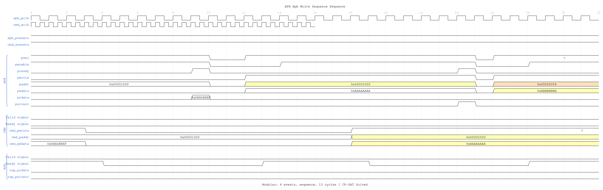
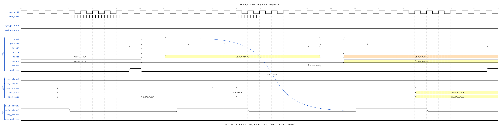
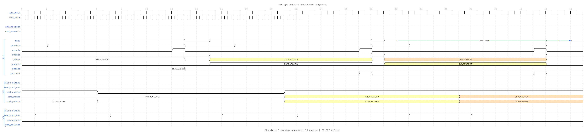
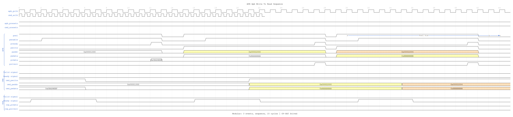
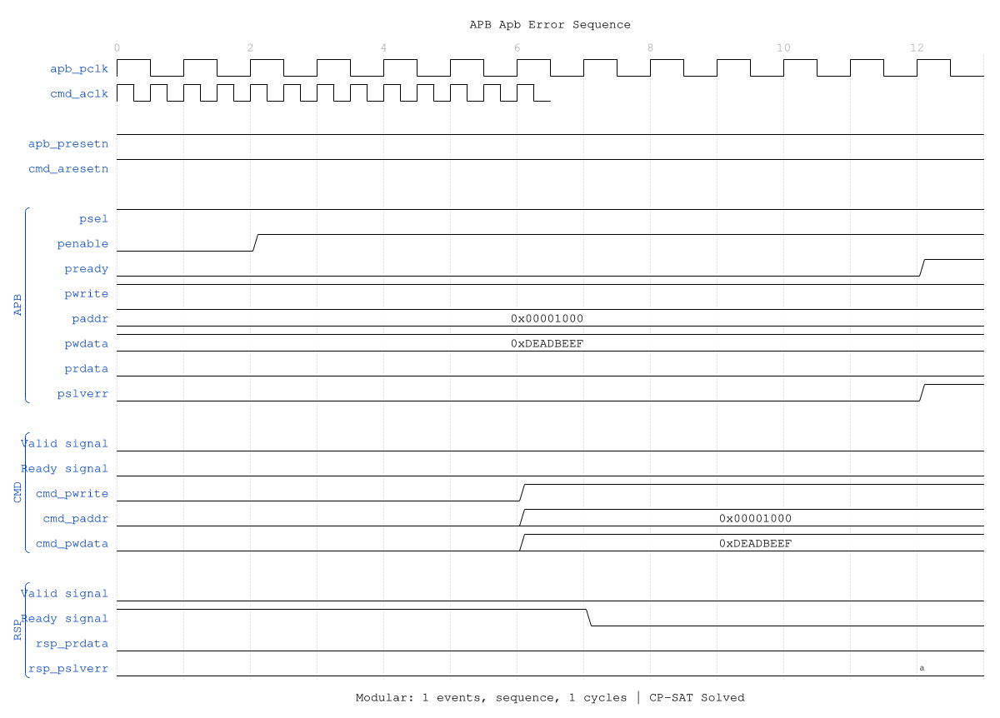

<!-- RTL Design Sherpa Documentation Header -->
<table>
<tr>
<td width="80">
  <a href="https://github.com/sean-galloway/RTLDesignSherpa">
    
  </a>
</td>
<td>
  <strong>RTL Design Sherpa</strong> · <em>Learning Hardware Design Through Practice</em><br>
  <sub>
    <a href="https://github.com/sean-galloway/RTLDesignSherpa">GitHub</a> ·
    <a href="https://github.com/sean-galloway/RTLDesignSherpa/blob/main/docs/DOCUMENTATION_INDEX.md">Documentation Index</a> ·
    <a href="https://github.com/sean-galloway/RTLDesignSherpa/blob/main/LICENSE">MIT License</a>
  </sub>
</td>
</tr>
</table>

---

<!-- End Header -->

# APB Slave CDC

**Module:** `apb_slave_cdc.sv`
**Location:** `rtl/amba/apb/`
**Status:** ✅ Production Ready

---

## Overview

The APB Slave CDC (Clock Domain Crossing) module provides a complete APB slave interface with integrated clock domain crossing between the APB (pclk) domain and an AXI/GAXI (aclk) domain. This enables safe integration of APB peripherals running at different clock frequencies.

### Key Features

- ✅ **Safe CDC:** Proper clock domain crossing with handshake protocol
- ✅ **Dual Clock Domains:** APB (pclk) and AXI (aclk) operate independently
- ✅ **Full APB4/APB5 Support:** Complete protocol compliance
- ✅ **Command/Response Interface:** Clean GAXI-style backend interface
- ✅ **Buffered Operation:** Integrated skid buffers for elastic storage

---

## Module Interface

```systemverilog
module apb_slave_cdc #(
    parameter int ADDR_WIDTH  = 32,
    parameter int DATA_WIDTH  = 32,
    parameter int STRB_WIDTH  = DATA_WIDTH / 8,
    parameter int PROT_WIDTH  = 3,
    parameter int DEPTH       = 2
) (
    // Clock and Reset
    input  logic              aclk,
    input  logic              aresetn,
    input  logic              pclk,
    input  logic              presetn,

    // APB Slave Interface (pclk domain)
    input  logic              s_apb_PSEL,
    input  logic              s_apb_PENABLE,
    output logic              s_apb_PREADY,
    input  logic [AW-1:0]     s_apb_PADDR,
    input  logic              s_apb_PWRITE,
    input  logic [DW-1:0]     s_apb_PWDATA,
    input  logic [SW-1:0]     s_apb_PSTRB,
    input  logic [PW-1:0]     s_apb_PPROT,
    output logic [DW-1:0]     s_apb_PRDATA,
    output logic              s_apb_PSLVERR,

    // Command Interface (aclk domain)
    output logic              cmd_valid,
    input  logic              cmd_ready,
    output logic              cmd_pwrite,
    output logic [AW-1:0]     cmd_paddr,
    output logic [DW-1:0]     cmd_pwdata,
    output logic [SW-1:0]     cmd_pstrb,
    output logic [PW-1:0]     cmd_pprot,

    // Response Interface (aclk domain)
    input  logic              rsp_valid,
    output logic              rsp_ready,
    input  logic [DW-1:0]     rsp_prdata,
    input  logic              rsp_pslverr
);
```

---

## Clock Domains

### APB Domain (pclk)
- APB slave interface signals
- Typical frequency: 50-200 MHz
- Used by APB master/interconnect

### AXI Domain (aclk)
- Command and response interfaces
- Can be faster or slower than pclk
- Used by backend processing logic

**Note:** The module handles the clock domain crossing safely using handshake-based CDC techniques.

---

## Waveforms

The following timing diagrams show CDC behavior with **both clock domains visible**:

**Clock Configuration:**
- `apb_pclk`: 100MHz (10ns period)
- `cmd_aclk`: 500MHz (2ns period), displayed with `period=0.4` for visual compactness

### Scenario 1: Write Transaction with CDC

Shows APB write crossing from pclk domain to aclk domain:



**WaveJSON:** [apb_write_sequence_001.json](../../assets/WAVES/apb_slave_cdc/apb_write_sequence_001.json)

**Key Observations:**
- APB transaction in pclk domain
- CMD transaction crosses to aclk domain
- Note the CDC latency between domains

### Scenario 2: Read Transaction with CDC

Shows APB read with response crossing back from aclk to pclk domain:



**WaveJSON:** [apb_read_sequence_001.json](../../assets/WAVES/apb_slave_cdc/apb_read_sequence_001.json)

**Key Observations:**
- APB read request in pclk domain
- CMD crosses to aclk domain
- RSP crosses back to pclk domain
- Complete round-trip CDC visible

### Scenario 3: Back-to-Back Writes with CDC


**WaveJSON:** [apb_back_to_back_writes_001.json](../../assets/WAVES/apb_slave_cdc/apb_back_to_back_writes_001.json)

### Scenario 4: Back-to-Back Reads with CDC



**WaveJSON:** [apb_back_to_back_reads_001.json](../../assets/WAVES/apb_slave_cdc/apb_back_to_back_reads_001.json)

### Scenario 5: Write-to-Read Transition with CDC



**WaveJSON:** [apb_write_to_read_001.json](../../assets/WAVES/apb_slave_cdc/apb_write_to_read_001.json)

### Scenario 6: Read-to-Write Transition with CDC


**WaveJSON:** [apb_read_to_write_001.json](../../assets/WAVES/apb_slave_cdc/apb_read_to_write_001.json)

### Scenario 7: Error Response with CDC



**WaveJSON:** [apb_error_001.json](../../assets/WAVES/apb_slave_cdc/apb_error_001.json)

---

## Usage Example

```systemverilog
apb_slave_cdc #(
    .ADDR_WIDTH(32),
    .DATA_WIDTH(32),
    .DEPTH(2)
) u_apb_cdc (
    // APB clock domain
    .pclk         (apb_clk),
    .presetn      (apb_resetn),

    // AXI clock domain
    .aclk         (axi_clk),
    .aresetn      (axi_resetn),

    // APB slave interface (pclk domain)
    .s_apb_PSEL     (apb_psel),
    .s_apb_PENABLE  (apb_penable),
    .s_apb_PREADY   (apb_pready),
    .s_apb_PADDR    (apb_paddr),
    .s_apb_PWRITE   (apb_pwrite),
    .s_apb_PWDATA   (apb_pwdata),
    .s_apb_PSTRB    (apb_pstrb),
    .s_apb_PPROT    (apb_pprot),
    .s_apb_PRDATA   (apb_prdata),
    .s_apb_PSLVERR  (apb_pslverr),

    // Command interface (aclk domain)
    .cmd_valid      (cmd_valid),
    .cmd_ready      (cmd_ready),
    .cmd_pwrite     (cmd_pwrite),
    .cmd_paddr      (cmd_paddr),
    .cmd_pwdata     (cmd_pwdata),
    .cmd_pstrb      (cmd_pstrb),
    .cmd_pprot      (cmd_pprot),

    // Response interface (aclk domain)
    .rsp_valid      (rsp_valid),
    .rsp_ready      (rsp_ready),
    .rsp_prdata     (rsp_prdata),
    .rsp_pslverr    (rsp_pslverr)
);
```

---

## References

- **APB Slave:** [apb_slave.md](apb_slave.md)
- **Source:** `rtl/amba/apb/apb_slave_cdc.sv`
- **Tests:** `val/amba/test_apb_slave_cdc.py`
- **WaveDrom Test:** `val/amba/test_apb_slave_cdc.py::test_apb_slave_cdc_wavedrom`

---

**Last Updated:** 2025-10-09

---

## Navigation

- **[← Back to RTLAmba Index](../index.md)**
- **[← Back to Main Documentation Index](../../index.md)**
