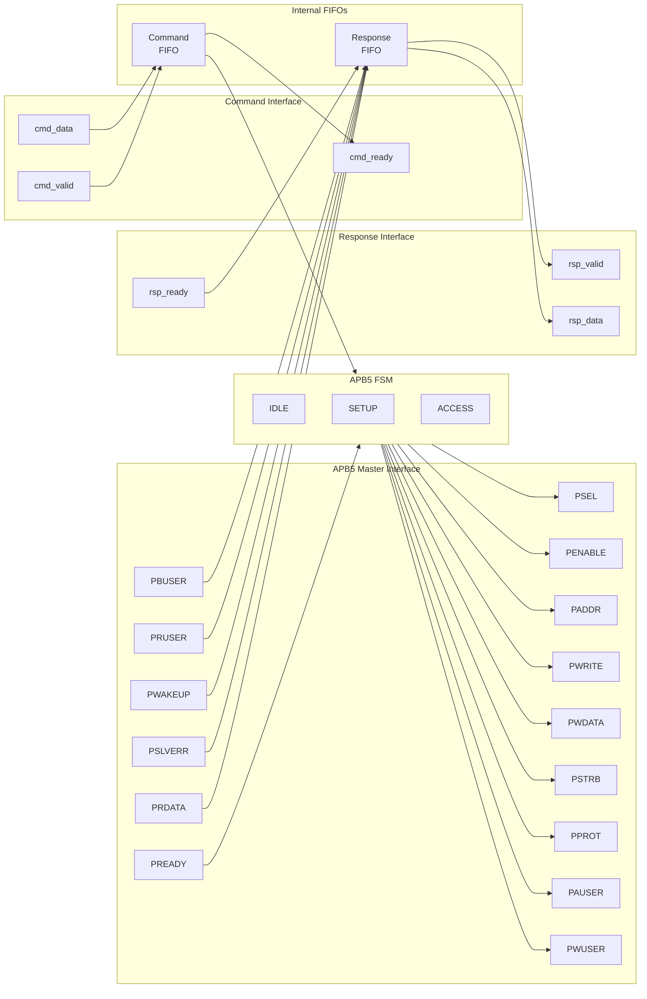

<!-- RTL Design Sherpa Documentation Header -->
<table>
<tr>
<td width="80">
  <a href="https://github.com/sean-galloway/RTLDesignSherpa">
    
  </a>
</td>
<td>
  <strong>RTL Design Sherpa</strong> · <em>Learning Hardware Design Through Practice</em><br>
  <sub>
    <a href="https://github.com/sean-galloway/RTLDesignSherpa">GitHub</a> ·
    <a href="https://github.com/sean-galloway/RTLDesignSherpa/blob/main/docs/DOCUMENTATION_INDEX.md">Documentation Index</a> ·
    <a href="https://github.com/sean-galloway/RTLDesignSherpa/blob/main/LICENSE">MIT License</a>
  </sub>
</td>
</tr>
</table>

---

<!-- End Header -->

# APB5 Master

**Module:** `apb5_master.sv`
**Location:** `rtl/amba/apb5/`
**Status:** Production Ready

---

## Overview

The APB5 Master module implements a complete AMBA APB5 master interface with all APB5 extensions including user-defined signals, wake-up support, and optional parity for data integrity. It provides command/response buffering for improved system performance.

### Key Features

- Full AMBA APB5 protocol compliance
- PAUSER: User-defined request attributes
- PWUSER: User-defined write data attributes
- PRUSER/PBUSER: User-defined response attributes from slave
- PWAKEUP: Wake-up signal handling from slave
- Optional parity support for data integrity
- Command and response FIFO buffering
- Configurable FIFO depths

---

## Module Architecture



---

## Parameters

| Parameter | Type | Default | Description |
|-----------|------|---------|-------------|
| ADDR_WIDTH | int | 32 | APB address bus width |
| DATA_WIDTH | int | 32 | APB data bus width |
| PROT_WIDTH | int | 3 | Protection signal width |
| AUSER_WIDTH | int | 4 | Address/request user signal width |
| WUSER_WIDTH | int | 4 | Write data user signal width |
| RUSER_WIDTH | int | 4 | Read data user signal width |
| BUSER_WIDTH | int | 4 | Response user signal width |
| CMD_DEPTH | int | 6 | Command FIFO depth (2^N entries) |
| RSP_DEPTH | int | 6 | Response FIFO depth (2^N entries) |
| ENABLE_PARITY | bit | 0 | Enable parity signals |
| STRB_WIDTH | int | DATA_WIDTH/8 | Write strobe width (calculated) |

---

## Ports

### Clock and Reset

| Port | Width | Direction | Description |
|------|-------|-----------|-------------|
| pclk | 1 | Input | APB clock |
| presetn | 1 | Input | APB active-low reset |

### APB5 Master Interface

| Port | Width | Direction | Description |
|------|-------|-----------|-------------|
| m_apb_PSEL | 1 | Output | APB select signal |
| m_apb_PENABLE | 1 | Output | APB enable signal |
| m_apb_PADDR | ADDR_WIDTH | Output | APB address |
| m_apb_PWRITE | 1 | Output | Write/read indicator (1=write) |
| m_apb_PWDATA | DATA_WIDTH | Output | Write data |
| m_apb_PSTRB | STRB_WIDTH | Output | Write byte strobes |
| m_apb_PPROT | PROT_WIDTH | Output | Protection attributes |
| m_apb_PAUSER | AUSER_WIDTH | Output | User-defined request attributes |
| m_apb_PWUSER | WUSER_WIDTH | Output | User-defined write data attributes |
| m_apb_PRDATA | DATA_WIDTH | Input | Read data from slave |
| m_apb_PSLVERR | 1 | Input | Slave error response |
| m_apb_PREADY | 1 | Input | Slave ready |
| m_apb_PWAKEUP | 1 | Input | Wake-up signal from slave |
| m_apb_PRUSER | RUSER_WIDTH | Input | User-defined read data attributes |
| m_apb_PBUSER | BUSER_WIDTH | Input | User-defined response attributes |

### Parity Signals (Optional)

| Port | Width | Direction | Description |
|------|-------|-----------|-------------|
| m_apb_PWDATAPARITY | STRB_WIDTH | Output | Write data parity (per byte) |
| m_apb_PADDRPARITY | 1 | Output | Address parity |
| m_apb_PCTRLPARITY | 1 | Output | Control signals parity |
| m_apb_PRDATAPARITY | STRB_WIDTH | Input | Read data parity from slave |
| m_apb_PREADYPARITY | 1 | Input | PREADY parity from slave |
| m_apb_PSLVERRPARITY | 1 | Input | PSLVERR parity from slave |

### Command Interface

| Port | Width | Direction | Description |
|------|-------|-----------|-------------|
| cmd_valid | 1 | Input | Command valid |
| cmd_ready | 1 | Output | Command ready (FIFO not full) |
| cmd_pwrite | 1 | Input | Command write/read |
| cmd_paddr | ADDR_WIDTH | Input | Command address |
| cmd_pwdata | DATA_WIDTH | Input | Command write data |
| cmd_pstrb | STRB_WIDTH | Input | Command write strobes |
| cmd_pprot | PROT_WIDTH | Input | Command protection attributes |
| cmd_pauser | AUSER_WIDTH | Input | Command user attributes |
| cmd_pwuser | WUSER_WIDTH | Input | Command write user attributes |

### Response Interface

| Port | Width | Direction | Description |
|------|-------|-----------|-------------|
| rsp_valid | 1 | Output | Response valid |
| rsp_ready | 1 | Input | Response ready |
| rsp_prdata | DATA_WIDTH | Output | Response read data |
| rsp_pslverr | 1 | Output | Response error status |
| rsp_pwakeup | 1 | Output | Response wake-up indicator |
| rsp_pruser | RUSER_WIDTH | Output | Response read user attributes |
| rsp_pbuser | BUSER_WIDTH | Output | Response user attributes |

---

## Functionality

### APB5 Protocol State Machine

```mermaid
stateDiagram-v2
    [*] --> IDLE

    IDLE --> SETUP : cmd_fifo_valid
    SETUP --> ACCESS : always
    ACCESS --> IDLE : PREADY & cmd_fifo_empty
    ACCESS --> SETUP : PREADY & !cmd_fifo_empty

    state IDLE {
        note right of IDLE : PSEL=0, PENABLE=0
    }
    state SETUP {
        note right of SETUP : PSEL=1, PENABLE=0
    }
    state ACCESS {
        note right of ACCESS : PSEL=1, PENABLE=1
    }
```

### APB5 Extensions

**User Signals:**
- **PAUSER**: Carries user-defined attributes with the address/control phase
- **PWUSER**: Carries user-defined attributes with write data
- **PRUSER**: Returns user-defined attributes with read data
- **PBUSER**: Returns user-defined attributes with the response

**Wake-up Support:**
- **PWAKEUP**: Slave can assert to indicate wake-up events
- Captured in response packet for software handling

**Parity Protection:**
- Optional odd parity on data, address, and control signals
- Enables detection of single-bit transmission errors

---

## Timing Diagrams

### Basic Write Transaction

<!-- TODO: Add wavedrom timing diagram for APB5 write transaction -->
```
TODO: Wavedrom timing diagram showing:
- PCLK
- PSEL
- PENABLE
- PADDR
- PWRITE (high)
- PWDATA
- PSTRB
- PAUSER
- PWUSER
- PREADY
- PSLVERR
```

### Basic Read Transaction

<!-- TODO: Add wavedrom timing diagram for APB5 read transaction -->
```
TODO: Wavedrom timing diagram showing:
- PCLK
- PSEL
- PENABLE
- PADDR
- PWRITE (low)
- PAUSER
- PREADY
- PRDATA
- PRUSER
- PSLVERR
```

### Wake-up Signal Handling

<!-- TODO: Add wavedrom timing diagram for wake-up scenario -->
```
TODO: Wavedrom timing diagram showing:
- PCLK
- Transaction signals
- PWAKEUP assertion
- Response capture
```

---

## Usage Example

```systemverilog
apb5_master #(
    .ADDR_WIDTH     (32),
    .DATA_WIDTH     (32),
    .AUSER_WIDTH    (4),
    .WUSER_WIDTH    (4),
    .RUSER_WIDTH    (4),
    .BUSER_WIDTH    (4),
    .CMD_DEPTH      (4),
    .RSP_DEPTH      (4),
    .ENABLE_PARITY  (0)
) u_apb5_master (
    .pclk           (apb_clk),
    .presetn        (apb_rst_n),

    // APB5 master interface
    .m_apb_PSEL     (m_apb_psel),
    .m_apb_PENABLE  (m_apb_penable),
    .m_apb_PADDR    (m_apb_paddr),
    .m_apb_PWRITE   (m_apb_pwrite),
    .m_apb_PWDATA   (m_apb_pwdata),
    .m_apb_PSTRB    (m_apb_pstrb),
    .m_apb_PPROT    (m_apb_pprot),
    .m_apb_PAUSER   (m_apb_pauser),
    .m_apb_PWUSER   (m_apb_pwuser),
    .m_apb_PRDATA   (m_apb_prdata),
    .m_apb_PSLVERR  (m_apb_pslverr),
    .m_apb_PREADY   (m_apb_pready),
    .m_apb_PWAKEUP  (m_apb_pwakeup),
    .m_apb_PRUSER   (m_apb_pruser),
    .m_apb_PBUSER   (m_apb_pbuser),

    // Command interface
    .cmd_valid      (cmd_valid),
    .cmd_ready      (cmd_ready),
    .cmd_pwrite     (cmd_write),
    .cmd_paddr      (cmd_addr),
    .cmd_pwdata     (cmd_wdata),
    .cmd_pstrb      (cmd_strb),
    .cmd_pprot      (cmd_prot),
    .cmd_pauser     (cmd_auser),
    .cmd_pwuser     (cmd_wuser),

    // Response interface
    .rsp_valid      (rsp_valid),
    .rsp_ready      (rsp_ready),
    .rsp_prdata     (rsp_rdata),
    .rsp_pslverr    (rsp_error),
    .rsp_pwakeup    (rsp_wakeup),
    .rsp_pruser     (rsp_ruser),
    .rsp_pbuser     (rsp_buser)
);
```

---

## Design Notes

### APB5 vs APB4 Differences

| Feature | APB4 | APB5 |
|---------|------|------|
| User signals | None | PAUSER, PWUSER, PRUSER, PBUSER |
| Wake-up | None | PWAKEUP |
| Parity | None | Optional on all signals |

### FIFO Sizing

- Command FIFO depth should match expected command burst length
- Response FIFO depth should match to prevent backpressure
- Typical values: 4-16 entries (depth parameter is log2)

### Parity Implementation

When `ENABLE_PARITY=1`:
- Odd parity computed on outgoing signals
- Incoming parity checked (error handling is system-specific)
- Adds latency for parity computation

---

## Related Documentation

- **[APB5 Slave](apb5_slave.md)** - APB5 slave interface
- **[APB5 Master CG](apb5_master_cg.md)** - Clock-gated variant
- **[APB5 Monitor](apb5_monitor.md)** - Protocol monitor
- **[APB4 Master](../apb/apb_master.md)** - APB4 version for comparison

---

## Navigation

- **[← Back to APB5 Index](README.md)**
- **[← Back to RTLAmba Index](../index.md)**
- **[← Back to Main Documentation Index](../../index.md)**
