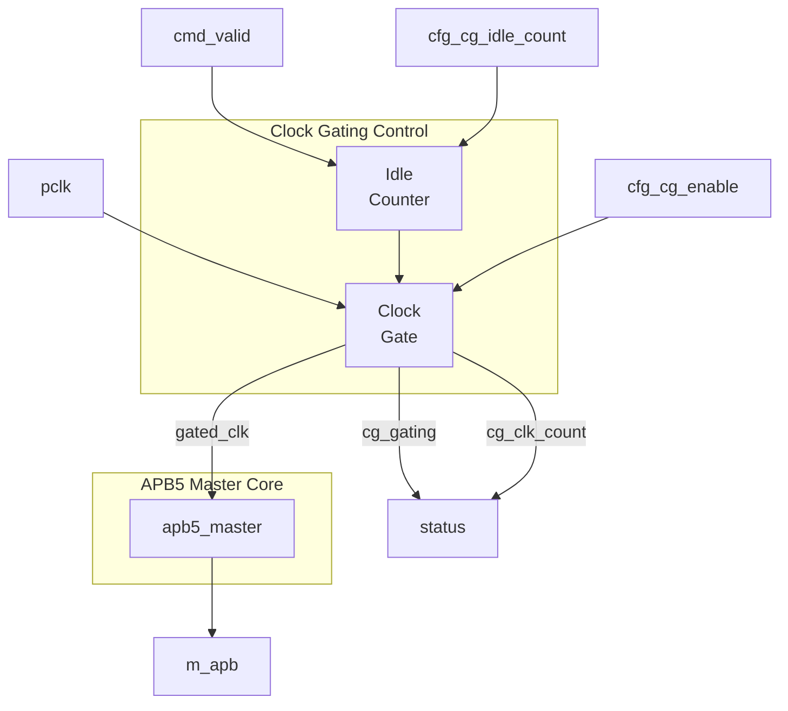

<!-- RTL Design Sherpa Documentation Header -->
<table>
<tr>
<td width="80">
  <a href="https://github.com/sean-galloway/RTLDesignSherpa">
    
  </a>
</td>
<td>
  <strong>RTL Design Sherpa</strong> · <em>Learning Hardware Design Through Practice</em><br>
  <sub>
    <a href="https://github.com/sean-galloway/RTLDesignSherpa">GitHub</a> ·
    <a href="https://github.com/sean-galloway/RTLDesignSherpa/blob/main/docs/DOCUMENTATION_INDEX.md">Documentation Index</a> ·
    <a href="https://github.com/sean-galloway/RTLDesignSherpa/blob/main/LICENSE">MIT License</a>
  </sub>
</td>
</tr>
</table>

---

<!-- End Header -->

# APB5 Master (Clock-Gated)

**Module:** `apb5_master_cg.sv`
**Location:** `rtl/amba/apb5/`
**Status:** Production Ready

---

## Overview

Clock-gated variant of the APB5 Master module. Wraps the base `apb5_master` with clock gating control logic to reduce dynamic power consumption during idle periods.

### Key Features

- All APB5 Master features (see [apb5_master](apb5_master.md))
- Automatic clock gating during idle periods
- Configurable idle threshold before gating
- Zero-latency wake-up on new transactions
- Power consumption reduction for low-duty-cycle applications

---

## Module Architecture



---

## Additional Parameters

| Parameter | Type | Default | Description |
|-----------|------|---------|-------------|
| CG_IDLE_COUNT_WIDTH | int | 4 | Width of idle counter (max idle = 2^N-1 cycles) |

All other parameters inherited from [apb5_master](apb5_master.md).

---

## Additional Ports

### Clock Gating Configuration

| Port | Width | Direction | Description |
|------|-------|-----------|-------------|
| cfg_cg_enable | 1 | Input | Enable clock gating (0=disabled) |
| cfg_cg_idle_count | CG_IDLE_COUNT_WIDTH | Input | Idle cycles before gating |

### Clock Gating Status

| Port | Width | Direction | Description |
|------|-------|-----------|-------------|
| cg_gating | 1 | Output | Clock currently gated |
| cg_clk_count | 32 | Output | Cumulative gated clock cycles |

---

## Clock Gating Behavior

### Gating State Machine

```mermaid
stateDiagram-v2
    [*] --> RUNNING

    RUNNING --> COUNTING : No activity
    COUNTING --> RUNNING : Activity detected
    COUNTING --> GATED : count >= threshold
    GATED --> RUNNING : cmd_valid or activity

    state RUNNING {
        note right of RUNNING : Clock running
    }
    state COUNTING {
        note right of COUNTING : Counting idle cycles
    }
    state GATED {
        note right of GATED : Clock stopped
    }
```

### Timing

<!-- TODO: Add wavedrom timing diagram for clock gating -->
```
TODO: Wavedrom timing diagram showing:
- pclk
- gated_clk
- cmd_valid
- cfg_cg_idle_count
- idle_counter
- cg_gating
- Transaction before/after gating
```

---

## Usage Example

```systemverilog
apb5_master_cg #(
    .ADDR_WIDTH         (32),
    .DATA_WIDTH         (32),
    .AUSER_WIDTH        (4),
    .WUSER_WIDTH        (4),
    .CG_IDLE_COUNT_WIDTH(4)
) u_apb5_master_cg (
    .pclk               (apb_clk),
    .presetn            (apb_rst_n),

    // Clock gating configuration
    .cfg_cg_enable      (1'b1),
    .cfg_cg_idle_count  (4'd8),    // Gate after 8 idle cycles

    // Clock gating status
    .cg_gating          (master_clk_gated),
    .cg_clk_count       (master_gated_cycles),

    // APB5 and command/response interfaces
    // ... (same as apb5_master)
);
```

---

## Power Savings

| Traffic Pattern | Duty Cycle | Typical Savings |
|-----------------|------------|-----------------|
| Burst | 30% | 35-40% |
| Mixed | 50% | 20-25% |
| Continuous | 90%+ | <5% |

---

## Related Documentation

- **[APB5 Master](apb5_master.md)** - Base module documentation
- **[APB5 Slave CG](apb5_slave_cg.md)** - Clock-gated slave
- **[Clock Gating Guide](../axi4/axi4_clock_gating_guide.md)** - General clock gating concepts

---

## Navigation

- **[← Back to APB5 Index](README.md)**
- **[← Back to RTLAmba Index](../index.md)**
- **[← Back to Main Documentation Index](../../index.md)**
