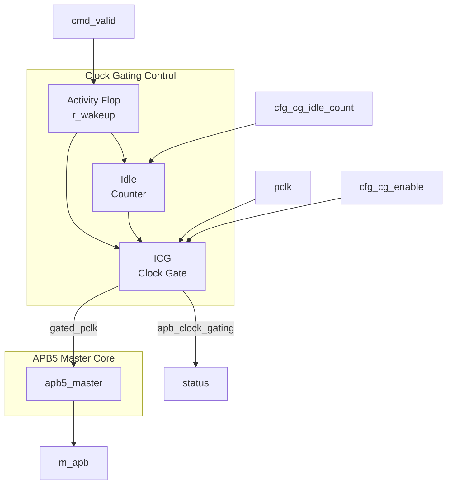

<!-- RTL Design Sherpa Documentation Header -->
<table>
<tr>
<td width="80">
  <a href="https://github.com/sean-galloway/RTLDesignSherpa">
    
  </a>
</td>
<td>
  <strong>RTL Design Sherpa</strong> · <em>Learning Hardware Design Through Practice</em><br>
  <sub>
    <a href="https://github.com/sean-galloway/RTLDesignSherpa">GitHub</a> ·
    <a href="https://github.com/sean-galloway/RTLDesignSherpa/blob/main/docs/DOCUMENTATION_INDEX.md">Documentation Index</a> ·
    <a href="https://github.com/sean-galloway/RTLDesignSherpa/blob/main/LICENSE">MIT License</a>
  </sub>
</td>
</tr>
</table>

---

<!-- End Header -->

# APB5 Master (Clock-Gated)

**Module:** `apb5_master_cg.sv`
**Location:** `rtl/amba/apb5/`
**Status:** Production Ready

---

## Overview

Clock-gated variant of the APB5 Master module. Wraps the base `apb5_master` with clock gating control logic to reduce dynamic power consumption during idle periods.

### Key Features

- All APB5 Master features (see [apb5_master](apb5_master.md))
- Automatic clock gating during idle periods
- Configurable idle threshold before gating
- Registered wake-up on new activity, through a glitch-free ICG cell
- Power consumption reduction for low-duty-cycle applications

---

## Module Architecture


```mermaid
flowchart TB
    subgraph CG["Clock Gating Control"]
        wake["Activity Flop<br/>r_wakeup"]
        idle["Idle<br/>Counter"]
        gate["ICG<br/>Clock Gate"]
    end

    subgraph CORE["APB5 Master Core"]
        master["apb5_master"]
    end

    pclk["pclk"] --> gate
    gate -->|gated_pclk| master
    idle --> gate
    wake --> gate

    cmd_valid --> wake
    wake --> idle
    master --> m_apb

    cfg_cg_enable --> gate
    cfg_cg_idle_count --> idle

    gate -->|apb_clock_gating| status
```

---

## Additional Parameters

| Parameter | Type | Default | Description |
|-----------|------|---------|-------------|
| CG_IDLE_COUNT_WIDTH | int | 4 | Width of idle counter (max idle = 2^N-1 cycles) |

All other parameters inherited from [apb5_master](apb5_master.md).

---

## Additional Ports

### Clock Gating Configuration

| Port | Width | Direction | Description |
|------|-------|-----------|-------------|
| cfg_cg_enable | 1 | Input | Enable clock gating (0=disabled, clock always runs) |
| cfg_cg_idle_count | CG_IDLE_COUNT_WIDTH | Input | Idle cycles before gating |

### Clock Gating Status

| Port | Width | Direction | Description |
|------|-------|-----------|-------------|
| apb_clock_gating | 1 | Output | High while the internal clock is gated off |

There is no cumulative gated-cycle counter port on this module. If a gated-cycle
total is needed, count `apb_clock_gating` in the integrating logic on the
ungated `pclk`.

All ports of [apb5_master](apb5_master.md) -- including the parity signals,
`parity_error_rdata`, `parity_error_ctrl` and `wakeup_pending` -- are present
unchanged and pass straight through to the wrapped core.

---

## Clock Gating Behavior

### Gating State Machine

```mermaid
stateDiagram-v2
    [*] --> RUNNING

    RUNNING --> COUNTING : No activity
    COUNTING --> RUNNING : Activity detected
    COUNTING --> GATED : count >= threshold
    GATED --> RUNNING : cmd_valid or activity

    state RUNNING {
        note right of RUNNING : Clock running
    }
    state COUNTING {
        note right of COUNTING : Counting idle cycles
    }
    state GATED {
        note right of GATED : Clock stopped
    }
```

### Activity Detection and Wake-up Latency

The wrapper keeps the clock running whenever any of the following is high:

```
cmd_valid || rsp_valid || m_apb_PSEL || m_apb_PENABLE || m_apb_PWAKEUP
```

That term is registered into `r_wakeup` on the ungated `pclk`, and
`amba_clock_gate_ctrl` registers it once more before it reaches the gating
condition. Activity is registered once (AXI4, AXI5, AXI4-Lite, AXI4-Stream) or
twice (APB, APB5, AXI5-Stream) before reaching the ICG enable, which is
combinational. APB5 is a **two-stage** family, so the first gated-clock rising
edge available to the wrapped `apb5_master` arrives **3 ungated `pclk` cycles**
after activity asserts. Nothing is lost during those cycles -- the core is simply
held static, and the APB transfer stretches by that many wait states.

The actual gating element is an ICG (integrated clock gating) cell instantiated
by `clock_gate_ctrl`, not a bare AND gate, so enable changes are glitch-free.
Note that ICG cells are an ASIC-library primitive; on FPGA targets a clock-enable
approach should be used instead.

Gating engages `cfg_cg_idle_count + 1` ungated `pclk` cycles after the internal
wakeup deasserts, which is `cfg_cg_idle_count + 3` cycles after the last bus
activity, because APB5 adds two register stages ahead of the ICG enable. With the
default `CG_IDLE_COUNT_WIDTH=4` the maximum programmable idle threshold is 15
cycles.

### Timing

<!-- TODO: Add wavedrom timing diagram for clock gating -->
> **Timing diagram pending.** The signals and sequence this scenario
> exercises:
>
> - pclk
> - gated_pclk
> - cmd_valid
> - cfg_cg_idle_count
> - idle_counter
> - apb_clock_gating
> - Transaction before/after gating


---

## Usage Example

```systemverilog
apb5_master_cg #(
    .ADDR_WIDTH         (32),
    .DATA_WIDTH         (32),
    .AUSER_WIDTH        (4),
    .WUSER_WIDTH        (4),
    .CG_IDLE_COUNT_WIDTH(4)
) u_apb5_master_cg (
    .pclk               (apb_clk),
    .presetn            (apb_rst_n),

    // Clock gating configuration
    .cfg_cg_enable      (1'b1),
    .cfg_cg_idle_count  (4'd8),    // Gate after 8 idle cycles

    // Clock gating status
    .apb_clock_gating   (master_clk_gated),

    // APB5 and command/response interfaces
    // ... (same as apb5_master)
);
```

---

## Power Savings

The figures below are first-order expectations derived from the fraction of
cycles the clock is gated off; they are analytical estimates, not measured
silicon or post-layout power numbers. Actual savings depend on the technology
library, the ICG cell, and the clock-tree share of total dynamic power.

| Traffic Pattern | Duty Cycle | Estimated Dynamic Savings |
|-----------------|------------|---------------------------|
| Burst | 30% | 35-40% |
| Mixed | 50% | 20-25% |
| Continuous | 90%+ | <5% |

---

## Related Documentation

- **[APB5 Master](apb5_master.md)** - Base module documentation
- **[APB5 Slave CG](apb5_slave_cg.md)** - Clock-gated slave
- **[Clock Gating Guide](../axi4/axi4_clock_gating_guide.md)** - General clock gating concepts

---

## Navigation

- **[← Back to APB5 Index](README.md)**
- **[← Back to RTLAmba Index](../index.md)**
- **[← Back to Main Documentation Index](../../index.md)**
