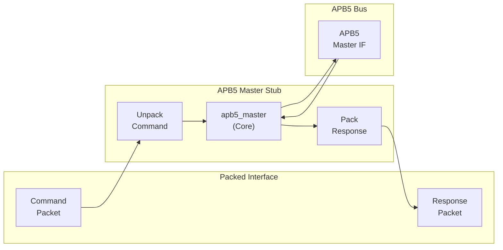
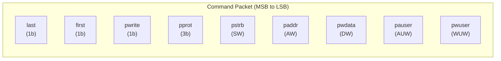
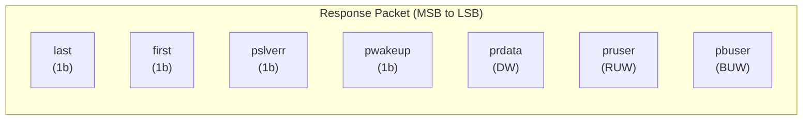
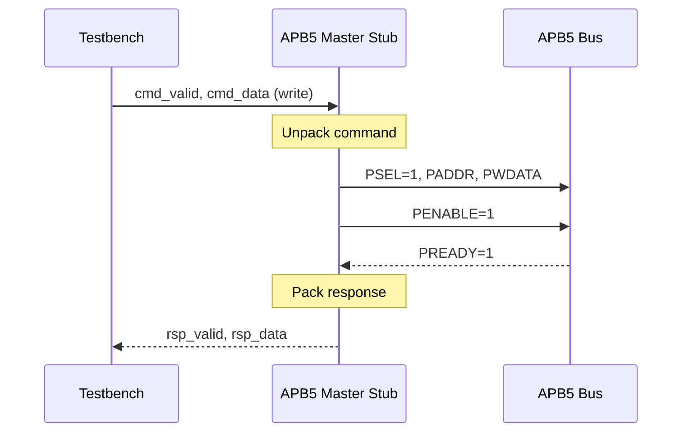

<!-- RTL Design Sherpa Documentation Header -->
<table>
<tr>
<td width="80">
  <a href="https://github.com/sean-galloway/RTLDesignSherpa">
    
  </a>
</td>
<td>
  <strong>RTL Design Sherpa</strong> · <em>Learning Hardware Design Through Practice</em><br>
  <sub>
    <a href="https://github.com/sean-galloway/RTLDesignSherpa">GitHub</a> ·
    <a href="https://github.com/sean-galloway/RTLDesignSherpa/blob/main/docs/DOCUMENTATION_INDEX.md">Documentation Index</a> ·
    <a href="https://github.com/sean-galloway/RTLDesignSherpa/blob/main/LICENSE">MIT License</a>
  </sub>
</td>
</tr>
</table>

---

<!-- End Header -->

# APB5 Master Stub

**Module:** `apb5_master_stub.sv`
**Location:** `rtl/amba/apb5/`
**Status:** Production Ready

---

## Overview

The APB5 Master Stub provides a simplified packed-data interface for driving APB5 transactions. It wraps the full `apb5_master` module with packet-based command/response interfaces, making it ideal for testbenches and integration scenarios where a simpler interface is preferred.

### Key Features

- Packed command/response packet interface
- Wraps fully-tested `apb5_master` internally
- All APB5 extensions (PAUSER, PWUSER, PRUSER, PBUSER)
- PWAKEUP signal handling from slave
- Optional parity support
- First/last markers for transaction tracking

---

## Module Architecture



---

## Parameters

| Parameter | Type | Default | Description |
|-----------|------|---------|-------------|
| CMD_DEPTH | int | 6 | Command FIFO depth (log2) |
| RSP_DEPTH | int | 6 | Response FIFO depth (log2) |
| ADDR_WIDTH | int | 32 | APB address bus width |
| DATA_WIDTH | int | 32 | APB data bus width |
| PROT_WIDTH | int | 3 | Protection signal width |
| AUSER_WIDTH | int | 4 | Address user signal width |
| WUSER_WIDTH | int | 4 | Write user signal width |
| RUSER_WIDTH | int | 4 | Read user signal width |
| BUSER_WIDTH | int | 4 | Response user signal width |
| ENABLE_PARITY | bit | 0 | Enable parity signals |
| STRB_WIDTH | int | DATA_WIDTH/8 | Write strobe width |
| CMD_PACKET_WIDTH | int | (calculated) | Total command packet width |
| RESP_PACKET_WIDTH | int | (calculated) | Total response packet width |

---

## Ports

### Clock and Reset

| Port | Width | Direction | Description |
|------|-------|-----------|-------------|
| pclk | 1 | Input | APB clock |
| presetn | 1 | Input | APB reset (active low) |

### APB5 Master Interface

| Port | Width | Direction | Description |
|------|-------|-----------|-------------|
| m_apb_PSEL | 1 | Output | APB select signal |
| m_apb_PENABLE | 1 | Output | APB enable signal |
| m_apb_PADDR | ADDR_WIDTH | Output | APB address |
| m_apb_PWRITE | 1 | Output | Write/read indicator |
| m_apb_PWDATA | DATA_WIDTH | Output | Write data |
| m_apb_PSTRB | STRB_WIDTH | Output | Write byte strobes |
| m_apb_PPROT | PROT_WIDTH | Output | Protection attributes |
| m_apb_PAUSER | AUSER_WIDTH | Output | User request attributes |
| m_apb_PWUSER | WUSER_WIDTH | Output | User write attributes |
| m_apb_PRDATA | DATA_WIDTH | Input | Read data from slave |
| m_apb_PSLVERR | 1 | Input | Slave error response |
| m_apb_PREADY | 1 | Input | Slave ready |
| m_apb_PWAKEUP | 1 | Input | Wake-up from slave |
| m_apb_PRUSER | RUSER_WIDTH | Input | User read attributes |
| m_apb_PBUSER | BUSER_WIDTH | Input | User response attributes |

### Command Packet Interface

| Port | Width | Direction | Description |
|------|-------|-----------|-------------|
| cmd_valid | 1 | Input | Command packet valid |
| cmd_ready | 1 | Output | Ready to accept command |
| cmd_data | CMD_PACKET_WIDTH | Input | Packed command data |

### Response Packet Interface

| Port | Width | Direction | Description |
|------|-------|-----------|-------------|
| rsp_valid | 1 | Output | Response packet valid |
| rsp_ready | 1 | Input | Ready to accept response |
| rsp_data | RESP_PACKET_WIDTH | Output | Packed response data |

### Status Outputs

| Port | Width | Direction | Description |
|------|-------|-----------|-------------|
| parity_error_rdata | 1 | Output | Read data parity error |
| parity_error_ctrl | 1 | Output | Control signal parity error |
| wakeup_pending | 1 | Output | Wake-up signal active |

---

## Packet Formats

### Command Packet Structure



**Bit Positions:**
```
cmd_data = {last, first, pwrite, pprot, pstrb, paddr, pwdata, pauser, pwuser}
```

### Response Packet Structure



**Bit Positions:**
```
rsp_data = {last, first, pslverr, pwakeup, prdata, pruser, pbuser}
```

---

## Transaction Flow

### Write Transaction



### Timing

<!-- TODO: Add wavedrom timing diagram for stub transactions -->
```
TODO: Wavedrom timing diagram showing:
- pclk
- cmd_valid, cmd_ready, cmd_data
- APB signals (PSEL, PENABLE, PADDR, PWDATA, PREADY)
- rsp_valid, rsp_ready, rsp_data
- Packet-to-APB timing relationship
```

---

## Usage Example

```systemverilog
apb5_master_stub #(
    .CMD_DEPTH      (6),
    .RSP_DEPTH      (6),
    .ADDR_WIDTH     (32),
    .DATA_WIDTH     (32),
    .AUSER_WIDTH    (4),
    .WUSER_WIDTH    (4),
    .RUSER_WIDTH    (4),
    .BUSER_WIDTH    (4),
    .ENABLE_PARITY  (0)
) u_apb5_master_stub (
    .pclk           (apb_clk),
    .presetn        (apb_rst_n),

    // APB5 master interface
    .m_apb_PSEL     (m_apb_psel),
    .m_apb_PENABLE  (m_apb_penable),
    .m_apb_PADDR    (m_apb_paddr),
    .m_apb_PWRITE   (m_apb_pwrite),
    .m_apb_PWDATA   (m_apb_pwdata),
    .m_apb_PSTRB    (m_apb_pstrb),
    .m_apb_PPROT    (m_apb_pprot),
    .m_apb_PAUSER   (m_apb_pauser),
    .m_apb_PWUSER   (m_apb_pwuser),
    .m_apb_PRDATA   (m_apb_prdata),
    .m_apb_PSLVERR  (m_apb_pslverr),
    .m_apb_PREADY   (m_apb_pready),
    .m_apb_PWAKEUP  (m_apb_pwakeup),
    .m_apb_PRUSER   (m_apb_pruser),
    .m_apb_PBUSER   (m_apb_pbuser),

    // Packed command interface
    .cmd_valid      (tb_cmd_valid),
    .cmd_ready      (tb_cmd_ready),
    .cmd_data       (tb_cmd_data),

    // Packed response interface
    .rsp_valid      (tb_rsp_valid),
    .rsp_ready      (tb_rsp_ready),
    .rsp_data       (tb_rsp_data),

    // Status
    .wakeup_pending (apb_wakeup)
);

// Build command packet
assign tb_cmd_data = {
    1'b1,           // last
    1'b1,           // first
    1'b1,           // pwrite (write transaction)
    3'b000,         // pprot
    4'hF,           // pstrb (all bytes)
    32'h1000_0000,  // paddr
    32'hDEAD_BEEF,  // pwdata
    4'h0,           // pauser
    4'h0            // pwuser
};
```

---

## Design Notes

### First/Last Markers

The first/last bits in packets enable:
- Transaction boundary detection
- Burst transaction support
- Testbench synchronization

### Internal Architecture

The stub instantiates the full `apb5_master` internally:
- All protocol handling done by proven `apb5_master`
- Stub only handles packet packing/unpacking
- Maintains full APB5 compliance

---

## Related Documentation

- **[APB5 Master](apb5_master.md)** - Core master module (wrapped by stub)
- **[APB5 Slave Stub](apb5_slave_stub.md)** - Corresponding slave stub

---

## Navigation

- **[<- Back to APB5 Index](README.md)**
- **[<- Back to RTLAmba Index](../index.md)**
- **[<- Back to Main Documentation Index](../../index.md)**
