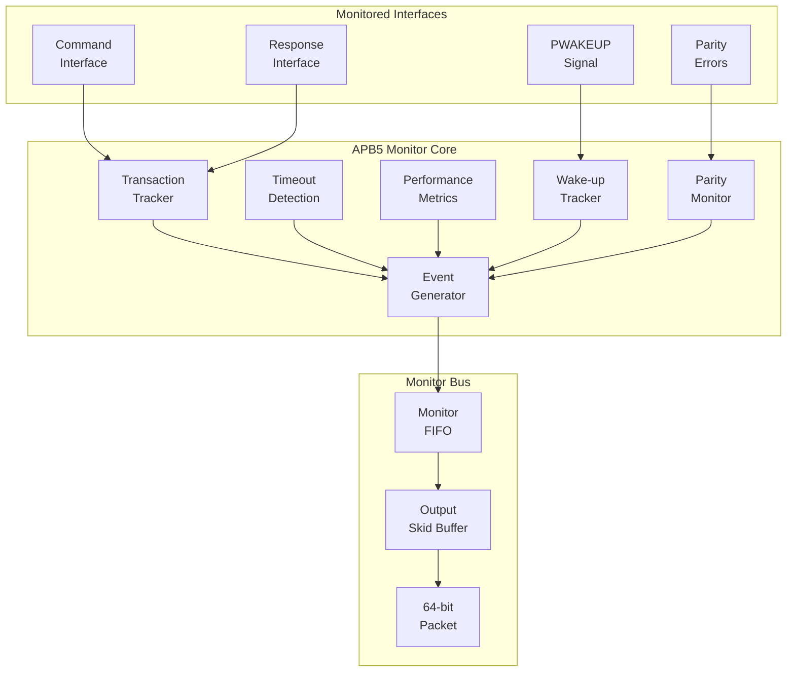
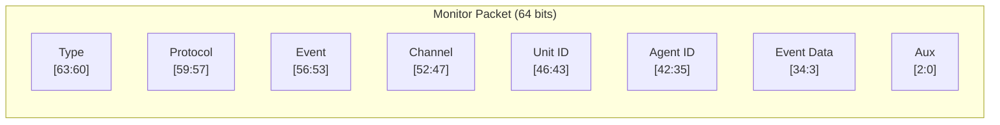
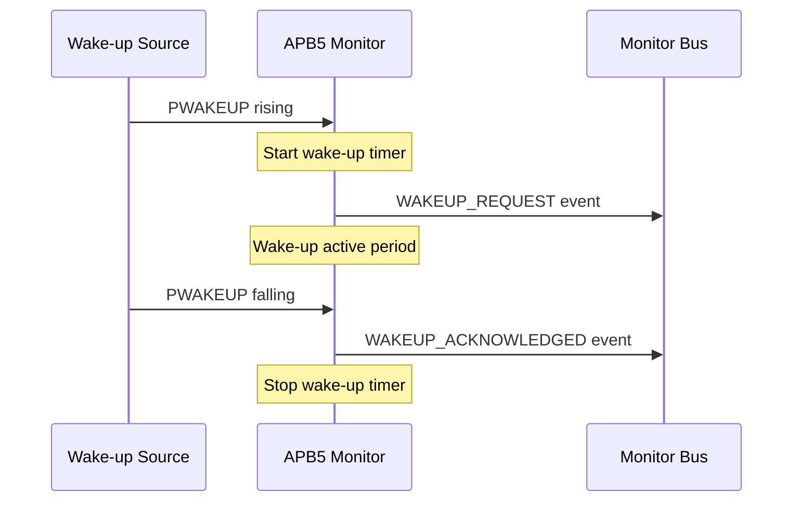

<!-- RTL Design Sherpa Documentation Header -->
<table>
<tr>
<td width="80">
  <a href="https://github.com/sean-galloway/RTLDesignSherpa">
    
  </a>
</td>
<td>
  <strong>RTL Design Sherpa</strong> · <em>Learning Hardware Design Through Practice</em><br>
  <sub>
    <a href="https://github.com/sean-galloway/RTLDesignSherpa">GitHub</a> ·
    <a href="https://github.com/sean-galloway/RTLDesignSherpa/blob/main/docs/DOCUMENTATION_INDEX.md">Documentation Index</a> ·
    <a href="https://github.com/sean-galloway/RTLDesignSherpa/blob/main/LICENSE">MIT License</a>
  </sub>
</td>
</tr>
</table>

---

<!-- End Header -->

# APB5 Monitor

**Module:** `apb5_monitor.sv`
**Location:** `rtl/amba/apb5/`
**Status:** Production Ready

---

## Overview

The APB5 Monitor provides comprehensive protocol monitoring for APB5 interfaces with support for all APB5 extensions. It tracks transactions, detects errors, monitors performance, and reports events through a standardized monitor bus interface.

### Key Features

- Full APB5 protocol monitoring
- Wake-up event tracking (APB5 PWAKEUP)
- User signal tracking (PAUSER, PWUSER, PRUSER, PBUSER)
- Parity error detection (when enabled)
- Transaction timeout detection
- Performance latency measurement
- Protocol violation detection
- 64-bit monitor bus packet output

---

## Module Architecture



---

## Parameters

| Parameter | Type | Default | Description |
|-----------|------|---------|-------------|
| ADDR_WIDTH | int | 32 | APB address bus width |
| DATA_WIDTH | int | 32 | APB data bus width |
| AUSER_WIDTH | int | 4 | Address user signal width |
| WUSER_WIDTH | int | 4 | Write user signal width |
| RUSER_WIDTH | int | 4 | Read user signal width |
| BUSER_WIDTH | int | 4 | Response user signal width |
| UNIT_ID | int | 1 | 4-bit unit identifier |
| AGENT_ID | int | 10 | 8-bit agent identifier |
| MAX_TRANSACTIONS | int | 4 | Maximum concurrent transactions |
| MONITOR_FIFO_DEPTH | int | 8 | Monitor packet FIFO depth |
| ENABLE_PARITY_MON | bit | 0 | Enable parity monitoring |

---

## Ports

### Clock and Reset

| Port | Width | Direction | Description |
|------|-------|-----------|-------------|
| aclk | 1 | Input | Monitor clock |
| aresetn | 1 | Input | Monitor reset (active low) |

### Command Interface Monitoring

| Port | Width | Direction | Description |
|------|-------|-----------|-------------|
| cmd_valid | 1 | Input | Command valid signal |
| cmd_ready | 1 | Input | Command ready signal |
| cmd_pwrite | 1 | Input | Write/read indicator |
| cmd_paddr | ADDR_WIDTH | Input | Command address |
| cmd_pwdata | DATA_WIDTH | Input | Command write data |
| cmd_pstrb | STRB_WIDTH | Input | Write byte strobes |
| cmd_pprot | 3 | Input | Protection attributes |
| cmd_pauser | AUSER_WIDTH | Input | Address user signal |
| cmd_pwuser | WUSER_WIDTH | Input | Write user signal |

### Response Interface Monitoring

| Port | Width | Direction | Description |
|------|-------|-----------|-------------|
| rsp_valid | 1 | Input | Response valid signal |
| rsp_ready | 1 | Input | Response ready signal |
| rsp_prdata | DATA_WIDTH | Input | Response read data |
| rsp_pslverr | 1 | Input | Slave error response |
| rsp_pruser | RUSER_WIDTH | Input | Read user signal |
| rsp_pbuser | BUSER_WIDTH | Input | Response user signal |

### APB5 Extension Monitoring

| Port | Width | Direction | Description |
|------|-------|-----------|-------------|
| apb5_pwakeup | 1 | Input | APB5 wake-up signal |
| parity_error_wdata | 1 | Input | Write data parity error |
| parity_error_rdata | 1 | Input | Read data parity error |
| parity_error_ctrl | 1 | Input | Control parity error |

### Configuration Inputs

| Port | Width | Direction | Description |
|------|-------|-----------|-------------|
| cfg_error_enable | 1 | Input | Enable error reporting |
| cfg_timeout_enable | 1 | Input | Enable timeout detection |
| cfg_protocol_enable | 1 | Input | Enable protocol checking |
| cfg_slverr_enable | 1 | Input | Enable SLVERR reporting |
| cfg_parity_enable | 1 | Input | Enable parity error reporting |
| cfg_wakeup_enable | 1 | Input | Enable wake-up event reporting |
| cfg_user_enable | 1 | Input | Enable user signal reporting |
| cfg_perf_enable | 1 | Input | Enable performance reporting |
| cfg_latency_enable | 1 | Input | Enable latency threshold |
| cfg_cmd_timeout_cnt | 16 | Input | Command timeout threshold |
| cfg_rsp_timeout_cnt | 16 | Input | Response timeout threshold |
| cfg_latency_threshold | 32 | Input | Latency threshold value |
| cfg_wakeup_timeout_cnt | 16 | Input | Wake-up timeout threshold |

### Monitor Bus Output

| Port | Width | Direction | Description |
|------|-------|-----------|-------------|
| monbus_valid | 1 | Output | Monitor packet valid |
| monbus_ready | 1 | Input | Monitor bus ready |
| monbus_packet | 64 | Output | Monitor packet data |

### Status Outputs

| Port | Width | Direction | Description |
|------|-------|-----------|-------------|
| active_count | 8 | Output | Active transaction count |
| error_count | 16 | Output | Total error count |
| transaction_count | 32 | Output | Total transaction count |
| wakeup_active | 1 | Output | Wake-up currently active |

---

## Monitor Packet Format

### 64-bit Packet Structure



### Packet Types

| Value | Type | Description |
|-------|------|-------------|
| 0 | Error | Protocol errors, SLVERR |
| 1 | Completion | Transaction completed |
| 2 | Timeout | Command/response timeout |
| 3 | Threshold | Threshold exceeded |
| 4 | Performance | Latency metrics |
| 5 | APB | APB-specific events (wake-up) |

### APB5-Specific Event Codes

| Code | Event | Description |
|------|-------|-------------|
| APB5_WAKEUP_REQUEST | 0x0 | PWAKEUP rising edge |
| APB5_WAKEUP_ACKNOWLEDGED | 0x1 | PWAKEUP falling edge |
| APB5_PARITY_PWDATA_ERROR | 0x4 | Write data parity error |
| APB5_PARITY_PRDATA_ERROR | 0x5 | Read data parity error |
| APB5_PARITY_PREADY_ERROR | 0x6 | PREADY parity error |

---

## Transaction State Machine

```mermaid
stateDiagram-v2
    [*] --> IDLE

    IDLE --> CMD_SENT : cmd_valid & cmd_ready
    CMD_SENT --> COMPLETE : rsp_valid & rsp_ready
    COMPLETE --> IDLE : (next cycle)

    state IDLE {
        note right of IDLE : No active transaction
    }
    state CMD_SENT {
        note right of CMD_SENT : Waiting for response
    }
    state COMPLETE {
        note right of COMPLETE : Transaction finished
    }
```

---

## Event Priority

Events are generated with the following priority (highest first):

1. **Error Events** - Protocol violations, SLVERR
2. **Parity Events** - Parity errors detected
3. **Timeout Events** - Command/response timeouts
4. **Wake-up Events** - PWAKEUP transitions
5. **Performance Events** - Latency threshold exceeded
6. **Completion Events** - Normal transaction completion

---

## Wake-up Monitoring

### Wake-up Detection



### Wake-up Timeout

If PWAKEUP remains high longer than `cfg_wakeup_timeout_cnt`, a timeout event is generated.

---

## Usage Example

```systemverilog
apb5_monitor #(
    .ADDR_WIDTH         (32),
    .DATA_WIDTH         (32),
    .AUSER_WIDTH        (4),
    .WUSER_WIDTH        (4),
    .RUSER_WIDTH        (4),
    .BUSER_WIDTH        (4),
    .UNIT_ID            (1),
    .AGENT_ID           (10),
    .MAX_TRANSACTIONS   (4),
    .MONITOR_FIFO_DEPTH (8),
    .ENABLE_PARITY_MON  (0)
) u_apb5_monitor (
    .aclk               (apb_clk),
    .aresetn            (apb_rst_n),

    // Command interface monitoring
    .cmd_valid          (apb_cmd_valid),
    .cmd_ready          (apb_cmd_ready),
    .cmd_pwrite         (apb_cmd_pwrite),
    .cmd_paddr          (apb_cmd_paddr),
    .cmd_pwdata         (apb_cmd_pwdata),
    .cmd_pstrb          (apb_cmd_pstrb),
    .cmd_pprot          (apb_cmd_pprot),
    .cmd_pauser         (apb_cmd_pauser),
    .cmd_pwuser         (apb_cmd_pwuser),

    // Response interface monitoring
    .rsp_valid          (apb_rsp_valid),
    .rsp_ready          (apb_rsp_ready),
    .rsp_prdata         (apb_rsp_prdata),
    .rsp_pslverr        (apb_rsp_pslverr),
    .rsp_pruser         (apb_rsp_pruser),
    .rsp_pbuser         (apb_rsp_pbuser),

    // APB5 wake-up monitoring
    .apb5_pwakeup       (apb_pwakeup),

    // Parity error inputs
    .parity_error_wdata (1'b0),
    .parity_error_rdata (1'b0),
    .parity_error_ctrl  (1'b0),

    // Configuration
    .cfg_error_enable   (1'b1),
    .cfg_timeout_enable (1'b1),
    .cfg_protocol_enable(1'b1),
    .cfg_slverr_enable  (1'b1),
    .cfg_parity_enable  (1'b0),
    .cfg_wakeup_enable  (1'b1),
    .cfg_user_enable    (1'b0),
    .cfg_perf_enable    (1'b0),
    .cfg_latency_enable (1'b0),
    .cfg_cmd_timeout_cnt(16'd1000),
    .cfg_rsp_timeout_cnt(16'd1000),
    .cfg_latency_threshold(32'd100),
    .cfg_wakeup_timeout_cnt(16'd500),

    // Monitor bus output
    .monbus_valid       (apb_mon_valid),
    .monbus_ready       (apb_mon_ready),
    .monbus_packet      (apb_mon_packet),

    // Status
    .active_count       (apb_active_count),
    .error_count        (apb_error_count),
    .transaction_count  (apb_trans_count),
    .wakeup_active      (apb_wakeup_active)
);
```

---

## Configuration Guidelines

### Recommended Configurations

**Functional Debug:**
```systemverilog
.cfg_error_enable   (1'b1),
.cfg_timeout_enable (1'b1),
.cfg_protocol_enable(1'b1),
.cfg_slverr_enable  (1'b1),
.cfg_wakeup_enable  (1'b1),
.cfg_perf_enable    (1'b0)   // Disable for lower traffic
```

**Performance Analysis:**
```systemverilog
.cfg_error_enable   (1'b1),
.cfg_perf_enable    (1'b1),
.cfg_latency_enable (1'b1),
.cfg_wakeup_enable  (1'b0)   // Disable non-essential
```

---

## Design Notes

### Transaction Table

- Tracks up to `MAX_TRANSACTIONS` concurrent transactions
- APB typically has 1-4 outstanding (simple protocol)
- Table entries cleaned up after event reported

### Internal FIFOs

- Monitor FIFO depth configurable via `MONITOR_FIFO_DEPTH`
- Output skid buffer ensures no backpressure stalls

---

## Related Documentation

- **[APB5 Master](apb5_master.md)** - APB5 master interface
- **[APB5 Slave](apb5_slave.md)** - APB5 slave interface
- **[Monitor Packet Format](../includes/monitor_package_spec.md)** - Standard packet format

---

## Navigation

- **[<- Back to APB5 Index](README.md)**
- **[<- Back to RTLAmba Index](../index.md)**
- **[<- Back to Main Documentation Index](../../index.md)**
