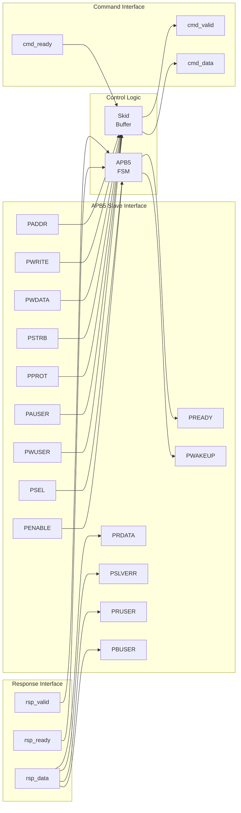
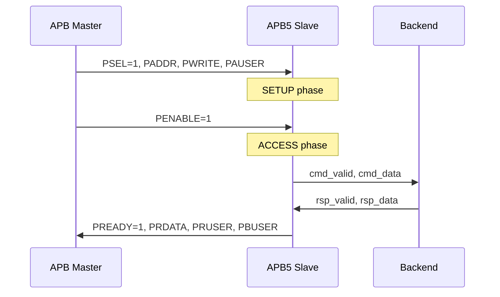

<!-- RTL Design Sherpa Documentation Header -->
<table>
<tr>
<td width="80">
  <a href="https://github.com/sean-galloway/RTLDesignSherpa">
    
  </a>
</td>
<td>
  <strong>RTL Design Sherpa</strong> · <em>Learning Hardware Design Through Practice</em><br>
  <sub>
    <a href="https://github.com/sean-galloway/RTLDesignSherpa">GitHub</a> ·
    <a href="https://github.com/sean-galloway/RTLDesignSherpa/blob/main/docs/DOCUMENTATION_INDEX.md">Documentation Index</a> ·
    <a href="https://github.com/sean-galloway/RTLDesignSherpa/blob/main/LICENSE">MIT License</a>
  </sub>
</td>
</tr>
</table>

---

<!-- End Header -->

# APB5 Slave

**Module:** `apb5_slave.sv`
**Location:** `rtl/amba/apb5/`
**Status:** Production Ready

---

## Overview

The APB5 Slave module implements a complete AMBA APB5 slave interface with all APB5 extensions. It receives APB transactions from the bus and provides a command/response interface for backend logic, supporting user-defined signals, wake-up generation, and optional parity.

### Key Features

- Full AMBA APB5 protocol compliance
- Receives PAUSER/PWUSER from master
- Generates PRUSER/PBUSER responses
- PWAKEUP output for wake-up signaling
- Optional parity support for data integrity
- Command/response FIFO buffering
- Configurable buffer depth

---

## Module Architecture



---

## Parameters

| Parameter | Type | Default | Description |
|-----------|------|---------|-------------|
| ADDR_WIDTH | int | 32 | APB address bus width |
| DATA_WIDTH | int | 32 | APB data bus width |
| PROT_WIDTH | int | 3 | Protection signal width |
| AUSER_WIDTH | int | 4 | Address/request user signal width |
| WUSER_WIDTH | int | 4 | Write data user signal width |
| RUSER_WIDTH | int | 4 | Read data user signal width |
| BUSER_WIDTH | int | 4 | Response user signal width |
| DEPTH | int | 2 | Internal buffer depth |
| ENABLE_PARITY | bit | 0 | Enable parity signals |
| STRB_WIDTH | int | DATA_WIDTH/8 | Write strobe width (calculated) |

---

## Ports

### Clock and Reset

| Port | Width | Direction | Description |
|------|-------|-----------|-------------|
| pclk | 1 | Input | APB clock |
| presetn | 1 | Input | APB active-low reset |

### APB5 Slave Interface

| Port | Width | Direction | Description |
|------|-------|-----------|-------------|
| s_apb_PSEL | 1 | Input | APB select signal |
| s_apb_PENABLE | 1 | Input | APB enable signal |
| s_apb_PREADY | 1 | Output | Slave ready response |
| s_apb_PADDR | ADDR_WIDTH | Input | APB address |
| s_apb_PWRITE | 1 | Input | Write/read indicator |
| s_apb_PWDATA | DATA_WIDTH | Input | Write data |
| s_apb_PSTRB | STRB_WIDTH | Input | Write byte strobes |
| s_apb_PPROT | PROT_WIDTH | Input | Protection attributes |
| s_apb_PAUSER | AUSER_WIDTH | Input | User-defined request attributes |
| s_apb_PWUSER | WUSER_WIDTH | Input | User-defined write data attributes |
| s_apb_PRDATA | DATA_WIDTH | Output | Read data to master |
| s_apb_PSLVERR | 1 | Output | Slave error response |
| s_apb_PWAKEUP | 1 | Output | Wake-up signal to master |
| s_apb_PRUSER | RUSER_WIDTH | Output | User-defined read data attributes |
| s_apb_PBUSER | BUSER_WIDTH | Output | User-defined response attributes |

### Parity Signals (Optional)

| Port | Width | Direction | Description |
|------|-------|-----------|-------------|
| s_apb_PWDATAPARITY | STRB_WIDTH | Input | Write data parity from master |
| s_apb_PADDRPARITY | 1 | Input | Address parity from master |
| s_apb_PCTRLPARITY | 1 | Input | Control signals parity from master |
| s_apb_PRDATAPARITY | STRB_WIDTH | Output | Read data parity to master |
| s_apb_PREADYPARITY | 1 | Output | PREADY parity to master |
| s_apb_PSLVERRPARITY | 1 | Output | PSLVERR parity to master |

### Command Interface (to backend)

| Port | Width | Direction | Description |
|------|-------|-----------|-------------|
| cmd_valid | 1 | Output | Command valid to backend |
| cmd_ready | 1 | Input | Backend ready |
| cmd_pwrite | 1 | Output | Command write/read |
| cmd_paddr | ADDR_WIDTH | Output | Command address |
| cmd_pwdata | DATA_WIDTH | Output | Command write data |
| cmd_pstrb | STRB_WIDTH | Output | Command write strobes |
| cmd_pprot | PROT_WIDTH | Output | Command protection |
| cmd_pauser | AUSER_WIDTH | Output | Command address user |
| cmd_pwuser | WUSER_WIDTH | Output | Command write user |

### Response Interface (from backend)

| Port | Width | Direction | Description |
|------|-------|-----------|-------------|
| rsp_valid | 1 | Input | Response valid from backend |
| rsp_ready | 1 | Output | Slave ready for response |
| rsp_prdata | DATA_WIDTH | Input | Response read data |
| rsp_pslverr | 1 | Input | Response error status |
| rsp_pruser | RUSER_WIDTH | Input | Response read user |
| rsp_pbuser | BUSER_WIDTH | Input | Response user |

### Wake-up Control

| Port | Width | Direction | Description |
|------|-------|-----------|-------------|
| wakeup_req | 1 | Input | Wake-up request from backend |

---

## Functionality

### APB5 Slave Protocol

The slave responds to APB transactions with proper timing:

1. **SETUP Phase**: PSEL=1, PENABLE=0 - Capture address and control
2. **ACCESS Phase**: PSEL=1, PENABLE=1 - Assert PREADY when response ready

### Response Timing



---

## Timing Diagrams

### Write Transaction with Wait States

<!-- TODO: Add wavedrom timing diagram for APB5 slave write with wait states -->
```
TODO: Wavedrom timing diagram showing:
- PCLK
- PSEL
- PENABLE
- PADDR
- PWRITE (high)
- PWDATA
- PAUSER, PWUSER
- PREADY (with wait states)
- PSLVERR
- PBUSER
```

### Read Transaction

<!-- TODO: Add wavedrom timing diagram for APB5 slave read -->
```
TODO: Wavedrom timing diagram showing:
- PCLK
- PSEL
- PENABLE
- PADDR
- PWRITE (low)
- PAUSER
- PREADY
- PRDATA
- PRUSER, PBUSER
```

### Wake-up Signaling

<!-- TODO: Add wavedrom timing diagram for wake-up -->
```
TODO: Wavedrom timing diagram showing:
- PCLK
- wakeup_req (from backend)
- PWAKEUP (to master)
- Timing relationship
```

---

## Usage Example

```systemverilog
apb5_slave #(
    .ADDR_WIDTH     (32),
    .DATA_WIDTH     (32),
    .AUSER_WIDTH    (4),
    .WUSER_WIDTH    (4),
    .RUSER_WIDTH    (4),
    .BUSER_WIDTH    (4),
    .DEPTH          (2),
    .ENABLE_PARITY  (0)
) u_apb5_slave (
    .pclk           (apb_clk),
    .presetn        (apb_rst_n),

    // APB5 slave interface
    .s_apb_PSEL     (s_apb_psel),
    .s_apb_PENABLE  (s_apb_penable),
    .s_apb_PREADY   (s_apb_pready),
    .s_apb_PADDR    (s_apb_paddr),
    .s_apb_PWRITE   (s_apb_pwrite),
    .s_apb_PWDATA   (s_apb_pwdata),
    .s_apb_PSTRB    (s_apb_pstrb),
    .s_apb_PPROT    (s_apb_pprot),
    .s_apb_PAUSER   (s_apb_pauser),
    .s_apb_PWUSER   (s_apb_pwuser),
    .s_apb_PRDATA   (s_apb_prdata),
    .s_apb_PSLVERR  (s_apb_pslverr),
    .s_apb_PWAKEUP  (s_apb_pwakeup),
    .s_apb_PRUSER   (s_apb_pruser),
    .s_apb_PBUSER   (s_apb_pbuser),

    // Backend command interface
    .cmd_valid      (backend_cmd_valid),
    .cmd_ready      (backend_cmd_ready),
    .cmd_pwrite     (backend_cmd_write),
    .cmd_paddr      (backend_cmd_addr),
    .cmd_pwdata     (backend_cmd_wdata),
    .cmd_pstrb      (backend_cmd_strb),
    .cmd_pprot      (backend_cmd_prot),
    .cmd_pauser     (backend_cmd_auser),
    .cmd_pwuser     (backend_cmd_wuser),

    // Backend response interface
    .rsp_valid      (backend_rsp_valid),
    .rsp_ready      (backend_rsp_ready),
    .rsp_prdata     (backend_rsp_rdata),
    .rsp_pslverr    (backend_rsp_error),
    .rsp_pruser     (backend_rsp_ruser),
    .rsp_pbuser     (backend_rsp_buser),

    // Wake-up
    .wakeup_req     (backend_wakeup)
);
```

---

## Design Notes

### Backpressure Handling

- If backend cannot accept commands (`cmd_ready=0`), slave inserts wait states
- PREADY held low until backend accepts command and provides response

### User Signal Propagation

- PAUSER/PWUSER captured during SETUP phase, forwarded to backend
- PRUSER/PBUSER from backend driven during ACCESS phase response

---

## Related Documentation

- **[APB5 Master](apb5_master.md)** - APB5 master interface
- **[APB5 Slave CG](apb5_slave_cg.md)** - Clock-gated variant
- **[APB5 Slave CDC](apb5_slave_cdc.md)** - Clock domain crossing variant
- **[APB4 Slave](../apb/apb_slave.md)** - APB4 version for comparison

---

## Navigation

- **[← Back to APB5 Index](README.md)**
- **[← Back to RTLAmba Index](../index.md)**
- **[← Back to Main Documentation Index](../../index.md)**
