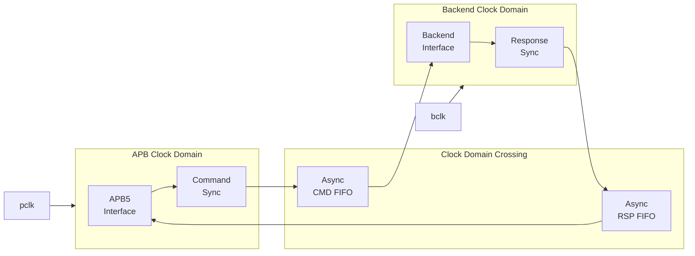
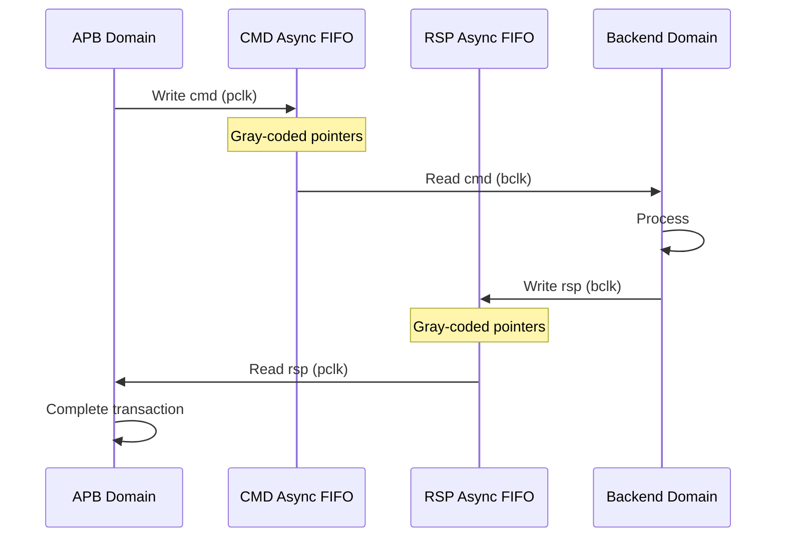

<!-- RTL Design Sherpa Documentation Header -->
<table>
<tr>
<td width="80">
  <a href="https://github.com/sean-galloway/RTLDesignSherpa">
    
  </a>
</td>
<td>
  <strong>RTL Design Sherpa</strong> · <em>Learning Hardware Design Through Practice</em><br>
  <sub>
    <a href="https://github.com/sean-galloway/RTLDesignSherpa">GitHub</a> ·
    <a href="https://github.com/sean-galloway/RTLDesignSherpa/blob/main/docs/DOCUMENTATION_INDEX.md">Documentation Index</a> ·
    <a href="https://github.com/sean-galloway/RTLDesignSherpa/blob/main/LICENSE">MIT License</a>
  </sub>
</td>
</tr>
</table>

---

<!-- End Header -->

# APB5 Slave (Clock Domain Crossing)

**Module:** `apb5_slave_cdc.sv`
**Location:** `rtl/amba/apb5/`
**Status:** Production Ready

---

## Overview

The APB5 Slave CDC module provides clock domain crossing capability between an APB5 bus clock domain and a backend clock domain. It safely transfers APB5 transactions across asynchronous clock boundaries.

### Key Features

- Full APB5 protocol support with CDC
- Asynchronous FIFO-based clock domain crossing
- All APB5 user signals (PAUSER, PWUSER, PRUSER, PBUSER)
- PWAKEUP signal crossing
- Configurable FIFO depths for each direction
- Metastability protection

---

## Module Architecture



---

## Parameters

| Parameter | Type | Default | Description |
|-----------|------|---------|-------------|
| ADDR_WIDTH | int | 32 | APB address bus width |
| DATA_WIDTH | int | 32 | APB data bus width |
| PROT_WIDTH | int | 3 | Protection signal width |
| AUSER_WIDTH | int | 4 | Address user signal width |
| WUSER_WIDTH | int | 4 | Write user signal width |
| RUSER_WIDTH | int | 4 | Read user signal width |
| BUSER_WIDTH | int | 4 | Response user signal width |
| CMD_DEPTH | int | 4 | Command FIFO depth (power of 2) |
| RSP_DEPTH | int | 4 | Response FIFO depth (power of 2) |
| SYNC_STAGES | int | 2 | Synchronizer stages for CDC |

---

## Ports

### Clock and Reset

| Port | Width | Direction | Description |
|------|-------|-----------|-------------|
| pclk | 1 | Input | APB bus clock |
| presetn | 1 | Input | APB reset (active low) |
| bclk | 1 | Input | Backend clock |
| bresetn | 1 | Input | Backend reset (active low) |

### APB5 Slave Interface

Same as [apb5_slave](apb5_slave.md) - operates in `pclk` domain.

### Backend Interface

Same command/response interface as [apb5_slave](apb5_slave.md) - operates in `bclk` domain.

---

## Clock Domain Crossing

### CDC Mechanism



### Timing Considerations

<!-- TODO: Add wavedrom timing diagram for CDC -->
```
TODO: Wavedrom timing diagram showing:
- pclk
- bclk (different frequency)
- APB transaction signals
- FIFO write/read pointers
- Backend transaction signals
- CDC latency
```

---

## Usage Example

```systemverilog
apb5_slave_cdc #(
    .ADDR_WIDTH     (32),
    .DATA_WIDTH     (32),
    .AUSER_WIDTH    (4),
    .WUSER_WIDTH    (4),
    .RUSER_WIDTH    (4),
    .BUSER_WIDTH    (4),
    .CMD_DEPTH      (4),
    .RSP_DEPTH      (4),
    .SYNC_STAGES    (2)
) u_apb5_slave_cdc (
    // APB clock domain
    .pclk           (apb_clk),
    .presetn        (apb_rst_n),

    // Backend clock domain
    .bclk           (backend_clk),
    .bresetn        (backend_rst_n),

    // APB5 slave interface (pclk domain)
    .s_apb_PSEL     (s_apb_psel),
    .s_apb_PENABLE  (s_apb_penable),
    // ... other APB signals

    // Backend interface (bclk domain)
    .cmd_valid      (backend_cmd_valid),
    .cmd_ready      (backend_cmd_ready),
    // ... other backend signals
);
```

---

## Design Notes

### FIFO Depth Sizing

- CMD_DEPTH should handle worst-case APB burst before backend responds
- RSP_DEPTH should handle responses during slow APB clock periods
- Minimum depth: 2 (for proper CDC operation)

### Reset Synchronization

- Both resets should be properly synchronized to their respective domains
- Module handles internal reset synchronization for CDC logic

### Latency

- Minimum latency: 2-4 cycles per direction (sync stages)
- Additional latency if FIFOs are empty/full

---

## Related Documentation

- **[APB5 Slave](apb5_slave.md)** - Base slave without CDC
- **[APB5 Slave CDC CG](apb5_slave_cdc_cg.md)** - CDC with clock gating
- **[CDC Handshake](../shared/cdc_handshake.md)** - CDC design patterns

---

## Navigation

- **[← Back to APB5 Index](README.md)**
- **[← Back to RTLAmba Index](../index.md)**
- **[← Back to Main Documentation Index](../../index.md)**
