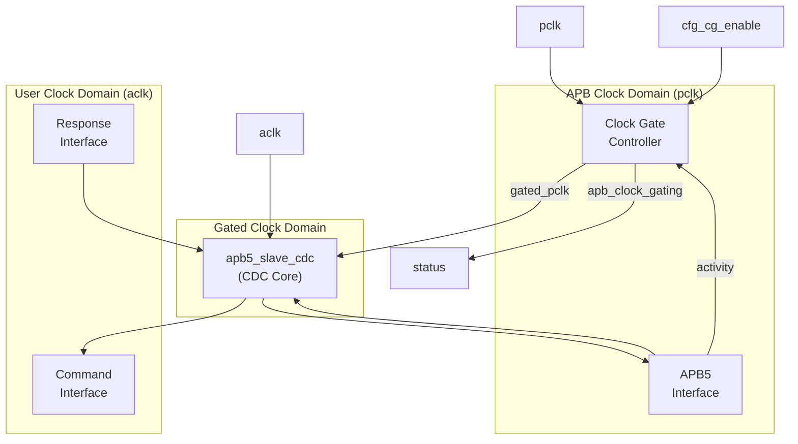
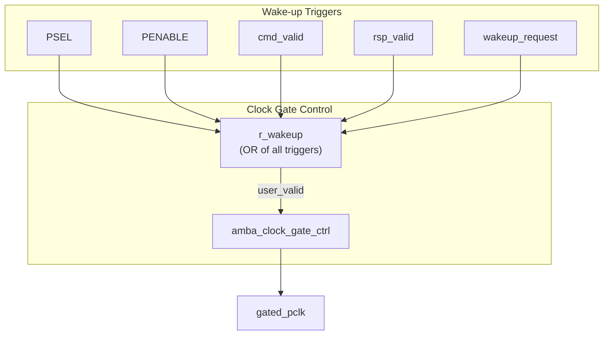
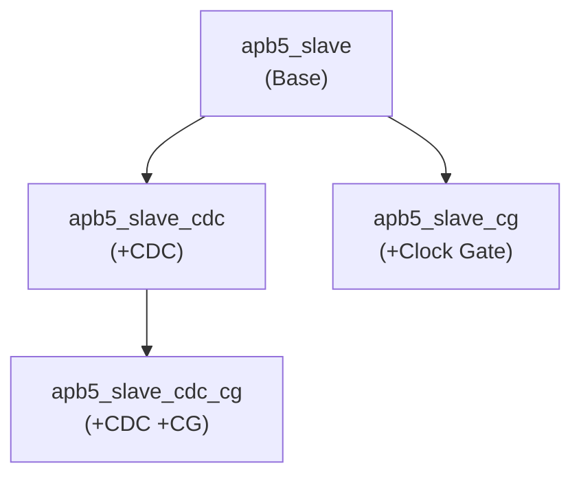

<!-- RTL Design Sherpa Documentation Header -->
<table>
<tr>
<td width="80">
  <a href="https://github.com/sean-galloway/RTLDesignSherpa">
    
  </a>
</td>
<td>
  <strong>RTL Design Sherpa</strong> · <em>Learning Hardware Design Through Practice</em><br>
  <sub>
    <a href="https://github.com/sean-galloway/RTLDesignSherpa">GitHub</a> ·
    <a href="https://github.com/sean-galloway/RTLDesignSherpa/blob/main/docs/DOCUMENTATION_INDEX.md">Documentation Index</a> ·
    <a href="https://github.com/sean-galloway/RTLDesignSherpa/blob/main/LICENSE">MIT License</a>
  </sub>
</td>
</tr>
</table>

---

<!-- End Header -->

# APB5 Slave (CDC + Clock-Gated)

**Module:** `apb5_slave_cdc_cg.sv`
**Location:** `rtl/amba/apb5/`
**Status:** Production Ready

---

## Overview

The APB5 Slave CDC + Clock-Gated module combines clock domain crossing with clock gating for maximum power efficiency. It wraps `apb5_slave_cdc` with clock gating control to reduce power consumption during idle periods while maintaining safe operation across asynchronous clock boundaries.

### Key Features

- Full APB5 protocol support with all extensions
- Asynchronous clock domain crossing (APB to backend)
- Clock gating for power reduction during idle
- All APB5 user signals (PAUSER, PWUSER, PRUSER, PBUSER)
- PWAKEUP signal handling across domains
- Optional parity support for data integrity
- Automatic wake-up on transaction activity

---

## Module Architecture



---

## Parameters

| Parameter | Type | Default | Description |
|-----------|------|---------|-------------|
| ADDR_WIDTH | int | 32 | APB address bus width |
| DATA_WIDTH | int | 32 | APB data bus width |
| PROT_WIDTH | int | 3 | Protection signal width |
| AUSER_WIDTH | int | 4 | Address user signal width |
| WUSER_WIDTH | int | 4 | Write user signal width |
| RUSER_WIDTH | int | 4 | Read user signal width |
| BUSER_WIDTH | int | 4 | Response user signal width |
| DEPTH | int | 2 | Internal buffer depth |
| ENABLE_PARITY | bit | 0 | Enable parity signals |
| CG_IDLE_COUNT_WIDTH | int | 4 | Width of idle counter |

---

## Ports

### Clock and Reset

| Port | Width | Direction | Description |
|------|-------|-----------|-------------|
| pclk | 1 | Input | APB bus clock |
| presetn | 1 | Input | APB reset (active low) |
| aclk | 1 | Input | User/backend clock |
| aresetn | 1 | Input | User reset (active low) |

### Clock Gating Configuration

| Port | Width | Direction | Description |
|------|-------|-----------|-------------|
| cfg_cg_enable | 1 | Input | Enable clock gating |
| cfg_cg_idle_count | CG_IDLE_COUNT_WIDTH | Input | Idle cycles before gating |

### APB5 Slave Interface

Same as [apb5_slave](apb5_slave.md) - operates in `pclk` domain.

### Backend Interface

Same command/response interface as [apb5_slave_cdc](apb5_slave_cdc.md) - operates in `aclk` domain.

### Status Outputs

| Port | Width | Direction | Description |
|------|-------|-----------|-------------|
| apb_clock_gating | 1 | Output | Indicates clock is currently gated |
| parity_error_wdata | 1 | Output | Write data parity error detected |
| parity_error_ctrl | 1 | Output | Control signal parity error |

---

## Clock Gating and CDC Interaction

### Wake-up Logic



### Timing Considerations

<!-- TODO: Add wavedrom timing diagram for CDC+CG -->
```
TODO: Wavedrom timing diagram showing:
- pclk (ungated)
- gated_pclk
- aclk (different frequency)
- s_apb_PSEL (wake trigger)
- apb_clock_gating indicator
- Transaction flow across CDC with gating
- Wake-up latency from PSEL to clock active
```

---

## Usage Example

```systemverilog
apb5_slave_cdc_cg #(
    .ADDR_WIDTH         (32),
    .DATA_WIDTH         (32),
    .AUSER_WIDTH        (4),
    .WUSER_WIDTH        (4),
    .RUSER_WIDTH        (4),
    .BUSER_WIDTH        (4),
    .DEPTH              (2),
    .ENABLE_PARITY      (0),
    .CG_IDLE_COUNT_WIDTH(4)
) u_apb5_slave_cdc_cg (
    // APB clock domain
    .pclk               (apb_clk),
    .presetn            (apb_rst_n),

    // User clock domain
    .aclk               (user_clk),
    .aresetn            (user_rst_n),

    // Clock gating
    .cfg_cg_enable      (1'b1),
    .cfg_cg_idle_count  (4'd8),
    .apb_clock_gating   (slave_clk_gated),

    // APB5 slave interface (pclk domain)
    .s_apb_PSEL         (s_apb_psel),
    .s_apb_PENABLE      (s_apb_penable),
    .s_apb_PREADY       (s_apb_pready),
    // ... other APB signals

    // Backend interface (aclk domain)
    .cmd_valid          (backend_cmd_valid),
    .cmd_ready          (backend_cmd_ready),
    // ... other command signals

    .rsp_valid          (backend_rsp_valid),
    .rsp_ready          (backend_rsp_ready),
    // ... other response signals

    // Wake-up control (aclk domain)
    .wakeup_request     (backend_wakeup)
);
```

---

## Design Notes

### Power and Latency Trade-offs

| Configuration | Power Savings | Wake-up Latency |
|---------------|---------------|-----------------|
| CG disabled | None | 0 cycles |
| CG idle=4 | Moderate | 0 cycles (instant wake) |
| CG idle=16 | Good | 0 cycles (instant wake) |

**Note:** Wake-up is instant from PSEL assertion due to combinational wake-up logic.

### Combined Feature Hierarchy



### Reset Considerations

- APB domain reset (`presetn`) controls APB interface and clock gate
- User domain reset (`aresetn`) controls backend interface
- Both resets must be properly synchronized to their domains
- Module handles internal CDC for reset coordination

---

## Related Documentation

- **[APB5 Slave](apb5_slave.md)** - Base slave module
- **[APB5 Slave CDC](apb5_slave_cdc.md)** - CDC variant without clock gating
- **[APB5 Slave CG](apb5_slave_cg.md)** - Clock gating without CDC

---

## Navigation

- **[<- Back to APB5 Index](README.md)**
- **[<- Back to RTLAmba Index](../index.md)**
- **[<- Back to Main Documentation Index](../../index.md)**
