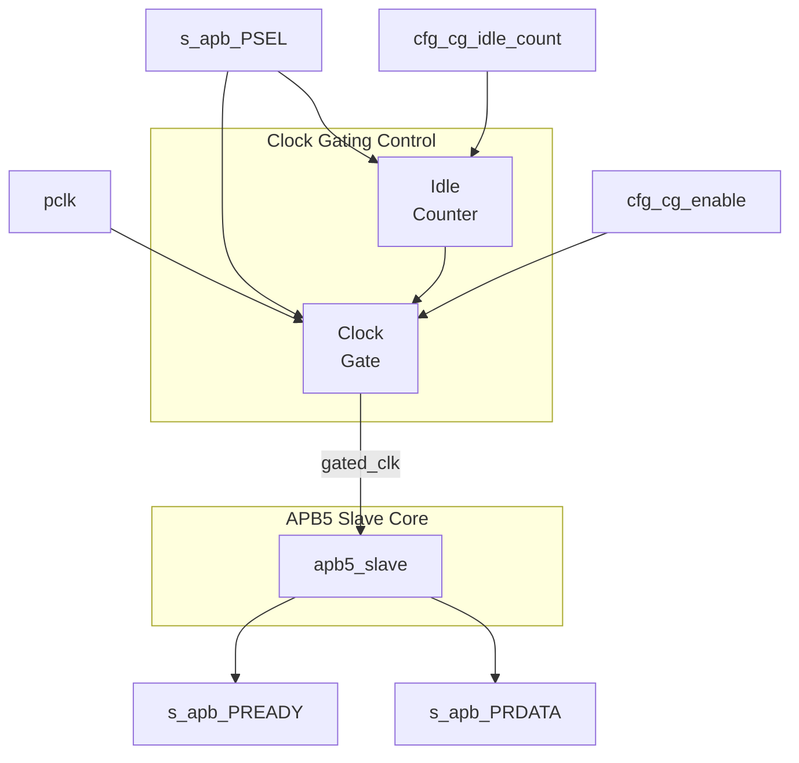

<!-- RTL Design Sherpa Documentation Header -->
<table>
<tr>
<td width="80">
  <a href="https://github.com/sean-galloway/RTLDesignSherpa">
    
  </a>
</td>
<td>
  <strong>RTL Design Sherpa</strong> · <em>Learning Hardware Design Through Practice</em><br>
  <sub>
    <a href="https://github.com/sean-galloway/RTLDesignSherpa">GitHub</a> ·
    <a href="https://github.com/sean-galloway/RTLDesignSherpa/blob/main/docs/DOCUMENTATION_INDEX.md">Documentation Index</a> ·
    <a href="https://github.com/sean-galloway/RTLDesignSherpa/blob/main/LICENSE">MIT License</a>
  </sub>
</td>
</tr>
</table>

---

<!-- End Header -->

# APB5 Slave (Clock-Gated)

**Module:** `apb5_slave_cg.sv`
**Location:** `rtl/amba/apb5/`
**Status:** Production Ready

---

## Overview

Clock-gated variant of the APB5 Slave module. Wraps the base `apb5_slave` with clock gating control logic to reduce dynamic power consumption when no transactions are active.

### Key Features

- All APB5 Slave features (see [apb5_slave](apb5_slave.md))
- Automatic clock gating during idle periods
- Immediate wake-up on PSEL assertion
- Configurable idle threshold
- Power monitoring outputs

---

## Module Architecture



---

## Additional Parameters

| Parameter | Type | Default | Description |
|-----------|------|---------|-------------|
| CG_IDLE_COUNT_WIDTH | int | 4 | Width of idle counter |

All other parameters inherited from [apb5_slave](apb5_slave.md).

---

## Additional Ports

### Clock Gating Configuration

| Port | Width | Direction | Description |
|------|-------|-----------|-------------|
| cfg_cg_enable | 1 | Input | Enable clock gating |
| cfg_cg_idle_count | CG_IDLE_COUNT_WIDTH | Input | Idle cycles before gating |

### Clock Gating Status

| Port | Width | Direction | Description |
|------|-------|-----------|-------------|
| cg_gating | 1 | Output | Clock currently gated |
| cg_clk_count | 32 | Output | Cumulative gated cycles |

---

## Clock Gating Behavior

### Wake-up Trigger

The slave clock ungates immediately when:
- PSEL is asserted (new transaction starting)
- Configuration changes

<!-- TODO: Add wavedrom timing diagram -->
```
TODO: Wavedrom timing diagram showing:
- pclk
- gated_clk
- s_apb_PSEL
- cg_gating
- Wake-up latency (0 cycles)
```

---

## Usage Example

```systemverilog
apb5_slave_cg #(
    .ADDR_WIDTH         (32),
    .DATA_WIDTH         (32),
    .CG_IDLE_COUNT_WIDTH(4)
) u_apb5_slave_cg (
    .pclk               (apb_clk),
    .presetn            (apb_rst_n),

    // Clock gating
    .cfg_cg_enable      (1'b1),
    .cfg_cg_idle_count  (4'd4),
    .cg_gating          (slave_clk_gated),
    .cg_clk_count       (slave_gated_cycles),

    // APB5 interface (same as apb5_slave)
    // ...
);
```

---

## Related Documentation

- **[APB5 Slave](apb5_slave.md)** - Base module documentation
- **[APB5 Master CG](apb5_master_cg.md)** - Clock-gated master

---

## Navigation

- **[← Back to APB5 Index](README.md)**
- **[← Back to RTLAmba Index](../index.md)**
- **[← Back to Main Documentation Index](../../index.md)**
