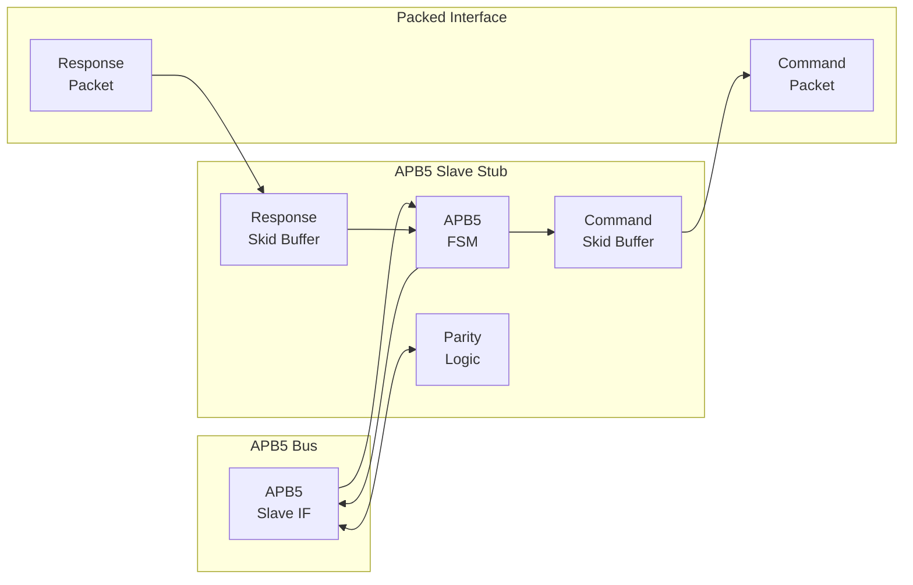
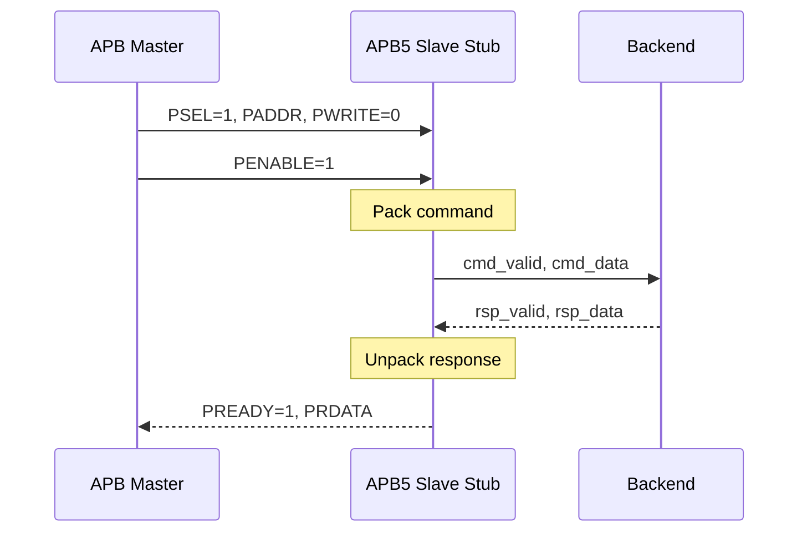

<!-- RTL Design Sherpa Documentation Header -->
<table>
<tr>
<td width="80">
  <a href="https://github.com/sean-galloway/RTLDesignSherpa">
    
  </a>
</td>
<td>
  <strong>RTL Design Sherpa</strong> · <em>Learning Hardware Design Through Practice</em><br>
  <sub>
    <a href="https://github.com/sean-galloway/RTLDesignSherpa">GitHub</a> ·
    <a href="https://github.com/sean-galloway/RTLDesignSherpa/blob/main/docs/DOCUMENTATION_INDEX.md">Documentation Index</a> ·
    <a href="https://github.com/sean-galloway/RTLDesignSherpa/blob/main/LICENSE">MIT License</a>
  </sub>
</td>
</tr>
</table>

---

<!-- End Header -->

# APB5 Slave Stub

**Module:** `apb5_slave_stub.sv`
**Location:** `rtl/amba/apb5/`
**Status:** Production Ready

---

## Overview

The APB5 Slave Stub provides a simplified packed-data interface for responding to APB5 transactions. It implements a complete APB5 slave with packet-based command/response interfaces, making it ideal for testbenches and simple backend implementations.

### Key Features

- Packed command/response packet interface
- Complete APB5 slave FSM implementation
- All APB5 extensions (PAUSER, PWUSER, PRUSER, PBUSER)
- PWAKEUP signal generation to master
- Optional parity support with error detection
- Skid buffers for command and response paths

---

## Module Architecture



---

## Parameters

| Parameter | Type | Default | Description |
|-----------|------|---------|-------------|
| DEPTH | int | 4 | Skid buffer depth |
| ADDR_WIDTH | int | 32 | APB address bus width |
| DATA_WIDTH | int | 32 | APB data bus width |
| PROT_WIDTH | int | 3 | Protection signal width |
| AUSER_WIDTH | int | 4 | Address user signal width |
| WUSER_WIDTH | int | 4 | Write user signal width |
| RUSER_WIDTH | int | 4 | Read user signal width |
| BUSER_WIDTH | int | 4 | Response user signal width |
| ENABLE_PARITY | bit | 0 | Enable parity signals |
| STRB_WIDTH | int | DATA_WIDTH/8 | Write strobe width |
| CMD_PACKET_WIDTH | int | (calculated) | Total command packet width |
| RESP_PACKET_WIDTH | int | (calculated) | Total response packet width |

---

## Ports

### Clock and Reset

| Port | Width | Direction | Description |
|------|-------|-----------|-------------|
| pclk | 1 | Input | APB clock |
| presetn | 1 | Input | APB reset (active low) |

### APB5 Slave Interface

| Port | Width | Direction | Description |
|------|-------|-----------|-------------|
| s_apb_PSEL | 1 | Input | APB select signal |
| s_apb_PENABLE | 1 | Input | APB enable signal |
| s_apb_PADDR | ADDR_WIDTH | Input | APB address |
| s_apb_PWRITE | 1 | Input | Write/read indicator |
| s_apb_PWDATA | DATA_WIDTH | Input | Write data |
| s_apb_PSTRB | STRB_WIDTH | Input | Write byte strobes |
| s_apb_PPROT | PROT_WIDTH | Input | Protection attributes |
| s_apb_PAUSER | AUSER_WIDTH | Input | User request attributes |
| s_apb_PWUSER | WUSER_WIDTH | Input | User write attributes |
| s_apb_PRDATA | DATA_WIDTH | Output | Read data to master |
| s_apb_PSLVERR | 1 | Output | Slave error response |
| s_apb_PREADY | 1 | Output | Slave ready |
| s_apb_PWAKEUP | 1 | Output | Wake-up to master |
| s_apb_PRUSER | RUSER_WIDTH | Output | User read attributes |
| s_apb_PBUSER | BUSER_WIDTH | Output | User response attributes |

### Command Packet Interface

| Port | Width | Direction | Description |
|------|-------|-----------|-------------|
| cmd_valid | 1 | Output | Command packet valid |
| cmd_ready | 1 | Input | Backend ready for command |
| cmd_data | CMD_PACKET_WIDTH | Output | Packed command data |

### Response Packet Interface

| Port | Width | Direction | Description |
|------|-------|-----------|-------------|
| rsp_valid | 1 | Input | Response packet valid |
| rsp_ready | 1 | Output | Ready for response |
| rsp_data | RESP_PACKET_WIDTH | Input | Packed response data |

### Control and Status

| Port | Width | Direction | Description |
|------|-------|-----------|-------------|
| wakeup_request | 1 | Input | Assert PWAKEUP to master |
| parity_error_wdata | 1 | Output | Write data parity error |
| parity_error_ctrl | 1 | Output | Control signal parity error |

---

## Packet Formats

### Command Packet Structure

```
cmd_data = {pwrite, pprot, pstrb, paddr, pwdata, pauser, pwuser}
```

| Field | Width | Description |
|-------|-------|-------------|
| pwrite | 1 | Write/read indicator |
| pprot | PROT_WIDTH | Protection attributes |
| pstrb | STRB_WIDTH | Write byte strobes |
| paddr | ADDR_WIDTH | Transaction address |
| pwdata | DATA_WIDTH | Write data |
| pauser | AUSER_WIDTH | Address user signal |
| pwuser | WUSER_WIDTH | Write user signal |

### Response Packet Structure

```
rsp_data = {pslverr, prdata, pruser, pbuser}
```

| Field | Width | Description |
|-------|-------|-------------|
| pslverr | 1 | Error response |
| prdata | DATA_WIDTH | Read data |
| pruser | RUSER_WIDTH | Read user signal |
| pbuser | BUSER_WIDTH | Response user signal |

---

## State Machine

```mermaid
stateDiagram-v2
    [*] --> IDLE

    IDLE --> XFER_DATA : PSEL & PENABLE & cmd_ready
    XFER_DATA --> IDLE : rsp_valid

    state IDLE {
        note right of IDLE : Wait for APB access
    }
    state XFER_DATA {
        note right of XFER_DATA : Wait for backend response
    }
```

### State Descriptions

| State | Description |
|-------|-------------|
| IDLE | Waiting for APB transaction (PSEL & PENABLE) |
| XFER_DATA | Command sent, waiting for response from backend |

---

## Transaction Flow

### Read Transaction



### Timing

<!-- TODO: Add wavedrom timing diagram for slave stub -->
```
TODO: Wavedrom timing diagram showing:
- pclk
- APB signals (PSEL, PENABLE, PADDR, PWRITE, PREADY, PRDATA)
- cmd_valid, cmd_ready, cmd_data
- rsp_valid, rsp_ready, rsp_data
- State transitions IDLE -> XFER_DATA -> IDLE
```

---

## Usage Example

```systemverilog
apb5_slave_stub #(
    .DEPTH          (4),
    .ADDR_WIDTH     (32),
    .DATA_WIDTH     (32),
    .AUSER_WIDTH    (4),
    .WUSER_WIDTH    (4),
    .RUSER_WIDTH    (4),
    .BUSER_WIDTH    (4),
    .ENABLE_PARITY  (0)
) u_apb5_slave_stub (
    .pclk           (apb_clk),
    .presetn        (apb_rst_n),

    // APB5 slave interface
    .s_apb_PSEL     (s_apb_psel),
    .s_apb_PENABLE  (s_apb_penable),
    .s_apb_PADDR    (s_apb_paddr),
    .s_apb_PWRITE   (s_apb_pwrite),
    .s_apb_PWDATA   (s_apb_pwdata),
    .s_apb_PSTRB    (s_apb_pstrb),
    .s_apb_PPROT    (s_apb_pprot),
    .s_apb_PAUSER   (s_apb_pauser),
    .s_apb_PWUSER   (s_apb_pwuser),
    .s_apb_PRDATA   (s_apb_prdata),
    .s_apb_PSLVERR  (s_apb_pslverr),
    .s_apb_PREADY   (s_apb_pready),
    .s_apb_PWAKEUP  (s_apb_pwakeup),
    .s_apb_PRUSER   (s_apb_pruser),
    .s_apb_PBUSER   (s_apb_pbuser),

    // Packed command interface
    .cmd_valid      (be_cmd_valid),
    .cmd_ready      (be_cmd_ready),
    .cmd_data       (be_cmd_data),

    // Packed response interface
    .rsp_valid      (be_rsp_valid),
    .rsp_ready      (be_rsp_ready),
    .rsp_data       (be_rsp_data),

    // Wake-up control
    .wakeup_request (be_wakeup)
);

// Simple backend: echo write data on reads
always_ff @(posedge apb_clk) begin
    if (!apb_rst_n) begin
        be_rsp_valid <= 1'b0;
    end else if (be_cmd_valid && be_cmd_ready) begin
        be_rsp_valid <= 1'b1;
        be_rsp_data <= {1'b0, stored_data, 8'h0};  // {pslverr, prdata, pruser, pbuser}
    end else if (be_rsp_ready) begin
        be_rsp_valid <= 1'b0;
    end
end
```

---

## Design Notes

### Skid Buffers

The stub uses skid buffers on both command and response paths:
- **Command skid buffer:** Absorbs command while FSM transitions
- **Response skid buffer:** Allows backend to push response before slave ready

### Parity Implementation

When `ENABLE_PARITY=1`:
- **Checking:** Odd parity verified on incoming PWDATA, PADDR, control signals
- **Generation:** Odd parity generated for outgoing PRDATA, PREADY, PSLVERR

### Wake-up Handling

The `wakeup_request` input is registered before driving `s_apb_PWAKEUP`:
- Provides clean synchronization
- Single-cycle delay from request to PWAKEUP assertion

---

## Related Documentation

- **[APB5 Slave](apb5_slave.md)** - Full slave module
- **[APB5 Master Stub](apb5_master_stub.md)** - Corresponding master stub

---

## Navigation

- **[<- Back to APB5 Index](README.md)**
- **[<- Back to RTLAmba Index](../index.md)**
- **[<- Back to Main Documentation Index](../../index.md)**
