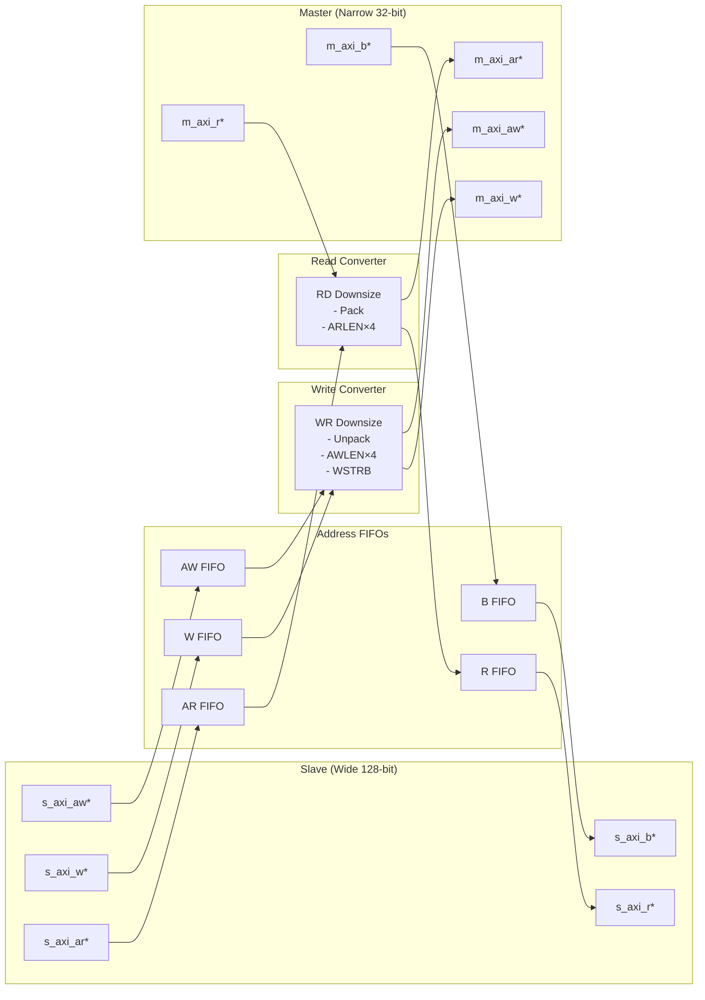

<!-- RTL Design Sherpa Documentation Header -->
<table>
<tr>
<td width="80">
  <a href="https://github.com/sean-galloway/RTLDesignSherpa">
    
  </a>
</td>
<td>
  <strong>RTL Design Sherpa</strong> · <em>Learning Hardware Design Through Practice</em><br>
  <sub>
    <a href="https://github.com/sean-galloway/RTLDesignSherpa">GitHub</a> ·
    <a href="https://github.com/sean-galloway/RTLDesignSherpa/blob/main/docs/DOCUMENTATION_INDEX.md">Documentation Index</a> ·
    <a href="https://github.com/sean-galloway/RTLDesignSherpa/blob/main/LICENSE">MIT License</a>
  </sub>
</td>
</tr>
</table>

---

<!-- End Header -->

# AXI4 Data Width Converter (Bidirectional)

**Module:** `axi4_dwidth_converter.sv`
**Location:** `rtl/amba/axi4/`
**Status:** ✅ Production Ready

---

## Overview

The AXI4 Data Width Converter provides bidirectional data width conversion between AXI4 interfaces of different data widths while maintaining full protocol compliance. A single parameterized module handles both upsizing (narrow→wide) and downsizing (wide→narrow) operations, automatically recalculating burst parameters and managing data packing/unpacking.

### Key Features

- ✅ **Bidirectional Conversion:** Single module supports both upsize and downsize
- ✅ **Full AXI4 Protocol:** All 5 channels (AW, W, B, AR, R) with complete signal support
- ✅ **Burst Preservation:** Maintains burst semantics across width conversion
- ✅ **Auto Burst Recalculation:** Adjusts AWLEN/ARLEN and AWSIZE/ARSIZE automatically
- ✅ **Error Propagation:** Correctly forwards SLVERR/DECERR responses
- ✅ **Elastic Buffering:** Configurable FIFO depths for each channel
- ✅ **Status Outputs:** Busy signal and pending transaction counters
- ✅ **Parameter Validation:** Compile-time checks for valid configurations

---

## Module Architecture

### Upsize Mode (Narrow → Wide)


**WIDTH_RATIO = 4** (128/32): Burst 16 beats @ 32-bit → 4 beats @ 128-bit

### Downsize Mode (Wide → Narrow)



**WIDTH_RATIO = 4** (128/32): Burst 4 beats @ 128-bit → 16 beats @ 32-bit

---

## Parameters

### Width Configuration

| Parameter | Type | Default | Range | Description |
|-----------|------|---------|-------|-------------|
| `S_AXI_DATA_WIDTH` | int | 32 | 8-1024 | Slave interface data width (power of 2) |
| `M_AXI_DATA_WIDTH` | int | 128 | 8-1024 | Master interface data width (power of 2) |
| `AXI_ID_WIDTH` | int | 8 | 1-16 | Transaction ID width |
| `AXI_ADDR_WIDTH` | int | 32 | 12-64 | Address bus width |
| `AXI_USER_WIDTH` | int | 1 | 0-1024 | User signal width |

### Buffer Depths

| Parameter | Type | Default | Description |
|-----------|------|---------|-------------|
| `AW_FIFO_DEPTH` | int | 4 | Write address FIFO depth (power of 2) |
| `W_FIFO_DEPTH` | int | 8 | Write data FIFO depth (power of 2) |
| `B_FIFO_DEPTH` | int | 4 | Write response FIFO depth (power of 2) |
| `AR_FIFO_DEPTH` | int | 4 | Read address FIFO depth (power of 2) |
| `R_FIFO_DEPTH` | int | 8 | Read data FIFO depth (power of 2) |

### Calculated Parameters (Auto)

| Parameter | Calculation | Description |
|-----------|-------------|-------------|
| `S_STRB_WIDTH` | `S_AXI_DATA_WIDTH / 8` | Slave write strobe width |
| `M_STRB_WIDTH` | `M_AXI_DATA_WIDTH / 8` | Master write strobe width |
| `WIDTH_RATIO` | `MAX / MIN` | Data width ratio (2-16) |
| `UPSIZE` | `S < M` | 1 if upsizing, 0 if downsizing |
| `DOWNSIZE` | `S > M` | 1 if downsizing, 0 if upsizing |
| `PTR_WIDTH` | `$clog2(WIDTH_RATIO)` | Beat pointer width |

---

## Port Groups

### AXI4 Slave Interface

**Write Channels:**
- AW channel: `s_axi_awid, s_axi_awaddr, s_axi_awlen, s_axi_awsize, s_axi_awburst, s_axi_awlock, s_axi_awcache, s_axi_awprot, s_axi_awqos, s_axi_awregion, s_axi_awuser, s_axi_awvalid, s_axi_awready`
- W channel: `s_axi_wdata[S_AXI_DATA_WIDTH], s_axi_wstrb[S_STRB_WIDTH], s_axi_wlast, s_axi_wuser, s_axi_wvalid, s_axi_wready`
- B channel: `s_axi_bid, s_axi_bresp, s_axi_buser, s_axi_bvalid, s_axi_bready`

**Read Channels:**
- AR channel: `s_axi_arid, s_axi_araddr, s_axi_arlen, s_axi_arsize, s_axi_arburst, s_axi_arlock, s_axi_arcache, s_axi_arprot, s_axi_arqos, s_axi_arregion, s_axi_aruser, s_axi_arvalid, s_axi_arready`
- R channel: `s_axi_rid, s_axi_rdata[S_AXI_DATA_WIDTH], s_axi_rresp, s_axi_rlast, s_axi_ruser, s_axi_rvalid, s_axi_rready`

### AXI4 Master Interface

**Write Channels:**
- AW channel: `m_axi_awid, m_axi_awaddr, m_axi_awlen, m_axi_awsize, m_axi_awburst, m_axi_awlock, m_axi_awcache, m_axi_awprot, m_axi_awqos, m_axi_awregion, m_axi_awuser, m_axi_awvalid, m_axi_awready`
- W channel: `m_axi_wdata[M_AXI_DATA_WIDTH], m_axi_wstrb[M_STRB_WIDTH], m_axi_wlast, m_axi_wuser, m_axi_wvalid, m_axi_wready`
- B channel: `m_axi_bid, m_axi_bresp, m_axi_buser, m_axi_bvalid, m_axi_bready`

**Read Channels:**
- AR channel: `m_axi_arid, m_axi_araddr, m_axi_arlen, m_axi_arsize, m_axi_arburst, m_axi_arlock, m_axi_arcache, m_axi_arprot, m_axi_arqos, m_axi_arregion, m_axi_aruser, m_axi_arvalid, m_axi_arready`
- R channel: `m_axi_rid, m_axi_rdata[M_AXI_DATA_WIDTH], m_axi_rresp, m_axi_rlast, m_axi_ruser, m_axi_rvalid, m_axi_rready`

### Status/Debug Outputs

| Port | Direction | Width | Description |
|------|-----------|-------|-------------|
| `busy` | Output | 1 | Indicates active conversions in progress |
| `wr_transactions_pending` | Output | 16 | Number of pending write transactions |
| `rd_transactions_pending` | Output | 16 | Number of pending read transactions |

---

## Conversion Mechanics

### Upsize Conversion (Narrow → Wide)

**Write Path:**
```
Example: 32-bit → 128-bit (WIDTH_RATIO = 4)

Slave Write:                Master Write:
AWLEN = 15 (16 beats)      AWLEN = 3 (4 beats)
AWSIZE = 3'b010 (4 bytes)  AWSIZE = 3'b100 (16 bytes)
AWADDR = 0x1000            AWADDR = 0x1000 (aligned)

W beats (32-bit):          W beats (128-bit):
Beat 0: wdata[31:0]   ───┐
Beat 1: wdata[31:0]   ───┤
Beat 2: wdata[31:0]   ───┼──► Beat 0: {beat3, beat2, beat1, beat0}
Beat 3: wdata[31:0]   ───┘
Beat 4: wdata[31:0]   ───┐
Beat 5: wdata[31:0]   ───┤
Beat 6: wdata[31:0]   ───┼──► Beat 1: {beat7, beat6, beat5, beat4}
Beat 7: wdata[31:0]   ───┘
... (16 beats total)       ... (4 beats total)
```

**Read Path:**
```
Slave Read:                Master Read:
ARLEN = 15 (16 beats)      ARLEN = 3 (4 beats)
ARSIZE = 3'b010 (4 bytes)  ARSIZE = 3'b100 (16 bytes)
ARADDR = 0x2000            ARADDR = 0x2000 (aligned)

R beats (128-bit):         R beats (32-bit):
Beat 0: {127:0} ──────────► Beat 0: rdata[31:0]   (bits [31:0])
                           Beat 1: rdata[31:0]   (bits [63:32])
                           Beat 2: rdata[31:0]   (bits [95:64])
                           Beat 3: rdata[31:0]   (bits [127:96])
Beat 1: {127:0} ──────────► Beat 4-7: ...
... (4 beats total)        ... (16 beats total)
```

### Downsize Conversion (Wide → Narrow)

**Write Path:**
```
Example: 128-bit → 32-bit (WIDTH_RATIO = 4)

Slave Write:               Master Write:
AWLEN = 3 (4 beats)        AWLEN = 15 (16 beats)
AWSIZE = 3'b100 (16 bytes) AWSIZE = 3'b010 (4 bytes)
AWADDR = 0x3000            AWADDR = 0x3000 (aligned)

W beats (128-bit):         W beats (32-bit):
Beat 0: wdata[127:0] ─────► Beat 0: [31:0]
                           Beat 1: [63:32]
                           Beat 2: [95:64]
                           Beat 3: [127:96]
Beat 1: wdata[127:0] ─────► Beat 4-7: ...
... (4 beats total)        ... (16 beats total)
```

**Read Path:**
```
Slave Read:                Master Read:
ARLEN = 3 (4 beats)        ARLEN = 15 (16 beats)
ARSIZE = 3'b100 (16 bytes) ARSIZE = 3'b010 (4 bytes)
ARADDR = 0x4000            ARADDR = 0x4000 (aligned)

R beats (32-bit):          R beats (128-bit):
Beat 0: rdata[31:0]   ───┐
Beat 1: rdata[31:0]   ───┤
Beat 2: rdata[31:0]   ───┼──► Beat 0: {beat3, beat2, beat1, beat0}
Beat 3: rdata[31:0]   ───┘
... (16 beats total)       ... (4 beats total)
```

### WSTRB Handling

**Upsize:** Packs narrow WSTRB beats into wide WSTRB
```
32-bit WSTRB:    4'b1111, 4'b1111, 4'b1111, 4'b1111
                    ↓        ↓        ↓        ↓
128-bit WSTRB:   16'b1111_1111_1111_1111
```

**Downsize:** Unpacks wide WSTRB into narrow WSTRB beats
```
128-bit WSTRB:   16'b1111_0000_1111_0000
                    ↓
32-bit WSTRB:    4'b0000, 4'b1111, 4'b0000, 4'b1111
```

---

## Usage Example

### Basic Upsize Converter (32-bit → 128-bit)

```systemverilog
axi4_dwidth_converter #(
    // Width configuration
    .S_AXI_DATA_WIDTH   (32),     // Narrow slave
    .M_AXI_DATA_WIDTH   (128),    // Wide master
    .AXI_ID_WIDTH       (4),
    .AXI_ADDR_WIDTH     (32),
    .AXI_USER_WIDTH     (1),

    // Buffer depths
    .AW_FIFO_DEPTH      (4),
    .W_FIFO_DEPTH       (16),     // Deeper for burst accumulation
    .B_FIFO_DEPTH       (4),
    .AR_FIFO_DEPTH      (4),
    .R_FIFO_DEPTH       (16)      // Deeper for burst unpacking
) u_upsize_conv (
    .aclk               (axi_clk),
    .aresetn            (axi_resetn),

    // Slave (narrow) interface
    .s_axi_awid         (narrow_awid),
    .s_axi_awaddr       (narrow_awaddr),
    .s_axi_awlen        (narrow_awlen),     // e.g., 15 (16 beats)
    .s_axi_awsize       (narrow_awsize),    // e.g., 3'b010 (4 bytes)
    .s_axi_awvalid      (narrow_awvalid),
    .s_axi_awready      (narrow_awready),
    // ... rest of slave AW/W/B/AR/R signals

    // Master (wide) interface
    .m_axi_awid         (wide_awid),
    .m_axi_awaddr       (wide_awaddr),
    .m_axi_awlen        (wide_awlen),       // e.g., 3 (4 beats)
    .m_axi_awsize       (wide_awsize),      // e.g., 3'b100 (16 bytes)
    .m_axi_awvalid      (wide_awvalid),
    .m_axi_awready      (wide_awready),
    // ... rest of master AW/W/B/AR/R signals

    // Status
    .busy                   (conv_busy),
    .wr_transactions_pending(wr_pend),
    .rd_transactions_pending(rd_pend)
);

// Typical upsize scenario: CPU (32-bit) → Memory controller (128-bit)
```

### Basic Downsize Converter (128-bit → 32-bit)

```systemverilog
axi4_dwidth_converter #(
    // Width configuration
    .S_AXI_DATA_WIDTH   (128),    // Wide slave
    .M_AXI_DATA_WIDTH   (32),     // Narrow master
    .AXI_ID_WIDTH       (4),
    .AXI_ADDR_WIDTH     (32),

    // Buffer depths
    .AW_FIFO_DEPTH      (4),
    .W_FIFO_DEPTH       (8),      // Moderate depth for unpacking
    .B_FIFO_DEPTH       (4),
    .AR_FIFO_DEPTH      (4),
    .R_FIFO_DEPTH       (32)      // Deeper for burst packing
) u_downsize_conv (
    .aclk               (axi_clk),
    .aresetn            (axi_resetn),

    // Slave (wide) interface
    .s_axi_awid         (wide_awid),
    .s_axi_awaddr       (wide_awaddr),
    .s_axi_awlen        (wide_awlen),       // e.g., 3 (4 beats)
    .s_axi_awsize       (wide_awsize),      // e.g., 3'b100 (16 bytes)
    // ... rest of slave signals

    // Master (narrow) interface
    .m_axi_awid         (narrow_awid),
    .m_axi_awaddr       (narrow_awaddr),
    .m_axi_awlen        (narrow_awlen),     // e.g., 15 (16 beats)
    .m_axi_awsize       (narrow_awsize),    // e.g., 3'b010 (4 bytes)
    // ... rest of master signals

    // Status
    .busy                   (conv_busy),
    .wr_transactions_pending(wr_pend),
    .rd_transactions_pending(rd_pend)
);

// Typical downsize scenario: Interconnect (128-bit) → Peripheral (32-bit)
```

---

## Design Notes

### WIDTH_RATIO Constraints

**Supported Ratios:** 2, 4, 8, 16
- WIDTH_RATIO = 2: e.g., 32→64, 64→128, 128→256
- WIDTH_RATIO = 4: e.g., 32→128, 64→256
- WIDTH_RATIO = 8: e.g., 32→256, 64→512
- WIDTH_RATIO = 16: e.g., 32→512, 64→1024

**Why Limited to 16?**
- Larger ratios require excessive buffering (512+ beats)
- Address alignment becomes complex
- Performance degrades significantly
- Rare in real designs (use multi-stage conversion instead)

### Address Alignment

**Critical:** Slave addresses must be aligned to master data width in upsize mode

```systemverilog
// Upsize 32→128 (WIDTH_RATIO=4, M_STRB_WIDTH=16)
// Slave addresses must be 16-byte aligned (bottom 4 bits = 0)

✅ VALID:   AWADDR = 0x1000 (aligned to 16 bytes)
✅ VALID:   AWADDR = 0x2000
❌ INVALID: AWADDR = 0x1004 (not 16-byte aligned)
❌ INVALID: AWADDR = 0x2008 (not 16-byte aligned)
```

**Downsize:** No alignment restrictions (master can access any byte)

### Burst Length Calculation

**Upsize:**
```
Master AWLEN = (Slave AWLEN + 1) / WIDTH_RATIO - 1
Master AWSIZE = Slave AWSIZE + $clog2(WIDTH_RATIO)

Example: 32→128 (WIDTH_RATIO=4)
Slave:  AWLEN=15, AWSIZE=2 (4 bytes)  → 16 beats × 4 bytes = 64 bytes
Master: AWLEN=3,  AWSIZE=4 (16 bytes) → 4 beats × 16 bytes = 64 bytes
```

**Downsize:**
```
Master AWLEN = (Slave AWLEN + 1) * WIDTH_RATIO - 1
Master AWSIZE = Slave AWSIZE - $clog2(WIDTH_RATIO)

Example: 128→32 (WIDTH_RATIO=4)
Slave:  AWLEN=3,  AWSIZE=4 (16 bytes) → 4 beats × 16 bytes = 64 bytes
Master: AWLEN=15, AWSIZE=2 (4 bytes)  → 16 beats × 4 bytes = 64 bytes
```

### Buffer Depth Guidelines

**Address Channels (AW/AR):**
- Default: 4 entries (sufficient for most cases)
- Increase if high address command rate

**Data Channels (W/R):**
- **Upsize:** Deeper buffers needed to accumulate narrow beats
  - W_FIFO_DEPTH ≥ WIDTH_RATIO × max_burst_length
  - R_FIFO_DEPTH ≥ WIDTH_RATIO × max_burst_length
- **Downsize:** Moderate buffers for unpacking wide beats
  - W_FIFO_DEPTH ≥ max_burst_length (wide side)
  - R_FIFO_DEPTH ≥ WIDTH_RATIO × max_burst_length (for packing)

**Example (32→128, max burst=16 narrow beats):**
```systemverilog
.W_FIFO_DEPTH  (16),  // Accumulate 16 narrow beats → 4 wide beats
.R_FIFO_DEPTH  (16)   // Unpack 4 wide beats → 16 narrow beats
```

### Performance Characteristics

**Throughput (Upsize):**
- Accumulation latency: WIDTH_RATIO-1 cycles per wide beat
- Example (WIDTH_RATIO=4): 3-cycle latency to accumulate first wide beat

**Throughput (Downsize):**
- Unpacking latency: 1 cycle per narrow beat
- Full wide beat can be unpacked in consecutive cycles

**Backpressure Handling:**
- FIFOs provide elastic buffering
- Prevents deadlock during width mismatch scenarios
- Slave can stall independently of master

---

## Related Modules

### Specialized Converters
- **[axi4_dwidth_converter_rd](axi4_dwidth_converter_rd.md)** - Read-only data width conversion
- **[axi4_dwidth_converter_wr](axi4_dwidth_converter_wr.md)** - Write-only data width conversion

### Core Modules
- **[axi4_master_rd](axi4_master_rd.md)** - AXI4 read master
- **[axi4_master_wr](axi4_master_wr.md)** - AXI4 write master
- **[axi4_slave_rd](axi4_slave_rd.md)** - AXI4 read slave
- **[axi4_slave_wr](axi4_slave_wr.md)** - AXI4 write slave

### Used Components
- **[gaxi_skid_buffer](../gaxi/gaxi_skid_buffer.md)** - Elastic buffering
- **[gaxi_fifo_sync](../gaxi/gaxi_fifo_sync.md)** - Synchronous FIFOs

---

## References

### Specifications
- ARM IHI 0022E: AMBA AXI Protocol Specification (AXI4)
- Chapter 11: Data Width Conversion

### Source Code
- RTL: `rtl/amba/axi4/axi4_dwidth_converter.sv`
- Tests: `val/amba/test_axi4_dwidth_converter.py`
- Framework: `bin/CocoTBFramework/components/axi4/`

### Documentation
- Architecture: [RTLAmba Overview](../overview.md)
- AXI4 Index: [README.md](README.md)

---

**Last Updated:** 2025-10-20

---

## Navigation

- **[← Back to AXI4 Index](README.md)**
- **[← Back to RTLAmba Index](../README.md)**
- **[← Back to Main Documentation Index](../../index.md)**
