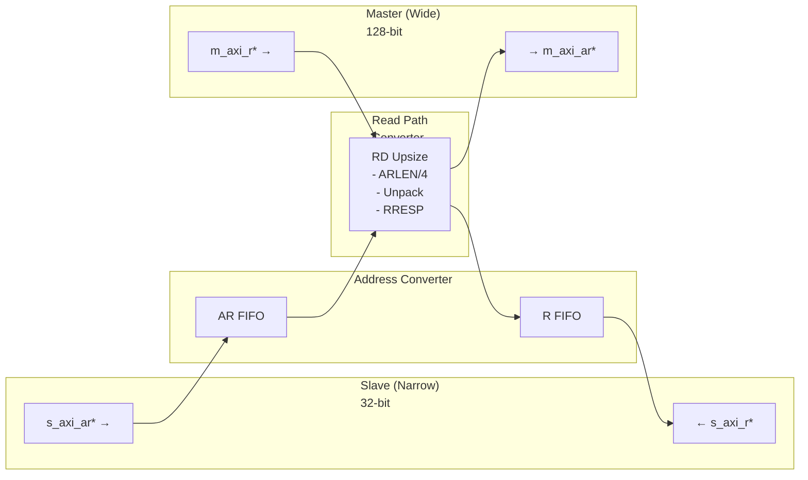
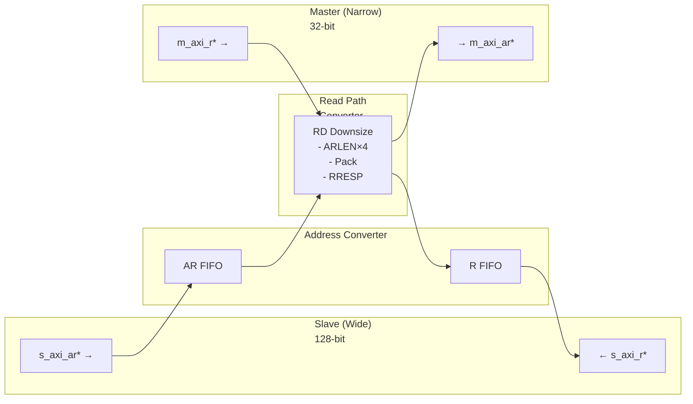

<!-- RTL Design Sherpa Documentation Header -->
<table>
<tr>
<td width="80">
  <a href="https://github.com/sean-galloway/RTLDesignSherpa">
    
  </a>
</td>
<td>
  <strong>RTL Design Sherpa</strong> · <em>Learning Hardware Design Through Practice</em><br>
  <sub>
    <a href="https://github.com/sean-galloway/RTLDesignSherpa">GitHub</a> ·
    <a href="https://github.com/sean-galloway/RTLDesignSherpa/blob/main/docs/DOCUMENTATION_INDEX.md">Documentation Index</a> ·
    <a href="https://github.com/sean-galloway/RTLDesignSherpa/blob/main/LICENSE">MIT License</a>
  </sub>
</td>
</tr>
</table>

---

<!-- End Header -->

# AXI4 Read Data Width Converter

**Module:** `axi4_dwidth_converter_rd.sv`
**Location:** `rtl/amba/axi4/`
**Status:** ✅ Production Ready

---

## Overview

The AXI4 Read Data Width Converter provides data width conversion for read-only AXI4 interfaces (AR and R channels only). This specialized converter is optimized for unidirectional bridges where the read and write paths are separate, reducing resource usage compared to the full bidirectional converter.

### Key Features

- ✅ **Read-Only:** AR and R channels only (no write channels)
- ✅ **Bidirectional Conversion:** Supports both upsize and downsize
- ✅ **Resource Optimized:** Smaller than bidirectional converter
- ✅ **Burst Preservation:** Maintains burst semantics across conversion
- ✅ **Error Propagation:** Correctly forwards RRESP error codes
- ✅ **Elastic Buffering:** Configurable FIFO depths for AR and R channels
- ✅ **Status Outputs:** Busy signal and pending transaction counter

---

## Module Architecture

### Upsize Mode (Narrow → Wide Reads)



Example: 16 narrow R beats (32-bit) ← 4 wide R beats (128-bit)

### Downsize Mode (Wide → Narrow Reads)



Example: 4 wide R beats (128-bit) ← 16 narrow R beats (32-bit)

---

## Parameters

### Width Configuration

| Parameter | Type | Default | Range | Description |
|-----------|------|---------|-------|-------------|
| `S_AXI_DATA_WIDTH` | int | 32 | 8-1024 | Slave interface data width (power of 2) |
| `M_AXI_DATA_WIDTH` | int | 128 | 8-1024 | Master interface data width (power of 2) |
| `AXI_ID_WIDTH` | int | 8 | 1-16 | Transaction ID width |
| `AXI_ADDR_WIDTH` | int | 32 | 12-64 | Address bus width |
| `AXI_USER_WIDTH` | int | 1 | 0-1024 | User signal width |

### Buffer Depths

| Parameter | Type | Default | Description |
|-----------|------|---------|-------------|
| `AR_FIFO_DEPTH` | int | 4 | Read address FIFO depth (power of 2) |
| `R_FIFO_DEPTH` | int | 8 | Read data FIFO depth (power of 2) |

### Calculated Parameters (Auto)

| Parameter | Calculation | Description |
|-----------|-------------|-------------|
| `WIDTH_RATIO` | `MAX / MIN` | Data width ratio (2-16) |
| `UPSIZE` | `S < M` | 1 if upsizing, 0 if downsizing |
| `DOWNSIZE` | `S > M` | 1 if downsizing, 0 if upsizing |

---

## Port Groups

### AXI4 Slave Read Interface

**Read Address Channel (AR):**
- `s_axi_arid, s_axi_araddr, s_axi_arlen, s_axi_arsize, s_axi_arburst, s_axi_arlock, s_axi_arcache, s_axi_arprot, s_axi_arqos, s_axi_arregion, s_axi_aruser, s_axi_arvalid, s_axi_arready`

**Read Data Channel (R):**
- `s_axi_rid, s_axi_rdata[S_AXI_DATA_WIDTH], s_axi_rresp, s_axi_rlast, s_axi_ruser, s_axi_rvalid, s_axi_rready`

### AXI4 Master Read Interface

**Read Address Channel (AR):**
- `m_axi_arid, m_axi_araddr, m_axi_arlen, m_axi_arsize, m_axi_arburst, m_axi_arlock, m_axi_arcache, m_axi_arprot, m_axi_arqos, m_axi_arregion, m_axi_aruser, m_axi_arvalid, m_axi_arready`

**Read Data Channel (R):**
- `m_axi_rid, m_axi_rdata[M_AXI_DATA_WIDTH], m_axi_rresp, m_axi_rlast, m_axi_ruser, m_axi_rvalid, m_axi_rready`

### Status/Debug Outputs

| Port | Direction | Width | Description |
|------|-----------|-------|-------------|
| `busy` | Output | 1 | Indicates active read conversions in progress |
| `rd_transactions_pending` | Output | 16 | Number of pending read transactions |

---

## Read Conversion Mechanics

### Upsize Read (Narrow → Wide)

```
Example: 32-bit → 128-bit (WIDTH_RATIO = 4)

Slave Read Request:            Master Read Request:
ARLEN = 15 (16 beats)          ARLEN = 3 (4 beats)
ARSIZE = 3'b010 (4 bytes)      ARSIZE = 3'b100 (16 bytes)
ARADDR = 0x2000                ARADDR = 0x2000 (aligned)

Master R beats (128-bit):      Slave R beats (32-bit):
Beat 0: rdata[127:0] ─────────► Beat 0: rdata[31:0]   (bits [31:0])
                                Beat 1: rdata[31:0]   (bits [63:32])
                                Beat 2: rdata[31:0]   (bits [95:64])
                                Beat 3: rdata[31:0]   (bits [127:96])
Beat 1: rdata[127:0] ─────────► Beat 4-7: ...
... (4 beats total)             ... (16 beats total)

RRESP handling:
Master: OKAY (all beats)        Slave: OKAY on each narrow beat
```

### Downsize Read (Wide → Narrow)

```
Example: 128-bit → 32-bit (WIDTH_RATIO = 4)

Slave Read Request:            Master Read Request:
ARLEN = 3 (4 beats)            ARLEN = 15 (16 beats)
ARSIZE = 3'b100 (16 bytes)     ARSIZE = 3'b010 (4 bytes)
ARADDR = 0x4000                ARADDR = 0x4000 (aligned)

Master R beats (32-bit):       Slave R beats (128-bit):
Beat 0: rdata[31:0]   ───┐
Beat 1: rdata[31:0]   ───┤
Beat 2: rdata[31:0]   ───┼────► Beat 0: {beat3, beat2, beat1, beat0}
Beat 3: rdata[31:0]   ───┘
... (16 beats total)            ... (4 beats total)

RRESP handling:
Master: OKAY, OKAY, SLVERR, OKAY
Slave:  Beat 0 → SLVERR (worst-case RRESP propagation)
```

### RRESP Error Propagation

**Upsize:** Each narrow beat inherits RRESP from corresponding wide beat
```
Master R beats:         Slave R beats:
Beat 0: RRESP=OKAY  →  Beat 0-3: RRESP=OKAY
Beat 1: RRESP=SLVERR → Beat 4-7: RRESP=SLVERR
```

**Downsize:** Wide beat RRESP is worst-case of narrow beats
```
Master R beats:         Slave R beat:
Beat 0-2: RRESP=OKAY  ┐
Beat 3: RRESP=SLVERR  ┼→ Beat 0: RRESP=SLVERR (worst-case)
```

---

## Usage Example

### Basic Read Upsize Converter (32-bit → 128-bit)

```systemverilog
axi4_dwidth_converter_rd #(
    // Width configuration
    .S_AXI_DATA_WIDTH   (32),     // Narrow slave
    .M_AXI_DATA_WIDTH   (128),    // Wide master
    .AXI_ID_WIDTH       (4),
    .AXI_ADDR_WIDTH     (32),
    .AXI_USER_WIDTH     (1),

    // Buffer depths
    .AR_FIFO_DEPTH      (4),
    .R_FIFO_DEPTH       (16)      // Deeper for burst unpacking
) u_rd_upsize (
    .aclk               (axi_clk),
    .aresetn            (axi_resetn),

    // Slave (narrow) interface
    .s_axi_arid         (cpu_arid),
    .s_axi_araddr       (cpu_araddr),
    .s_axi_arlen        (cpu_arlen),     // e.g., 15 (16 beats)
    .s_axi_arsize       (cpu_arsize),    // e.g., 3'b010 (4 bytes)
    .s_axi_arvalid      (cpu_arvalid),
    .s_axi_arready      (cpu_arready),
    // ... rest of AR signals

    .s_axi_rid          (cpu_rid),
    .s_axi_rdata        (cpu_rdata),     // 32-bit
    .s_axi_rresp        (cpu_rresp),
    .s_axi_rlast        (cpu_rlast),
    .s_axi_rvalid       (cpu_rvalid),
    .s_axi_rready       (cpu_rready),

    // Master (wide) interface
    .m_axi_arid         (mem_arid),
    .m_axi_araddr       (mem_araddr),
    .m_axi_arlen        (mem_arlen),     // e.g., 3 (4 beats)
    .m_axi_arsize       (mem_arsize),    // e.g., 3'b100 (16 bytes)
    .m_axi_arvalid      (mem_arvalid),
    .m_axi_arready      (mem_arready),
    // ... rest of AR signals

    .m_axi_rid          (mem_rid),
    .m_axi_rdata        (mem_rdata),     // 128-bit
    .m_axi_rresp        (mem_rresp),
    .m_axi_rlast        (mem_rlast),
    .m_axi_rvalid       (mem_rvalid),
    .m_axi_rready       (mem_rready),

    // Status
    .busy                   (rd_busy),
    .rd_transactions_pending(rd_pend)
);

// Use case: CPU (32-bit read) ← Memory controller (128-bit interface)
```

### Basic Read Downsize Converter (128-bit → 32-bit)

```systemverilog
axi4_dwidth_converter_rd #(
    // Width configuration
    .S_AXI_DATA_WIDTH   (128),    // Wide slave
    .M_AXI_DATA_WIDTH   (32),     // Narrow master
    .AXI_ID_WIDTH       (4),
    .AXI_ADDR_WIDTH     (32),

    // Buffer depths
    .AR_FIFO_DEPTH      (4),
    .R_FIFO_DEPTH       (32)      // Deeper for burst packing
) u_rd_downsize (
    .aclk               (axi_clk),
    .aresetn            (axi_resetn),

    // Slave (wide) interface
    .s_axi_arid         (wide_arid),
    .s_axi_araddr       (wide_araddr),
    .s_axi_arlen        (wide_arlen),     // e.g., 3 (4 beats)
    .s_axi_arsize       (wide_arsize),    // e.g., 3'b100 (16 bytes)
    .s_axi_arvalid      (wide_arvalid),
    .s_axi_arready      (wide_arready),
    // ... rest of AR signals

    .s_axi_rid          (wide_rid),
    .s_axi_rdata        (wide_rdata),     // 128-bit
    .s_axi_rresp        (wide_rresp),
    .s_axi_rlast        (wide_rlast),
    .s_axi_rvalid       (wide_rvalid),
    .s_axi_rready       (wide_rready),

    // Master (narrow) interface
    .m_axi_arid         (periph_arid),
    .m_axi_araddr       (periph_araddr),
    .m_axi_arlen        (periph_arlen),   // e.g., 15 (16 beats)
    .m_axi_arsize       (periph_arsize),  // e.g., 3'b010 (4 bytes)
    .m_axi_arvalid      (periph_arvalid),
    .m_axi_arready      (periph_arready),
    // ... rest of AR signals

    .m_axi_rid          (periph_rid),
    .m_axi_rdata        (periph_rdata),   // 32-bit
    .m_axi_rresp        (periph_rresp),
    .m_axi_rlast        (periph_rlast),
    .m_axi_rvalid       (periph_rvalid),
    .m_axi_rready       (periph_rready),

    // Status
    .busy                   (rd_busy),
    .rd_transactions_pending(rd_pend)
);

// Use case: Interconnect (128-bit) → Peripheral (32-bit read-only)
```

---

## Design Notes

### Read-Only Use Cases

**When to Use Read-Only Converter:**
- Unidirectional read-only bridges
- Separate read and write data paths
- ROM/Flash interfaces (read-only by nature)
- Read-heavy systems with dedicated write path

**Resource Savings vs. Full Converter:**
- No AW/W/B channel FIFOs (saves ~40% resources)
- Simpler control logic
- Lower latency (no write path dependencies)

### Address Alignment

Same alignment requirements as [axi4_dwidth_converter](axi4_dwidth_converter.md):

**Upsize:** Slave addresses must be aligned to master data width
```
32→128 upsize: ARADDR must be 16-byte aligned (bottom 4 bits = 0)
```

**Downsize:** No alignment restrictions

### Burst Length Calculation

**Upsize:**
```
Master ARLEN = (Slave ARLEN + 1) / WIDTH_RATIO - 1
Master ARSIZE = Slave ARSIZE + $clog2(WIDTH_RATIO)
```

**Downsize:**
```
Master ARLEN = (Slave ARLEN + 1) * WIDTH_RATIO - 1
Master ARSIZE = Slave ARSIZE - $clog2(WIDTH_RATIO)
```

See [axi4_dwidth_converter](axi4_dwidth_converter.md) for detailed examples.

### Buffer Depth Guidelines

**AR Channel:**
- Default: 4 entries (sufficient for most cases)
- Increase for high address command rate

**R Channel:**
- **Upsize:** R_FIFO_DEPTH ≥ WIDTH_RATIO × max_burst_length
  - Need to buffer unpacked narrow beats
- **Downsize:** R_FIFO_DEPTH ≥ WIDTH_RATIO × max_burst_length
  - Need to accumulate narrow beats for packing

**Example (32→128, max burst=16 narrow beats):**
```systemverilog
.AR_FIFO_DEPTH  (4),   // Address commands
.R_FIFO_DEPTH   (16)   // Unpack 4 wide → 16 narrow beats
```

### Performance Characteristics

**Throughput (Upsize):**
- Unpacking latency: 1 cycle per narrow beat
- Full wide beat unpacked in consecutive cycles

**Throughput (Downsize):**
- Packing latency: WIDTH_RATIO-1 cycles per wide beat
- Need to accumulate all narrow beats before forwarding

**Comparison to Full Converter:**
- ~20-30% lower latency (no write path overhead)
- ~40% resource savings (no write channel FIFOs)

---

## Related Modules

### Companion Converters
- **[axi4_dwidth_converter](axi4_dwidth_converter.md)** - Full bidirectional converter (AW/W/B/AR/R)
- **[axi4_dwidth_converter_wr](axi4_dwidth_converter_wr.md)** - Write-only data width conversion

### Core Modules
- **[axi4_master_rd](axi4_master_rd.md)** - AXI4 read master
- **[axi4_slave_rd](axi4_slave_rd.md)** - AXI4 read slave

### Used Components
- **[gaxi_skid_buffer](../gaxi/gaxi_skid_buffer.md)** - Elastic buffering
- **[gaxi_fifo_sync](../gaxi/gaxi_fifo_sync.md)** - Synchronous FIFOs

---

## References

### Specifications
- ARM IHI 0022E: AMBA AXI Protocol Specification (AXI4)
- Chapter 11: Data Width Conversion

### Source Code
- RTL: `rtl/amba/axi4/axi4_dwidth_converter_rd.sv`
- Tests: `val/amba/test_axi4_dwidth_converter_rd.py`
- Framework: `bin/CocoTBFramework/components/axi4/`

### Documentation
- Architecture: [RTLAmba Overview](../overview.md)
- AXI4 Index: [README.md](README.md)

---

**Last Updated:** 2025-10-20

---

## Navigation

- **[← Back to AXI4 Index](README.md)**
- **[← Back to RTLAmba Index](../index.md)**
- **[← Back to Main Documentation Index](../../index.md)**
