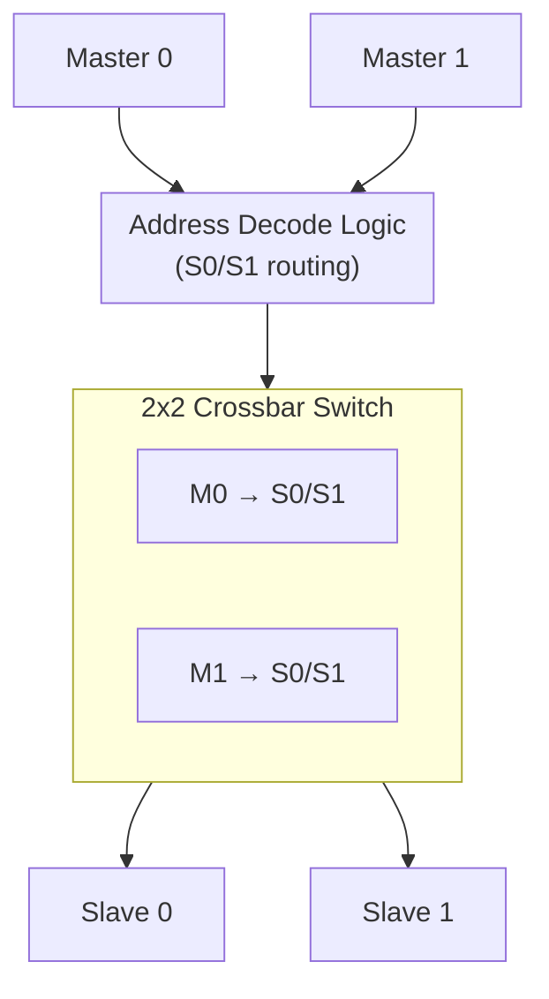
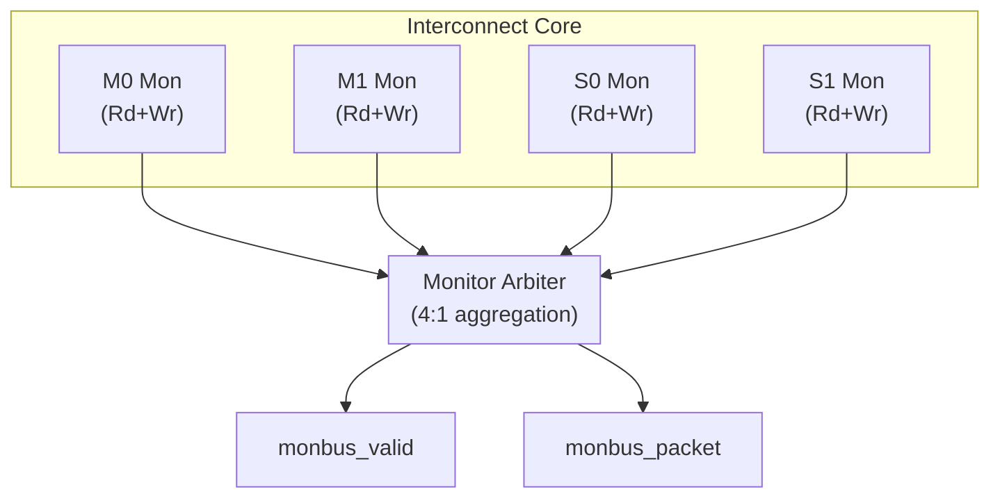

<!-- RTL Design Sherpa Documentation Header -->
<table>
<tr>
<td width="80">
  <a href="https://github.com/sean-galloway/RTLDesignSherpa">
    
  </a>
</td>
<td>
  <strong>RTL Design Sherpa</strong> · <em>Learning Hardware Design Through Practice</em><br>
  <sub>
    <a href="https://github.com/sean-galloway/RTLDesignSherpa">GitHub</a> ·
    <a href="https://github.com/sean-galloway/RTLDesignSherpa/blob/main/docs/DOCUMENTATION_INDEX.md">Documentation Index</a> ·
    <a href="https://github.com/sean-galloway/RTLDesignSherpa/blob/main/LICENSE">MIT License</a>
  </sub>
</td>
</tr>
</table>

---

<!-- End Header -->

# AXI4 2x2 Interconnect with Monitoring

**Module:** `axi4_interconnect_2x2_mon.sv`
**Location:** `rtl/amba/axi4/`
**Status:** ✅ Production Ready

---

## Overview

The AXI4 2x2 Interconnect provides a full crossbar connection between 2 AXI4 masters and 2 AXI4 slaves with comprehensive monitoring on all interfaces. This module is designed for system-level integration, providing address decoding, routing, arbitration, and centralized performance analysis.

### Key Features

- ✅ **2x2 Crossbar:** Full connectivity - any master can access any slave
- ✅ **Address Decoding:** Configurable base addresses and masks per slave
- ✅ **Integrated Monitoring:** Monitors on all 4 interfaces (2 masters + 2 slaves)
- ✅ **Monitor Aggregation:** Centralized monitor bus for system-level analysis
- ✅ **Arbitration:** Priority-based arbitration for multi-master contention
- ✅ **Clock Gating Support:** Optional clock gating on all interfaces
- ✅ **Performance Analysis:** Cross-channel correlation and deadlock detection
- ✅ **Error Handling:** DECERR for unmapped addresses

---

## Module Architecture



### Monitoring Architecture



---

## Parameters

### AXI4 Configuration

| Parameter | Type | Default | Description |
|-----------|------|---------|-------------|
| `AXI_ID_WIDTH` | int | 8 | Transaction ID width |
| `AXI_ADDR_WIDTH` | int | 32 | Address bus width |
| `AXI_DATA_WIDTH` | int | 32 | Data bus width |
| `AXI_USER_WIDTH` | int | 1 | User signal width |

### Address Mapping

| Parameter | Type | Default | Description |
|-----------|------|---------|-------------|
| `S0_BASE_ADDR` | logic[31:0] | 0 | Slave 0 base address |
| `S0_ADDR_MASK` | logic[31:0] | 32'h0FFFFFFF | Slave 0 address mask (256MB) |
| `S1_BASE_ADDR` | logic[31:0] | 32'h10000000 | Slave 1 base address (256MB offset) |
| `S1_ADDR_MASK` | logic[31:0] | 32'h0FFFFFFF | Slave 1 address mask (256MB) |

### Monitor Configuration

| Parameter | Type | Default | Description |
|-----------|------|---------|-------------|
| `UNIT_ID` | int | 3 | 4-bit unit identifier for interconnect |
| `AGENT_ID` | int | 30 | 8-bit agent identifier for interconnect |
| `MAX_TRANSACTIONS` | int | 16 | Maximum outstanding transactions per interface |
| `ENABLE_FILTERING` | bit | 1 | Enable packet filtering on monitors |
| `ENABLE_CLOCK_GATING` | bit | 1 | Enable clock gating on all interfaces |
| `ADD_PIPELINE_STAGE` | bit | 0 | Add register stage for timing closure |

---

## Port Groups

### Master Interfaces

**Master 0 (m0_axi_*):**
- AW channel: `awid, awaddr, awlen, awsize, awburst, awlock, awcache, awprot, awqos, awregion, awuser, awvalid, awready`
- W channel: `wdata, wstrb, wlast, wuser, wvalid, wready`
- B channel: `bid, bresp, buser, bvalid, bready`
- AR channel: `arid, araddr, arlen, arsize, arburst, arlock, arcache, arprot, arqos, arregion, aruser, arvalid, arready`
- R channel: `rid, rdata, rresp, rlast, ruser, rvalid, rready`

**Master 1 (m1_axi_*):**
- Identical structure to Master 0

### Slave Interfaces

**Slave 0 (s0_axi_*):**
- AW, W, B, AR, R channels (same signals as masters, mirrored direction)

**Slave 1 (s1_axi_*):**
- Identical structure to Slave 0

### Monitor Bus Output

| Port | Direction | Width | Description |
|------|-----------|-------|-------------|
| `monbus_valid` | Output | 1 | Aggregated monitor packet valid |
| `monbus_ready` | Input | 1 | Downstream ready to accept packet |
| `monbus_packet` | Output | 64 | Aggregated monitor packet data |

### Monitor Configuration Inputs

All standard AXI4 monitor configuration signals (applies to all 4 monitors):
- `cfg_monitor_enable`, `cfg_error_enable`, `cfg_timeout_enable`, `cfg_perf_enable`
- `cfg_timeout_cycles`, `cfg_latency_threshold`
- 7 mask signals (`cfg_axi_*_mask`)

### Status Outputs

| Port | Direction | Width | Description |
|------|-----------|-------|-------------|
| `busy` | Output | 1 | Any interface has active transactions |
| `m0_active_transactions` | Output | 8 | Master 0 outstanding transactions |
| `m1_active_transactions` | Output | 8 | Master 1 outstanding transactions |
| `s0_active_transactions` | Output | 8 | Slave 0 outstanding transactions |
| `s1_active_transactions` | Output | 8 | Slave 1 outstanding transactions |
| `error_count` | Output | 16 | Cumulative error count (all interfaces) |

---

## Address Mapping

### Default Configuration

```
Slave 0: 0x00000000 - 0x0FFFFFFF (256 MB)
Slave 1: 0x10000000 - 0x1FFFFFFF (256 MB)
```

### Address Decoding Logic

```systemverilog
// Address decode for Slave 0
wire s0_match = ((addr & ~S0_ADDR_MASK) == S0_BASE_ADDR);

// Address decode for Slave 1
wire s1_match = ((addr & ~S1_ADDR_MASK) == S1_BASE_ADDR);

// DECERR if no match
wire addr_valid = s0_match | s1_match;
```

### Custom Address Mapping Example

```systemverilog
// Memory map:
// Slave 0: 0x00000000 - 0x7FFFFFFF (2 GB - DDR)
// Slave 1: 0x80000000 - 0xFFFFFFFF (2 GB - peripherals)

axi4_interconnect_2x2_mon #(
    .S0_BASE_ADDR   (32'h00000000),
    .S0_ADDR_MASK   (32'h7FFFFFFF),  // 2 GB
    .S1_BASE_ADDR   (32'h80000000),
    .S1_ADDR_MASK   (32'h7FFFFFFF)   // 2 GB
) u_interconnect (
    // ...
);
```

---

## Usage Example

### Basic System Integration

```systemverilog
axi4_interconnect_2x2_mon #(
    // AXI4 parameters
    .AXI_ID_WIDTH       (4),
    .AXI_ADDR_WIDTH     (32),
    .AXI_DATA_WIDTH     (64),
    .AXI_USER_WIDTH     (1),

    // Address mapping
    .S0_BASE_ADDR       (32'h00000000),  // Memory
    .S0_ADDR_MASK       (32'h0FFFFFFF),  // 256 MB
    .S1_BASE_ADDR       (32'h10000000),  // Peripherals
    .S1_ADDR_MASK       (32'h00FFFFFF),  // 16 MB

    // Monitor configuration
    .UNIT_ID            (3),
    .AGENT_ID           (30),
    .MAX_TRANSACTIONS   (16),
    .ENABLE_FILTERING   (1),
    .ENABLE_CLOCK_GATING(1)
) u_interconnect (
    .aclk               (system_clk),
    .aresetn            (system_resetn),

    // Master 0: CPU
    .m0_axi_awid        (cpu_awid),
    .m0_axi_awaddr      (cpu_awaddr),
    // ... rest of Master 0 AW/W/B/AR/R signals

    // Master 1: DMA
    .m1_axi_awid        (dma_awid),
    .m1_axi_awaddr      (dma_awaddr),
    // ... rest of Master 1 AW/W/B/AR/R signals

    // Slave 0: DDR Memory Controller
    .s0_axi_awid        (mem_awid),
    .s0_axi_awaddr      (mem_awaddr),
    // ... rest of Slave 0 AW/W/B/AR/R signals

    // Slave 1: Peripheral Bus Bridge
    .s1_axi_awid        (periph_awid),
    .s1_axi_awaddr      (periph_awaddr),
    // ... rest of Slave 1 AW/W/B/AR/R signals

    // Monitor configuration
    .cfg_monitor_enable     (1'b1),
    .cfg_error_enable       (1'b1),
    .cfg_timeout_enable     (1'b1),
    .cfg_perf_enable        (1'b0),
    .cfg_timeout_cycles     (16'd1000),
    .cfg_latency_threshold  (32'd500),

    .cfg_axi_pkt_mask       (16'b1111_1111_0000_0011),
    .cfg_axi_error_mask     (16'h0000),
    .cfg_axi_timeout_mask   (16'h0000),
    .cfg_axi_compl_mask     (16'hFFFF),
    // ... rest of mask signals

    // Monitor bus output
    .monbus_valid           (mon_valid),
    .monbus_ready           (mon_ready),
    .monbus_packet          (mon_packet),

    // Status
    .busy                   (system_busy),
    .m0_active_transactions (cpu_active),
    .m1_active_transactions (dma_active),
    .s0_active_transactions (mem_active),
    .s1_active_transactions (periph_active),
    .error_count            (total_errors)
);
```

---

## Design Notes

### Arbitration Strategy

**Address Channel Arbitration:**
- Priority-based: Master 0 has higher priority than Master 1
- Fixed priority (not round-robin)
- Per-slave arbitration (independent for S0 and S1)

**Data Channel Handling:**
- W channel follows AW channel grant
- R/B channels use ID-based routing (no arbitration needed)

### Multi-Master Scenarios

**Concurrent Access to Same Slave:**
```
Master 0 → Slave 0 (granted)
Master 1 → Slave 0 (blocked until M0 completes)
```

**Concurrent Access to Different Slaves:**
```
Master 0 → Slave 0 (granted)
Master 1 → Slave 1 (granted, parallel access)
```

### Error Handling

**DECERR Generation:**
- Unmapped addresses return DECERR on B/R channels
- Example: Access to 0x20000000 (not in S0 or S1 range)

**Error Propagation:**
- Slave errors (SLVERR) forwarded to requesting master
- Monitor captures all error events

### Performance Optimization

**Reduce Latency:**
- Disable pipeline stage (`ADD_PIPELINE_STAGE=0`) for single-cycle routing
- Use deeper transaction tracking (`MAX_TRANSACTIONS=32`)

**Reduce Congestion:**
- Enable filtering (`ENABLE_FILTERING=1`)
- Selective packet types (error + timeout only)

**Power Optimization:**
- Enable clock gating (`ENABLE_CLOCK_GATING=1`)
- Gates clocks when interfaces idle

### Monitor Packet Sources

**4 Monitors in Interconnect:**
1. Master 0 Monitor (AGENT_ID = AGENT_ID + 0)
2. Master 1 Monitor (AGENT_ID = AGENT_ID + 1)
3. Slave 0 Monitor (AGENT_ID = AGENT_ID + 2)
4. Slave 1 Monitor (AGENT_ID = AGENT_ID + 3)

**Monitor Bus Aggregation:**
- 4:1 arbiter combines packets from all monitors
- Priority: M0 > M1 > S0 > S1 (same as address arbitration)
- Single monitor bus output to system

### System-Level Analysis

**Cross-Interface Correlation:**
```
Master 0 → Address 0x00001000 → Slave 0
  - M0 monitor: Write request packet
  - S0 monitor: Write completion packet
  - Latency correlation via AWID/BID matching
```

**Deadlock Detection:**
- Monitor tracks outstanding transactions per interface
- Alert if any interface exceeds threshold with backpressure

---

## Related Modules

### Core Components
- **[axi4_master_rd_mon](axi4_master_rd_mon.md)** - Master read with monitoring
- **[axi4_master_wr_mon](axi4_master_wr_mon.md)** - Master write with monitoring
- **[axi4_slave_rd_mon](axi4_slave_rd_mon.md)** - Slave read with monitoring
- **[axi4_slave_wr_mon](axi4_slave_wr_mon.md)** - Slave write with monitoring

### System Integration
- **APB Crossbar** - Peripheral bus crossbar (simpler protocol)
- **Monitor Aggregator** - System-level monitor packet collection

---

## References

### Specifications
- ARM IHI 0022E: AMBA AXI Protocol Specification (AXI4)
- Chapter 10: Multi-Master Systems and Interconnects

### Source Code
- RTL: `rtl/amba/axi4/axi4_interconnect_2x2_mon.sv`
- Tests: `val/amba/test_axi4_interconnect.py`
- Framework: `bin/CocoTBFramework/components/axi4/`

### Documentation
- Configuration Guide: [AXI_Monitor_Configuration_Guide.md](../../AXI_Monitor_Configuration_Guide.md)
- Architecture: [RTLAmba Overview](../overview.md)
- AXI4 Index: [README.md](README.md)

---

**Last Updated:** 2025-10-20

---

## Navigation

- **[← Back to AXI4 Index](README.md)**
- **[← Back to RTLAmba Index](../README.md)**
- **[← Back to Main Documentation Index](../../index.md)**
