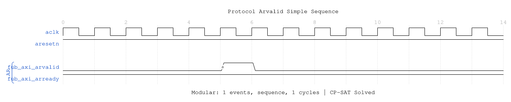

<!-- RTL Design Sherpa Documentation Header -->
<table>
<tr>
<td width="80">
  <a href="https://github.com/sean-galloway/RTLDesignSherpa">
    
  </a>
</td>
<td>
  <strong>RTL Design Sherpa</strong> · <em>Learning Hardware Design Through Practice</em><br>
  <sub>
    <a href="https://github.com/sean-galloway/RTLDesignSherpa">GitHub</a> ·
    <a href="https://github.com/sean-galloway/RTLDesignSherpa/blob/main/docs/DOCUMENTATION_INDEX.md">Documentation Index</a> ·
    <a href="https://github.com/sean-galloway/RTLDesignSherpa/blob/main/LICENSE">MIT License</a>
  </sub>
</td>
</tr>
</table>

---

<!-- End Header -->

# AXI4 Master Read Monitor

**Module:** `axi4_master_rd_mon.sv`
**Location:** `rtl/amba/axi4/`
**Status:** ✅ Production Ready

---

## Overview

The AXI4 Master Read Monitor module combines a functional AXI4 master read interface with comprehensive transaction monitoring and filtering capabilities. This module is essential for verification environments, providing real-time protocol checking, error detection, performance metrics, and configurable packet filtering.

### Key Features

- ✅ **Integrated Monitoring:** Combines `axi4_master_rd` with `axi_monitor_filtered`
- ✅ **3-Level Filtering:** Packet type masks, error routing, individual event masking
- ✅ **Error Detection:** Protocol violations, SLVERR, DECERR, orphan transactions
- ✅ **Timeout Monitoring:** Configurable timeout detection for stuck transactions
- ✅ **Performance Metrics:** Latency tracking, transaction counting, throughput analysis
- ✅ **Monitor Bus Output:** 64-bit standardized packets for system-level monitoring
- ✅ **Configuration Validation:** Detects conflicting configuration settings
- ✅ **Clock Gating Support:** Busy signal for power management

---

## Module Architecture


The module instantiates two sub-modules:
1. **axi4_master_rd** - Core AXI4 functionality with buffering
2. **axi_monitor_filtered** - Transaction monitoring with 3-level filtering

---

## Parameters

### AXI4 Master Parameters

| Parameter | Type | Default | Description |
|-----------|------|---------|-------------|
| `SKID_DEPTH_AR` | int | 2 | AR channel skid buffer depth |
| `SKID_DEPTH_R` | int | 4 | R channel skid buffer depth |
| `AXI_ID_WIDTH` | int | 8 | Transaction ID width |
| `AXI_ADDR_WIDTH` | int | 32 | Address bus width |
| `AXI_DATA_WIDTH` | int | 32 | Data bus width |
| `AXI_USER_WIDTH` | int | 1 | User signal width |

### Monitor Parameters

| Parameter | Type | Default | Description |
|-----------|------|---------|-------------|
| `UNIT_ID` | int | 1 | 4-bit unit identifier in monitor packets |
| `AGENT_ID` | int | 10 | 8-bit agent identifier in monitor packets |
| `MAX_TRANSACTIONS` | int | 16 | Maximum concurrent outstanding transactions |
| `ENABLE_FILTERING` | bit | 1 | Enable packet filtering (0=pass all packets) |
| `ADD_PIPELINE_STAGE` | bit | 0 | Add register stage for timing closure |

---

## Port Groups

### AXI4 Interfaces

**Frontend Interface (fub_axi_*):**
- AR channel inputs: `arid, araddr, arlen, arsize, arburst, arlock, arcache, arprot, arqos, arregion, aruser, arvalid`
- AR channel output: `arready`
- R channel outputs: `rid, rdata, rresp, rlast, ruser, rvalid`
- R channel input: `rready`

**Master Interface (m_axi_*):**
- AR channel outputs: `arid, araddr, arlen, arsize, arburst, arlock, arcache, arprot, arqos, arregion, aruser, arvalid`
- AR channel input: `arready`
- R channel inputs: `rid, rdata, rresp, rlast, ruser, rvalid`
- R channel output: `rready`

### Monitor Configuration

**Basic Configuration:**

| Port | Direction | Width | Description |
|------|-----------|-------|-------------|
| `cfg_monitor_enable` | Input | 1 | Master enable for all monitoring |
| `cfg_error_enable` | Input | 1 | Enable error packet generation |
| `cfg_timeout_enable` | Input | 1 | Enable timeout detection |
| `cfg_perf_enable` | Input | 1 | Enable performance metrics |
| `cfg_timeout_cycles` | Input | 16 | Timeout threshold in clock cycles |
| `cfg_latency_threshold` | Input | 32 | Latency threshold for alerts |

**Filtering Configuration (3 Levels):**

**Level 1 - Packet Type Masks:**

| Port | Direction | Width | Description |
|------|-----------|-------|-------------|
| `cfg_axi_pkt_mask` | Input | 16 | Drop mask for entire packet types |
| `cfg_axi_err_select` | Input | 16 | Error routing select (future use) |

**Level 2 & 3 - Individual Event Masks:**

| Port | Direction | Width | Description |
|------|-----------|-------|-------------|
| `cfg_axi_error_mask` | Input | 16 | Mask specific error events |
| `cfg_axi_timeout_mask` | Input | 16 | Mask specific timeout events |
| `cfg_axi_compl_mask` | Input | 16 | Mask specific completion events |
| `cfg_axi_thresh_mask` | Input | 16 | Mask specific threshold events |
| `cfg_axi_perf_mask` | Input | 16 | Mask specific performance events |
| `cfg_axi_addr_mask` | Input | 16 | Mask specific address match events |
| `cfg_axi_debug_mask` | Input | 16 | Mask specific debug events |

### Monitor Bus Output

| Port | Direction | Width | Description |
|------|-----------|-------|-------------|
| `monbus_valid` | Output | 1 | Monitor packet valid |
| `monbus_ready` | Input | 1 | Downstream ready to accept packet |
| `monbus_packet` | Output | 64 | Monitor packet data (see format below) |

### Status Outputs

| Port | Direction | Width | Description |
|------|-----------|-------|-------------|
| `busy` | Output | 1 | Indicates active transactions (for clock gating) |
| `active_transactions` | Output | 8 | Current number of outstanding transactions |
| `error_count` | Output | 16 | Cumulative error count |
| `transaction_count` | Output | 32 | Total transaction count |
| `cfg_conflict_error` | Output | 1 | Configuration conflict detected |

---

## Monitor Packet Format

The 64-bit `monbus_packet` follows the standardized AMBA monitor bus format:

```
Bits [63:60] - Packet Type:
  0x0 = ERROR      Error events (SLVERR, DECERR, protocol violations)
  0x1 = COMPL      Completion events (transaction finished)
  0x2 = TIMEOUT    Timeout events (transaction stuck)
  0x3 = THRESH     Threshold events (latency exceeded)
  0x4 = PERF       Performance metrics
  0x5 = ADDR       Address match events
  0x6 = DEBUG      Debug events

Bits [59:57] - Protocol: 0x0 (AXI)
Bits [56:53] - Event Code (specific to packet type)
Bits [52:47] - Channel ID
Bits [46:43] - Unit ID (from UNIT_ID parameter)
Bits [42:35] - Agent ID (from AGENT_ID parameter)
Bits [34:0]  - Event Data (address, latency, error info, etc.)
```

---

## Timing Diagrams

The following waveforms show AXI4 master read monitor behavior across various scenarios:

### Scenario 1: Single-Beat Read Transaction

Complete AXI4 read transaction with AR handshake and R response:


**WaveJSON:** [single_beat_read_001.json](../../assets/WAVES/axi4_master_rd_mon/single_beat_read_001.json)

**Key Observations:**
- AR channel handshake (ARVALID/ARREADY)
- R channel response (RVALID/RREADY/RLAST)
- Monitor bus packet generation
- Transaction tracking and completion

### Scenario 2: AR Channel Handshake Detail

Detailed view of address read channel handshake:


**WaveJSON:** [ar_handshake_001.json](../../assets/WAVES/axi4_master_rd_mon/ar_handshake_001.json)

**Key Observations:**
- ARVALID assertion timing
- ARREADY response from slave
- Address and control signal stability
- Handshake protocol compliance

### Scenario 3: R Response Channel Detail

Read data response channel behavior:


**WaveJSON:** [r_response_001.json](../../assets/WAVES/axi4_master_rd_mon/r_response_001.json)

**Key Observations:**
- RVALID/RREADY handshake
- RLAST assertion for transaction completion
- RRESP status (OKAY/SLVERR/DECERR)
- Read data capture

### Scenario 4: Complete AXI4 Read Transaction

End-to-end AXI4 read transaction flow:


**WaveJSON:** [axi4_read_transaction_001.json](../../assets/WAVES/axi4_master_rd_mon/axi4_read_transaction_001.json)

**Key Observations:**
- Complete AR → R channel flow
- Transaction ID tracking
- Burst length and size handling
- Monitor packet correlation

### Scenario 5: Monitor Bus Packet Generation

Monitor bus output packet format and timing:


**WaveJSON:** [monbus_packet_001.json](../../assets/WAVES/axi4_master_rd_mon/monbus_packet_001.json)

**Key Observations:**
- Monitor bus valid/ready handshake
- 64-bit packet format
- Packet type encoding
- Event data payload

### Scenario 6: Simple ARVALID Transaction

Simplified view of ARVALID-based transaction:



**WaveJSON:** [arvalid_simple_001.json](../../assets/WAVES/axi4_master_rd_mon/arvalid_simple_001.json)

**Key Observations:**
- Minimal handshake sequence
- Single-beat read operation
- Fast transaction completion

### Scenario 7: Alternative Single-Beat Read

Variant single-beat read with different timing:


**WaveJSON:** [single_beat_read_002_001.json](../../assets/WAVES/axi4_master_rd_mon/single_beat_read_002_001.json)

**Key Observations:**
- Different backpressure pattern
- Ready signal de-assertion effects
- Transaction latency variation

---

## Configuration Strategies

### Strategy 1: Functional Verification (Recommended)

**Goal:** Catch protocol errors and track completion

```systemverilog
// Enable configuration
.cfg_monitor_enable     (1'b1),
.cfg_error_enable       (1'b1),      // Errors
.cfg_timeout_enable     (1'b1),      // Timeouts
.cfg_perf_enable        (1'b0),      // Disable (reduces traffic)

// Filtering - pass error and timeout, drop others
.cfg_axi_pkt_mask       (16'b1111_1111_0000_0011),  // Pass ERROR, TIMEOUT only
.cfg_axi_err_select     (16'h0000),
.cfg_axi_error_mask     (16'h0000),  // Pass all errors
.cfg_axi_timeout_mask   (16'h0000),  // Pass all timeouts
.cfg_axi_compl_mask     (16'hFFFF),  // Drop completions
.cfg_axi_perf_mask      (16'hFFFF),  // Drop performance
.cfg_axi_debug_mask     (16'hFFFF),  // Drop debug

// Timeouts
.cfg_timeout_cycles     (16'd1000),
.cfg_latency_threshold  (32'd500)
```

### Strategy 2: Performance Analysis

**Goal:** Collect performance metrics, suppress completions

```systemverilog
// Enable configuration
.cfg_monitor_enable     (1'b1),
.cfg_error_enable       (1'b1),      // Still catch errors
.cfg_timeout_enable     (1'b0),      // Disable timeouts
.cfg_perf_enable        (1'b1),      // Enable performance

// Filtering - pass error and performance only
.cfg_axi_pkt_mask       (16'b1111_1110_0000_0001),  // Pass ERROR, PERF only
.cfg_axi_err_select     (16'h0000),
.cfg_axi_error_mask     (16'h0000),  // Pass all errors
.cfg_axi_perf_mask      (16'h0000),  // Pass all performance
.cfg_axi_compl_mask     (16'hFFFF),  // Drop completions
.cfg_axi_timeout_mask   (16'hFFFF),  // Drop timeouts
.cfg_axi_debug_mask     (16'hFFFF),  // Drop debug
```

### Strategy 3: Debug Mode

**Goal:** Maximum visibility, expect low traffic

```systemverilog
// Enable everything
.cfg_monitor_enable     (1'b1),
.cfg_error_enable       (1'b1),
.cfg_timeout_enable     (1'b1),
.cfg_perf_enable        (1'b1),

// Filtering - pass all packets
.cfg_axi_pkt_mask       (16'h0000),  // Pass all packet types
.cfg_axi_err_select     (16'h0000),
.cfg_axi_error_mask     (16'h0000),
.cfg_axi_timeout_mask   (16'h0000),
.cfg_axi_compl_mask     (16'h0000),  // Pass completions
.cfg_axi_thresh_mask    (16'h0000),
.cfg_axi_perf_mask      (16'h0000),
.cfg_axi_addr_mask      (16'h0000),
.cfg_axi_debug_mask     (16'h0000)
```

**⚠️ WARNING:** Never enable all packet types in high-throughput scenarios - monitor bus will saturate!

---

## Usage Example

### Basic Integration

```systemverilog
// Instantiate AXI4 master read monitor
axi4_master_rd_mon #(
    .SKID_DEPTH_AR      (2),
    .SKID_DEPTH_R       (4),
    .AXI_ID_WIDTH       (4),
    .AXI_ADDR_WIDTH     (32),
    .AXI_DATA_WIDTH     (64),
    .AXI_USER_WIDTH     (1),
    .UNIT_ID            (1),
    .AGENT_ID           (10),
    .MAX_TRANSACTIONS   (16),
    .ENABLE_FILTERING   (1)
) u_master_rd_mon (
    .aclk               (axi_aclk),
    .aresetn            (axi_aresetn),

    // Frontend interface
    .fub_axi_arid       (read_arid),
    .fub_axi_araddr     (read_araddr),
    .fub_axi_arlen      (read_arlen),
    .fub_axi_arsize     (read_arsize),
    .fub_axi_arburst    (read_arburst),
    .fub_axi_arlock     (1'b0),
    .fub_axi_arcache    (4'b0010),
    .fub_axi_arprot     (3'b000),
    .fub_axi_arqos      (4'b0000),
    .fub_axi_arregion   (4'b0000),
    .fub_axi_aruser     (1'b0),
    .fub_axi_arvalid    (read_arvalid),
    .fub_axi_arready    (read_arready),

    .fub_axi_rid        (read_rid),
    .fub_axi_rdata      (read_rdata),
    .fub_axi_rresp      (read_rresp),
    .fub_axi_rlast      (read_rlast),
    .fub_axi_ruser      (read_ruser),
    .fub_axi_rvalid     (read_rvalid),
    .fub_axi_rready     (read_rready),

    // Master interface (to interconnect)
    .m_axi_arid         (m_axi_arid),
    .m_axi_araddr       (m_axi_araddr),
    .m_axi_arlen        (m_axi_arlen),
    .m_axi_arsize       (m_axi_arsize),
    .m_axi_arburst      (m_axi_arburst),
    .m_axi_arlock       (m_axi_arlock),
    .m_axi_arcache      (m_axi_arcache),
    .m_axi_arprot       (m_axi_arprot),
    .m_axi_arqos        (m_axi_arqos),
    .m_axi_arregion     (m_axi_arregion),
    .m_axi_aruser       (m_axi_aruser),
    .m_axi_arvalid      (m_axi_arvalid),
    .m_axi_arready      (m_axi_arready),

    .m_axi_rid          (m_axi_rid),
    .m_axi_rdata        (m_axi_rdata),
    .m_axi_rresp        (m_axi_rresp),
    .m_axi_rlast        (m_axi_rlast),
    .m_axi_ruser        (m_axi_ruser),
    .m_axi_rvalid       (m_axi_rvalid),
    .m_axi_rready       (m_axi_rready),

    // Monitor configuration (Strategy 1 - Functional)
    .cfg_monitor_enable     (1'b1),
    .cfg_error_enable       (1'b1),
    .cfg_timeout_enable     (1'b1),
    .cfg_perf_enable        (1'b0),
    .cfg_timeout_cycles     (16'd1000),
    .cfg_latency_threshold  (32'd500),

    .cfg_axi_pkt_mask       (16'b1111_1111_0000_0011),
    .cfg_axi_err_select     (16'h0000),
    .cfg_axi_error_mask     (16'h0000),
    .cfg_axi_timeout_mask   (16'h0000),
    .cfg_axi_compl_mask     (16'hFFFF),
    .cfg_axi_thresh_mask    (16'hFFFF),
    .cfg_axi_perf_mask      (16'hFFFF),
    .cfg_axi_addr_mask      (16'hFFFF),
    .cfg_axi_debug_mask     (16'hFFFF),

    // Monitor bus output
    .monbus_valid           (mon_valid),
    .monbus_ready           (mon_ready),
    .monbus_packet          (mon_packet),

    // Status
    .busy                   (rd_busy),
    .active_transactions    (rd_active),
    .error_count            (rd_errors),
    .transaction_count      (rd_count),
    .cfg_conflict_error     (cfg_conflict)
);

// Downstream FIFO for monitor packets
gaxi_fifo_sync #(
    .DATA_WIDTH(64),
    .DEPTH(256)
) u_mon_fifo (
    .i_clk      (axi_aclk),
    .i_rst_n    (axi_aresetn),
    .i_valid    (mon_valid),
    .i_data     (mon_packet),
    .o_ready    (mon_ready),
    .o_valid    (fifo_valid),
    .o_data     (fifo_data),
    .i_ready    (consumer_ready)
);
```

---

## Design Notes

### Filtering Hierarchy

The 3-level filtering provides flexible packet control:

1. **Level 1 (cfg_axi_pkt_mask):** Coarse filtering by packet type
   - Bit per packet type (ERROR, TIMEOUT, COMPL, etc.)
   - 1 = drop, 0 = pass to next level

2. **Level 2 (cfg_axi_err_select):** Future error routing
   - Reserved for directing errors to alternate paths

3. **Level 3 (cfg_axi_*_mask):** Fine-grained event filtering
   - Individual event masks within each packet type
   - Allows selecting specific events while dropping others

### Configuration Conflicts

The module detects conflicting configurations:
- Monitoring disabled but packet types enabled
- Timeout enabled with zero timeout_cycles
- Filter masks incompatible with enable signals

When detected, `cfg_conflict_error` asserts.

### Performance Considerations

**Monitor Bus Bandwidth:**
- Each transaction can generate multiple packets
- Completion packets: 1 per transaction
- Performance packets: 1 per transaction
- Error packets: Variable (0-N per transaction)

**Recommended Packet Budget:**
- Functional mode: 2-3 packets per transaction (ERROR + TIMEOUT)
- Performance mode: 2 packets per transaction (ERROR + PERF)
- Debug mode: 5-10 packets per transaction (all types)

### Transaction Table

Monitors up to `MAX_TRANSACTIONS` concurrent transactions:
- Tracks ARID, address, latency, status
- Generates packets on completion, timeout, or error
- Proper cleanup via event_reported feedback (fixed in v1.1)

---

## Related Modules

### Companion Monitors
- **axi4_master_wr_mon** - AXI4 master write with monitoring
- **axi4_slave_rd_mon** - AXI4 slave read with monitoring
- **axi4_slave_wr_mon** - AXI4 slave write with monitoring

### Base Modules
- **[axi4_master_rd](axi4_master_rd.md)** - Functional AXI4 master read (without monitoring)
- **axi_monitor_filtered** - Monitoring engine with filtering (shared/)

### Used Components
- **[gaxi_skid_buffer](../gaxi/gaxi_skid_buffer.md)** - Elastic buffering
- **axi_monitor_base** - Core monitoring logic (shared/)
- **axi_monitor_trans_mgr** - Transaction tracking (shared/)

---

## References

### Specifications
- ARM IHI 0022E: AMBA AXI Protocol Specification (AXI4)
- Monitor Bus Packet Format: [monitor_package_spec.md](../includes/monitor_package_spec.md)

### Source Code
- RTL: `rtl/amba/axi4/axi4_master_rd_mon.sv`
- Tests: `val/amba/test_axi4_master_rd_mon.py`
- Framework: `bin/CocoTBFramework/components/axi4/`

### Documentation
- Configuration Guide: [AXI Monitor Base](../shared/axi_monitor_base.md)
- Architecture: [RTLAmba Overview](../overview.md)
- AXI4 Index: [axi4/README.md](README.md)

---

**Last Updated:** 2025-10-20

---

## Navigation

- **[← Back to AXI4 Index](README.md)**
- **[← Back to RTLAmba Index](../index.md)**
- **[← Back to Main Documentation Index](../../index.md)**
