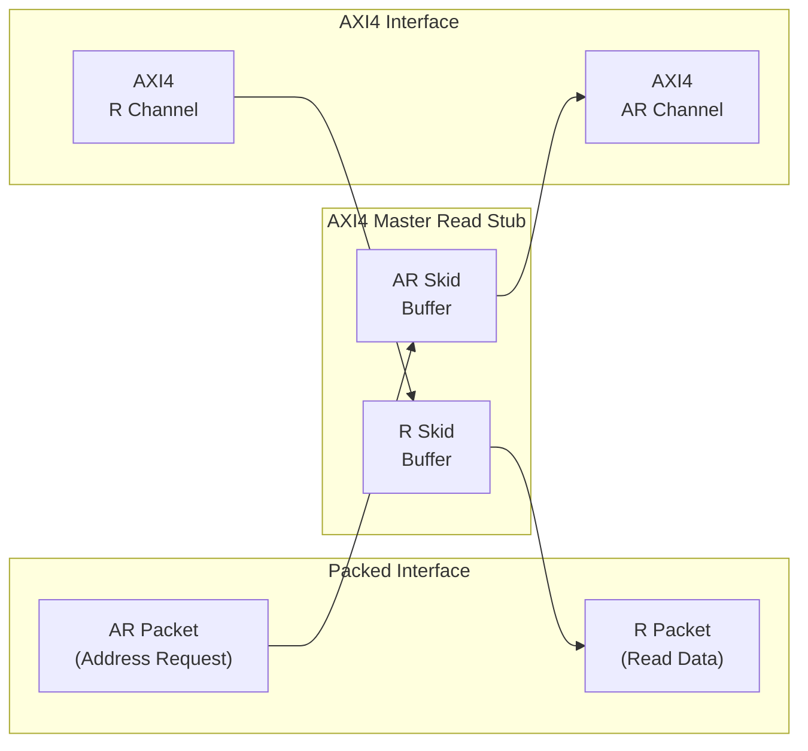
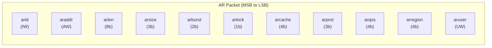
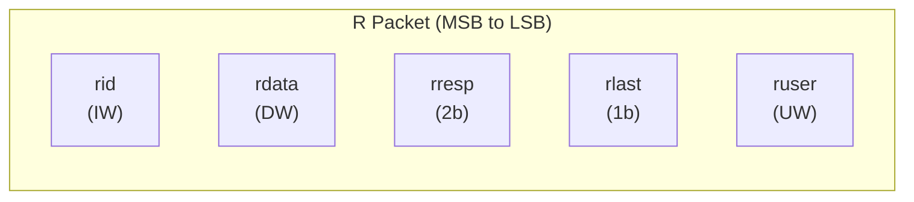
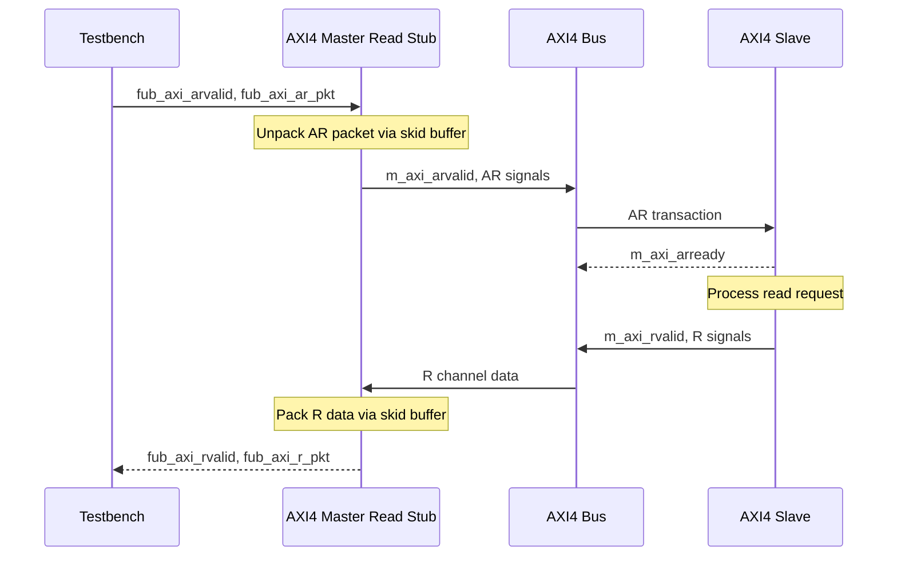

<!-- RTL Design Sherpa Documentation Header -->
<table>
<tr>
<td width="80">
  <a href="https://github.com/sean-galloway/RTLDesignSherpa">
    
  </a>
</td>
<td>
  <strong>RTL Design Sherpa</strong> · <em>Learning Hardware Design Through Practice</em><br>
  <sub>
    <a href="https://github.com/sean-galloway/RTLDesignSherpa">GitHub</a> ·
    <a href="https://github.com/sean-galloway/RTLDesignSherpa/blob/main/docs/DOCUMENTATION_INDEX.md">Documentation Index</a> ·
    <a href="https://github.com/sean-galloway/RTLDesignSherpa/blob/main/LICENSE">MIT License</a>
  </sub>
</td>
</tr>
</table>

---

<!-- End Header -->

# AXI4 Master Read Stub

**Module:** `axi4_master_rd_stub.sv`
**Location:** `rtl/amba/axi4/stubs/`
**Status:** Production Ready

---

## Overview

The AXI4 Master Read Stub provides a simplified packed-data interface for driving AXI4 read transactions. It uses skid buffers to pack/unpack AXI4 AR (read address) and R (read data) channels into simple packet interfaces, making it ideal for testbenches and integration scenarios where a simplified interface is preferred.

### Key Features

- Packed packet interface for AR and R channels
- Configurable skid buffer depths for each channel
- Full AXI4 read transaction support
- Burst, ID, user signal support
- Parameterized data widths

---

## Module Architecture



---

## Parameters

| Parameter | Type | Default | Description |
|-----------|------|---------|-------------|
| SKID_DEPTH_AR | int | 2 | AR channel skid buffer depth (log2) |
| SKID_DEPTH_R | int | 4 | R channel skid buffer depth (log2) |
| AXI_ID_WIDTH | int | 8 | AXI transaction ID width |
| AXI_ADDR_WIDTH | int | 32 | AXI address bus width |
| AXI_DATA_WIDTH | int | 32 | AXI data bus width |
| AXI_USER_WIDTH | int | 1 | AXI user signal width |
| AXI_WSTRB_WIDTH | int | AXI_DATA_WIDTH/8 | Write strobe width (unused) |
| AW | int | AXI_ADDR_WIDTH | Short alias for address width |
| DW | int | AXI_DATA_WIDTH | Short alias for data width |
| IW | int | AXI_ID_WIDTH | Short alias for ID width |
| SW | int | AXI_WSTRB_WIDTH | Short alias for strobe width |
| UW | int | AXI_USER_WIDTH | Short alias for user width |
| ARSize | int | IW+AW+8+3+2+1+4+3+4+4+UW | AR packet size (calculated) |
| RSize | int | IW+DW+2+1+UW | R packet size (calculated) |

---

## Ports

### Clock and Reset

| Port | Width | Direction | Description |
|------|-------|-----------|-------------|
| aclk | 1 | Input | AXI clock |
| aresetn | 1 | Input | AXI reset (active low) |

### AXI4 Read Address Channel (AR)

| Port | Width | Direction | Description |
|------|-------|-----------|-------------|
| m_axi_arid | AXI_ID_WIDTH | Output | Read address ID |
| m_axi_araddr | AXI_ADDR_WIDTH | Output | Read address |
| m_axi_arlen | 8 | Output | Burst length |
| m_axi_arsize | 3 | Output | Burst size |
| m_axi_arburst | 2 | Output | Burst type |
| m_axi_arlock | 1 | Output | Lock type |
| m_axi_arcache | 4 | Output | Cache type |
| m_axi_arprot | 3 | Output | Protection type |
| m_axi_arqos | 4 | Output | Quality of service |
| m_axi_arregion | 4 | Output | Region identifier |
| m_axi_aruser | AXI_USER_WIDTH | Output | User signal |
| m_axi_arvalid | 1 | Output | Read address valid |
| m_axi_arready | 1 | Input | Read address ready |

### AXI4 Read Data Channel (R)

| Port | Width | Direction | Description |
|------|-------|-----------|-------------|
| m_axi_rid | AXI_ID_WIDTH | Input | Read data ID |
| m_axi_rdata | AXI_DATA_WIDTH | Input | Read data |
| m_axi_rresp | 2 | Input | Read response |
| m_axi_rlast | 1 | Input | Read last |
| m_axi_ruser | AXI_USER_WIDTH | Input | User signal |
| m_axi_rvalid | 1 | Input | Read data valid |
| m_axi_rready | 1 | Output | Read data ready |

### AR Packet Interface

| Port | Width | Direction | Description |
|------|-------|-----------|-------------|
| fub_axi_arvalid | 1 | Input | AR packet valid |
| fub_axi_arready | 1 | Output | Ready to accept AR packet |
| fub_axi_ar_count | 3 | Output | AR buffer occupancy |
| fub_axi_ar_pkt | ARSize | Input | Packed AR packet data |

### R Packet Interface

| Port | Width | Direction | Description |
|------|-------|-----------|-------------|
| fub_axi_rvalid | 1 | Output | R packet valid |
| fub_axi_rready | 1 | Input | Ready to accept R packet |
| fub_axi_r_pkt | RSize | Output | Packed R packet data |

---

## Packet Formats

### AR Packet Structure (Read Address)



**Bit Positions:**
```
fub_axi_ar_pkt = {arid, araddr, arlen, arsize, arburst, arlock, arcache, arprot, arqos, arregion, aruser}

Width = IW + AW + 8 + 3 + 2 + 1 + 4 + 3 + 4 + 4 + UW
```

### R Packet Structure (Read Data)



**Bit Positions:**
```
fub_axi_r_pkt = {rid, rdata, rresp, rlast, ruser}

Width = IW + DW + 2 + 1 + UW
```

---

## Transaction Flow

### Read Transaction



### Timing

<!-- TODO: Add wavedrom timing diagram for stub transactions -->
```
TODO: Wavedrom timing diagram showing:
- aclk
- fub_axi_arvalid, fub_axi_arready, fub_axi_ar_pkt
- AXI AR signals (m_axi_arvalid, m_axi_araddr, m_axi_arlen, etc.)
- AXI R signals (m_axi_rvalid, m_axi_rdata, m_axi_rlast, etc.)
- fub_axi_rvalid, fub_axi_rready, fub_axi_r_pkt
- Packet-to-AXI timing relationship with skid buffer operation
```

---

## Usage Example

```systemverilog
axi4_master_rd_stub #(
    .SKID_DEPTH_AR   (2),
    .SKID_DEPTH_R    (4),
    .AXI_ID_WIDTH    (8),
    .AXI_ADDR_WIDTH  (32),
    .AXI_DATA_WIDTH  (64),
    .AXI_USER_WIDTH  (4)
) u_axi4_master_rd_stub (
    .aclk            (axi_clk),
    .aresetn         (axi_rst_n),

    // AXI4 master read interface
    .m_axi_arid      (m_axi_arid),
    .m_axi_araddr    (m_axi_araddr),
    .m_axi_arlen     (m_axi_arlen),
    .m_axi_arsize    (m_axi_arsize),
    .m_axi_arburst   (m_axi_arburst),
    .m_axi_arlock    (m_axi_arlock),
    .m_axi_arcache   (m_axi_arcache),
    .m_axi_arprot    (m_axi_arprot),
    .m_axi_arqos     (m_axi_arqos),
    .m_axi_arregion  (m_axi_arregion),
    .m_axi_aruser    (m_axi_aruser),
    .m_axi_arvalid   (m_axi_arvalid),
    .m_axi_arready   (m_axi_arready),

    .m_axi_rid       (m_axi_rid),
    .m_axi_rdata     (m_axi_rdata),
    .m_axi_rresp     (m_axi_rresp),
    .m_axi_rlast     (m_axi_rlast),
    .m_axi_ruser     (m_axi_ruser),
    .m_axi_rvalid    (m_axi_rvalid),
    .m_axi_rready    (m_axi_rready),

    // Packed AR interface
    .fub_axi_arvalid (tb_ar_valid),
    .fub_axi_arready (tb_ar_ready),
    .fub_axi_ar_count(tb_ar_count),
    .fub_axi_ar_pkt  (tb_ar_pkt),

    // Packed R interface
    .fub_axi_rvalid  (tb_r_valid),
    .fub_axi_rready  (tb_r_ready),
    .fub_axi_r_pkt   (tb_r_pkt)
);

// Build AR packet (single beat read at address 0x1000)
localparam ARSize = 8 + 32 + 8 + 3 + 2 + 1 + 4 + 3 + 4 + 4 + 4;  // Calculate size
assign tb_ar_pkt = {
    8'd0,           // arid
    32'h0000_1000,  // araddr
    8'd0,           // arlen (1 beat)
    3'b011,         // arsize (8 bytes)
    2'b01,          // arburst (INCR)
    1'b0,           // arlock
    4'b0011,        // arcache
    3'b000,         // arprot
    4'b0000,        // arqos
    4'b0000,        // arregion
    4'h0            // aruser
};

// Parse R packet
wire [7:0]  r_id   = tb_r_pkt[RSize-1:RSize-8];
wire [63:0] r_data = tb_r_pkt[RSize-9:RSize-72];
wire [1:0]  r_resp = tb_r_pkt[6:5];
wire        r_last = tb_r_pkt[4];
wire [3:0]  r_user = tb_r_pkt[3:0];
```

---

## Design Notes

### Skid Buffer Operation

The stub uses `gaxi_skid_buffer` modules to:
- Decouple timing between testbench and AXI bus
- Provide configurable buffering depth per channel
- Handle backpressure gracefully
- Support burst transactions without stalling

**Recommended Depths:**
- **AR Channel:** 2-4 (address transactions)
- **R Channel:** 4-8 (data beats for bursts)

### Packet Packing Order

AR and R packets are packed MSB-to-LSB following AXI signal order:
- Simplifies testbench packet creation
- Matches common concatenation order
- Efficient for burst transaction handling

### Internal Architecture

The stub instantiates two `gaxi_skid_buffer` modules:
- **AR Skid Buffer:** Unpacks AR packets to AXI AR channel
- **R Skid Buffer:** Packs AXI R channel to R packets

All AXI protocol handling is done by the skid buffers and downstream modules.

---

## Related Documentation

- **[AXI4 Master Read](axi4_master_rd.md)** - Full AXI4 master read module (if wrapping one)
- **[AXI4 Master Write Stub](axi4_master_wr_stub.md)** - Corresponding write stub
- **[AXI4 Master Stub](axi4_master_stub.md)** - Combined read/write stub
- **[AXI4 Slave Read Stub](axi4_slave_rd_stub.md)** - Slave-side read stub

---

## Navigation

- **[<- Back to AXI4 Index](README.md)**
- **[<- Back to RTLAmba Index](../index.md)**
- **[<- Back to Main Documentation Index](../../index.md)**
