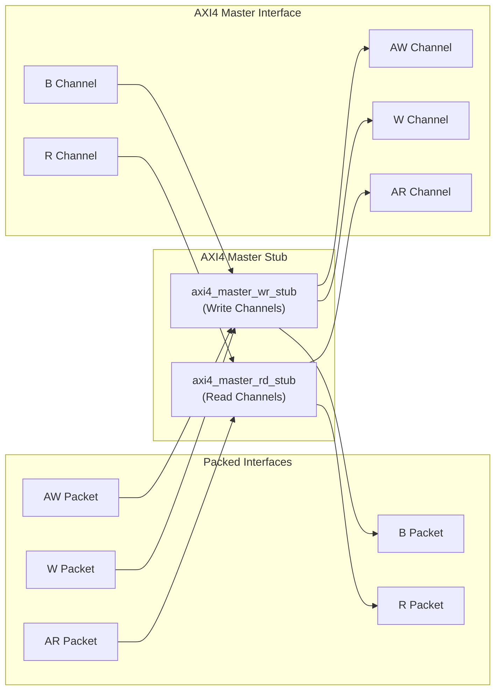
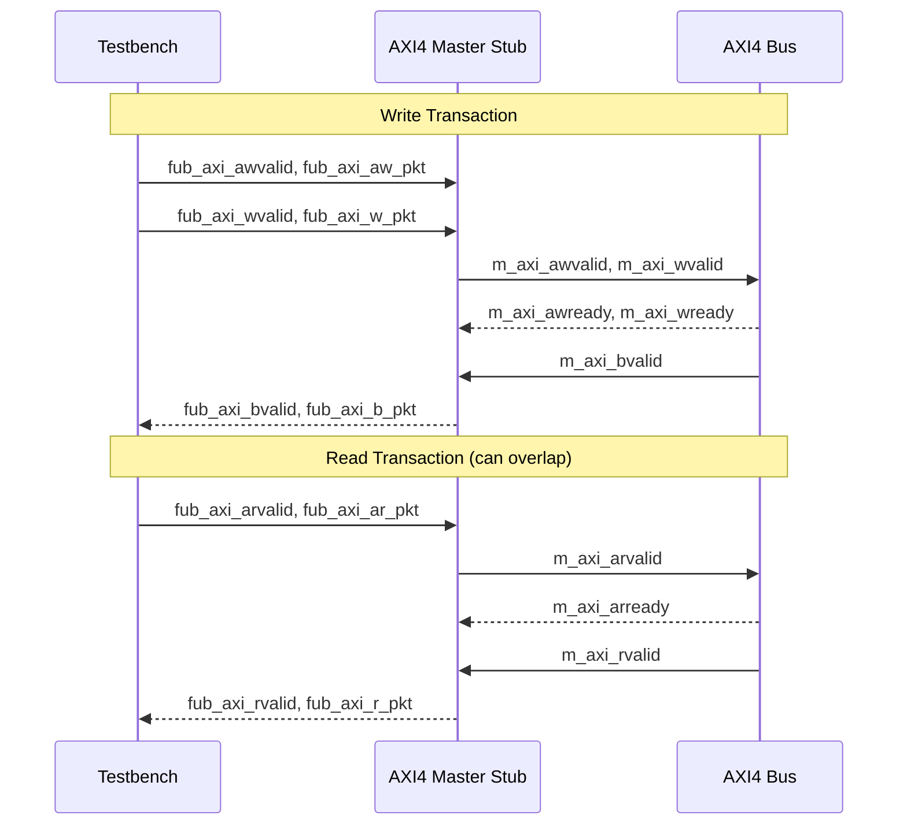

<!-- RTL Design Sherpa Documentation Header -->
<table>
<tr>
<td width="80">
  <a href="https://github.com/sean-galloway/RTLDesignSherpa">
    
  </a>
</td>
<td>
  <strong>RTL Design Sherpa</strong> · <em>Learning Hardware Design Through Practice</em><br>
  <sub>
    <a href="https://github.com/sean-galloway/RTLDesignSherpa">GitHub</a> ·
    <a href="https://github.com/sean-galloway/RTLDesignSherpa/blob/main/docs/DOCUMENTATION_INDEX.md">Documentation Index</a> ·
    <a href="https://github.com/sean-galloway/RTLDesignSherpa/blob/main/LICENSE">MIT License</a>
  </sub>
</td>
</tr>
</table>

---

<!-- End Header -->

# AXI4 Master Stub

**Module:** `axi4_master_stub.sv`
**Location:** `rtl/amba/axi4/stubs/`
**Status:** Production Ready

---

## Overview

The AXI4 Master Stub provides a simplified packed-data interface for driving both AXI4 read and write transactions. It combines the read and write stub functionalities into a single module, internally instantiating `axi4_master_rd_stub` and `axi4_master_wr_stub`. This provides a complete AXI4 master interface with simplified packet-based control, ideal for testbenches and integration scenarios.

### Key Features

- Combined read and write channel support
- Packed packet interfaces for all channels (AW, W, B, AR, R)
- Configurable skid buffer depths per channel
- Full AXI4 protocol support (bursts, IDs, user signals)
- Simplified testbench integration
- Parameterized data widths

---

## Module Architecture



---

## Parameters

| Parameter | Type | Default | Description |
|-----------|------|---------|-------------|
| SKID_DEPTH_AW | int | 2 | AW channel skid buffer depth (log2) |
| SKID_DEPTH_W | int | 4 | W channel skid buffer depth (log2) |
| SKID_DEPTH_B | int | 2 | B channel skid buffer depth (log2) |
| SKID_DEPTH_AR | int | 2 | AR channel skid buffer depth (log2) |
| SKID_DEPTH_R | int | 4 | R channel skid buffer depth (log2) |
| AXI_ID_WIDTH | int | 8 | AXI transaction ID width |
| AXI_ADDR_WIDTH | int | 32 | AXI address bus width |
| AXI_DATA_WIDTH | int | 32 | AXI data bus width |
| AXI_USER_WIDTH | int | 1 | AXI user signal width |
| AXI_WSTRB_WIDTH | int | AXI_DATA_WIDTH/8 | Write strobe width |
| AW | int | AXI_ADDR_WIDTH | Short alias for address width |
| DW | int | AXI_DATA_WIDTH | Short alias for data width |
| IW | int | AXI_ID_WIDTH | Short alias for ID width |
| SW | int | AXI_WSTRB_WIDTH | Short alias for strobe width |
| UW | int | AXI_USER_WIDTH | Short alias for user width |
| AWSize | int | IW+AW+8+3+2+1+4+3+4+4+UW | AW packet size (calculated) |
| WSize | int | DW+SW+1+UW | W packet size (calculated) |
| BSize | int | IW+2+UW | B packet size (calculated) |
| ARSize | int | IW+AW+8+3+2+1+4+3+4+4+UW | AR packet size (calculated) |
| RSize | int | IW+DW+2+1+UW | R packet size (calculated) |

---

## Ports

### Clock and Reset

| Port | Width | Direction | Description |
|------|-------|-----------|-------------|
| aclk | 1 | Input | AXI clock |
| aresetn | 1 | Input | AXI reset (active low) |

### AXI4 Write Channels

| Port | Width | Direction | Description |
|------|-------|-----------|-------------|
| m_axi_awid | AXI_ID_WIDTH | Output | Write address ID |
| m_axi_awaddr | AXI_ADDR_WIDTH | Output | Write address |
| m_axi_awlen | 8 | Output | Burst length |
| m_axi_awsize | 3 | Output | Burst size |
| m_axi_awburst | 2 | Output | Burst type |
| m_axi_awlock | 1 | Output | Lock type |
| m_axi_awcache | 4 | Output | Cache type |
| m_axi_awprot | 3 | Output | Protection type |
| m_axi_awqos | 4 | Output | Quality of service |
| m_axi_awregion | 4 | Output | Region identifier |
| m_axi_awuser | AXI_USER_WIDTH | Output | User signal |
| m_axi_awvalid | 1 | Output | Write address valid |
| m_axi_awready | 1 | Input | Write address ready |
| m_axi_wdata | AXI_DATA_WIDTH | Output | Write data |
| m_axi_wstrb | AXI_WSTRB_WIDTH | Output | Write strobes |
| m_axi_wlast | 1 | Output | Write last |
| m_axi_wuser | AXI_USER_WIDTH | Output | User signal |
| m_axi_wvalid | 1 | Output | Write data valid |
| m_axi_wready | 1 | Input | Write data ready |
| m_axi_bid | AXI_ID_WIDTH | Input | Response ID |
| m_axi_bresp | 2 | Input | Write response |
| m_axi_buser | AXI_USER_WIDTH | Input | User signal |
| m_axi_bvalid | 1 | Input | Write response valid |
| m_axi_bready | 1 | Output | Write response ready |

### AXI4 Read Channels

| Port | Width | Direction | Description |
|------|-------|-----------|-------------|
| m_axi_arid | AXI_ID_WIDTH | Output | Read address ID |
| m_axi_araddr | AXI_ADDR_WIDTH | Output | Read address |
| m_axi_arlen | 8 | Output | Burst length |
| m_axi_arsize | 3 | Output | Burst size |
| m_axi_arburst | 2 | Output | Burst type |
| m_axi_arlock | 1 | Output | Lock type |
| m_axi_arcache | 4 | Output | Cache type |
| m_axi_arprot | 3 | Output | Protection type |
| m_axi_arqos | 4 | Output | Quality of service |
| m_axi_arregion | 4 | Output | Region identifier |
| m_axi_aruser | AXI_USER_WIDTH | Output | User signal |
| m_axi_arvalid | 1 | Output | Read address valid |
| m_axi_arready | 1 | Input | Read address ready |
| m_axi_rid | AXI_ID_WIDTH | Input | Read data ID |
| m_axi_rdata | AXI_DATA_WIDTH | Input | Read data |
| m_axi_rresp | 2 | Input | Read response |
| m_axi_rlast | 1 | Input | Read last |
| m_axi_ruser | AXI_USER_WIDTH | Input | User signal |
| m_axi_rvalid | 1 | Input | Read data valid |
| m_axi_rready | 1 | Output | Read data ready |

### Write Packet Interfaces

| Port | Width | Direction | Description |
|------|-------|-----------|-------------|
| fub_axi_awvalid | 1 | Input | AW packet valid |
| fub_axi_awready | 1 | Output | Ready to accept AW packet |
| fub_axi_aw_count | 4 | Output | AW buffer occupancy |
| fub_axi_aw_pkt | AWSize | Input | Packed AW packet data |
| fub_axi_wvalid | 1 | Input | W packet valid |
| fub_axi_wready | 1 | Output | Ready to accept W packet |
| fub_axi_w_pkt | WSize | Input | Packed W packet data |
| fub_axi_bvalid | 1 | Output | B packet valid |
| fub_axi_bready | 1 | Input | Ready to accept B packet |
| fub_axi_b_pkt | BSize | Output | Packed B packet data |

### Read Packet Interfaces

| Port | Width | Direction | Description |
|------|-------|-----------|-------------|
| fub_axi_arvalid | 1 | Input | AR packet valid |
| fub_axi_arready | 1 | Output | Ready to accept AR packet |
| fub_axi_ar_count | 3 | Output | AR buffer occupancy |
| fub_axi_ar_pkt | ARSize | Input | Packed AR packet data |
| fub_axi_rvalid | 1 | Output | R packet valid |
| fub_axi_rready | 1 | Input | Ready to accept R packet |
| fub_axi_r_pkt | RSize | Output | Packed R packet data |

---

## Packet Formats

### Write Channel Packets

**AW Packet (Write Address):**
```
fub_axi_aw_pkt = {awid, awaddr, awlen, awsize, awburst, awlock, awcache, awprot, awqos, awregion, awuser}
Width = IW + AW + 8 + 3 + 2 + 1 + 4 + 3 + 4 + 4 + UW
```

**W Packet (Write Data):**
```
fub_axi_w_pkt = {wdata, wstrb, wlast, wuser}
Width = DW + SW + 1 + UW
```

**B Packet (Write Response):**
```
fub_axi_b_pkt = {bid, bresp, buser}
Width = IW + 2 + UW
```

### Read Channel Packets

**AR Packet (Read Address):**
```
fub_axi_ar_pkt = {arid, araddr, arlen, arsize, arburst, arlock, arcache, arprot, arqos, arregion, aruser}
Width = IW + AW + 8 + 3 + 2 + 1 + 4 + 3 + 4 + 4 + UW
```

**R Packet (Read Data):**
```
fub_axi_r_pkt = {rid, rdata, rresp, rlast, ruser}
Width = IW + DW + 2 + 1 + UW
```

**Complete packet format details:** See [AXI4 Master Write Stub](axi4_master_wr_stub.md) and [AXI4 Master Read Stub](axi4_master_rd_stub.md)

---

## Transaction Flow

### Combined Read and Write Operations



### Timing

<!-- TODO: Add wavedrom timing diagram for combined stub -->
```
TODO: Wavedrom timing diagram showing:
- aclk
- Write packet interfaces (fub_axi_aw*, fub_axi_w*, fub_axi_b*)
- Read packet interfaces (fub_axi_ar*, fub_axi_r*)
- AXI write channels (m_axi_aw*, m_axi_w*, m_axi_b*)
- AXI read channels (m_axi_ar*, m_axi_r*)
- Overlapping read/write operations
```

---

## Usage Example

```systemverilog
axi4_master_stub #(
    .SKID_DEPTH_AW   (2),
    .SKID_DEPTH_W    (4),
    .SKID_DEPTH_B    (2),
    .SKID_DEPTH_AR   (2),
    .SKID_DEPTH_R    (4),
    .AXI_ID_WIDTH    (8),
    .AXI_ADDR_WIDTH  (32),
    .AXI_DATA_WIDTH  (64),
    .AXI_USER_WIDTH  (4)
) u_axi4_master_stub (
    .aclk            (axi_clk),
    .aresetn         (axi_rst_n),

    // AXI4 master interface (all channels)
    .m_axi_awid      (m_axi_awid),
    .m_axi_awaddr    (m_axi_awaddr),
    .m_axi_awlen     (m_axi_awlen),
    .m_axi_awsize    (m_axi_awsize),
    .m_axi_awburst   (m_axi_awburst),
    .m_axi_awlock    (m_axi_awlock),
    .m_axi_awcache   (m_axi_awcache),
    .m_axi_awprot    (m_axi_awprot),
    .m_axi_awqos     (m_axi_awqos),
    .m_axi_awregion  (m_axi_awregion),
    .m_axi_awuser    (m_axi_awuser),
    .m_axi_awvalid   (m_axi_awvalid),
    .m_axi_awready   (m_axi_awready),

    .m_axi_wdata     (m_axi_wdata),
    .m_axi_wstrb     (m_axi_wstrb),
    .m_axi_wlast     (m_axi_wlast),
    .m_axi_wuser     (m_axi_wuser),
    .m_axi_wvalid    (m_axi_wvalid),
    .m_axi_wready    (m_axi_wready),

    .m_axi_bid       (m_axi_bid),
    .m_axi_bresp     (m_axi_bresp),
    .m_axi_buser     (m_axi_buser),
    .m_axi_bvalid    (m_axi_bvalid),
    .m_axi_bready    (m_axi_bready),

    .m_axi_arid      (m_axi_arid),
    .m_axi_araddr    (m_axi_araddr),
    .m_axi_arlen     (m_axi_arlen),
    .m_axi_arsize    (m_axi_arsize),
    .m_axi_arburst   (m_axi_arburst),
    .m_axi_arlock    (m_axi_arlock),
    .m_axi_arcache   (m_axi_arcache),
    .m_axi_arprot    (m_axi_arprot),
    .m_axi_arqos     (m_axi_arqos),
    .m_axi_arregion  (m_axi_arregion),
    .m_axi_aruser    (m_axi_aruser),
    .m_axi_arvalid   (m_axi_arvalid),
    .m_axi_arready   (m_axi_arready),

    .m_axi_rid       (m_axi_rid),
    .m_axi_rdata     (m_axi_rdata),
    .m_axi_rresp     (m_axi_rresp),
    .m_axi_rlast     (m_axi_rlast),
    .m_axi_ruser     (m_axi_ruser),
    .m_axi_rvalid    (m_axi_rvalid),
    .m_axi_rready    (m_axi_rready),

    // Write packet interfaces
    .fub_axi_awvalid (tb_aw_valid),
    .fub_axi_awready (tb_aw_ready),
    .fub_axi_aw_count(tb_aw_count),
    .fub_axi_aw_pkt  (tb_aw_pkt),

    .fub_axi_wvalid  (tb_w_valid),
    .fub_axi_wready  (tb_w_ready),
    .fub_axi_w_pkt   (tb_w_pkt),

    .fub_axi_bvalid  (tb_b_valid),
    .fub_axi_bready  (tb_b_ready),
    .fub_axi_b_pkt   (tb_b_pkt),

    // Read packet interfaces
    .fub_axi_arvalid (tb_ar_valid),
    .fub_axi_arready (tb_ar_ready),
    .fub_axi_ar_count(tb_ar_count),
    .fub_axi_ar_pkt  (tb_ar_pkt),

    .fub_axi_rvalid  (tb_r_valid),
    .fub_axi_rready  (tb_r_ready),
    .fub_axi_r_pkt   (tb_r_pkt)
);

// Example: Build write transaction packets
assign tb_aw_pkt = {
    8'd1,           // awid
    32'h1000_0000,  // awaddr
    8'd0,           // awlen (1 beat)
    3'b011,         // awsize (8 bytes)
    2'b01,          // awburst (INCR)
    1'b0,           // awlock
    4'b0011,        // awcache
    3'b000,         // awprot
    4'b0000,        // awqos
    4'b0000,        // awregion
    4'h0            // awuser
};

assign tb_w_pkt = {
    64'hDEAD_BEEF_CAFE_BABE,  // wdata
    8'hFF,                     // wstrb
    1'b1,                      // wlast
    4'h0                       // wuser
};

// Example: Build read transaction packet
assign tb_ar_pkt = {
    8'd2,           // arid
    32'h2000_0000,  // araddr
    8'd3,           // arlen (4 beats)
    3'b011,         // arsize (8 bytes)
    2'b01,          // arburst (INCR)
    1'b0,           // arlock
    4'b0011,        // arcache
    3'b000,         // arprot
    4'b0000,        // arqos
    4'b0000,        // arregion
    4'h0            // aruser
};

// Parse responses
wire [7:0] b_id   = tb_b_pkt[BSize-1:BSize-8];
wire [1:0] b_resp = tb_b_pkt[5:4];

wire [7:0]  r_id   = tb_r_pkt[RSize-1:RSize-8];
wire [63:0] r_data = tb_r_pkt[RSize-9:RSize-72];
wire [1:0]  r_resp = tb_r_pkt[6:5];
wire        r_last = tb_r_pkt[4];
```

---

## Design Notes

### Internal Architecture

The stub instantiates two sub-modules:
- **`axi4_master_wr_stub`** - Handles AW, W, and B channels
- **`axi4_master_rd_stub`** - Handles AR and R channels

This hierarchical design:
- Reuses proven read/write stub modules
- Maintains clear channel separation
- Simplifies verification and testing
- Allows independent read/write operation

### Read/Write Independence

Read and write channels are completely independent:
- Can overlap in time (simultaneous read and write)
- Each has independent skid buffers
- No ordering constraints between reads and writes
- Testbench can drive at different rates

### Skid Buffer Depths

**Recommended configurations:**

**Low latency (fast memory):**
```systemverilog
.SKID_DEPTH_AW(2), .SKID_DEPTH_W(2), .SKID_DEPTH_B(2),
.SKID_DEPTH_AR(2), .SKID_DEPTH_R(2)
```

**Typical system:**
```systemverilog
.SKID_DEPTH_AW(2), .SKID_DEPTH_W(4), .SKID_DEPTH_B(2),
.SKID_DEPTH_AR(2), .SKID_DEPTH_R(4)
```

**High throughput bursts:**
```systemverilog
.SKID_DEPTH_AW(4), .SKID_DEPTH_W(8), .SKID_DEPTH_B(4),
.SKID_DEPTH_AR(4), .SKID_DEPTH_R(8)
```

---

## Related Documentation

- **[AXI4 Master Read Stub](axi4_master_rd_stub.md)** - Read-only stub (instantiated internally)
- **[AXI4 Master Write Stub](axi4_master_wr_stub.md)** - Write-only stub (instantiated internally)
- **[AXI4 Slave Stub](axi4_slave_stub.md)** - Corresponding combined slave stub
- **[AXI4 Master Read](axi4_master_rd.md)** - Full AXI4 master read module
- **[AXI4 Master Write](axi4_master_wr.md)** - Full AXI4 master write module

---

## Navigation

- **[<- Back to AXI4 Index](README.md)**
- **[<- Back to RTLAmba Index](../index.md)**
- **[<- Back to Main Documentation Index](../../index.md)**
