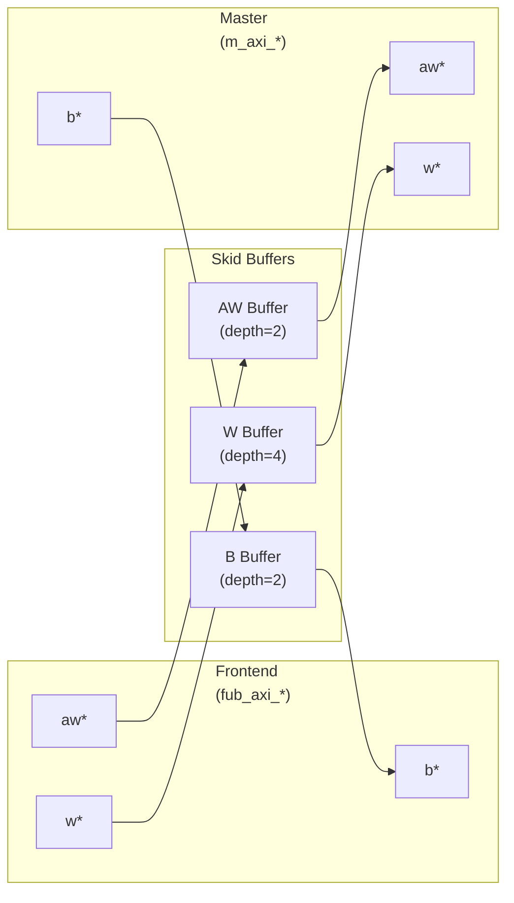

<!-- RTL Design Sherpa Documentation Header -->
<table>
<tr>
<td width="80">
  <a href="https://github.com/sean-galloway/RTLDesignSherpa">
    
  </a>
</td>
<td>
  <strong>RTL Design Sherpa</strong> · <em>Learning Hardware Design Through Practice</em><br>
  <sub>
    <a href="https://github.com/sean-galloway/RTLDesignSherpa">GitHub</a> ·
    <a href="https://github.com/sean-galloway/RTLDesignSherpa/blob/main/docs/DOCUMENTATION_INDEX.md">Documentation Index</a> ·
    <a href="https://github.com/sean-galloway/RTLDesignSherpa/blob/main/LICENSE">MIT License</a>
  </sub>
</td>
</tr>
</table>

---

<!-- End Header -->

# AXI4 Master Write

**Module:** `axi4_master_wr.sv`
**Location:** `rtl/amba/axi4/`
**Status:** ✅ Production Ready

---

## Overview

The AXI4 Master Write module provides a buffered AXI4 master write interface with configurable depth skid buffers on each write channel. This module serves as an elastic buffer between a write initiator and an AXI4 interconnect, decoupling timing and providing backpressure handling.

### Key Features

- ✅ **Full AXI4 Write Support:** Complete AW, W, and B channel implementation
- ✅ **Independent Channel Buffering:** Separate configurable depth buffers for each channel
- ✅ **Elastic Buffering:** Decouples upstream and downstream timing domains
- ✅ **Burst Support:** Full burst transaction handling with WLAST tracking
- ✅ **User Signal Support:** Carries AWUSER, WUSER, and BUSER signals
- ✅ **Clock Gating Support:** Busy signal for dynamic power management

---

## Module Interface

```systemverilog
module axi4_master_wr #(
    parameter int SKID_DEPTH_AW     = 2,
    parameter int SKID_DEPTH_W      = 4,
    parameter int SKID_DEPTH_B      = 2,
    parameter int AXI_ID_WIDTH      = 8,
    parameter int AXI_ADDR_WIDTH    = 32,
    parameter int AXI_DATA_WIDTH    = 32,
    parameter int AXI_USER_WIDTH    = 1
) (
    // Clock and Reset
    input  logic                       aclk,
    input  logic                       aresetn,

    // Frontend AXI Interface (fub_axi_*)
    // Write address channel (AW)
    input  logic [AXI_ID_WIDTH-1:0]   fub_axi_awid,
    input  logic [AXI_ADDR_WIDTH-1:0] fub_axi_awaddr,
    input  logic [7:0]                 fub_axi_awlen,
    input  logic [2:0]                 fub_axi_awsize,
    input  logic [1:0]                 fub_axi_awburst,
    input  logic                       fub_axi_awlock,
    input  logic [3:0]                 fub_axi_awcache,
    input  logic [2:0]                 fub_axi_awprot,
    input  logic [3:0]                 fub_axi_awqos,
    input  logic [3:0]                 fub_axi_awregion,
    input  logic [AXI_USER_WIDTH-1:0] fub_axi_awuser,
    input  logic                       fub_axi_awvalid,
    output logic                       fub_axi_awready,

    // Write data channel (W)
    input  logic [AXI_DATA_WIDTH-1:0] fub_axi_wdata,
    input  logic [AXI_DATA_WIDTH/8-1:0] fub_axi_wstrb,
    input  logic                       fub_axi_wlast,
    input  logic [AXI_USER_WIDTH-1:0] fub_axi_wuser,
    input  logic                       fub_axi_wvalid,
    output logic                       fub_axi_wready,

    // Write response channel (B)
    output logic [AXI_ID_WIDTH-1:0]   fub_axi_bid,
    output logic [1:0]                 fub_axi_bresp,
    output logic [AXI_USER_WIDTH-1:0] fub_axi_buser,
    output logic                       fub_axi_bvalid,
    input  logic                       fub_axi_bready,

    // Master AXI Interface (m_axi_*)
    // Write address channel (AW)
    output logic [AXI_ID_WIDTH-1:0]   m_axi_awid,
    output logic [AXI_ADDR_WIDTH-1:0] m_axi_awaddr,
    output logic [7:0]                 m_axi_awlen,
    output logic [2:0]                 m_axi_awsize,
    output logic [1:0]                 m_axi_awburst,
    output logic                       m_axi_awlock,
    output logic [3:0]                 m_axi_awcache,
    output logic [2:0]                 m_axi_awprot,
    output logic [3:0]                 m_axi_awqos,
    output logic [3:0]                 m_axi_awregion,
    output logic [AXI_USER_WIDTH-1:0] m_axi_awuser,
    output logic                       m_axi_awvalid,
    input  logic                       m_axi_awready,

    // Write data channel (W)
    output logic [AXI_DATA_WIDTH-1:0] m_axi_wdata,
    output logic [AXI_DATA_WIDTH/8-1:0] m_axi_wstrb,
    output logic                       m_axi_wlast,
    output logic [AXI_USER_WIDTH-1:0] m_axi_wuser,
    output logic                       m_axi_wvalid,
    input  logic                       m_axi_wready,

    // Write response channel (B)
    input  logic [AXI_ID_WIDTH-1:0]   m_axi_bid,
    input  logic [1:0]                 m_axi_bresp,
    input  logic [AXI_USER_WIDTH-1:0] m_axi_buser,
    input  logic                       m_axi_bvalid,
    output logic                       m_axi_bready,

    // Status
    output logic                       busy
);
```

---

## Parameters

| Parameter | Type | Default | Description |
|-----------|------|---------|-------------|
| `SKID_DEPTH_AW` | int | 2 | Depth of write address (AW) channel skid buffer |
| `SKID_DEPTH_W` | int | 4 | Depth of write data (W) channel skid buffer |
| `SKID_DEPTH_B` | int | 2 | Depth of write response (B) channel skid buffer |
| `AXI_ID_WIDTH` | int | 8 | Width of transaction ID signals (AWID, BID) |
| `AXI_ADDR_WIDTH` | int | 32 | Width of address bus (AWADDR) |
| `AXI_DATA_WIDTH` | int | 32 | Width of data bus (WDATA), must be 8, 16, 32, 64, 128, 256, 512, or 1024 |
| `AXI_USER_WIDTH` | int | 1 | Width of user-defined signals (AWUSER, WUSER, BUSER) |

---

## Port Groups

### Clock and Reset

| Port | Direction | Width | Description |
|------|-----------|-------|-------------|
| `aclk` | Input | 1 | AXI clock - all signals sampled on rising edge |
| `aresetn` | Input | 1 | Active-low asynchronous reset |

### Frontend AXI Interface (fub_axi_*)

**Write Address Channel (AW)**

| Port | Direction | Width | Description |
|------|-----------|-------|-------------|
| `fub_axi_awid` | Input | `AXI_ID_WIDTH` | Write transaction ID |
| `fub_axi_awaddr` | Input | `AXI_ADDR_WIDTH` | Write address |
| `fub_axi_awlen` | Input | 8 | Burst length (0-255 beats) |
| `fub_axi_awsize` | Input | 3 | Burst size (bytes per beat) |
| `fub_axi_awburst` | Input | 2 | Burst type (FIXED, INCR, WRAP) |
| `fub_axi_awlock` | Input | 1 | Lock type (atomic access support) |
| `fub_axi_awcache` | Input | 4 | Cache attributes |
| `fub_axi_awprot` | Input | 3 | Protection attributes |
| `fub_axi_awqos` | Input | 4 | Quality of Service identifier |
| `fub_axi_awregion` | Input | 4 | Region identifier |
| `fub_axi_awuser` | Input | `AXI_USER_WIDTH` | User-defined signal |
| `fub_axi_awvalid` | Input | 1 | Write address valid |
| `fub_axi_awready` | Output | 1 | Write address ready |

**Write Data Channel (W)**

| Port | Direction | Width | Description |
|------|-----------|-------|-------------|
| `fub_axi_wdata` | Input | `AXI_DATA_WIDTH` | Write data |
| `fub_axi_wstrb` | Input | `AXI_DATA_WIDTH/8` | Write strobes (byte enables) |
| `fub_axi_wlast` | Input | 1 | Last beat of burst indicator |
| `fub_axi_wuser` | Input | `AXI_USER_WIDTH` | User-defined signal |
| `fub_axi_wvalid` | Input | 1 | Write data valid |
| `fub_axi_wready` | Output | 1 | Write data ready |

**Write Response Channel (B)**

| Port | Direction | Width | Description |
|------|-----------|-------|-------------|
| `fub_axi_bid` | Output | `AXI_ID_WIDTH` | Response transaction ID |
| `fub_axi_bresp` | Output | 2 | Write response (OKAY, EXOKAY, SLVERR, DECERR) |
| `fub_axi_buser` | Output | `AXI_USER_WIDTH` | User-defined signal |
| `fub_axi_bvalid` | Output | 1 | Write response valid |
| `fub_axi_bready` | Input | 1 | Write response ready |

### Master AXI Interface (m_axi_*)

Mirrors the frontend interface but in the opposite direction (output on AW/W, input on B).

### Status Outputs

| Port | Direction | Width | Description |
|------|-----------|-------|-------------|
| `busy` | Output | 1 | Indicates active transactions in buffers (for clock gating) |

---

## Functional Description

### Architecture

The AXI4 Master Write module uses three independent `gaxi_skid_buffer` instances to provide elastic buffering on each write channel:



### Channel Operations

#### Write Address (AW) Channel
1. Frontend presents write address and attributes
2. AW skid buffer accepts when space available (`fub_axi_awready` high)
3. Buffered address presented to master interface when ready
4. Configurable depth (`SKID_DEPTH_AW`) smooths timing variations

#### Write Data (W) Channel
1. Frontend presents write data with strobes
2. W skid buffer provides deeper buffering (default depth=4)
3. WLAST signal preserved to indicate burst boundaries
4. Independent from AW channel (AXI4 allows W before AW)

#### Write Response (B) Channel
1. Master returns write response with transaction ID
2. B skid buffer captures response when frontend busy
3. Frontend receives response when ready to accept
4. ID matching handled by AXI interconnect (not this module)

### Busy Signal

The `busy` output indicates active transactions:
```systemverilog
busy = (aw_count > 0) || (w_count > 0) || (b_count > 0) ||
       fub_axi_awvalid || fub_axi_wvalid || m_axi_bvalid
```

Use cases:
- **Clock gating:** Disable clock when `busy` is low
- **Power management:** Enter low-power mode when idle
- **Synchronization:** Wait for idle before configuration changes

---

## Configuration Guidelines

### Buffer Depth Selection

**Write Address (SKID_DEPTH_AW):**
- Default: 2 (sufficient for most cases)
- Increase if:
  - High-latency address decode paths
  - Frequent address channel backpressure
  - Multiple outstanding bursts needed

**Write Data (SKID_DEPTH_W):**
- Default: 4 (deeper than AW for burst data)
- Increase if:
  - Large burst sizes (AWLEN > 4)
  - High-bandwidth streaming writes
  - Significant W channel backpressure

**Write Response (SKID_DEPTH_B):**
- Default: 2 (responses are typically single-beat)
- Increase if:
  - Frontend slow to accept responses
  - Many concurrent outstanding writes
  - Response channel backpressure observed

### Recommended Configurations

**Low-Latency System (single outstanding write):**
```systemverilog
axi4_master_wr #(
    .SKID_DEPTH_AW(2),
    .SKID_DEPTH_W(2),
    .SKID_DEPTH_B(2)
) u_master_wr ( ... );
```

**High-Throughput Streaming (burst writes):**
```systemverilog
axi4_master_wr #(
    .SKID_DEPTH_AW(4),
    .SKID_DEPTH_W(16),   // Deep for burst data
    .SKID_DEPTH_B(4)
) u_master_wr ( ... );
```

**Multiple Outstanding Writes:**
```systemverilog
axi4_master_wr #(
    .SKID_DEPTH_AW(8),
    .SKID_DEPTH_W(16),
    .SKID_DEPTH_B(8)
) u_master_wr ( ... );
```

---

## Usage Example

### Basic Integration

```systemverilog
// Instantiate AXI4 master write buffer
axi4_master_wr #(
    .SKID_DEPTH_AW(2),
    .SKID_DEPTH_W(4),
    .SKID_DEPTH_B(2),
    .AXI_ID_WIDTH(4),
    .AXI_ADDR_WIDTH(32),
    .AXI_DATA_WIDTH(64),
    .AXI_USER_WIDTH(1)
) u_axi_master_wr (
    .aclk               (axi_aclk),
    .aresetn            (axi_aresetn),

    // Frontend interface (from write initiator)
    .fub_axi_awid       (write_awid),
    .fub_axi_awaddr     (write_awaddr),
    .fub_axi_awlen      (write_awlen),
    .fub_axi_awsize     (write_awsize),
    .fub_axi_awburst    (write_awburst),
    .fub_axi_awlock     (1'b0),
    .fub_axi_awcache    (4'b0010),
    .fub_axi_awprot     (3'b000),
    .fub_axi_awqos      (4'b0000),
    .fub_axi_awregion   (4'b0000),
    .fub_axi_awuser     (1'b0),
    .fub_axi_awvalid    (write_awvalid),
    .fub_axi_awready    (write_awready),

    .fub_axi_wdata      (write_wdata),
    .fub_axi_wstrb      (write_wstrb),
    .fub_axi_wlast      (write_wlast),
    .fub_axi_wuser      (1'b0),
    .fub_axi_wvalid     (write_wvalid),
    .fub_axi_wready     (write_wready),

    .fub_axi_bid        (write_bid),
    .fub_axi_bresp      (write_bresp),
    .fub_axi_buser      (write_buser),
    .fub_axi_bvalid     (write_bvalid),
    .fub_axi_bready     (write_bready),

    // Master interface (to AXI interconnect)
    .m_axi_awid         (m_axi_awid),
    .m_axi_awaddr       (m_axi_awaddr),
    .m_axi_awlen        (m_axi_awlen),
    .m_axi_awsize       (m_axi_awsize),
    .m_axi_awburst      (m_axi_awburst),
    .m_axi_awlock       (m_axi_awlock),
    .m_axi_awcache      (m_axi_awcache),
    .m_axi_awprot       (m_axi_awprot),
    .m_axi_awqos        (m_axi_awqos),
    .m_axi_awregion     (m_axi_awregion),
    .m_axi_awuser       (m_axi_awuser),
    .m_axi_awvalid      (m_axi_awvalid),
    .m_axi_awready      (m_axi_awready),

    .m_axi_wdata        (m_axi_wdata),
    .m_axi_wstrb        (m_axi_wstrb),
    .m_axi_wlast        (m_axi_wlast),
    .m_axi_wuser        (m_axi_wuser),
    .m_axi_wvalid       (m_axi_wvalid),
    .m_axi_wready       (m_axi_wready),

    .m_axi_bid          (m_axi_bid),
    .m_axi_bresp        (m_axi_bresp),
    .m_axi_buser        (m_axi_buser),
    .m_axi_bvalid       (m_axi_bvalid),
    .m_axi_bready       (m_axi_bready),

    // Status
    .busy               (wr_master_busy)
);
```

### Clock Gating Example

```systemverilog
// Use busy signal for clock gating
logic axi_clk_gated;

clock_gate_ctrl u_cg (
    .i_clk          (axi_clk),
    .i_enable       (wr_master_busy),
    .o_clk_gated    (axi_clk_gated)
);

// Connect module to gated clock
axi4_master_wr #( ... ) u_master_wr (
    .aclk (axi_clk_gated),
    ...
);
```

---

## Design Notes

### Buffer Independence

The three skid buffers operate independently:
- AW and W channels can progress at different rates
- AXI4 allows W data before AW address
- B responses return asynchronously based on slave timing

### Packet Preservation

All signal groups packed and unpacked atomically:
- AW channel: `{awid, awaddr, awlen, awsize, awburst, awlock, awcache, awprot, awqos, awregion, awuser}`
- W channel: `{wdata, wstrb, wlast, wuser}`
- B channel: `{bid, bresp, buser}`

### Backpressure Handling

Ready signals propagate backpressure:
- Frontend sees `awready/wready` low when buffers full
- Master backpressure captured in buffers
- Prevents data loss while decoupling timing

### Reset Behavior

On `aresetn` assertion (active-low):
- All skid buffers flush
- Valid signals deasserted
- Busy signal goes low
- No data retained across reset

---

## Related Modules

### Companion Modules
- **[axi4_master_rd](axi4_master_rd.md)** - AXI4 master read with buffering
- **axi4_master_wr_cg** - Clock-gated variant with additional CG logic
- **axi4_master_wr_mon** - Write transaction monitor for verification

### Used Components
- **[gaxi_skid_buffer](../gaxi/gaxi_skid_buffer.md)** - Elastic buffer with valid/ready handshake
- **[clock_gate_ctrl](../../RTLCommon/clock_gate_ctrl.md)** - Clock gating control (example)

### Related Infrastructure
- **axi4_interconnect** - Multi-master/multi-slave crossbar
- **axi4_slave_wr** - Corresponding AXI4 write slave module

---

## References

### Specifications
- ARM IHI 0022E: AMBA AXI Protocol Specification (AXI4)

### Source Code
- RTL: `rtl/amba/axi4/axi4_master_wr.sv`
- Tests: `val/amba/test_axi4_master_wr.py`
- Framework: `bin/CocoTBFramework/components/axi4/`

### Documentation
- Architecture: [RTLAmba Overview](../overview.md)
- AXI4 Index: [axi4/README.md](README.md)
- GAXI Buffers: [gaxi/README.md](../gaxi/README.md)

---

**Last Updated:** 2025-10-20

---

## Navigation

- **[← Back to AXI4 Index](README.md)**
- **[← Back to RTLAmba Index](../README.md)**
- **[← Back to Main Documentation Index](../../index.md)**
