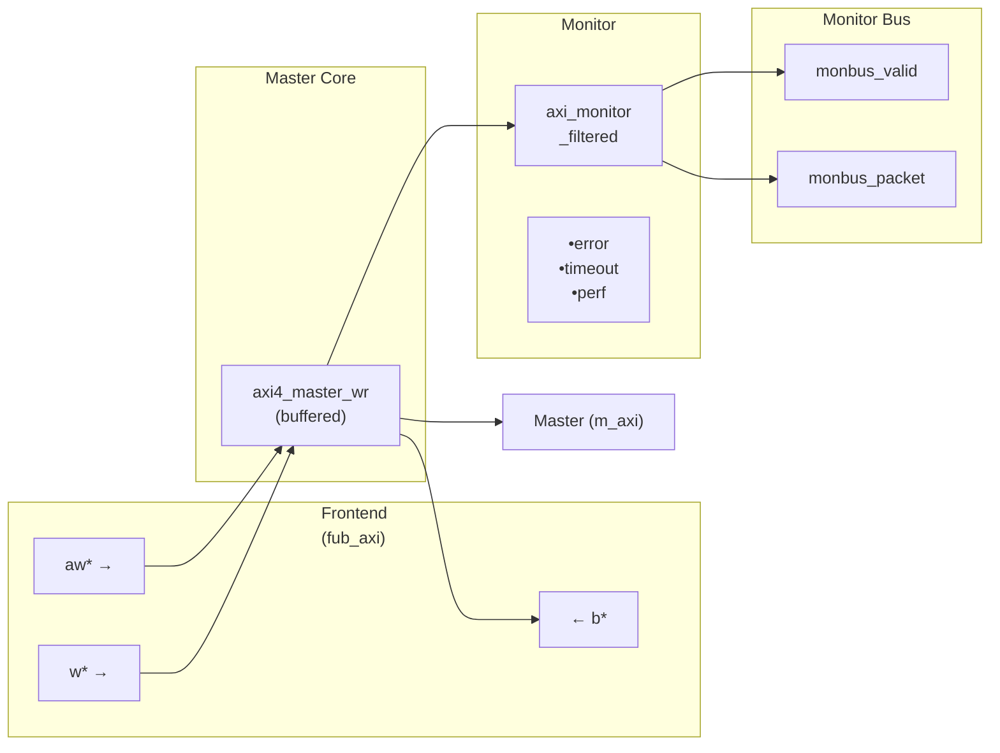
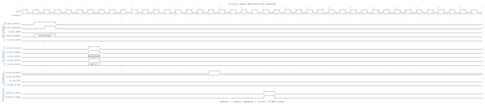

<!-- RTL Design Sherpa Documentation Header -->
<table>
<tr>
<td width="80">
  <a href="https://github.com/sean-galloway/RTLDesignSherpa">
    
  </a>
</td>
<td>
  <strong>RTL Design Sherpa</strong> · <em>Learning Hardware Design Through Practice</em><br>
  <sub>
    <a href="https://github.com/sean-galloway/RTLDesignSherpa">GitHub</a> ·
    <a href="https://github.com/sean-galloway/RTLDesignSherpa/blob/main/docs/DOCUMENTATION_INDEX.md">Documentation Index</a> ·
    <a href="https://github.com/sean-galloway/RTLDesignSherpa/blob/main/LICENSE">MIT License</a>
  </sub>
</td>
</tr>
</table>

---

<!-- End Header -->

# AXI4 Master Write Monitor

**Module:** `axi4_master_wr_mon.sv`
**Location:** `rtl/amba/axi4/`
**Status:** ✅ Production Ready

---

## Overview

The AXI4 Master Write Monitor module combines a functional AXI4 master write interface with comprehensive transaction monitoring and filtering capabilities. This module is essential for verification environments, providing real-time protocol checking, error detection, performance metrics, and configurable packet filtering for write transactions.

### Key Features

- ✅ **Integrated Monitoring:** Combines `axi4_master_wr` with `axi_monitor_filtered`
- ✅ **3-Level Filtering:** Packet type masks, error routing, individual event masking
- ✅ **Error Detection:** Protocol violations, SLVERR, DECERR, orphan transactions
- ✅ **Timeout Monitoring:** Configurable timeout detection for stuck transactions
- ✅ **Performance Metrics:** Latency tracking, transaction counting, throughput analysis
- ✅ **Monitor Bus Output:** 128-bit packets paired with 64-bit side-band timestamps
- ✅ **Configuration Validation:** Detects conflicting configuration settings
- ✅ **Clock Gating Support:** Busy signal for power management

---

## Module Architecture


```mermaid
flowchart LR
    subgraph FE["Frontend<br/>(fub_axi)"]
        aw["aw* →"]
        w["w* →"]
        b["← b*"]
    end

    subgraph CORE["Master Core"]
        mc["axi4_master_wr<br/>(buffered)"]
    end

    subgraph MON["Monitor"]
        mf["axi_monitor<br/>_filtered"]
        features["•error<br/>•timeout<br/>•perf"]
    end

    subgraph MB["Monitor Bus"]
        mbv["monbus_valid"]
        mbp["monbus_packet"]
    end

    aw --> mc
    w --> mc
    mc --> b
    mc --> mf
    mf --> mbv
    mf --> mbp
    mc --> maxi["Master (m_axi)"]
```

The module instantiates two sub-modules:
1. **axi4_master_wr** - Core AXI4 write functionality with buffering
2. **axi_monitor_filtered** - Transaction monitoring with 3-level filtering

---

## Parameters

### AXI4 Master Parameters

| Parameter | Type | Default | Description |
|-----------|------|---------|-------------|
| `SKID_DEPTH_AW` | int | 2 | AW channel skid buffer depth |
| `SKID_DEPTH_W` | int | 4 | W channel skid buffer depth |
| `SKID_DEPTH_B` | int | 2 | B channel skid buffer depth |
| `AXI_ID_WIDTH` | int | 8 | Transaction ID width |
| `AXI_ADDR_WIDTH` | int | 32 | Address bus width |
| `AXI_DATA_WIDTH` | int | 32 | Data bus width |
| `AXI_USER_WIDTH` | int | 1 | User signal width |

### Monitor Parameters

| Parameter | Type | Default | Description |
|-----------|------|---------|-------------|
| `UNIT_ID` | int | 1 | 4-bit unit identifier in monitor packets |
| `AGENT_ID` | int | 11 | 8-bit agent identifier in monitor packets |
| `MAX_TRANSACTIONS` | int | 16 | Maximum concurrent outstanding transactions |
| `ENABLE_FILTERING` | bit | 1 | Enable packet filtering (0=pass all packets) |
| `ADD_PIPELINE_STAGE` | bit | 0 | Add register stage for timing closure |
| `USE_MONITOR` | bit | 1 | Synthesis-time monitor enable. 0 = omit monitor and tie outputs to safe non-blocking defaults; 1 = full monitor functionality. |
| `N_ADDR_RANGES` | int | 0 | Number of address-range comparators. 0 = checker omitted (zero area). >0 = N independent [low, high] ranges; hits emit PktTypeError + AXI_ERR_ADDR_RANGE on monbus. |

---

## Monitor Backpressure (block_ready)

The monitor exposes a `block_ready` signal that goes low when its internal FIFO is saturated and cannot accept a new in-flight transaction. The wrapper ANDs `block_ready` into the upstream-facing `fub_axi_awready` so a saturated monitor stalls new transactions on the wire instead of dropping events.

- **Where the stall lands**: the upstream `fub_axi_awready` is forced low until the monitor drains.
- **When `USE_MONITOR=0`**: `block_ready` is internally tied high, so the wrapper imposes no stall and runs at full bandwidth.

This replaces a previous bug where `block_ready` was left unconnected and a full monitor FIFO would silently lose events.

---

## Address-Range Checker

The wrapper can be parameterized with `N_ADDR_RANGES > 0` to instantiate an N-comparator address-range checker that watches every accepted AW handshake and emits a `PktTypeError` monbus packet (event code `AXI_ERR_ADDR_RANGE = 8'h0D`) when an address falls inside any of the configured `[low, high]` inclusive ranges.

**Config inputs (active only when `N_ADDR_RANGES > 0`):**
- `cfg_addr_check_enable` — master on/off for the checker.
- `cfg_addr_range_enable[N-1:0]` — per-range enable bit.
- `cfg_addr_range_low[N-1:0][AXI_ADDR_WIDTH-1:0]` — inclusive low bound for each range.
- `cfg_addr_range_high[N-1:0][AXI_ADDR_WIDTH-1:0]` — inclusive high bound for each range.

**Event encoding** (within the standard 128-bit `monitor_packet_t`, event_data field):
- `packet_type` = `PktTypeError` (4'h0)
- `protocol`    = AXI (3'b000)
- `event_code`  = `AXI_ERR_ADDR_RANGE` (8'h0D)
- `event_data[63:60]` = `range_index` (4 bits; supports up to 16 ranges)
- `event_data[59:0]`  = full matched address (up to 60 bits, zero-padded if narrower)

**Exact match:** set `cfg_addr_range_low[i] == cfg_addr_range_high[i]`.

**Filtering:** the existing `cfg_axi_error_mask[13]` bit masks this event code; set it high to suppress range packets without disabling other errors. No new mask wiring needed.

**Per-range coalescing:** if a range hits again before its packet has been emitted, the latched address is overwritten (latest hit wins). One packet per cycle drains the pending mask via a lowest-index priority encoder. Distinct ranges never lose events; under sustained per-range bursts, only the latest address per range is reported per emission cycle.

---

## Port Groups

### AXI4 Write Channels

**Frontend Interface (fub_axi_*):**
- AW channel: `awid, awaddr, awlen, awsize, awburst, awlock, awcache, awprot, awqos, awregion, awuser, awvalid, awready`
- W channel: `wdata, wstrb, wlast, wuser, wvalid, wready`
- B channel: `bid, bresp, buser, bvalid, bready`

**Master Interface (m_axi_*):**
- Same signals as frontend, mirrored direction

### Monitor Configuration

Configuration ports are identical to [axi4_master_rd_mon](axi4_master_rd_mon.md):
- Basic: `cfg_monitor_enable`, `cfg_error_enable`, `cfg_timeout_enable`, `cfg_perf_enable`
- Thresholds: `cfg_timeout_cycles`, `cfg_latency_threshold`
- Filtering: 7 mask signals (`cfg_axi_*_mask`)

### Monitor Bus Output

| Port | Direction | Width | Description |
|------|-----------|-------|-------------|
| `monbus_valid` | Output | 1 | Monitor packet valid |
| `monbus_ready` | Input | 1 | Downstream ready to accept packet |
| `monbus_packet` | Output | 128 | `monitor_packet_t` (see format below) |
| `monbus_timestamp` | Output | 64 | `monbus_timestamp_t` paired atomically with `monbus_packet` |
| `i_mon_time` | Input | 64 | Free-running counter from `monbus_axil_group`, sampled at packet emission |

### Status Outputs

| Port | Direction | Width | Description |
|------|-----------|-------|-------------|
| `busy` | Output | 1 | Indicates active transactions (for clock gating) |
| `active_transactions` | Output | 8 | Current number of outstanding transactions |
| `error_count` | Output | 16 | Cumulative error count |
| `transaction_count` | Output | 32 | Total transaction count |
| `cfg_conflict_error` | Output | 1 | Configuration conflict detected |

---

## Monitor Packet Format

The 128-bit `monbus_packet` (paired with the 64-bit `monbus_timestamp` side-band signal) follows the standardized AMBA monitor bus format. Identical format as [axi4_master_rd_mon](axi4_master_rd_mon.md):

```
Bits [127:124] - Packet Type:
  0x0 = ERROR      Error events (SLVERR, DECERR, protocol violations)
  0x1 = COMPL      Completion events (transaction finished)
  0x2 = THRESH     Threshold events
  0x3 = TIMEOUT    Timeout events
  0x4 = PERF       Performance metrics
  0x8 = ADDR_MATCH Address match events
  0x9 = APB        APB-specific events
  0xF = DEBUG      Debug events
Bits [123:109] - Reserved (15 bits, forward-compat slack)
Bits [108:105] - Protocol (4 bits): 0x0=AXI, 0x1=AXIS, 0x2=APB, 0x3=ARB, 0x4=CORE
Bits [104:97]  - Event Code (8 bits, protocol-specific)
Bits [96:88]   - Channel ID (9 bits — AXI ID or channel index)
Bits [87:72]   - Agent ID (16 bits, from AGENT_ID parameter)
Bits [71:64]   - Unit ID (8 bits, from UNIT_ID parameter)
Bits [63:0]    - Event Data (64 bits — full address, latency, etc.)
```

---

## Timing Diagrams

The following waveforms show AXI4 master write monitor behavior:

### Scenario 1: Single-Beat Write Transaction

Complete AXI4 write transaction showing AW, W, and B channels:


**WaveJSON:** [single_beat_write_001.json](../../assets/WAVES/axi4_master_wr_mon/single_beat_write_001.json)

**Key Observations:**
- AW channel handshake (AWVALID/AWREADY)
- W channel data (WVALID/WREADY/WLAST/WSTRB)
- B channel response (BVALID/BREADY/BRESP)
- Monitor bus packet generation
- Three-channel write protocol coordination

### Scenario 2: Alternative Single-Beat Write

Variant single-beat write with different backpressure pattern:



**WaveJSON:** [single_beat_write_002_001.json](../../assets/WAVES/axi4_master_wr_mon/single_beat_write_002_001.json)

**Key Observations:**
- Different ready signal timing
- Channel interleaving effects
- Write strobe (WSTRB) handling
- Response latency variation
- Monitor packet correlation with transaction ID

---

## Configuration Strategies

### Strategy 1: Functional Verification (Recommended)

**Goal:** Catch write errors and track completion

```systemverilog
// Enable configuration
.cfg_monitor_enable     (1'b1),
.cfg_error_enable       (1'b1),      // Catch SLVERR/DECERR
.cfg_timeout_enable     (1'b1),      // Detect stuck writes
.cfg_perf_enable        (1'b0),      // Disable (reduces traffic)

// Filtering - pass error and timeout only
.cfg_axi_pkt_mask       (16'b1111_1111_0000_0011),
.cfg_axi_error_mask     (16'h0000),  // Pass all errors
.cfg_axi_timeout_mask   (16'h0000),  // Pass all timeouts
.cfg_axi_compl_mask     (16'hFFFF),  // Drop completions
.cfg_axi_perf_mask      (16'hFFFF),  // Drop performance

// Timeouts
.cfg_timeout_cycles     (16'd1000),
.cfg_latency_threshold  (32'd500)
```

### Strategy 2: Performance Analysis

**Goal:** Collect write performance metrics

```systemverilog
// Enable configuration
.cfg_monitor_enable     (1'b1),
.cfg_error_enable       (1'b1),      // Still catch errors
.cfg_timeout_enable     (1'b0),      // Disable timeouts
.cfg_perf_enable        (1'b1),      // Enable performance

// Filtering - pass error and performance only
.cfg_axi_pkt_mask       (16'b1111_1110_0000_0001),
.cfg_axi_error_mask     (16'h0000),  // Pass all errors
.cfg_axi_perf_mask      (16'h0000),  // Pass all performance
.cfg_axi_compl_mask     (16'hFFFF),  // Drop completions
.cfg_axi_timeout_mask   (16'hFFFF)   // Drop timeouts
```

### Strategy 3: Debug Mode

**Goal:** Maximum visibility for write transactions

```systemverilog
// Enable everything
.cfg_monitor_enable     (1'b1),
.cfg_error_enable       (1'b1),
.cfg_timeout_enable     (1'b1),
.cfg_perf_enable        (1'b1),

// Filtering - pass all packets
.cfg_axi_pkt_mask       (16'h0000),  // Pass all
// All individual masks set to 16'h0000
```

**⚠️ WARNING:** Never enable all packet types in high-throughput write scenarios!

---

## Usage Example

### Basic Integration

```systemverilog
axi4_master_wr_mon #(
    .SKID_DEPTH_AW      (2),
    .SKID_DEPTH_W       (4),
    .SKID_DEPTH_B       (2),
    .AXI_ID_WIDTH       (4),
    .AXI_ADDR_WIDTH     (32),
    .AXI_DATA_WIDTH     (64),
    .AXI_USER_WIDTH     (1),
    .UNIT_ID            (1),
    .AGENT_ID           (11),
    .MAX_TRANSACTIONS   (16),
    .ENABLE_FILTERING   (1)
) u_master_wr_mon (
    .aclk               (axi_aclk),
    .aresetn            (axi_aresetn),

    // Frontend interface (from write initiator)
    .fub_axi_awid       (write_awid),
    .fub_axi_awaddr     (write_awaddr),
    // ... rest of AW/W/B signals

    // Master interface (to interconnect)
    .m_axi_awid         (m_axi_awid),
    .m_axi_awaddr       (m_axi_awaddr),
    // ... rest of AW/W/B signals

    // Monitor configuration (Strategy 1 - Functional)
    .cfg_monitor_enable     (1'b1),
    .cfg_error_enable       (1'b1),
    .cfg_timeout_enable     (1'b1),
    .cfg_perf_enable        (1'b0),
    .cfg_timeout_cycles     (16'd1000),
    .cfg_latency_threshold  (32'd500),

    .cfg_axi_pkt_mask       (16'b1111_1111_0000_0011),
    .cfg_axi_error_mask     (16'h0000),
    .cfg_axi_timeout_mask   (16'h0000),
    .cfg_axi_compl_mask     (16'hFFFF),
    // ... rest of mask signals

    // Monitor bus output
    .monbus_valid           (mon_valid),
    .monbus_ready           (mon_ready),
    .monbus_packet          (mon_packet),

    // Status
    .busy                   (wr_busy),
    .active_transactions    (wr_active),
    .error_count            (wr_errors),
    .transaction_count      (wr_count),
    .cfg_conflict_error     (cfg_conflict)
);
```

---

## Design Notes

### Write-Specific Monitoring

**Write Response Tracking:**
- Monitors AW channel for write address capture
- Tracks W channel beats (WLAST detection)
- Correlates B channel responses with AWID
- Detects mismatched burst lengths (W beats vs AWLEN+1)

**Common Write Errors Detected:**
- **SLVERR:** Slave error response (decode failure, access violation)
- **DECERR:** Decode error (address not mapped)
- **Orphan transactions:** AWID without matching BID
- **Timeout:** Write address or response stuck beyond threshold
- **Protocol violations:** Invalid WSTRB, missing WLAST

### Performance Considerations

**Write Transaction Bandwidth:**
- AW channel: 1 transaction/cycle (when buffer not full)
- W channel: 1 beat/cycle sustained (burst pipelining)
- B channel: 1 response/cycle (sparse compared to W beats)

**Monitor Packet Budget (Write):**
- Typical: 2-3 packets per write transaction
- Burst writes: More efficient packet/beat ratio
- Single writes: Higher packet overhead

### Buffer Depth Guidelines

Same as [axi4_master_wr](axi4_master_wr.md):
- **SKID_DEPTH_AW:** 2 (default) - sufficient for most systems
- **SKID_DEPTH_W:** 4 (default) - accommodates moderate bursts
- **SKID_DEPTH_B:** 2 (default) - responses are single-beat

Increase depths for high-latency or high-throughput scenarios.

---

## Related Modules

### Companion Monitors
- **[axi4_master_rd_mon](axi4_master_rd_mon.md)** - AXI4 master read with monitoring
- **axi4_slave_rd_mon** - AXI4 slave read with monitoring
- **axi4_slave_wr_mon** - AXI4 slave write with monitoring

### Base Modules
- **[axi4_master_wr](axi4_master_wr.md)** - Functional AXI4 master write (without monitoring)
- **axi_monitor_filtered** - Monitoring engine with filtering (shared/)

### Used Components
- **[gaxi_skid_buffer](../gaxi/gaxi_skid_buffer.md)** - Elastic buffering
- **axi_monitor_base** - Core monitoring logic (shared/)
- **axi_monitor_trans_mgr** - Transaction tracking (shared/)

---

## References

### Specifications
- ARM IHI 0022E: AMBA AXI Protocol Specification (AXI4)
- Monitor Bus Packet Format: [monitor_package_spec.md](../includes/monitor_package_spec.md)

### Source Code
- RTL: `rtl/amba/axi4/axi4_master_wr_mon.sv`
- Tests: `val/amba/test_axi4_master_wr_mon.py`
- Framework: `bin/TBClasses/components/axi4/`

### Documentation
- Configuration Guide: [AXI Monitor Base](../shared/axi_monitor_base.md)
- Architecture: [RTLAmba Overview](../overview.md)
- AXI4 Index: [README.md](README.md)

---

**Last Updated:** 2025-10-20

---

## Navigation

- **[← Back to AXI4 Index](README.md)**
- **[← Back to RTLAmba Index](../index.md)**
- **[← Back to Main Documentation Index](../../index.md)**
