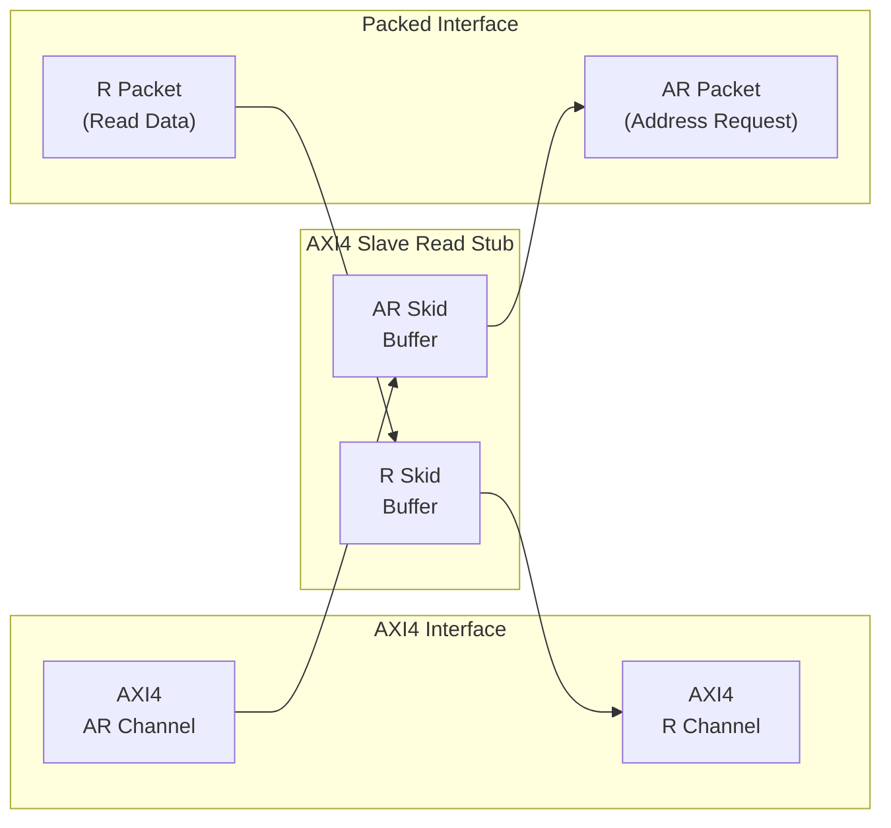
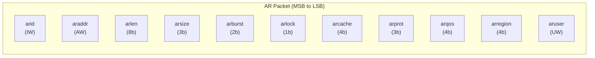
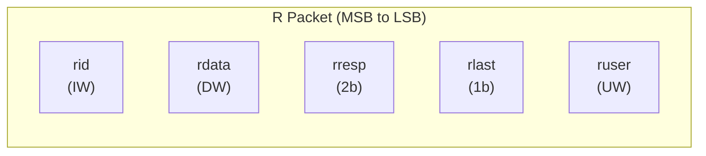
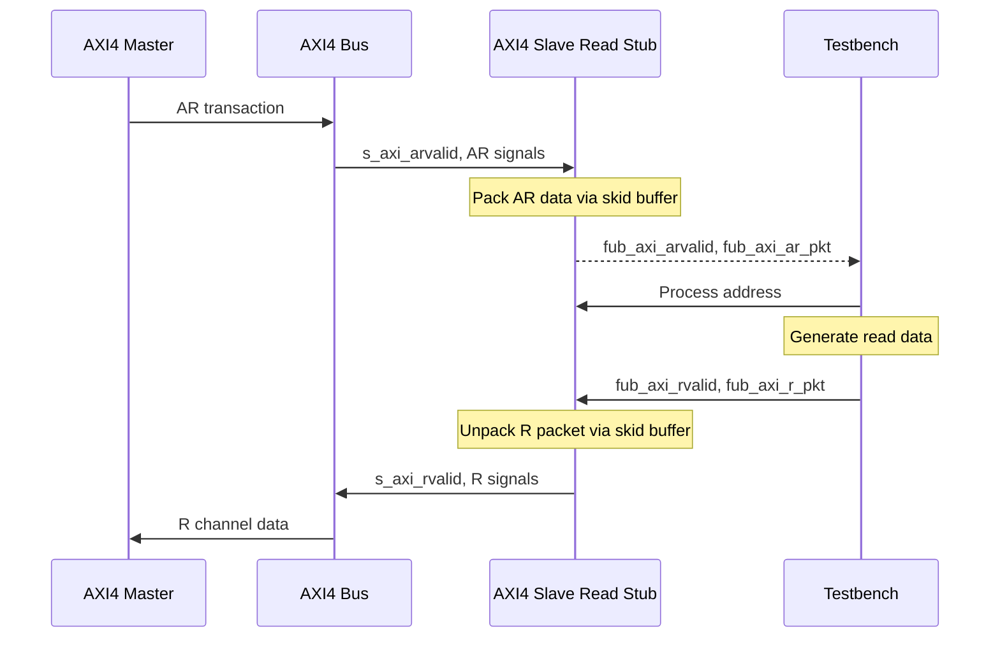

<!-- RTL Design Sherpa Documentation Header -->
<table>
<tr>
<td width="80">
  <a href="https://github.com/sean-galloway/RTLDesignSherpa">
    
  </a>
</td>
<td>
  <strong>RTL Design Sherpa</strong> · <em>Learning Hardware Design Through Practice</em><br>
  <sub>
    <a href="https://github.com/sean-galloway/RTLDesignSherpa">GitHub</a> ·
    <a href="https://github.com/sean-galloway/RTLDesignSherpa/blob/main/docs/DOCUMENTATION_INDEX.md">Documentation Index</a> ·
    <a href="https://github.com/sean-galloway/RTLDesignSherpa/blob/main/LICENSE">MIT License</a>
  </sub>
</td>
</tr>
</table>

---

<!-- End Header -->

# AXI4 Slave Read Stub

**Module:** `axi4_slave_rd_stub.sv`
**Location:** `rtl/amba/axi4/stubs/`
**Status:** Production Ready

---

## Overview

The AXI4 Slave Read Stub provides a simplified packed-data interface for receiving AXI4 read transactions from a master. It uses skid buffers to pack/unpack AXI4 AR (read address) and R (read data) channels into simple packet interfaces, making it ideal for testbenches and integration scenarios where a simplified slave interface is needed.

### Key Features

- Packed packet interface for AR and R channels
- Configurable skid buffer depths for each channel
- Full AXI4 read transaction support
- Burst, ID, user signal support
- Parameterized data widths

---

## Module Architecture



---

## Parameters

| Parameter | Type | Default | Description |
|-----------|------|---------|-------------|
| SKID_DEPTH_AR | int | 2 | AR channel skid buffer depth (log2) |
| SKID_DEPTH_R | int | 4 | R channel skid buffer depth (log2) |
| AXI_ID_WIDTH | int | 8 | AXI transaction ID width |
| AXI_ADDR_WIDTH | int | 32 | AXI address bus width |
| AXI_DATA_WIDTH | int | 32 | AXI data bus width |
| AXI_USER_WIDTH | int | 1 | AXI user signal width |
| AXI_WSTRB_WIDTH | int | AXI_DATA_WIDTH/8 | Write strobe width (unused) |
| AW | int | AXI_ADDR_WIDTH | Short alias for address width |
| DW | int | AXI_DATA_WIDTH | Short alias for data width |
| IW | int | AXI_ID_WIDTH | Short alias for ID width |
| SW | int | AXI_WSTRB_WIDTH | Short alias for strobe width |
| UW | int | AXI_USER_WIDTH | Short alias for user width |
| ARSize | int | IW+AW+8+3+2+1+4+3+4+4+UW | AR packet size (calculated) |
| RSize | int | IW+DW+2+1+UW | R packet size (calculated) |

---

## Ports

### Clock and Reset

| Port | Width | Direction | Description |
|------|-------|-----------|-------------|
| aclk | 1 | Input | AXI clock |
| aresetn | 1 | Input | AXI reset (active low) |

### AXI4 Read Address Channel (AR)

| Port | Width | Direction | Description |
|------|-------|-----------|-------------|
| s_axi_arid | IW | Input | Read address ID |
| s_axi_araddr | AW | Input | Read address |
| s_axi_arlen | 8 | Input | Burst length |
| s_axi_arsize | 3 | Input | Burst size |
| s_axi_arburst | 2 | Input | Burst type |
| s_axi_arlock | 1 | Input | Lock type |
| s_axi_arcache | 4 | Input | Cache type |
| s_axi_arprot | 3 | Input | Protection type |
| s_axi_arqos | 4 | Input | Quality of service |
| s_axi_arregion | 4 | Input | Region identifier |
| s_axi_aruser | UW | Input | User signal |
| s_axi_arvalid | 1 | Input | Read address valid |
| s_axi_arready | 1 | Output | Read address ready |

### AXI4 Read Data Channel (R)

| Port | Width | Direction | Description |
|------|-------|-----------|-------------|
| s_axi_rid | IW | Output | Read data ID |
| s_axi_rdata | DW | Output | Read data |
| s_axi_rresp | 2 | Output | Read response |
| s_axi_rlast | 1 | Output | Read last |
| s_axi_ruser | UW | Output | User signal |
| s_axi_rvalid | 1 | Output | Read data valid |
| s_axi_rready | 1 | Input | Read data ready |

### AR Packet Interface

| Port | Width | Direction | Description |
|------|-------|-----------|-------------|
| fub_axi_arvalid | 1 | Output | AR packet valid |
| fub_axi_arready | 1 | Input | Ready to accept AR packet |
| fub_axi_ar_count | 4 | Output | AR buffer occupancy |
| fub_axi_ar_pkt | ARSize | Output | Packed AR packet data |

### R Packet Interface

| Port | Width | Direction | Description |
|------|-------|-----------|-------------|
| fub_axi_rvalid | 1 | Input | R packet valid |
| fub_axi_rready | 1 | Output | Ready to accept R packet |
| fub_axi_r_pkt | RSize | Input | Packed R packet data |

---

## Packet Formats

### AR Packet Structure (Read Address)



**Bit Positions:**
```
fub_axi_ar_pkt = {arid, araddr, arlen, arsize, arburst, arlock, arcache, arprot, arqos, arregion, aruser}

Width = IW + AW + 8 + 3 + 2 + 1 + 4 + 3 + 4 + 4 + UW
```

### R Packet Structure (Read Data)



**Bit Positions:**
```
fub_axi_r_pkt = {rid, rdata, rresp, rlast, ruser}

Width = IW + DW + 2 + 1 + UW
```

---

## Transaction Flow

### Read Transaction



### Timing

<!-- TODO: Add wavedrom timing diagram for stub transactions -->
```
TODO: Wavedrom timing diagram showing:
- aclk
- AXI AR signals (s_axi_arvalid, s_axi_araddr, s_axi_arlen, etc.)
- fub_axi_arvalid, fub_axi_arready, fub_axi_ar_pkt
- fub_axi_rvalid, fub_axi_rready, fub_axi_r_pkt
- AXI R signals (s_axi_rvalid, s_axi_rdata, s_axi_rlast, etc.)
- Packet-to-AXI timing relationship with skid buffer operation
```

---

## Usage Example

```systemverilog
axi4_slave_rd_stub #(
    .SKID_DEPTH_AR   (2),
    .SKID_DEPTH_R    (4),
    .AXI_ID_WIDTH    (8),
    .AXI_ADDR_WIDTH  (32),
    .AXI_DATA_WIDTH  (64),
    .AXI_USER_WIDTH  (4)
) u_axi4_slave_rd_stub (
    .aclk            (axi_clk),
    .aresetn         (axi_rst_n),

    // AXI4 slave read interface
    .s_axi_arid      (s_axi_arid),
    .s_axi_araddr    (s_axi_araddr),
    .s_axi_arlen     (s_axi_arlen),
    .s_axi_arsize    (s_axi_arsize),
    .s_axi_arburst   (s_axi_arburst),
    .s_axi_arlock    (s_axi_arlock),
    .s_axi_arcache   (s_axi_arcache),
    .s_axi_arprot    (s_axi_arprot),
    .s_axi_arqos     (s_axi_arqos),
    .s_axi_arregion  (s_axi_arregion),
    .s_axi_aruser    (s_axi_aruser),
    .s_axi_arvalid   (s_axi_arvalid),
    .s_axi_arready   (s_axi_arready),

    .s_axi_rid       (s_axi_rid),
    .s_axi_rdata     (s_axi_rdata),
    .s_axi_rresp     (s_axi_rresp),
    .s_axi_rlast     (s_axi_rlast),
    .s_axi_ruser     (s_axi_ruser),
    .s_axi_rvalid    (s_axi_rvalid),
    .s_axi_rready    (s_axi_rready),

    // Packed AR interface
    .fub_axi_arvalid (tb_ar_valid),
    .fub_axi_arready (tb_ar_ready),
    .fub_axi_ar_count(tb_ar_count),
    .fub_axi_ar_pkt  (tb_ar_pkt),

    // Packed R interface
    .fub_axi_rvalid  (tb_r_valid),
    .fub_axi_rready  (tb_r_ready),
    .fub_axi_r_pkt   (tb_r_pkt)
);

// Parse AR packet
wire [7:0]  ar_id     = tb_ar_pkt[ARSize-1:ARSize-8];
wire [31:0] ar_addr   = tb_ar_pkt[ARSize-9:ARSize-40];
wire [7:0]  ar_len    = tb_ar_pkt[ARSize-41:ARSize-48];
wire [2:0]  ar_size   = tb_ar_pkt[ARSize-49:ARSize-51];
wire [1:0]  ar_burst  = tb_ar_pkt[ARSize-52:ARSize-53];
// ... additional fields as needed

// Build R packet (single beat response with data 0xDEADBEEFCAFEBABE)
localparam RSize = 8 + 64 + 2 + 1 + 4;  // Calculate size
assign tb_r_pkt = {
    ar_id,                      // rid (match request ID)
    64'hDEAD_BEEF_CAFE_BABE,   // rdata
    2'b00,                      // rresp (OKAY)
    1'b1,                       // rlast
    4'h0                        // ruser
};
```

---

## Design Notes

### Skid Buffer Operation

The stub uses `gaxi_skid_buffer` modules to:
- Decouple timing between AXI bus and testbench
- Provide configurable buffering depth per channel
- Handle backpressure gracefully
- Support burst transactions without stalling

**Recommended Depths:**
- **AR Channel:** 2-4 (address transactions)
- **R Channel:** 4-8 (data beats for bursts)

### Packet Packing Order

AR and R packets are packed MSB-to-LSB following AXI signal order:
- Simplifies testbench packet parsing
- Matches common concatenation order
- Efficient for burst transaction handling

### Internal Architecture

The stub instantiates two `gaxi_skid_buffer` modules:
- **AR Skid Buffer:** Packs AXI AR channel to AR packets
- **R Skid Buffer:** Unpacks R packets to AXI R channel

All AXI protocol handling is done by the skid buffers and upstream modules.

---

## Related Documentation

- **[AXI4 Slave Read](axi4_slave_rd.md)** - Full AXI4 slave read module (if wrapping one)
- **[AXI4 Slave Write Stub](axi4_slave_wr_stub.md)** - Corresponding write stub
- **[AXI4 Slave Stub](axi4_slave_stub.md)** - Combined read/write stub
- **[AXI4 Master Read Stub](axi4_master_rd_stub.md)** - Master-side read stub

---

## Navigation

- **[<- Back to AXI4 Index](README.md)**
- **[<- Back to RTLAmba Index](../index.md)**
- **[<- Back to Main Documentation Index](../../index.md)**
