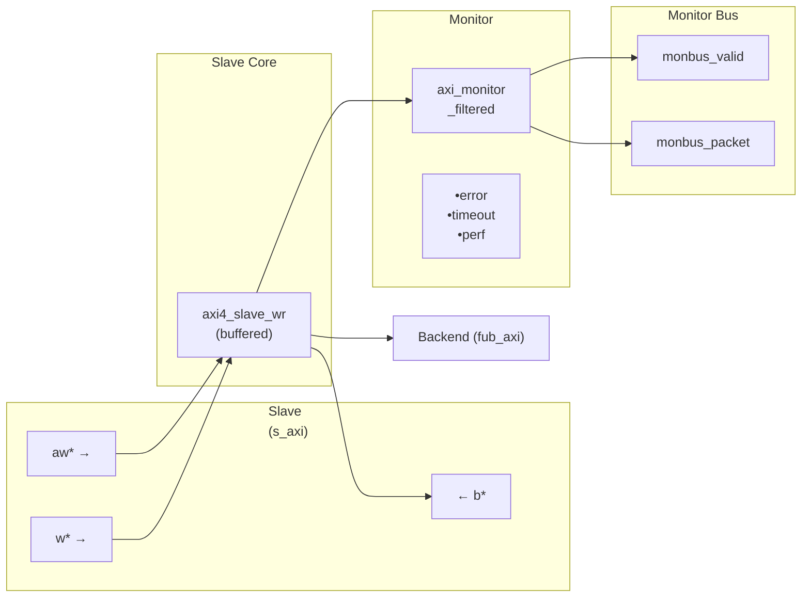
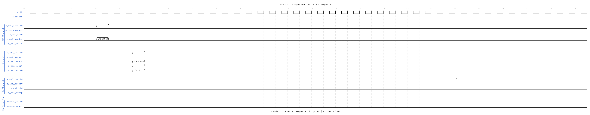

<!-- RTL Design Sherpa Documentation Header -->
<table>
<tr>
<td width="80">
  <a href="https://github.com/sean-galloway/RTLDesignSherpa">
    
  </a>
</td>
<td>
  <strong>RTL Design Sherpa</strong> · <em>Learning Hardware Design Through Practice</em><br>
  <sub>
    <a href="https://github.com/sean-galloway/RTLDesignSherpa">GitHub</a> ·
    <a href="https://github.com/sean-galloway/RTLDesignSherpa/blob/main/docs/DOCUMENTATION_INDEX.md">Documentation Index</a> ·
    <a href="https://github.com/sean-galloway/RTLDesignSherpa/blob/main/LICENSE">MIT License</a>
  </sub>
</td>
</tr>
</table>

---

<!-- End Header -->

# AXI4 Slave Write Monitor

**Module:** `axi4_slave_wr_mon.sv`
**Location:** `rtl/amba/axi4/`
**Status:** ✅ Production Ready

---

## Overview

The AXI4 Slave Write Monitor module combines a functional AXI4 slave write interface with comprehensive transaction monitoring and filtering capabilities. This module is essential for verification environments, providing real-time protocol checking, error detection, performance metrics, and configurable packet filtering for slave-side write transactions.

### Key Features

- ✅ **Integrated Monitoring:** Combines `axi4_slave_wr` with `axi_monitor_filtered`
- ✅ **3-Level Filtering:** Packet type masks, error routing, individual event masking
- ✅ **Error Detection:** Protocol violations, SLVERR, DECERR, orphan transactions
- ✅ **Timeout Monitoring:** Configurable timeout detection for stuck transactions
- ✅ **Performance Metrics:** Latency tracking, transaction counting, throughput analysis
- ✅ **Monitor Bus Output:** 64-bit standardized packets for system-level monitoring
- ✅ **Configuration Validation:** Detects conflicting configuration settings
- ✅ **Clock Gating Support:** Busy signal for power management

---

## Module Architecture



The module instantiates two sub-modules:
1. **axi4_slave_wr** - Core AXI4 slave write functionality with buffering
2. **axi_monitor_filtered** - Transaction monitoring with 3-level filtering

---

## Parameters

### AXI4 Slave Parameters

| Parameter | Type | Default | Description |
|-----------|------|---------|-------------|
| `SKID_DEPTH_AW` | int | 2 | AW channel skid buffer depth |
| `SKID_DEPTH_W` | int | 4 | W channel skid buffer depth |
| `SKID_DEPTH_B` | int | 2 | B channel skid buffer depth |
| `AXI_ID_WIDTH` | int | 8 | Transaction ID width |
| `AXI_ADDR_WIDTH` | int | 32 | Address bus width |
| `AXI_DATA_WIDTH` | int | 32 | Data bus width |
| `AXI_USER_WIDTH` | int | 1 | User signal width |

### Monitor Parameters

| Parameter | Type | Default | Description |
|-----------|------|---------|-------------|
| `UNIT_ID` | int | 2 | 4-bit unit identifier in monitor packets |
| `AGENT_ID` | int | 21 | 8-bit agent identifier in monitor packets |
| `MAX_TRANSACTIONS` | int | 16 | Maximum concurrent outstanding transactions |
| `ENABLE_FILTERING` | bit | 1 | Enable packet filtering (0=pass all packets) |
| `ADD_PIPELINE_STAGE` | bit | 0 | Add register stage for timing closure |

---

## Port Groups

### AXI4 Write Channels

**Slave Interface (s_axi_*):**
- AW channel: `awid, awaddr, awlen, awsize, awburst, awlock, awcache, awprot, awqos, awregion, awuser, awvalid, awready`
- W channel: `wdata, wstrb, wlast, wuser, wvalid, wready`
- B channel: `bid, bresp, buser, bvalid, bready`

**Backend Interface (fub_axi_*):**
- Same signals as slave, mirrored direction (to memory/backend)

### Monitor Configuration

Configuration ports are identical to other AXI4 monitors:
- Basic: `cfg_monitor_enable`, `cfg_error_enable`, `cfg_timeout_enable`, `cfg_perf_enable`
- Thresholds: `cfg_timeout_cycles`, `cfg_latency_threshold`
- Filtering: 7 mask signals (`cfg_axi_*_mask`)

### Monitor Bus Output

| Port | Direction | Width | Description |
|------|-----------|-------|-------------|
| `monbus_valid` | Output | 1 | Monitor packet valid |
| `monbus_ready` | Input | 1 | Downstream ready to accept packet |
| `monbus_packet` | Output | 64 | Monitor packet data |

### Status Outputs

| Port | Direction | Width | Description |
|------|-----------|-------|-------------|
| `busy` | Output | 1 | Indicates active transactions (for clock gating) |
| `active_transactions` | Output | 8 | Current number of outstanding transactions |
| `error_count` | Output | 16 | Cumulative error count |
| `transaction_count` | Output | 32 | Total transaction count |
| `cfg_conflict_error` | Output | 1 | Configuration conflict detected |

---

## Monitor Packet Format

Identical 64-bit format as other AXI4 monitors. See [axi4_master_rd_mon](axi4_master_rd_mon.md) for complete specification.

---

## Timing Diagrams

The following waveforms show AXI4 slave write monitor behavior from the slave perspective:

### Scenario 1: Single-Beat Write (Slave View)

AXI4 write transaction from slave interface perspective:


**WaveJSON:** [single_beat_write_001.json](../../assets/WAVES/axi4_slave_wr_mon/single_beat_write_001.json)

**Key Observations:**
- Slave-side AW channel (s_axi_aw*)
- Slave-side W channel data (s_axi_w*)
- Slave-side B channel response (s_axi_b*)
- Monitor packet generation from slave perspective
- Slave BRESP status monitoring
- Transaction tracking in slave context

### Scenario 2: Alternative Single-Beat Write (Slave View)

Variant write transaction with different timing from slave:



**WaveJSON:** [single_beat_write_002_001.json](../../assets/WAVES/axi4_slave_wr_mon/single_beat_write_002_001.json)

**Key Observations:**
- Slave ready signal behavior
- AWREADY backpressure effects
- WREADY flow control
- BVALID generation timing
- Slave latency monitoring
- Error detection from slave side

---

## Configuration Strategies

### Strategy 1: Functional Verification (Recommended)

**Goal:** Catch slave-side write errors

```systemverilog
// Enable configuration
.cfg_monitor_enable     (1'b1),
.cfg_error_enable       (1'b1),      // Detect SLVERR/DECERR from backend
.cfg_timeout_enable     (1'b1),      // Detect backend timeouts
.cfg_perf_enable        (1'b0),      // Disable (reduces traffic)

// Filtering - pass error and timeout only
.cfg_axi_pkt_mask       (16'b1111_1111_0000_0011),
.cfg_axi_error_mask     (16'h0000),  // Pass all errors
.cfg_axi_timeout_mask   (16'h0000),  // Pass all timeouts
.cfg_axi_compl_mask     (16'hFFFF),  // Drop completions
.cfg_axi_perf_mask      (16'hFFFF),  // Drop performance

// Timeouts
.cfg_timeout_cycles     (16'd2000),  // Backend write response timeout
.cfg_latency_threshold  (32'd1000)
```

### Strategy 2: Performance Analysis

**Goal:** Analyze slave write performance

```systemverilog
// Enable configuration
.cfg_monitor_enable     (1'b1),
.cfg_error_enable       (1'b1),
.cfg_timeout_enable     (1'b0),
.cfg_perf_enable        (1'b1),      // Enable performance metrics

// Filtering - pass error and performance only
.cfg_axi_pkt_mask       (16'b1111_1110_0000_0001),
.cfg_axi_error_mask     (16'h0000),  // Pass all errors
.cfg_axi_perf_mask      (16'h0000),  // Pass all performance
.cfg_axi_compl_mask     (16'hFFFF),  // Drop completions
```

---

## Usage Example

### Basic Integration with Memory

```systemverilog
axi4_slave_wr_mon #(
    .SKID_DEPTH_AW      (2),
    .SKID_DEPTH_W       (4),
    .SKID_DEPTH_B       (2),
    .AXI_ID_WIDTH       (4),
    .AXI_ADDR_WIDTH     (32),
    .AXI_DATA_WIDTH     (64),
    .AXI_USER_WIDTH     (1),
    .UNIT_ID            (2),
    .AGENT_ID           (21),
    .MAX_TRANSACTIONS   (16),
    .ENABLE_FILTERING   (1)
) u_slave_wr_mon (
    .aclk               (axi_aclk),
    .aresetn            (axi_aresetn),

    // Slave interface (from interconnect)
    .s_axi_awid         (s_axi_awid),
    .s_axi_awaddr       (s_axi_awaddr),
    // ... rest of AW/W/B signals

    // Backend interface (to memory controller)
    .fub_axi_awid       (mem_awid),
    .fub_axi_awaddr     (mem_awaddr),
    // ... rest of AW/W/B signals

    // Monitor configuration
    .cfg_monitor_enable     (1'b1),
    .cfg_error_enable       (1'b1),
    .cfg_timeout_enable     (1'b1),
    .cfg_perf_enable        (1'b0),
    .cfg_timeout_cycles     (16'd2000),  // Higher for memory latency
    .cfg_latency_threshold  (32'd1000),

    .cfg_axi_pkt_mask       (16'b1111_1111_0000_0011),
    .cfg_axi_error_mask     (16'h0000),
    .cfg_axi_timeout_mask   (16'h0000),
    .cfg_axi_compl_mask     (16'hFFFF),
    // ... rest of mask signals

    // Monitor bus output
    .monbus_valid           (mon_valid),
    .monbus_ready           (mon_ready),
    .monbus_packet          (mon_packet),

    // Status
    .busy                   (wr_slave_busy),
    .active_transactions    (wr_active),
    .error_count            (wr_errors),
    .transaction_count      (wr_count),
    .cfg_conflict_error     (cfg_conflict)
);

// Memory controller backend
memory_controller u_mem (
    .axi_aclk       (axi_aclk),
    .axi_aresetn    (axi_aresetn),
    // Connect to fub_axi_* signals
    .axi_awid       (mem_awid),
    .axi_awaddr     (mem_awaddr),
    // ...
);
```

---

## Design Notes

### Slave-Side Monitoring

**Key Differences from Master Monitors:**
- Monitors from slave perspective (interconnect → backend)
- Tracks backend write response latency
- Detects backend timeout scenarios
- Default UNIT_ID=2, AGENT_ID=21 (distinguishes from master)

**Slave Write Sequence:**
1. AW channel: Master write address arrives at slave
2. Monitor captures: Address, ID, burst parameters
3. AW forwarded to backend (memory/logic)
4. W channel: Master sends data beats
5. Monitor tracks: Write beat count, WLAST
6. B channel: Backend returns write response
7. Monitor tracks: Response latency, BRESP
8. B forwarded back to master via interconnect

**Common Slave Errors Detected:**
- **Backend timeout:** AW accepted but B never returned
- **Write data timeout:** AW accepted but W never completed
- **SLVERR:** Slave error (access violation, parity error, write protection)
- **DECERR:** Decode error (shouldn't occur at slave, but detected)
- **Burst mismatch:** W beats don't match AWLEN+1
- **ID corruption:** BID doesn't match tracked AWID
- **WSTRB protocol violations:** Invalid byte lane enables

### Performance Considerations

**Backend Latency Monitoring:**
- Tracks AW → B response latency
- Includes W channel completion time
- Configurable timeout threshold
- Separate from master-side latency

**Typical Timeout Values:**
- SRAM backend: 100-500 cycles
- DDR controller: 1000-5000 cycles
- Flash/EEPROM: 10000+ cycles (write operations)
- PCIe/external: 10000+ cycles

**Write-Specific Timing:**
- AW-W ordering flexible in AXI4
- Backend may wait for WLAST before responding
- B response latency includes W channel completion

### Buffer Depth Guidelines

Same as [axi4_slave_wr](axi4_slave_wr.md):
- **SKID_DEPTH_AW:** 2 (default) - handles interconnect backpressure
- **SKID_DEPTH_W:** 4 (default) - buffers burst write data
- **SKID_DEPTH_B:** 2 (default) - write responses are single-beat
- Increase for high-latency backends or large bursts

### Write Transaction Characteristics

**Burst Write Monitoring:**
- Monitors AW channel for address capture
- Tracks W channel beats until WLAST
- Correlates B channel response with AWID
- Validates burst length (W beats == AWLEN+1)
- Checks WSTRB validity per beat

**Performance Impact:**
- Write bursts more efficient than single writes
- Backend may buffer/pipeline write data
- B response can occur before W completion (with reordering)
- Monitor packets generated per transaction, not per beat

---

## Related Modules

### Companion Monitors
- **[axi4_master_rd_mon](axi4_master_rd_mon.md)** - AXI4 master read with monitoring
- **[axi4_master_wr_mon](axi4_master_wr_mon.md)** - AXI4 master write with monitoring
- **[axi4_slave_rd_mon](axi4_slave_rd_mon.md)** - AXI4 slave read with monitoring

### Base Modules
- **[axi4_slave_wr](axi4_slave_wr.md)** - Functional AXI4 slave write (without monitoring)
- **axi_monitor_filtered** - Monitoring engine with filtering (shared/)

### Used Components
- **[gaxi_skid_buffer](../gaxi/gaxi_skid_buffer.md)** - Elastic buffering
- **axi_monitor_base** - Core monitoring logic (shared/)
- **axi_monitor_trans_mgr** - Transaction tracking (shared/)

---

## References

### Specifications
- ARM IHI 0022E: AMBA AXI Protocol Specification (AXI4)
- Monitor Bus Packet Format: [monitor_package_spec.md](../includes/monitor_package_spec.md)

### Source Code
- RTL: `rtl/amba/axi4/axi4_slave_wr_mon.sv`
- Tests: `val/amba/test_axi4_slave_wr_mon.py`
- Framework: `bin/CocoTBFramework/components/axi4/`

### Documentation
- Configuration Guide: [AXI Monitor Base](../shared/axi_monitor_base.md)
- Architecture: [RTLAmba Overview](../overview.md)
- AXI4 Index: [README.md](README.md)

---

**Last Updated:** 2025-10-20

---

## Navigation

- **[← Back to AXI4 Index](README.md)**
- **[← Back to RTLAmba Index](../index.md)**
- **[← Back to Main Documentation Index](../../index.md)**
