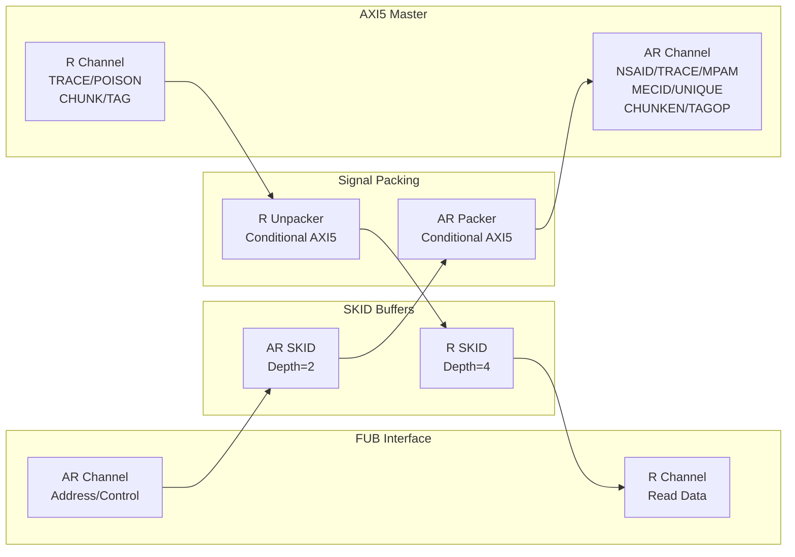

<!-- RTL Design Sherpa Documentation Header -->
<table>
<tr>
<td width="80">
  <a href="https://github.com/sean-galloway/RTLDesignSherpa">
    
  </a>
</td>
<td>
  <strong>RTL Design Sherpa</strong> · <em>Learning Hardware Design Through Practice</em><br>
  <sub>
    <a href="https://github.com/sean-galloway/RTLDesignSherpa">GitHub</a> ·
    <a href="https://github.com/sean-galloway/RTLDesignSherpa/blob/main/docs/DOCUMENTATION_INDEX.md">Documentation Index</a> ·
    <a href="https://github.com/sean-galloway/RTLDesignSherpa/blob/main/LICENSE">MIT License</a>
  </sub>
</td>
</tr>
</table>

---

<!-- End Header -->

# AXI5 Master Read

**Module:** `axi5_master_rd.sv`
**Location:** `rtl/amba/axi5/`
**Status:** Production Ready

---

## Overview

The AXI5 Master Read module implements a complete AMBA AXI5 master read interface with full AXI5 protocol support including all new AXI5 extensions. It provides SKID buffering for improved system performance and flow control.

### Key Features

- Full AMBA AXI5 protocol compliance
- **ARNSAID:** Non-secure access identifier for security domains
- **ARTRACE:** Trace signal for debug and performance monitoring
- **ARMPAM:** Memory Partitioning and Monitoring (PartID + PMG)
- **ARMECID:** Memory Encryption Context ID for secure memory
- **ARUNIQUE:** Unique ID indicator for cache operations
- **ARCHUNKEN:** Read data chunking enable for partial data transfers
- **ARTAGOP:** Memory tag operation (MTE - Memory Tagging Extension)
- **RTRACE:** Read data trace signal
- **RPOISON:** Data poison indicator for corrupted data detection
- **RCHUNKV/RCHUNKNUM/RCHUNKSTRB:** Chunking control signals
- **RTAG/RTAGMATCH:** Memory tags and tag match response (MTE)
- Configurable SKID buffer depths for AR and R channels
- Busy signal for power management and clock gating
- Removed ARREGION (deprecated in AXI5)

---

## Module Architecture



---

## Parameters

| Parameter | Type | Default | Description |
|-----------|------|---------|-------------|
| SKID_DEPTH_AR | int | 2 | AR channel SKID buffer depth |
| SKID_DEPTH_R | int | 4 | R channel SKID buffer depth |
| AXI_ID_WIDTH | int | 8 | Transaction ID width |
| AXI_ADDR_WIDTH | int | 32 | Address bus width |
| AXI_DATA_WIDTH | int | 32 | Data bus width |
| AXI_USER_WIDTH | int | 1 | User signal width |
| AXI_WSTRB_WIDTH | int | DATA_WIDTH/8 | Write strobe width (calculated) |
| AXI_NSAID_WIDTH | int | 4 | Non-secure access ID width |
| AXI_MPAM_WIDTH | int | 11 | MPAM width (PartID + PMG) |
| AXI_MECID_WIDTH | int | 16 | Memory encryption context ID width |
| AXI_TAG_WIDTH | int | 4 | Memory tag width per 16 bytes |
| AXI_TAGOP_WIDTH | int | 2 | Tag operation width |
| AXI_CHUNKNUM_WIDTH | int | 4 | Chunk number width |
| ENABLE_NSAID | bit | 1 | Enable non-secure access ID |
| ENABLE_TRACE | bit | 1 | Enable trace signals |
| ENABLE_MPAM | bit | 1 | Enable memory partitioning |
| ENABLE_MECID | bit | 1 | Enable memory encryption context |
| ENABLE_UNIQUE | bit | 1 | Enable unique ID indicator |
| ENABLE_CHUNKING | bit | 1 | Enable data chunking |
| ENABLE_MTE | bit | 1 | Enable Memory Tagging Extension |
| ENABLE_POISON | bit | 1 | Enable poison indicator |

---

## Ports

### Clock and Reset

| Port | Width | Direction | Description |
|------|-------|-----------|-------------|
| aclk | 1 | Input | AXI clock |
| aresetn | 1 | Input | AXI active-low reset |

### FUB AXI5 Interface (Slave Side - Input)

#### AR Channel

| Port | Width | Direction | Description |
|------|-------|-----------|-------------|
| fub_axi_arid | IW | Input | Read address ID |
| fub_axi_araddr | AW | Input | Read address |
| fub_axi_arlen | 8 | Input | Burst length |
| fub_axi_arsize | 3 | Input | Burst size |
| fub_axi_arburst | 2 | Input | Burst type |
| fub_axi_arlock | 1 | Input | Lock type |
| fub_axi_arcache | 4 | Input | Cache attributes |
| fub_axi_arprot | 3 | Input | Protection attributes |
| fub_axi_arqos | 4 | Input | Quality of Service |
| fub_axi_aruser | UW | Input | User-defined signal |
| fub_axi_arvalid | 1 | Input | Read address valid |
| fub_axi_arready | 1 | Output | Read address ready |

#### AXI5 AR Extensions

| Port | Width | Direction | Description |
|------|-------|-----------|-------------|
| fub_axi_arnsaid | AXI_NSAID_WIDTH | Input | Non-secure access ID |
| fub_axi_artrace | 1 | Input | Trace signal |
| fub_axi_armpam | AXI_MPAM_WIDTH | Input | Memory partitioning/monitoring |
| fub_axi_armecid | AXI_MECID_WIDTH | Input | Memory encryption context ID |
| fub_axi_arunique | 1 | Input | Unique ID indicator |
| fub_axi_archunken | 1 | Input | Chunking enable |
| fub_axi_artagop | AXI_TAGOP_WIDTH | Input | Tag operation (MTE) |

#### R Channel

| Port | Width | Direction | Description |
|------|-------|-----------|-------------|
| fub_axi_rid | IW | Output | Read data ID |
| fub_axi_rdata | DW | Output | Read data |
| fub_axi_rresp | 2 | Output | Read response |
| fub_axi_rlast | 1 | Output | Last transfer in burst |
| fub_axi_ruser | UW | Output | User-defined signal |
| fub_axi_rvalid | 1 | Output | Read data valid |
| fub_axi_rready | 1 | Input | Read data ready |

#### AXI5 R Extensions

| Port | Width | Direction | Description |
|------|-------|-----------|-------------|
| fub_axi_rtrace | 1 | Output | Trace signal |
| fub_axi_rpoison | 1 | Output | Data poison indicator |
| fub_axi_rchunkv | 1 | Output | Chunk valid |
| fub_axi_rchunknum | AXI_CHUNKNUM_WIDTH | Output | Chunk number |
| fub_axi_rchunkstrb | CHUNK_STRB_WIDTH | Output | Chunk strobe (128-bit granules) |
| fub_axi_rtag | TW | Output | Memory tags (NUM_TAGS × TAG_WIDTH) |
| fub_axi_rtagmatch | 1 | Output | Tag match response |

### Master AXI5 Interface (Output Side)

Same port list as FUB interface but with `m_axi_*` prefix and reversed directions.

### Status Outputs

| Port | Width | Direction | Description |
|------|-------|-----------|-------------|
| busy | 1 | Output | Module busy indicator for clock gating |

---

## Functionality

### AXI5 Enhancements Over AXI4

**Security and Isolation:**
- **ARNSAID:** Identifies security domain for non-secure accesses
- **ARMECID:** Provides encryption context for secure memory regions

**Performance and Monitoring:**
- **ARTRACE:** Enables performance trace and debug capabilities
- **ARMPAM:** Supports memory bandwidth partitioning and QoS

**Advanced Features:**
- **ARUNIQUE:** Indicates unique cache line access (no sharing)
- **ARCHUNKEN:** Enables partial data transfer (chunking)
- **ARTAGOP/RTAG/RTAGMATCH:** Memory Tagging Extension for security

**Data Integrity:**
- **RPOISON:** Flags corrupted or invalid data
- **RCHUNKV/RCHUNKNUM/RCHUNKSTRB:** Controls chunked data transfers

**Deprecated:**
- **ARREGION:** Removed (not recommended for new designs)

### Signal Packing Logic

The module uses dynamic packing based on feature enables:

```systemverilog
// AR channel packed conditionally
if (ENABLE_NSAID)    → pack ARNSAID
if (ENABLE_TRACE)    → pack ARTRACE
if (ENABLE_MPAM)     → pack ARMPAM
if (ENABLE_MECID)    → pack ARMECID
if (ENABLE_UNIQUE)   → pack ARUNIQUE
if (ENABLE_CHUNKING) → pack ARCHUNKEN
if (ENABLE_MTE)      → pack ARTAGOP

// R channel unpacked conditionally
if (ENABLE_TRACE)    → unpack RTRACE
if (ENABLE_POISON)   → unpack RPOISON
if (ENABLE_CHUNKING) → unpack RCHUNKV/RCHUNKNUM/RCHUNKSTRB
if (ENABLE_MTE)      → unpack RTAG/RTAGMATCH
```

Disabled signals default to 0.

---

## Timing Diagrams

### Basic Read Transaction

<!-- TODO: Add wavedrom timing diagram for AXI5 read transaction -->
```
TODO: Wavedrom timing diagram showing:
- ACLK
- ARID, ARADDR, ARLEN, ARSIZE
- ARVALID, ARREADY
- ARNSAID, ARTRACE, ARMPAM (AXI5 extensions)
- RID, RDATA, RRESP, RLAST
- RVALID, RREADY
- RTRACE, RPOISON (AXI5 extensions)
```

### Chunked Read Transaction

<!-- TODO: Add wavedrom timing diagram for chunked read -->
```
TODO: Wavedrom timing diagram showing:
- ACLK
- ARCHUNKEN assertion
- RCHUNKV, RCHUNKNUM, RCHUNKSTRB
- Partial data transfer pattern
```

### Memory Tagging Extension (MTE)

<!-- TODO: Add wavedrom timing diagram for MTE operation -->
```
TODO: Wavedrom timing diagram showing:
- ARTAGOP encoding
- RTAG delivery with data
- RTAGMATCH response
```

---

## Usage Example

```systemverilog
axi5_master_rd #(
    .AXI_ID_WIDTH       (8),
    .AXI_ADDR_WIDTH     (32),
    .AXI_DATA_WIDTH     (64),
    .AXI_USER_WIDTH     (4),
    .SKID_DEPTH_AR      (2),
    .SKID_DEPTH_R       (4),
    // Enable AXI5 features
    .ENABLE_NSAID       (1),
    .ENABLE_TRACE       (1),
    .ENABLE_MPAM        (1),
    .ENABLE_MECID       (1),
    .ENABLE_UNIQUE      (1),
    .ENABLE_CHUNKING    (1),
    .ENABLE_MTE         (1),
    .ENABLE_POISON      (1)
) u_axi5_master_rd (
    .aclk               (axi_clk),
    .aresetn            (axi_rst_n),

    // FUB interface (slave side)
    .fub_axi_arid       (fub_arid),
    .fub_axi_araddr     (fub_araddr),
    .fub_axi_arlen      (fub_arlen),
    .fub_axi_arsize     (fub_arsize),
    .fub_axi_arburst    (fub_arburst),
    .fub_axi_arlock     (fub_arlock),
    .fub_axi_arcache    (fub_arcache),
    .fub_axi_arprot     (fub_arprot),
    .fub_axi_arqos      (fub_arqos),
    .fub_axi_aruser     (fub_aruser),
    .fub_axi_arvalid    (fub_arvalid),
    .fub_axi_arready    (fub_arready),

    // AXI5 AR extensions
    .fub_axi_arnsaid    (fub_arnsaid),
    .fub_axi_artrace    (fub_artrace),
    .fub_axi_armpam     (fub_armpam),
    .fub_axi_armecid    (fub_armecid),
    .fub_axi_arunique   (fub_arunique),
    .fub_axi_archunken  (fub_archunken),
    .fub_axi_artagop    (fub_artagop),

    // R channel
    .fub_axi_rid        (fub_rid),
    .fub_axi_rdata      (fub_rdata),
    .fub_axi_rresp      (fub_rresp),
    .fub_axi_rlast      (fub_rlast),
    .fub_axi_ruser      (fub_ruser),
    .fub_axi_rvalid     (fub_rvalid),
    .fub_axi_rready     (fub_rready),

    // AXI5 R extensions
    .fub_axi_rtrace     (fub_rtrace),
    .fub_axi_rpoison    (fub_rpoison),
    .fub_axi_rchunkv    (fub_rchunkv),
    .fub_axi_rchunknum  (fub_rchunknum),
    .fub_axi_rchunkstrb (fub_rchunkstrb),
    .fub_axi_rtag       (fub_rtag),
    .fub_axi_rtagmatch  (fub_rtagmatch),

    // Master interface (output side)
    .m_axi_arid         (m_axi_arid),
    .m_axi_araddr       (m_axi_araddr),
    // ... (connect all master signals similarly)

    // Status
    .busy               (master_rd_busy)
);
```

---

## Design Notes

### AXI5 vs AXI4 Differences

| Feature | AXI4 | AXI5 |
|---------|------|------|
| Security domains | None | NSAID |
| Trace support | None | TRACE signals |
| Memory partitioning | None | MPAM |
| Encryption context | None | MECID |
| Unique access | None | UNIQUE |
| Data chunking | None | CHUNKING |
| Memory tagging | None | MTE (TAG/TAGOP) |
| Poison indication | None | POISON |
| Region field | ARREGION | Deprecated |

### Memory Tagging Extension (MTE)

When `ENABLE_MTE=1`:
- **ARTAGOP:** Specifies tag operation (Match/Insert/Fetch)
- **RTAG:** Delivers memory tags (1 tag per 16 bytes of data)
- **RTAGMATCH:** Indicates tag match result
- **NUM_TAGS:** Calculated as (DATA_WIDTH / 128), minimum 1

Example for 128-bit data bus:
- NUM_TAGS = 1
- TW = AXI_TAG_WIDTH × 1 = 4 bits

### Chunking Support

When `ENABLE_CHUNKING=1`:
- **ARCHUNKEN:** Master requests chunked response
- **RCHUNKV:** Indicates chunk is valid
- **RCHUNKNUM:** Identifies chunk within transaction
- **RCHUNKSTRB:** Byte strobes at 128-bit granularity

### Feature Enable Strategy

Disable unused features to reduce area:
```systemverilog
.ENABLE_NSAID    (0),  // No security domains
.ENABLE_TRACE    (0),  // No trace capability
.ENABLE_MPAM     (0),  // No memory partitioning
.ENABLE_MECID    (0),  // No encryption
.ENABLE_UNIQUE   (0),  // No unique access
.ENABLE_CHUNKING (0),  // No chunking
.ENABLE_MTE      (0),  // No memory tagging
.ENABLE_POISON   (0)   // No poison detection
```

---

## Related Documentation

- **[AXI5 Master Write](axi5_master_wr.md)** - Master write interface
- **[AXI5 Slave Read](axi5_slave_rd.md)** - Slave read interface
- **[AXI5 Master Read CG](axi5_master_rd_cg.md)** - Clock-gated variant
- **[AXI5 Master Read Monitor](axi5_master_rd_mon.md)** - With integrated monitoring
- **[AXI4 Master Read](../axi/axi4_master_rd.md)** - AXI4 version for comparison

---

## Navigation

- **[← Back to AXI5 Index](README.md)**
- **[← Back to RTLAmba Index](../index.md)**
- **[← Back to Main Documentation Index](../../index.md)**
