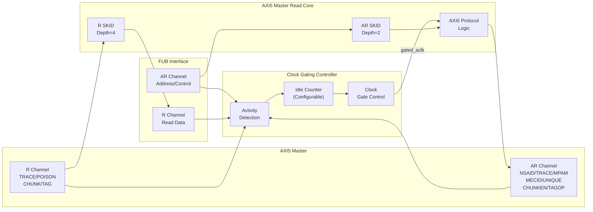

<!-- RTL Design Sherpa Documentation Header -->
<table>
<tr>
<td width="80">
  <a href="https://github.com/sean-galloway/RTLDesignSherpa">
    
  </a>
</td>
<td>
  <strong>RTL Design Sherpa</strong> · <em>Learning Hardware Design Through Practice</em><br>
  <sub>
    <a href="https://github.com/sean-galloway/RTLDesignSherpa">GitHub</a> ·
    <a href="https://github.com/sean-galloway/RTLDesignSherpa/blob/main/docs/DOCUMENTATION_INDEX.md">Documentation Index</a> ·
    <a href="https://github.com/sean-galloway/RTLDesignSherpa/blob/main/LICENSE">MIT License</a>
  </sub>
</td>
</tr>
</table>

---

<!-- End Header -->

# AXI5 Master Read with Clock Gating

**Module:** `axi5_master_rd_cg.sv`
**Location:** `rtl/amba/axi5/`
**Status:** Production Ready

---

## Overview

The AXI5 Master Read with Clock Gating module wraps the standard `axi5_master_rd` core with intelligent clock gating for power optimization. It automatically gates the clock when no AXI activity is detected for a configurable number of idle cycles.

### Key Features

- Full AMBA AXI5 protocol compliance (wraps `axi5_master_rd`)
- **ARNSAID:** Non-secure access identifier for security domains
- **ARTRACE:** Trace signal for debug and performance monitoring
- **ARMPAM:** Memory Partitioning and Monitoring (PartID + PMG)
- **ARMECID:** Memory Encryption Context ID for secure memory
- **ARUNIQUE:** Unique ID indicator for cache operations
- **ARCHUNKEN:** Read data chunking enable for partial data transfers
- **ARTAGOP:** Memory tag operation (MTE - Memory Tagging Extension)
- **RTRACE:** Read data trace signal
- **RPOISON:** Data poison indicator for corrupted data detection
- **RCHUNKV/RCHUNKNUM/RCHUNKSTRB:** Chunking control signals
- **RTAG/RTAGMATCH:** Memory tags and tag match response (MTE)
- **Automatic clock gating** based on activity detection
- **Configurable idle count** before clock gating activates
- **Power savings** during idle periods
- **Transparent operation** - no protocol changes
- **Status outputs** for clock gating state monitoring

---

## Module Architecture



---

## Parameters

| Parameter | Type | Default | Description |
|-----------|------|---------|-------------|
| SKID_DEPTH_AR | int | 2 | AR channel SKID buffer depth |
| SKID_DEPTH_R | int | 4 | R channel SKID buffer depth |
| AXI_ID_WIDTH | int | 8 | Transaction ID width |
| AXI_ADDR_WIDTH | int | 32 | Address bus width |
| AXI_DATA_WIDTH | int | 32 | Data bus width |
| AXI_USER_WIDTH | int | 1 | User signal width |
| AXI_WSTRB_WIDTH | int | DATA_WIDTH/8 | Write strobe width (calculated) |
| AXI_NSAID_WIDTH | int | 4 | Non-secure access ID width |
| AXI_MPAM_WIDTH | int | 11 | MPAM width (PartID + PMG) |
| AXI_MECID_WIDTH | int | 16 | Memory encryption context ID width |
| AXI_TAG_WIDTH | int | 4 | Memory tag width per 16 bytes |
| AXI_TAGOP_WIDTH | int | 2 | Tag operation width |
| AXI_CHUNKNUM_WIDTH | int | 4 | Chunk number width |
| ENABLE_NSAID | bit | 1 | Enable non-secure access ID |
| ENABLE_TRACE | bit | 1 | Enable trace signals |
| ENABLE_MPAM | bit | 1 | Enable memory partitioning |
| ENABLE_MECID | bit | 1 | Enable memory encryption context |
| ENABLE_UNIQUE | bit | 1 | Enable unique ID indicator |
| ENABLE_CHUNKING | bit | 1 | Enable data chunking |
| ENABLE_MTE | bit | 1 | Enable Memory Tagging Extension |
| ENABLE_POISON | bit | 1 | Enable poison indicator |
| **CG_IDLE_COUNT_WIDTH** | int | 4 | Width of idle counter (max 2^N-1 cycles) |

---

## Ports

### Clock and Reset

| Port | Width | Direction | Description |
|------|-------|-----------|-------------|
| aclk | 1 | Input | AXI clock (ungated) |
| aresetn | 1 | Input | AXI active-low reset |

### Clock Gating Configuration

| Port | Width | Direction | Description |
|------|-------|-----------|-------------|
| cfg_cg_enable | 1 | Input | Clock gating enable (1=enable, 0=always active) |
| cfg_cg_idle_count | CG_IDLE_COUNT_WIDTH | Input | Idle cycles before gating activates |

### FUB AXI5 Interface (Slave Side - Input)

#### AR Channel

| Port | Width | Direction | Description |
|------|-------|-----------|-------------|
| fub_axi_arid | IW | Input | Read address ID |
| fub_axi_araddr | AW | Input | Read address |
| fub_axi_arlen | 8 | Input | Burst length |
| fub_axi_arsize | 3 | Input | Burst size |
| fub_axi_arburst | 2 | Input | Burst type |
| fub_axi_arlock | 1 | Input | Lock type |
| fub_axi_arcache | 4 | Input | Cache attributes |
| fub_axi_arprot | 3 | Input | Protection attributes |
| fub_axi_arqos | 4 | Input | Quality of Service |
| fub_axi_aruser | UW | Input | User-defined signal |
| fub_axi_arvalid | 1 | Input | Read address valid |
| fub_axi_arready | 1 | Output | Read address ready (forced 0 when gating) |

#### AXI5 AR Extensions

| Port | Width | Direction | Description |
|------|-------|-----------|-------------|
| fub_axi_arnsaid | AXI_NSAID_WIDTH | Input | Non-secure access ID |
| fub_axi_artrace | 1 | Input | Trace signal |
| fub_axi_armpam | AXI_MPAM_WIDTH | Input | Memory partitioning/monitoring |
| fub_axi_armecid | AXI_MECID_WIDTH | Input | Memory encryption context ID |
| fub_axi_arunique | 1 | Input | Unique ID indicator |
| fub_axi_archunken | 1 | Input | Chunking enable |
| fub_axi_artagop | AXI_TAGOP_WIDTH | Input | Tag operation (MTE) |

#### R Channel

| Port | Width | Direction | Description |
|------|-------|-----------|-------------|
| fub_axi_rid | IW | Output | Read data ID |
| fub_axi_rdata | DW | Output | Read data |
| fub_axi_rresp | 2 | Output | Read response |
| fub_axi_rlast | 1 | Output | Last transfer in burst |
| fub_axi_ruser | UW | Output | User-defined signal |
| fub_axi_rvalid | 1 | Output | Read data valid |
| fub_axi_rready | 1 | Input | Read data ready |

#### AXI5 R Extensions

| Port | Width | Direction | Description |
|------|-------|-----------|-------------|
| fub_axi_rtrace | 1 | Output | Trace signal |
| fub_axi_rpoison | 1 | Output | Data poison indicator |
| fub_axi_rchunkv | 1 | Output | Chunk valid |
| fub_axi_rchunknum | AXI_CHUNKNUM_WIDTH | Output | Chunk number |
| fub_axi_rchunkstrb | CHUNK_STRB_WIDTH | Output | Chunk strobe (128-bit granules) |
| fub_axi_rtag | TW | Output | Memory tags (NUM_TAGS × TAG_WIDTH) |
| fub_axi_rtagmatch | 1 | Output | Tag match response |

### Master AXI5 Interface (Output Side)

Same port list as FUB interface but with `m_axi_*` prefix and reversed directions.

### Clock Gating Status Outputs

| Port | Width | Direction | Description |
|------|-------|-----------|-------------|
| cg_gating | 1 | Output | Clock gating active (1=clock gated, 0=clock running) |
| cg_idle | 1 | Output | Interface idle (1=no activity detected) |

---

## Functionality

### Clock Gating Operation

The clock gating controller monitors activity on both user and AXI sides:

**User-side activity detection:**
```systemverilog
user_valid = fub_axi_arvalid || fub_axi_rready || int_busy
```

**AXI-side activity detection:**
```systemverilog
axi_valid = m_axi_arvalid || m_axi_rvalid
```

**Clock gating state machine:**
1. **ACTIVE:** Clock running, transactions in progress
2. **IDLE:** No activity detected, idle counter incrementing
3. **GATING:** Idle count reached, clock gated (power saving)
4. **WAKE:** Activity detected, clock ungating

**Ready signal control during gating:**
```systemverilog
fub_axi_arready = cg_gating ? 1'b0 : int_arready;
m_axi_rready = cg_gating ? 1'b0 : int_rready;
```

### Idle Counter Configuration

The `cfg_cg_idle_count` parameter sets how many consecutive idle cycles are required before clock gating activates:

| cfg_cg_idle_count | Idle Cycles | Use Case |
|-------------------|-------------|----------|
| 0 | 1 cycle | Aggressive power saving |
| 1-3 | 2-4 cycles | Balanced (typical) |
| 4-7 | 5-8 cycles | Low-latency systems |
| 8-15 | 9-16 cycles | Minimize gating overhead |

**Recommendation:** Start with `cfg_cg_idle_count = 3` (4 idle cycles) for most applications.

### Power Savings Analysis

**Clock gating effectiveness:**
- Dynamic power reduction proportional to idle time
- Typical savings: 20-40% in bursty traffic scenarios
- Maximum savings: >90% in mostly-idle systems

**Trade-offs:**
- Wake latency: 1-2 clock cycles
- Area increase: ~5% (clock gating logic)
- Best suited for: Intermittent traffic patterns

---

## Timing Diagrams

### Clock Gating Activation

<!-- TODO: Add wavedrom timing diagram for clock gating activation -->
```
TODO: Wavedrom timing diagram showing:
- ACLK (ungated)
- GATED_ACLK (gated clock)
- user_valid, axi_valid activity
- Idle counter incrementing
- cg_idle assertion
- cg_gating activation
- Clock stops after idle count
```

### Clock Gating Wake-up

<!-- TODO: Add wavedrom timing diagram for clock gating wake-up -->
```
TODO: Wavedrom timing diagram showing:
- ACLK (ungated)
- GATED_ACLK resuming
- Activity detection (arvalid assertion)
- cg_gating deactivation
- arready response after wake
- Normal AXI transaction proceeds
```

---

## Usage Example

```systemverilog
axi5_master_rd_cg #(
    .AXI_ID_WIDTH       (8),
    .AXI_ADDR_WIDTH     (32),
    .AXI_DATA_WIDTH     (64),
    .AXI_USER_WIDTH     (4),
    .SKID_DEPTH_AR      (2),
    .SKID_DEPTH_R       (4),
    // Enable AXI5 features
    .ENABLE_NSAID       (1),
    .ENABLE_TRACE       (1),
    .ENABLE_MPAM        (1),
    .ENABLE_MECID       (1),
    .ENABLE_UNIQUE      (1),
    .ENABLE_CHUNKING    (1),
    .ENABLE_MTE         (1),
    .ENABLE_POISON      (1),
    // Clock gating configuration
    .CG_IDLE_COUNT_WIDTH (4)
) u_axi5_master_rd_cg (
    .aclk               (axi_clk),
    .aresetn            (axi_rst_n),

    // Clock gating configuration
    .cfg_cg_enable      (power_save_enable),
    .cfg_cg_idle_count  (4'd3),  // Gate after 4 idle cycles

    // FUB interface (slave side)
    .fub_axi_arid       (fub_arid),
    .fub_axi_araddr     (fub_araddr),
    .fub_axi_arlen      (fub_arlen),
    .fub_axi_arsize     (fub_arsize),
    .fub_axi_arburst    (fub_arburst),
    .fub_axi_arlock     (fub_arlock),
    .fub_axi_arcache    (fub_arcache),
    .fub_axi_arprot     (fub_arprot),
    .fub_axi_arqos      (fub_arqos),
    .fub_axi_aruser     (fub_aruser),
    .fub_axi_arvalid    (fub_arvalid),
    .fub_axi_arready    (fub_arready),

    // AXI5 AR extensions
    .fub_axi_arnsaid    (fub_arnsaid),
    .fub_axi_artrace    (fub_artrace),
    .fub_axi_armpam     (fub_armpam),
    .fub_axi_armecid    (fub_armecid),
    .fub_axi_arunique   (fub_arunique),
    .fub_axi_archunken  (fub_archunken),
    .fub_axi_artagop    (fub_artagop),

    // R channel
    .fub_axi_rid        (fub_rid),
    .fub_axi_rdata      (fub_rdata),
    .fub_axi_rresp      (fub_rresp),
    .fub_axi_rlast      (fub_rlast),
    .fub_axi_ruser      (fub_ruser),
    .fub_axi_rvalid     (fub_rvalid),
    .fub_axi_rready     (fub_rready),

    // AXI5 R extensions
    .fub_axi_rtrace     (fub_rtrace),
    .fub_axi_rpoison    (fub_rpoison),
    .fub_axi_rchunkv    (fub_rchunkv),
    .fub_axi_rchunknum  (fub_rchunknum),
    .fub_axi_rchunkstrb (fub_rchunkstrb),
    .fub_axi_rtag       (fub_rtag),
    .fub_axi_rtagmatch  (fub_rtagmatch),

    // Master interface (output side)
    .m_axi_arid         (m_axi_arid),
    .m_axi_araddr       (m_axi_araddr),
    // ... (connect all master signals similarly)

    // Clock gating status
    .cg_gating          (clock_gated),
    .cg_idle            (interface_idle)
);

// Use status signals for power monitoring
always_ff @(posedge axi_clk or negedge axi_rst_n) begin
    if (!axi_rst_n)
        power_cycles_saved <= '0;
    else if (clock_gated)
        power_cycles_saved <= power_cycles_saved + 1;
end
```

---

## Design Notes

### Clock Gating vs. Always-On

| Aspect | Always-On | Clock Gated |
|--------|-----------|-------------|
| Power (idle) | 100% | 10-30% |
| Wake latency | 0 cycles | 1-2 cycles |
| Area overhead | 0% | ~5% |
| Best for | Continuous traffic | Bursty traffic |

### Configuration Strategies

**Aggressive Power Saving:**
```systemverilog
.cfg_cg_enable      (1'b1),
.cfg_cg_idle_count  (4'd0)   // Gate immediately after idle
```

**Balanced (Recommended):**
```systemverilog
.cfg_cg_enable      (1'b1),
.cfg_cg_idle_count  (4'd3)   // Gate after 4 idle cycles
```

**Low-Latency:**
```systemverilog
.cfg_cg_enable      (1'b1),
.cfg_cg_idle_count  (4'd7)   // Gate after 8 idle cycles
```

**Disabled (Always-On):**
```systemverilog
.cfg_cg_enable      (1'b0),
.cfg_cg_idle_count  (4'd0)   // Ignored when disabled
```

### Integration with System Power Management

The clock gating status outputs can integrate with broader system power management:

```systemverilog
// Aggregate clock gating status
assign system_power_state = {
    axi_rd_cg.cg_gating,
    axi_wr_cg.cg_gating,
    apb_cg.cg_gating
    // ... other clock-gated modules
};

// Enter deep sleep when all interfaces gated
assign deep_sleep_ok = &system_power_state;
```

### Verification Considerations

When verifying clock-gated designs:
1. Test with `cfg_cg_enable = 0` first (baseline)
2. Enable clock gating and verify identical functional behavior
3. Check wake latency meets timing requirements
4. Verify no protocol violations during gating/ungating
5. Measure power savings in representative traffic scenarios

---

## Related Documentation

- **[AXI5 Master Read](axi5_master_rd.md)** - Non-gated base module
- **[AXI5 Master Write CG](axi5_master_wr_cg.md)** - Write with clock gating
- **[AXI5 Master Read Monitor CG](axi5_master_rd_mon_cg.md)** - With monitoring + clock gating
- **[AMBA Clock Gate Controller](../shared/amba_clock_gate_ctrl.md)** - Clock gating controller spec

---

## Navigation

- **[← Back to AXI5 Index](README.md)**
- **[← Back to RTLAmba Index](../index.md)**
- **[← Back to Main Documentation Index](../../index.md)**
