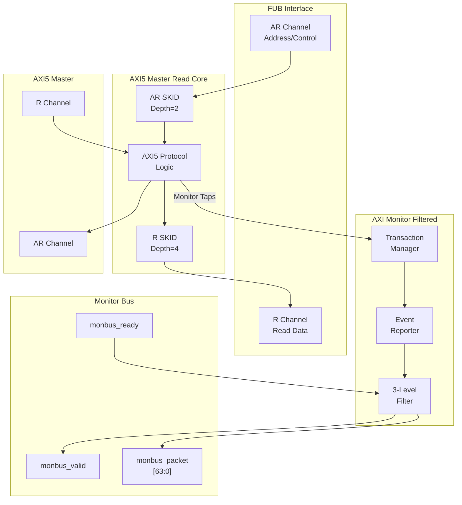

<!-- RTL Design Sherpa Documentation Header -->
<table>
<tr>
<td width="80">
  <a href="https://github.com/sean-galloway/RTLDesignSherpa">
    
  </a>
</td>
<td>
  <strong>RTL Design Sherpa</strong> · <em>Learning Hardware Design Through Practice</em><br>
  <sub>
    <a href="https://github.com/sean-galloway/RTLDesignSherpa">GitHub</a> ·
    <a href="https://github.com/sean-galloway/RTLDesignSherpa/blob/main/docs/DOCUMENTATION_INDEX.md">Documentation Index</a> ·
    <a href="https://github.com/sean-galloway/RTLDesignSherpa/blob/main/LICENSE">MIT License</a>
  </sub>
</td>
</tr>
</table>

---

<!-- End Header -->

# AXI5 Master Read with Monitor

**Module:** `axi5_master_rd_mon.sv`
**Location:** `rtl/amba/axi5/`
**Status:** Production Ready

---

## Overview

The AXI5 Master Read with Monitor module combines the standard `axi5_master_rd` core with an integrated `axi_monitor_filtered` for comprehensive transaction monitoring and error detection. This module provides real-time visibility into AXI5 read operations with configurable packet filtering.

### Key Features

- Full AMBA AXI5 protocol compliance (wraps `axi5_master_rd`)
- **ARNSAID:** Non-secure access identifier for security domains
- **ARTRACE:** Trace signal for debug and performance monitoring
- **ARMPAM:** Memory Partitioning and Monitoring (PartID + PMG)
- **ARMECID:** Memory Encryption Context ID for secure memory
- **ARUNIQUE:** Unique ID indicator for cache operations
- **ARCHUNKEN:** Read data chunking enable for partial data transfers
- **ARTAGOP:** Memory tag operation (MTE - Memory Tagging Extension)
- **RTRACE:** Read data trace signal
- **RPOISON:** Data poison indicator for corrupted data detection
- **RCHUNKV/RCHUNKNUM/RCHUNKSTRB:** Chunking control signals
- **RTAG/RTAGMATCH:** Memory tags and tag match response (MTE)
- **Integrated AXI monitor** with 3-level filtering hierarchy
- **Error detection:** Protocol violations, SLVERR, DECERR
- **Timeout monitoring:** Stuck transactions, stalled channels
- **Performance metrics:** Latency, throughput, outstanding transactions
- **MonBus output:** Standardized 64-bit monitor packet format
- **Configuration validation:** Detects filter conflicts

---

## Module Architecture



---

## Parameters

| Parameter | Type | Default | Description |
|-----------|------|---------|-------------|
| SKID_DEPTH_AR | int | 2 | AR channel SKID buffer depth |
| SKID_DEPTH_R | int | 4 | R channel SKID buffer depth |
| AXI_ID_WIDTH | int | 8 | Transaction ID width |
| AXI_ADDR_WIDTH | int | 32 | Address bus width |
| AXI_DATA_WIDTH | int | 32 | Data bus width |
| AXI_USER_WIDTH | int | 1 | User signal width |
| AXI_WSTRB_WIDTH | int | DATA_WIDTH/8 | Write strobe width (calculated) |
| AXI_NSAID_WIDTH | int | 4 | Non-secure access ID width |
| AXI_MPAM_WIDTH | int | 11 | MPAM width (PartID + PMG) |
| AXI_MECID_WIDTH | int | 16 | Memory encryption context ID width |
| AXI_TAG_WIDTH | int | 4 | Memory tag width per 16 bytes |
| AXI_TAGOP_WIDTH | int | 2 | Tag operation width |
| AXI_CHUNKNUM_WIDTH | int | 4 | Chunk number width |
| ENABLE_NSAID | bit | 1 | Enable non-secure access ID |
| ENABLE_TRACE | bit | 1 | Enable trace signals |
| ENABLE_MPAM | bit | 1 | Enable memory partitioning |
| ENABLE_MECID | bit | 1 | Enable memory encryption context |
| ENABLE_UNIQUE | bit | 1 | Enable unique ID indicator |
| ENABLE_CHUNKING | bit | 1 | Enable data chunking |
| ENABLE_MTE | bit | 1 | Enable Memory Tagging Extension |
| ENABLE_POISON | bit | 1 | Enable poison indicator |
| **UNIT_ID** | int | 1 | Monitor unit identifier |
| **AGENT_ID** | int | 10 | Monitor agent identifier |
| **MAX_TRANSACTIONS** | int | 16 | Transaction table size |
| **ENABLE_FILTERING** | bit | 1 | Enable 3-level packet filtering |
| **ADD_PIPELINE_STAGE** | bit | 0 | Add pipeline stage in monitor (latency vs. timing) |

---

## Ports

### Clock and Reset

| Port | Width | Direction | Description |
|------|-------|-----------|-------------|
| aclk | 1 | Input | AXI clock |
| aresetn | 1 | Input | AXI active-low reset |

### FUB AXI5 Interface (Slave Side)

Same as `axi5_master_rd` - see [AXI5 Master Read](axi5_master_rd.md) for complete port listing.

### Master AXI5 Interface (Output Side)

Same as `axi5_master_rd` - see [AXI5 Master Read](axi5_master_rd.md) for complete port listing.

### Monitor Configuration

| Port | Width | Direction | Description |
|------|-------|-----------|-------------|
| cfg_monitor_enable | 1 | Input | Enable completion packet generation |
| cfg_error_enable | 1 | Input | Enable error packet generation |
| cfg_timeout_enable | 1 | Input | Enable timeout packet generation |
| cfg_perf_enable | 1 | Input | Enable performance packet generation |
| cfg_timeout_cycles | 16 | Input | Timeout threshold (clock cycles) |
| cfg_latency_threshold | 32 | Input | Latency threshold for performance alerts |

### AXI Protocol Filtering Configuration

| Port | Width | Direction | Description |
|------|-------|-----------|-------------|
| cfg_axi_pkt_mask | 16 | Input | Packet type filter (Level 1) |
| cfg_axi_err_select | 16 | Input | Error routing configuration (Level 2) |
| cfg_axi_error_mask | 16 | Input | Error event filter (Level 3) |
| cfg_axi_timeout_mask | 16 | Input | Timeout event filter (Level 3) |
| cfg_axi_compl_mask | 16 | Input | Completion event filter (Level 3) |
| cfg_axi_thresh_mask | 16 | Input | Threshold event filter (Level 3) |
| cfg_axi_perf_mask | 16 | Input | Performance event filter (Level 3) |
| cfg_axi_addr_mask | 16 | Input | Address event filter (Level 3) |
| cfg_axi_debug_mask | 16 | Input | Debug event filter (Level 3) |

### Monitor Bus Output

| Port | Width | Direction | Description |
|------|-------|-----------|-------------|
| monbus_valid | 1 | Output | Monitor packet valid |
| monbus_ready | 1 | Input | Monitor packet ready (backpressure) |
| monbus_packet | 64 | Output | Monitor packet data |

### Status Outputs

| Port | Width | Direction | Description |
|------|-------|-----------|-------------|
| busy | 1 | Output | Core busy indicator |
| active_transactions | 8 | Output | Number of outstanding transactions |
| error_count | 16 | Output | Cumulative error count (placeholder) |
| transaction_count | 32 | Output | Total transaction count (placeholder) |
| cfg_conflict_error | 1 | Output | Configuration conflict detected |

---

## Functionality

### Monitor Bus Packet Format

Monitor packets are 64-bit standardized format:

```
[63:60] Packet Type:
    0x0 = ERROR     (Protocol violations, SLVERR, DECERR)
    0x1 = COMPL     (Transaction completions)
    0x2 = TIMEOUT   (Stuck transactions)
    0x3 = THRESH    (Threshold violations)
    0x4 = PERF      (Performance metrics)
    0x5 = ADDR      (Address tracking)
    0x6 = DEBUG     (Debug information)

[59:57] Protocol:
    0x0 = AXI       (This module)
    0x1 = APB
    0x2 = AXIS

[56:53] Event Code (type-specific)

[52:47] Channel ID (transaction ID)

[46:43] Unit ID (from UNIT_ID parameter)

[42:35] Agent ID (from AGENT_ID parameter)

[34:0]  Event Data (address, latency, error code, etc.)
```

### Three-Level Filtering Hierarchy

**Level 1: Packet Type Mask (cfg_axi_pkt_mask)**
```systemverilog
cfg_axi_pkt_mask[0] = 1 → Enable ERROR packets
cfg_axi_pkt_mask[1] = 1 → Enable COMPL packets
cfg_axi_pkt_mask[2] = 1 → Enable TIMEOUT packets
cfg_axi_pkt_mask[3] = 1 → Enable THRESH packets
cfg_axi_pkt_mask[4] = 1 → Enable PERF packets
cfg_axi_pkt_mask[5] = 1 → Enable ADDR packets
cfg_axi_pkt_mask[6] = 1 → Enable DEBUG packets
```

**Level 2: Error Routing (cfg_axi_err_select)**

Determines whether errors generate ERROR packets or COMPL packets with error status.

**Level 3: Event Masks (cfg_axi_*_mask)**

Fine-grained control over specific events within each packet type:
- `cfg_axi_error_mask`: SLVERR, DECERR, orphan detection, etc.
- `cfg_axi_timeout_mask`: AR timeout, R timeout, response timeout
- `cfg_axi_compl_mask`: Normal completion, error completion
- `cfg_axi_thresh_mask`: Outstanding transaction count, latency threshold
- `cfg_axi_perf_mask`: Average latency, peak bandwidth, utilization
- `cfg_axi_addr_mask`: Address range tracking
- `cfg_axi_debug_mask`: Internal state, debug events

### Error Detection Events

The monitor detects and reports:

**Protocol Errors:**
- AR handshake violations
- R handshake violations
- ID width mismatches
- Burst length violations
- Unaligned addresses

**Response Errors:**
- SLVERR (slave error response)
- DECERR (decode error response)
- Orphaned read data (no matching AR)
- ID mismatch (RID != ARID)

**Timeout Errors:**
- AR channel stall (no ARREADY)
- R channel stall (no RVALID)
- Transaction timeout (AR to RLAST)

**Threshold Violations:**
- Outstanding transaction count > threshold
- Transaction latency > cfg_latency_threshold

### Configuration Conflict Detection

The `cfg_conflict_error` output flags invalid configurations:

```systemverilog
// Example conflict: COMPL and PERF both enabled
if (cfg_monitor_enable && cfg_perf_enable)
    cfg_conflict_error = 1;  // Packet congestion risk!
```

Recommended: Enable only ONE high-traffic packet type at a time.

---

## Timing Diagrams

### Monitored Read Transaction with Error

<!-- TODO: Add wavedrom timing diagram -->
```
TODO: Wavedrom timing diagram showing:
- ACLK
- AR channel: ARID, ARADDR, ARVALID, ARREADY
- R channel: RID, RDATA, RRESP (SLVERR), RVALID, RREADY
- Monitor bus: monbus_valid, monbus_packet showing ERROR packet
- Event sequence: AR → R error → ERROR packet generated
```

### Timeout Detection

<!-- TODO: Add wavedrom timing diagram -->
```
TODO: Wavedrom timing diagram showing:
- ACLK
- AR channel: ARVALID asserted, ARREADY stuck low
- Timeout counter incrementing
- cfg_timeout_cycles threshold
- Monitor bus: monbus_valid, monbus_packet showing TIMEOUT packet
```

### Performance Monitoring

<!-- TODO: Add wavedrom timing diagram -->
```
TODO: Wavedrom timing diagram showing:
- Multiple read transactions
- Latency measurement (AR to RLAST)
- Monitor bus: PERF packets with latency data
- Threshold comparison with cfg_latency_threshold
```

---

## Usage Example

### Functional Verification Configuration

```systemverilog
axi5_master_rd_mon #(
    .AXI_ID_WIDTH       (8),
    .AXI_ADDR_WIDTH     (32),
    .AXI_DATA_WIDTH     (64),
    .AXI_USER_WIDTH     (4),
    .SKID_DEPTH_AR      (2),
    .SKID_DEPTH_R       (4),
    // Enable AXI5 features
    .ENABLE_NSAID       (1),
    .ENABLE_TRACE       (1),
    .ENABLE_MPAM        (1),
    .ENABLE_MECID       (1),
    .ENABLE_UNIQUE      (1),
    .ENABLE_CHUNKING    (1),
    .ENABLE_MTE         (1),
    .ENABLE_POISON      (1),
    // Monitor configuration
    .UNIT_ID            (1),
    .AGENT_ID           (10),
    .MAX_TRANSACTIONS   (16),
    .ENABLE_FILTERING   (1)
) u_axi5_master_rd_mon (
    .aclk               (axi_clk),
    .aresetn            (axi_rst_n),

    // FUB and Master interfaces
    // ... (connect AXI5 signals)

    // Monitor configuration - FUNCTIONAL DEBUG MODE
    .cfg_monitor_enable (1'b1),        // Enable completions
    .cfg_error_enable   (1'b1),        // Enable errors
    .cfg_timeout_enable (1'b1),        // Enable timeouts
    .cfg_perf_enable    (1'b0),        // DISABLE (high traffic)
    .cfg_timeout_cycles (16'd1000),    // 1000 cycle timeout
    .cfg_latency_threshold (32'd500),  // 500 cycle threshold

    // Level 1: Enable ERROR, COMPL, TIMEOUT packets
    .cfg_axi_pkt_mask   (16'h0007),    // [2:0] = ERROR|COMPL|TIMEOUT

    // Level 2: Route errors to ERROR packets
    .cfg_axi_err_select (16'h0001),    // Generate ERROR packets

    // Level 3: Enable all error events
    .cfg_axi_error_mask (16'hFFFF),    // All errors
    .cfg_axi_timeout_mask (16'hFFFF),  // All timeouts
    .cfg_axi_compl_mask (16'hFFFF),    // All completions

    // Monitor bus output
    .monbus_valid       (mon_valid),
    .monbus_ready       (mon_ready),
    .monbus_packet      (mon_pkt),

    // Status
    .busy               (master_busy),
    .active_transactions (active_trans),
    .cfg_conflict_error (cfg_error)
);

// Downstream FIFO for monitor packets
gaxi_fifo_sync #(
    .DATA_WIDTH (64),
    .DEPTH      (256)
) u_mon_fifo (
    .i_clk      (axi_clk),
    .i_rst_n    (axi_rst_n),
    .i_valid    (mon_valid),
    .i_data     (mon_pkt),
    .o_ready    (mon_ready),
    .o_valid    (fifo_valid),
    .o_data     (fifo_pkt),
    .i_ready    (consumer_ready)
);
```

### Performance Analysis Configuration

```systemverilog
// Monitor configuration - PERFORMANCE MODE
.cfg_monitor_enable (1'b0),        // DISABLE completions
.cfg_error_enable   (1'b1),        // Keep errors enabled
.cfg_timeout_enable (1'b0),        // DISABLE timeouts
.cfg_perf_enable    (1'b1),        // ENABLE performance
.cfg_timeout_cycles (16'd1000),
.cfg_latency_threshold (32'd500),

// Level 1: Enable ERROR and PERF packets only
.cfg_axi_pkt_mask   (16'h0011),    // ERROR | PERF

// Level 3: Enable performance metrics
.cfg_axi_error_mask (16'hFFFF),    // All errors
.cfg_axi_perf_mask  (16'hFFFF),    // All perf metrics
```

---

## Design Notes

### Configuration Best Practices

**CRITICAL: Never enable COMPL + PERF simultaneously!**

High packet volume can overwhelm monitor bus and cause backpressure.

**Recommended Configurations:**

| Use Case | Enabled Packet Types | Notes |
|----------|---------------------|-------|
| Functional debug | ERROR + COMPL + TIMEOUT | Catches bugs, monitors correctness |
| Performance tuning | ERROR + PERF | Latency, throughput metrics |
| Protocol compliance | ERROR + TIMEOUT | Minimal overhead |
| Deep debug | ERROR + DEBUG | Internal state visibility |

### Transaction Table Sizing

`MAX_TRANSACTIONS` must accommodate maximum outstanding reads:

| AXI Configuration | Recommended MAX_TRANSACTIONS |
|------------------|------------------------------|
| Single outstanding | 4 |
| Moderate pipelining | 16 |
| Deep pipelining | 32-64 |
| High-performance | 128+ |

### Filtering Strategy

**Start broad, then narrow:**
1. Enable all packet types initially
2. Identify high-traffic events
3. Mask low-value events with Level 3 filters
4. Separate configurations for different test phases

### Monitor Bus Backpressure

The monitor respects `monbus_ready` backpressure:
- Packets buffered internally when `monbus_ready = 0`
- Oldest packets dropped if buffer full
- **Always add downstream FIFO** for robustness

---

## Related Documentation

- **[AXI5 Master Read](axi5_master_rd.md)** - Base module without monitoring
- **[AXI5 Master Read CG](axi5_master_rd_cg.md)** - With clock gating only
- **[AXI5 Master Read Monitor CG](axi5_master_rd_mon_cg.md)** - Monitor + clock gating
- **[AXI Monitor Filtered](../shared/axi_monitor_filtered.md)** - Monitor core specification
- **[Monitor Package Spec](../includes/monitor_package_spec.md)** - Packet format details
- **[AXI Monitor Configuration Guide](../../../../AXI_Monitor_Configuration_Guide.md)** - Complete configuration reference

---

## Navigation

- **[← Back to AXI5 Index](README.md)**
- **[← Back to RTLAmba Index](../index.md)**
- **[← Back to Main Documentation Index](../../index.md)**
