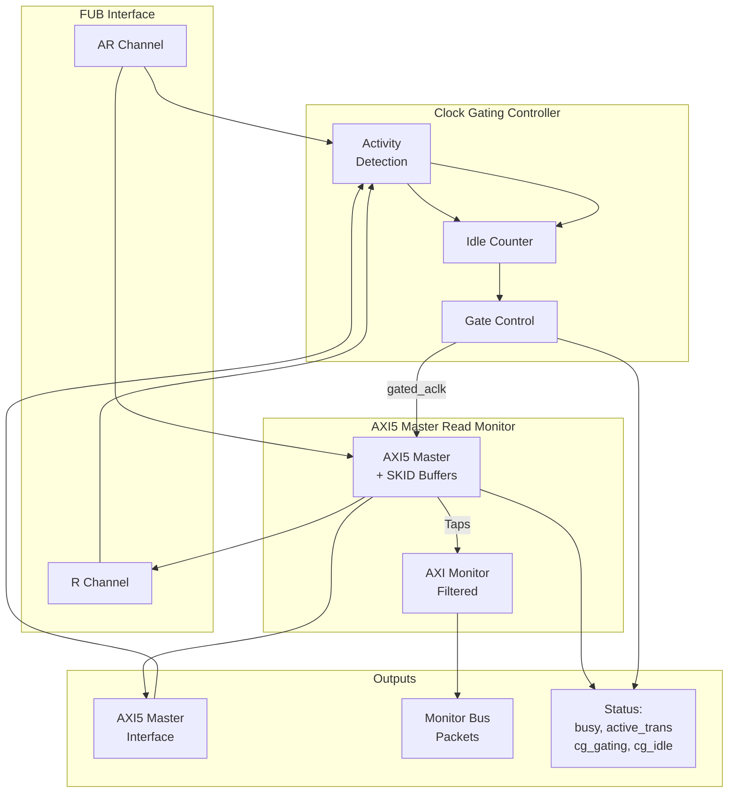

<!-- RTL Design Sherpa Documentation Header -->
<table>
<tr>
<td width="80">
  <a href="https://github.com/sean-galloway/RTLDesignSherpa">
    
  </a>
</td>
<td>
  <strong>RTL Design Sherpa</strong> · <em>Learning Hardware Design Through Practice</em><br>
  <sub>
    <a href="https://github.com/sean-galloway/RTLDesignSherpa">GitHub</a> ·
    <a href="https://github.com/sean-galloway/RTLDesignSherpa/blob/main/docs/DOCUMENTATION_INDEX.md">Documentation Index</a> ·
    <a href="https://github.com/sean-galloway/RTLDesignSherpa/blob/main/LICENSE">MIT License</a>
  </sub>
</td>
</tr>
</table>

---

<!-- End Header -->

# AXI5 Master Read with Monitor and Clock Gating

**Module:** `axi5_master_rd_mon_cg.sv`
**Location:** `rtl/amba/axi5/`
**Status:** Production Ready

---

## Overview

The AXI5 Master Read with Monitor and Clock Gating module combines `axi5_master_rd_mon` (AXI5 master with integrated monitoring) with intelligent clock gating for power optimization. This provides the ultimate combination: comprehensive transaction monitoring, error detection, and automatic power management.

### Key Features

- Full AMBA AXI5 protocol compliance
- **All AXI5 extensions:** NSAID, TRACE, MPAM, MECID, UNIQUE, CHUNKING, MTE, POISON
- **Integrated AXI monitor** with 3-level filtering hierarchy
- **Error detection:** Protocol violations, SLVERR, DECERR
- **Timeout monitoring:** Stuck transactions, stalled channels
- **Performance metrics:** Latency, throughput, outstanding transactions
- **MonBus output:** Standardized 64-bit monitor packet format
- **Automatic clock gating** based on activity detection
- **Configurable idle threshold** before clock gating activates
- **Power savings** during idle periods
- **Transparent operation** - no protocol changes
- **Dual status outputs:** Monitor status + clock gating status

---

## Module Architecture



---

## Parameters

| Parameter | Type | Default | Description |
|-----------|------|---------|-------------|
| SKID_DEPTH_AR | int | 2 | AR channel SKID buffer depth |
| SKID_DEPTH_R | int | 4 | R channel SKID buffer depth |
| AXI_ID_WIDTH | int | 8 | Transaction ID width |
| AXI_ADDR_WIDTH | int | 32 | Address bus width |
| AXI_DATA_WIDTH | int | 32 | Data bus width |
| AXI_USER_WIDTH | int | 1 | User signal width |
| AXI_NSAID_WIDTH | int | 4 | Non-secure access ID width |
| AXI_MPAM_WIDTH | int | 11 | MPAM width (PartID + PMG) |
| AXI_MECID_WIDTH | int | 16 | Memory encryption context ID width |
| AXI_TAG_WIDTH | int | 4 | Memory tag width per 16 bytes |
| AXI_TAGOP_WIDTH | int | 2 | Tag operation width |
| AXI_CHUNKNUM_WIDTH | int | 4 | Chunk number width |
| ENABLE_NSAID | bit | 1 | Enable non-secure access ID |
| ENABLE_TRACE | bit | 1 | Enable trace signals |
| ENABLE_MPAM | bit | 1 | Enable memory partitioning |
| ENABLE_MECID | bit | 1 | Enable memory encryption context |
| ENABLE_UNIQUE | bit | 1 | Enable unique ID indicator |
| ENABLE_CHUNKING | bit | 1 | Enable data chunking |
| ENABLE_MTE | bit | 1 | Enable Memory Tagging Extension |
| ENABLE_POISON | bit | 1 | Enable poison indicator |
| UNIT_ID | int | 1 | Monitor unit identifier |
| AGENT_ID | int | 10 | Monitor agent identifier |
| MAX_TRANSACTIONS | int | 16 | Transaction table size |
| ENABLE_FILTERING | bit | 1 | Enable 3-level packet filtering |
| ADD_PIPELINE_STAGE | bit | 0 | Add pipeline stage in monitor |
| **CG_IDLE_COUNT_WIDTH** | int | 4 | Width of idle counter (max 2^N-1 cycles) |

---

## Ports

### Clock and Reset

| Port | Width | Direction | Description |
|------|-------|-----------|-------------|
| aclk | 1 | Input | AXI clock (ungated) |
| aresetn | 1 | Input | AXI active-low reset |

### Clock Gating Configuration

| Port | Width | Direction | Description |
|------|-------|-----------|-------------|
| cfg_cg_enable | 1 | Input | Clock gating enable (1=enable, 0=always active) |
| cfg_cg_idle_count | CG_IDLE_COUNT_WIDTH | Input | Idle cycles before gating activates |

### FUB AXI5 Interface (Slave Side)

Same as `axi5_master_rd_mon` - see [AXI5 Master Read Monitor](axi5_master_rd_mon.md).

### Master AXI5 Interface (Output Side)

Same as `axi5_master_rd_mon` - see [AXI5 Master Read Monitor](axi5_master_rd_mon.md).

### Monitor Configuration

Same as `axi5_master_rd_mon` - see [AXI5 Master Read Monitor](axi5_master_rd_mon.md).

### Monitor Bus Output

| Port | Width | Direction | Description |
|------|-------|-----------|-------------|
| monbus_valid | 1 | Output | Monitor packet valid |
| monbus_ready | 1 | Input | Monitor packet ready (backpressure) |
| monbus_packet | 64 | Output | Monitor packet data (64-bit format) |

### Status Outputs

| Port | Width | Direction | Description |
|------|-------|-----------|-------------|
| busy | 1 | Output | Core busy indicator |
| active_transactions | 8 | Output | Number of outstanding transactions |
| error_count | 16 | Output | Cumulative error count (placeholder) |
| transaction_count | 32 | Output | Total transaction count (placeholder) |
| cfg_conflict_error | 1 | Output | Configuration conflict detected |
| **cg_gating** | 1 | Output | Clock gating active (1=gated, 0=running) |
| **cg_idle** | 1 | Output | Interface idle (1=no activity) |

---

## Functionality

### Combined Monitoring and Power Management

This module provides the best of both worlds:

**Monitoring (from axi5_master_rd_mon):**
- Real-time transaction monitoring
- Error and timeout detection
- Performance metrics collection
- Configurable packet filtering
- MonBus output for system integration

**Power Management (from axi5_master_rd_cg):**
- Automatic clock gating during idle periods
- Configurable idle threshold
- Activity-based wake-up
- Status outputs for power monitoring

### Clock Gating with Monitor Active

The clock gating logic considers monitor activity:

```systemverilog
user_valid = fub_axi_arvalid || fub_axi_rready || int_busy;
axi_valid = m_axi_arvalid || m_axi_rvalid;

// Clock remains active if:
// - User interface active (AR or R channels)
// - AXI interface active
// - Internal busy (transactions in flight)
// - Monitor has pending packets (implicit in int_busy)
```

The monitor continues operating during clock gating transitions, ensuring no events are lost.

### Ready Signal Control During Gating

When clock gating is active, ready signals are forced low to prevent new transactions:

```systemverilog
fub_axi_arready = cg_gating ? 1'b0 : int_arready;
m_axi_rready = cg_gating ? 1'b0 : int_rready;
```

This ensures protocol compliance during power management.

---

## Timing Diagrams

### Clock Gating with Monitor Activity

<!-- TODO: Add wavedrom timing diagram -->
```
TODO: Wavedrom timing diagram showing:
- ACLK (ungated)
- GATED_ACLK (gated clock)
- AXI transaction sequence
- Monitor packet generation
- Idle period detection
- cg_gating activation
- Monitor quiescent before clock stops
```

### Wake-up with Immediate Monitoring

<!-- TODO: Add wavedrom timing diagram -->
```
TODO: Wavedrom timing diagram showing:
- ACLK (ungated)
- GATED_ACLK resuming
- ARVALID assertion (wake trigger)
- cg_gating deactivation
- AXI transaction proceeds
- Monitor packets generated immediately
```

---

## Usage Example

### Comprehensive Debug + Power Optimization

```systemverilog
axi5_master_rd_mon_cg #(
    .AXI_ID_WIDTH       (8),
    .AXI_ADDR_WIDTH     (32),
    .AXI_DATA_WIDTH     (64),
    .AXI_USER_WIDTH     (4),
    .SKID_DEPTH_AR      (2),
    .SKID_DEPTH_R       (4),
    // Enable all AXI5 features
    .ENABLE_NSAID       (1),
    .ENABLE_TRACE       (1),
    .ENABLE_MPAM        (1),
    .ENABLE_MECID       (1),
    .ENABLE_UNIQUE      (1),
    .ENABLE_CHUNKING    (1),
    .ENABLE_MTE         (1),
    .ENABLE_POISON      (1),
    // Monitor configuration
    .UNIT_ID            (1),
    .AGENT_ID           (10),
    .MAX_TRANSACTIONS   (16),
    .ENABLE_FILTERING   (1),
    // Clock gating configuration
    .CG_IDLE_COUNT_WIDTH (4)
) u_axi5_master_rd_mon_cg (
    .aclk               (axi_clk),
    .aresetn            (axi_rst_n),

    // Clock gating configuration
    .cfg_cg_enable      (power_save_enable),
    .cfg_cg_idle_count  (4'd3),  // Gate after 4 idle cycles

    // FUB and Master interfaces
    // ... (connect AXI5 signals)

    // Monitor configuration - FUNCTIONAL DEBUG MODE
    .cfg_monitor_enable (1'b1),        // Completions
    .cfg_error_enable   (1'b1),        // Errors
    .cfg_timeout_enable (1'b1),        // Timeouts
    .cfg_perf_enable    (1'b0),        // DISABLED
    .cfg_timeout_cycles (16'd1000),
    .cfg_latency_threshold (32'd500),

    // Filtering configuration
    .cfg_axi_pkt_mask   (16'h0007),    // ERROR|COMPL|TIMEOUT
    .cfg_axi_err_select (16'h0001),
    .cfg_axi_error_mask (16'hFFFF),
    .cfg_axi_timeout_mask (16'hFFFF),
    .cfg_axi_compl_mask (16'hFFFF),

    // Monitor bus
    .monbus_valid       (mon_valid),
    .monbus_ready       (mon_ready),
    .monbus_packet      (mon_pkt),

    // Status outputs
    .busy               (master_busy),
    .active_transactions (active_trans),
    .cfg_conflict_error (cfg_error),
    .cg_gating          (clock_gated),
    .cg_idle            (interface_idle)
);

// Monitor packet consumer with power-aware handling
always_ff @(posedge axi_clk or negedge axi_rst_n) begin
    if (!axi_rst_n) begin
        mon_pkt_count <= '0;
        power_cycles_saved <= '0;
    end else begin
        // Count monitor packets
        if (mon_valid && mon_ready)
            mon_pkt_count <= mon_pkt_count + 1;

        // Track power savings
        if (clock_gated)
            power_cycles_saved <= power_cycles_saved + 1;
    end
end

// Alert on configuration conflicts
assert property (@(posedge axi_clk) disable iff (!axi_rst_n)
    !cfg_error
) else $error("Monitor configuration conflict detected!");

// Downstream FIFO for monitor packets
gaxi_fifo_sync #(
    .DATA_WIDTH (64),
    .DEPTH      (256)
) u_mon_fifo (
    .i_clk      (axi_clk),
    .i_rst_n    (axi_rst_n),
    .i_valid    (mon_valid),
    .i_data     (mon_pkt),
    .o_ready    (mon_ready),
    .o_valid    (fifo_valid),
    .o_data     (fifo_pkt),
    .i_ready    (consumer_ready)
);
```

---

## Design Notes

### When to Use This Module

**Ideal for:**
- Battery-powered or power-sensitive systems
- Bursty traffic patterns with significant idle periods
- Systems requiring comprehensive debug visibility
- Production systems needing runtime monitoring + power optimization

**Consider alternatives if:**
- Continuous, high-throughput traffic (clock gating ineffective)
- Ultra-low latency requirements (avoid gating overhead)
- Area-constrained designs (monitor + CG adds ~10% area)

### Configuration Strategy Matrix

| Scenario | Monitor Config | Clock Gating Config | Expected Benefit |
|----------|---------------|---------------------|------------------|
| **Development/Debug** | ERROR + COMPL + TIMEOUT | Disabled | Full visibility, no wake latency |
| **Performance Tuning** | ERROR + PERF | Disabled | Metrics without power interference |
| **Power Testing** | ERROR only | Aggressive (count=0) | Maximum power savings |
| **Production** | ERROR + TIMEOUT | Balanced (count=3) | Error detection + power savings |

### Monitor + Clock Gating Interaction

**Key Considerations:**

1. **Monitor packets generated before gating:**
   - Monitor processes all events before idle state
   - MonBus packets flushed before clock stops
   - No events lost during gating transition

2. **Wake latency includes monitor initialization:**
   - 1-2 cycles for clock ungating
   - Monitor ready immediately (no reset needed)
   - First transaction monitored correctly

3. **Power savings account for monitor overhead:**
   - Monitor adds ~10% dynamic power when active
   - Clock gating saves ~80-90% when idle
   - Net savings: 70-80% during idle periods

### Verification Recommendations

1. **Test monitor + CG independently first:**
   ```systemverilog
   // Phase 1: Monitor only (CG disabled)
   .cfg_cg_enable (1'b0)
   // Verify all monitor features

   // Phase 2: CG only (monitor minimal)
   .cfg_monitor_enable (1'b0)
   .cfg_error_enable   (1'b0)
   .cfg_cg_enable      (1'b1)
   // Verify clock gating behavior

   // Phase 3: Combined
   // Both enabled, verify interaction
   ```

2. **Check monitor packet integrity across gating:**
   - No packets lost during gating transitions
   - No duplicate packets
   - Timestamps/latencies accurate

3. **Measure actual power savings:**
   - Instrument with power counters
   - Compare vs. always-on baseline
   - Verify efficiency in target traffic patterns

---

## Related Documentation

- **[AXI5 Master Read](axi5_master_rd.md)** - Base module
- **[AXI5 Master Read CG](axi5_master_rd_cg.md)** - Clock gating only
- **[AXI5 Master Read Monitor](axi5_master_rd_mon.md)** - Monitor only
- **[AXI5 Master Write Monitor CG](axi5_master_wr_mon_cg.md)** - Write variant
- **[AXI Monitor Configuration Guide](../../../../AXI_Monitor_Configuration_Guide.md)** - Monitor setup
- **[AMBA Clock Gate Controller](../shared/amba_clock_gate_ctrl.md)** - Clock gating details

---

## Navigation

- **[← Back to AXI5 Index](README.md)**
- **[← Back to RTLAmba Index](../index.md)**
- **[← Back to Main Documentation Index](../../index.md)**
