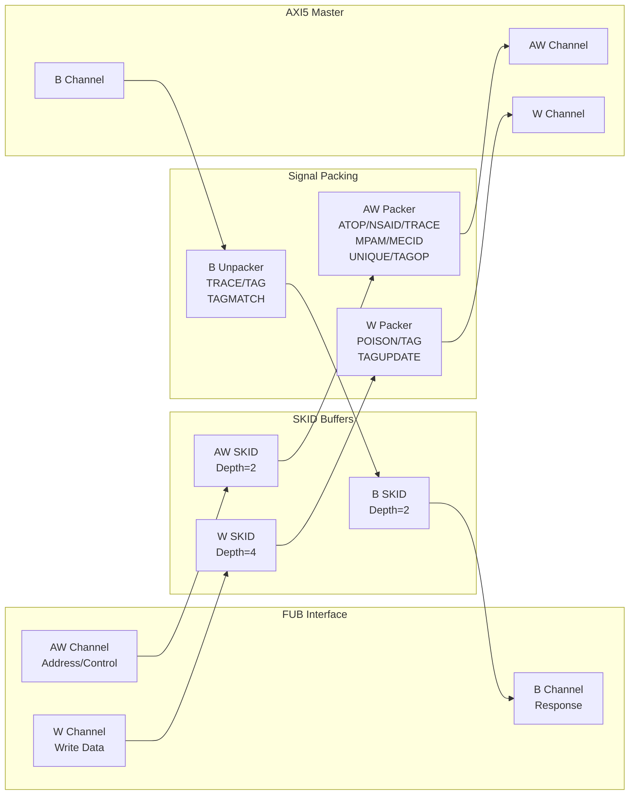

<!-- RTL Design Sherpa Documentation Header -->
<table>
<tr>
<td width="80">
  <a href="https://github.com/sean-galloway/RTLDesignSherpa">
    
  </a>
</td>
<td>
  <strong>RTL Design Sherpa</strong> · <em>Learning Hardware Design Through Practice</em><br>
  <sub>
    <a href="https://github.com/sean-galloway/RTLDesignSherpa">GitHub</a> ·
    <a href="https://github.com/sean-galloway/RTLDesignSherpa/blob/main/docs/DOCUMENTATION_INDEX.md">Documentation Index</a> ·
    <a href="https://github.com/sean-galloway/RTLDesignSherpa/blob/main/LICENSE">MIT License</a>
  </sub>
</td>
</tr>
</table>

---

<!-- End Header -->

# AXI5 Master Write

**Module:** `axi5_master_wr.sv`
**Location:** `rtl/amba/axi5/`
**Status:** Production Ready

---

## Overview

The AXI5 Master Write module implements a complete AMBA AXI5 master write interface with full AXI5 protocol support including atomic operations and all new AXI5 extensions. It provides SKID buffering for AW, W, and B channels for improved system performance.

### Key Features

- Full AMBA AXI5 protocol compliance
- **AWATOP:** Atomic transaction operation type (Compare/Swap, Fetch/Add, etc.)
- **AWNSAID:** Non-secure access identifier for security domains
- **AWTRACE:** Trace signal for debug and performance monitoring
- **AWMPAM:** Memory Partitioning and Monitoring (PartID + PMG)
- **AWMECID:** Memory Encryption Context ID for secure memory
- **AWUNIQUE:** Unique ID indicator for cache operations
- **AWTAGOP:** Memory tag operation (MTE - Memory Tagging Extension)
- **AWTAG:** Memory tags for address
- **WPOISON:** Write data poison indicator for error injection
- **WTAG:** Write data memory tags (MTE)
- **WTAGUPDATE:** Tag update mask for selective tag writing
- **BTRACE:** Response trace signal
- **BTAG/BTAGMATCH:** Response memory tags and tag match
- Configurable SKID buffer depths for AW, W, and B channels
- Busy signal for power management and clock gating
- Removed AWREGION (deprecated in AXI5)

---

## Module Architecture



---

## Parameters

| Parameter | Type | Default | Description |
|-----------|------|---------|-------------|
| SKID_DEPTH_AW | int | 2 | AW channel SKID buffer depth |
| SKID_DEPTH_W | int | 4 | W channel SKID buffer depth |
| SKID_DEPTH_B | int | 2 | B channel SKID buffer depth |
| AXI_ID_WIDTH | int | 8 | Transaction ID width |
| AXI_ADDR_WIDTH | int | 32 | Address bus width |
| AXI_DATA_WIDTH | int | 32 | Data bus width |
| AXI_USER_WIDTH | int | 1 | User signal width |
| AXI_WSTRB_WIDTH | int | DATA_WIDTH/8 | Write strobe width (calculated) |
| AXI_ATOP_WIDTH | int | 6 | Atomic operation width |
| AXI_NSAID_WIDTH | int | 4 | Non-secure access ID width |
| AXI_MPAM_WIDTH | int | 11 | MPAM width (PartID + PMG) |
| AXI_MECID_WIDTH | int | 16 | Memory encryption context ID width |
| AXI_TAG_WIDTH | int | 4 | Memory tag width per 16 bytes |
| AXI_TAGOP_WIDTH | int | 2 | Tag operation width |
| ENABLE_ATOMIC | bit | 1 | Enable atomic operations |
| ENABLE_NSAID | bit | 1 | Enable non-secure access ID |
| ENABLE_TRACE | bit | 1 | Enable trace signals |
| ENABLE_MPAM | bit | 1 | Enable memory partitioning |
| ENABLE_MECID | bit | 1 | Enable memory encryption context |
| ENABLE_UNIQUE | bit | 1 | Enable unique ID indicator |
| ENABLE_MTE | bit | 1 | Enable Memory Tagging Extension |
| ENABLE_POISON | bit | 1 | Enable poison indicator |

---

## Ports

### Clock and Reset

| Port | Width | Direction | Description |
|------|-------|-----------|-------------|
| aclk | 1 | Input | AXI clock |
| aresetn | 1 | Input | AXI active-low reset |

### FUB AXI5 Interface (Slave Side - Input)

#### AW Channel

| Port | Width | Direction | Description |
|------|-------|-----------|-------------|
| fub_axi_awid | IW | Input | Write address ID |
| fub_axi_awaddr | AW | Input | Write address |
| fub_axi_awlen | 8 | Input | Burst length |
| fub_axi_awsize | 3 | Input | Burst size |
| fub_axi_awburst | 2 | Input | Burst type |
| fub_axi_awlock | 1 | Input | Lock type |
| fub_axi_awcache | 4 | Input | Cache attributes |
| fub_axi_awprot | 3 | Input | Protection attributes |
| fub_axi_awqos | 4 | Input | Quality of Service |
| fub_axi_awuser | UW | Input | User-defined signal |
| fub_axi_awvalid | 1 | Input | Write address valid |
| fub_axi_awready | 1 | Output | Write address ready |

#### AXI5 AW Extensions

| Port | Width | Direction | Description |
|------|-------|-----------|-------------|
| fub_axi_awatop | AXI_ATOP_WIDTH | Input | Atomic operation type |
| fub_axi_awnsaid | AXI_NSAID_WIDTH | Input | Non-secure access ID |
| fub_axi_awtrace | 1 | Input | Trace signal |
| fub_axi_awmpam | AXI_MPAM_WIDTH | Input | Memory partitioning/monitoring |
| fub_axi_awmecid | AXI_MECID_WIDTH | Input | Memory encryption context ID |
| fub_axi_awunique | 1 | Input | Unique ID indicator |
| fub_axi_awtagop | AXI_TAGOP_WIDTH | Input | Tag operation (MTE) |
| fub_axi_awtag | TW | Input | Address memory tags |

#### W Channel

| Port | Width | Direction | Description |
|------|-------|-----------|-------------|
| fub_axi_wdata | DW | Input | Write data |
| fub_axi_wstrb | SW | Input | Write strobes |
| fub_axi_wlast | 1 | Input | Last transfer in burst |
| fub_axi_wuser | UW | Input | User-defined signal |
| fub_axi_wvalid | 1 | Input | Write data valid |
| fub_axi_wready | 1 | Output | Write data ready |

#### AXI5 W Extensions

| Port | Width | Direction | Description |
|------|-------|-----------|-------------|
| fub_axi_wpoison | 1 | Input | Data poison indicator |
| fub_axi_wtag | TW | Input | Write data tags |
| fub_axi_wtagupdate | NUM_TAGS | Input | Tag update mask |

#### B Channel

| Port | Width | Direction | Description |
|------|-------|-----------|-------------|
| fub_axi_bid | IW | Output | Response ID |
| fub_axi_bresp | 2 | Output | Write response |
| fub_axi_buser | UW | Output | User-defined signal |
| fub_axi_bvalid | 1 | Output | Write response valid |
| fub_axi_bready | 1 | Input | Write response ready |

#### AXI5 B Extensions

| Port | Width | Direction | Description |
|------|-------|-----------|-------------|
| fub_axi_btrace | 1 | Output | Response trace |
| fub_axi_btag | TW | Output | Response tags |
| fub_axi_btagmatch | 1 | Output | Tag match response |

### Master AXI5 Interface (Output Side)

Same port list as FUB interface but with `m_axi_*` prefix and reversed directions.

### Status Outputs

| Port | Width | Direction | Description |
|------|-------|-----------|-------------|
| busy | 1 | Output | Module busy indicator for clock gating |

---

## Functionality

### AXI5 Enhancements Over AXI4

**Atomic Operations:**
- **AWATOP:** Supports atomic Compare/Swap, Fetch/Add, Fetch/And, etc.
- Enables lock-free synchronization primitives

**Security and Isolation:**
- **AWNSAID:** Identifies security domain for non-secure accesses
- **AWMECID:** Provides encryption context for secure memory regions

**Performance and Monitoring:**
- **AWTRACE:** Enables performance trace and debug capabilities
- **AWMPAM:** Supports memory bandwidth partitioning and QoS

**Advanced Features:**
- **AWUNIQUE:** Indicates unique cache line access (no sharing)
- **AWTAGOP/AWTAG/WTAG:** Memory Tagging Extension for security
- **WTAGUPDATE:** Selective tag update mask

**Data Integrity:**
- **WPOISON:** Indicates corrupted or test data
- **BTRACE/BTAG/BTAGMATCH:** Response with trace and tag information

**Deprecated:**
- **AWREGION:** Removed (not recommended for new designs)

### Atomic Operations

AWATOP encoding (6 bits):
```
[5:4] - Atomic type:
  00 = None
  01 = Swap
  10 = Compare
  11 = Fetch-op

[3:0] - Operation (when Fetch-op):
  0000 = ADD
  0001 = CLR (AND-NOT)
  0010 = EOR (XOR)
  0011 = SET (OR)
  0100 = SMAX
  0101 = SMIN
  0110 = UMAX
  0111 = UMIN
```

---

## Timing Diagrams

### Basic Write Transaction

<!-- TODO: Add wavedrom timing diagram for AXI5 write transaction -->
```
TODO: Wavedrom timing diagram showing:
- ACLK
- AWID, AWADDR, AWLEN, AWSIZE
- AWVALID, AWREADY
- AWATOP, AWNSAID, AWTRACE (AXI5 extensions)
- WDATA, WSTRB, WLAST
- WVALID, WREADY
- WPOISON, WTAG (AXI5 extensions)
- BID, BRESP
- BVALID, BREADY
- BTRACE, BTAG (AXI5 extensions)
```

### Atomic Operation

<!-- TODO: Add wavedrom timing diagram for atomic operation -->
```
TODO: Wavedrom timing diagram showing:
- AWATOP encoding for atomic operation
- Write data for atomic operand
- Response with atomic result
```

### Memory Tagging Extension (MTE)

<!-- TODO: Add wavedrom timing diagram for MTE write -->
```
TODO: Wavedrom timing diagram showing:
- AWTAGOP encoding
- AWTAG delivery with address
- WTAG delivery with data
- WTAGUPDATE mask
- BTAGMATCH response
```

---

## Usage Example

```systemverilog
axi5_master_wr #(
    .AXI_ID_WIDTH       (8),
    .AXI_ADDR_WIDTH     (32),
    .AXI_DATA_WIDTH     (64),
    .AXI_USER_WIDTH     (4),
    .SKID_DEPTH_AW      (2),
    .SKID_DEPTH_W       (4),
    .SKID_DEPTH_B       (2),
    // Enable AXI5 features
    .ENABLE_ATOMIC      (1),
    .ENABLE_NSAID       (1),
    .ENABLE_TRACE       (1),
    .ENABLE_MPAM        (1),
    .ENABLE_MECID       (1),
    .ENABLE_UNIQUE      (1),
    .ENABLE_MTE         (1),
    .ENABLE_POISON      (1)
) u_axi5_master_wr (
    .aclk               (axi_clk),
    .aresetn            (axi_rst_n),

    // FUB interface (slave side)
    .fub_axi_awid       (fub_awid),
    .fub_axi_awaddr     (fub_awaddr),
    .fub_axi_awlen      (fub_awlen),
    .fub_axi_awsize     (fub_awsize),
    .fub_axi_awburst    (fub_awburst),
    .fub_axi_awlock     (fub_awlock),
    .fub_axi_awcache    (fub_awcache),
    .fub_axi_awprot     (fub_awprot),
    .fub_axi_awqos      (fub_awqos),
    .fub_axi_awuser     (fub_awuser),
    .fub_axi_awvalid    (fub_awvalid),
    .fub_axi_awready    (fub_awready),

    // AXI5 AW extensions
    .fub_axi_awatop     (fub_awatop),
    .fub_axi_awnsaid    (fub_awnsaid),
    .fub_axi_awtrace    (fub_awtrace),
    .fub_axi_awmpam     (fub_awmpam),
    .fub_axi_awmecid    (fub_awmecid),
    .fub_axi_awunique   (fub_awunique),
    .fub_axi_awtagop    (fub_awtagop),
    .fub_axi_awtag      (fub_awtag),

    // W channel
    .fub_axi_wdata      (fub_wdata),
    .fub_axi_wstrb      (fub_wstrb),
    .fub_axi_wlast      (fub_wlast),
    .fub_axi_wuser      (fub_wuser),
    .fub_axi_wvalid     (fub_wvalid),
    .fub_axi_wready     (fub_wready),

    // AXI5 W extensions
    .fub_axi_wpoison    (fub_wpoison),
    .fub_axi_wtag       (fub_wtag),
    .fub_axi_wtagupdate (fub_wtagupdate),

    // B channel
    .fub_axi_bid        (fub_bid),
    .fub_axi_bresp      (fub_bresp),
    .fub_axi_buser      (fub_buser),
    .fub_axi_bvalid     (fub_bvalid),
    .fub_axi_bready     (fub_bready),

    // AXI5 B extensions
    .fub_axi_btrace     (fub_btrace),
    .fub_axi_btag       (fub_btag),
    .fub_axi_btagmatch  (fub_btagmatch),

    // Master interface (output side)
    .m_axi_awid         (m_axi_awid),
    .m_axi_awaddr       (m_axi_awaddr),
    // ... (connect all master signals similarly)

    // Status
    .busy               (master_wr_busy)
);
```

---

## Design Notes

### Atomic Operation Support

When `ENABLE_ATOMIC=1`:
- **AWATOP[5:4]** selects atomic type (Swap/Compare/Fetch-op)
- **AWATOP[3:0]** selects operation for Fetch-op
- Write data provides operand value
- Response may include atomic result (implementation-dependent)

Common atomic operations:
- **Atomic Swap:** Exchange memory value with register
- **Compare and Swap:** Update memory if value matches
- **Fetch and Add:** Read-modify-write atomically

### Memory Tagging Extension (MTE)

When `ENABLE_MTE=1`:
- **AWTAGOP:** Specifies tag operation for address tags
- **AWTAG:** Provides address-level memory tags
- **WTAG:** Provides data-level memory tags (1 tag per 16 bytes)
- **WTAGUPDATE:** Mask for selective tag updates
- **BTAG/BTAGMATCH:** Response includes tag information

### Poison Support

When `ENABLE_POISON=1`:
- **WPOISON:** Master flags data as poisoned
- Use cases: Error injection, cache pollution testing, security

### Feature Enable Strategy

Disable unused features to reduce area:
```systemverilog
.ENABLE_ATOMIC   (0),  // No atomic operations
.ENABLE_NSAID    (0),  // No security domains
.ENABLE_TRACE    (0),  // No trace capability
.ENABLE_MPAM     (0),  // No memory partitioning
.ENABLE_MECID    (0),  // No encryption
.ENABLE_UNIQUE   (0),  // No unique access
.ENABLE_MTE      (0),  // No memory tagging
.ENABLE_POISON   (0)   // No poison indication
```

---

## Related Documentation

- **[AXI5 Master Read](axi5_master_rd.md)** - Master read interface
- **[AXI5 Slave Write](axi5_slave_wr.md)** - Slave write interface
- **[AXI5 Master Write CG](axi5_master_wr_cg.md)** - Clock-gated variant
- **[AXI5 Master Write Monitor](axi5_master_wr_mon.md)** - With integrated monitoring
- **[AXI4 Master Write](../axi/axi4_master_wr.md)** - AXI4 version for comparison

---

## Navigation

- **[← Back to AXI5 Index](README.md)**
- **[← Back to RTLAmba Index](../index.md)**
- **[← Back to Main Documentation Index](../../index.md)**
