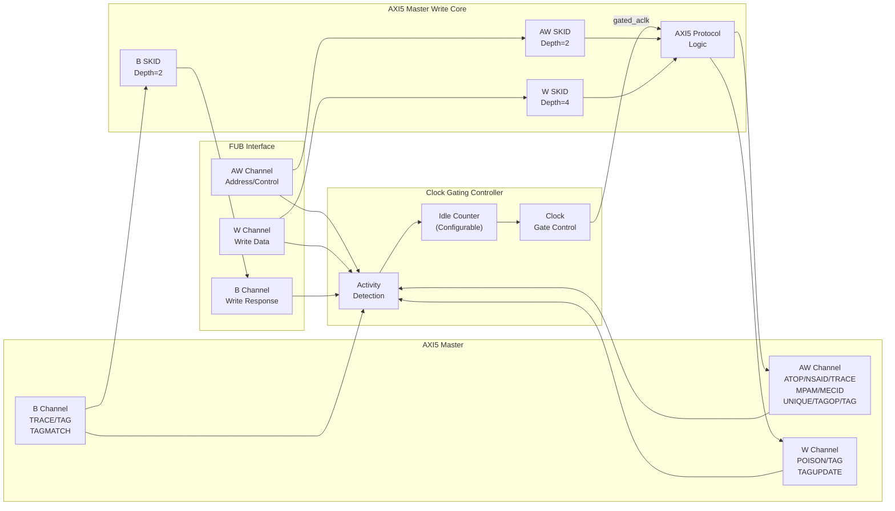

<!-- RTL Design Sherpa Documentation Header -->
<table>
<tr>
<td width="80">
  <a href="https://github.com/sean-galloway/RTLDesignSherpa">
    
  </a>
</td>
<td>
  <strong>RTL Design Sherpa</strong> · <em>Learning Hardware Design Through Practice</em><br>
  <sub>
    <a href="https://github.com/sean-galloway/RTLDesignSherpa">GitHub</a> ·
    <a href="https://github.com/sean-galloway/RTLDesignSherpa/blob/main/docs/DOCUMENTATION_INDEX.md">Documentation Index</a> ·
    <a href="https://github.com/sean-galloway/RTLDesignSherpa/blob/main/LICENSE">MIT License</a>
  </sub>
</td>
</tr>
</table>

---

<!-- End Header -->

# AXI5 Master Write with Clock Gating

**Module:** `axi5_master_wr_cg.sv`
**Location:** `rtl/amba/axi5/`
**Status:** Production Ready

---

## Overview

The AXI5 Master Write with Clock Gating module wraps the standard `axi5_master_wr` core with intelligent clock gating for power optimization. It automatically gates the clock when no AXI write activity is detected for a configurable number of idle cycles.

### Key Features

- Full AMBA AXI5 protocol compliance (wraps `axi5_master_wr`)
- **AWATOP:** Atomic operation support (compare-and-swap, atomic operations)
- **AWNSAID:** Non-secure access identifier for security domains
- **AWTRACE:** Trace signal for debug and performance monitoring
- **AWMPAM:** Memory Partitioning and Monitoring (PartID + PMG)
- **AWMECID:** Memory Encryption Context ID for secure memory
- **AWUNIQUE:** Unique ID indicator for cache operations
- **AWTAGOP:** Memory tag operation (MTE - Memory Tagging Extension)
- **AWTAG:** Memory tags on address channel
- **WPOISON:** Write data poison indicator for corrupted data detection
- **WTAG/WTAGUPDATE:** Memory tags and tag update control (MTE)
- **BTRACE/BTAG/BTAGMATCH:** Response trace and tag signals
- **Automatic clock gating** based on activity detection
- **Configurable idle count** before clock gating activates
- **Power savings** during idle periods
- **Transparent operation** - no protocol changes
- **Status outputs** for clock gating state monitoring

---

## Module Architecture



---

## Parameters

| Parameter | Type | Default | Description |
|-----------|------|---------|-------------|
| SKID_DEPTH_AW | int | 2 | AW channel SKID buffer depth |
| SKID_DEPTH_W | int | 4 | W channel SKID buffer depth |
| SKID_DEPTH_B | int | 2 | B channel SKID buffer depth |
| AXI_ID_WIDTH | int | 8 | Transaction ID width |
| AXI_ADDR_WIDTH | int | 32 | Address bus width |
| AXI_DATA_WIDTH | int | 32 | Data bus width |
| AXI_USER_WIDTH | int | 1 | User signal width |
| AXI_WSTRB_WIDTH | int | DATA_WIDTH/8 | Write strobe width (calculated) |
| AXI_ATOP_WIDTH | int | 6 | Atomic operation width |
| AXI_NSAID_WIDTH | int | 4 | Non-secure access ID width |
| AXI_MPAM_WIDTH | int | 11 | MPAM width (PartID + PMG) |
| AXI_MECID_WIDTH | int | 16 | Memory encryption context ID width |
| AXI_TAG_WIDTH | int | 4 | Memory tag width per 16 bytes |
| AXI_TAGOP_WIDTH | int | 2 | Tag operation width |
| ENABLE_ATOMIC | bit | 1 | Enable atomic operations |
| ENABLE_NSAID | bit | 1 | Enable non-secure access ID |
| ENABLE_TRACE | bit | 1 | Enable trace signals |
| ENABLE_MPAM | bit | 1 | Enable memory partitioning |
| ENABLE_MECID | bit | 1 | Enable memory encryption context |
| ENABLE_UNIQUE | bit | 1 | Enable unique ID indicator |
| ENABLE_MTE | bit | 1 | Enable Memory Tagging Extension |
| ENABLE_POISON | bit | 1 | Enable poison indicator |
| **CG_IDLE_COUNT_WIDTH** | int | 4 | Width of idle counter (max 2^N-1 cycles) |

---

## Ports

### Clock and Reset

| Port | Width | Direction | Description |
|------|-------|-----------|-------------|
| aclk | 1 | Input | AXI clock (ungated) |
| aresetn | 1 | Input | AXI active-low reset |

### Clock Gating Configuration

| Port | Width | Direction | Description |
|------|-------|-----------|-------------|
| cfg_cg_enable | 1 | Input | Clock gating enable (1=enable, 0=always active) |
| cfg_cg_idle_count | CG_IDLE_COUNT_WIDTH | Input | Idle cycles before gating activates |

### FUB AXI5 Interface (Slave Side - Input)

#### AW Channel

| Port | Width | Direction | Description |
|------|-------|-----------|-------------|
| fub_axi_awid | IW | Input | Write address ID |
| fub_axi_awaddr | AW | Input | Write address |
| fub_axi_awlen | 8 | Input | Burst length |
| fub_axi_awsize | 3 | Input | Burst size |
| fub_axi_awburst | 2 | Input | Burst type |
| fub_axi_awlock | 1 | Input | Lock type |
| fub_axi_awcache | 4 | Input | Cache attributes |
| fub_axi_awprot | 3 | Input | Protection attributes |
| fub_axi_awqos | 4 | Input | Quality of Service |
| fub_axi_awuser | UW | Input | User-defined signal |
| fub_axi_awvalid | 1 | Input | Write address valid |
| fub_axi_awready | 1 | Output | Write address ready (forced 0 when gating) |

#### AXI5 AW Extensions

| Port | Width | Direction | Description |
|------|-------|-----------|-------------|
| fub_axi_awatop | AXI_ATOP_WIDTH | Input | Atomic operation |
| fub_axi_awnsaid | AXI_NSAID_WIDTH | Input | Non-secure access ID |
| fub_axi_awtrace | 1 | Input | Trace signal |
| fub_axi_awmpam | AXI_MPAM_WIDTH | Input | Memory partitioning/monitoring |
| fub_axi_awmecid | AXI_MECID_WIDTH | Input | Memory encryption context ID |
| fub_axi_awunique | 1 | Input | Unique ID indicator |
| fub_axi_awtagop | AXI_TAGOP_WIDTH | Input | Tag operation (MTE) |
| fub_axi_awtag | TW | Input | Memory tags on address channel |

#### W Channel

| Port | Width | Direction | Description |
|------|-------|-----------|-------------|
| fub_axi_wdata | DW | Input | Write data |
| fub_axi_wstrb | SW | Input | Write strobes |
| fub_axi_wlast | 1 | Input | Last transfer in burst |
| fub_axi_wuser | UW | Input | User-defined signal |
| fub_axi_wvalid | 1 | Input | Write data valid |
| fub_axi_wready | 1 | Output | Write data ready (forced 0 when gating) |

#### AXI5 W Extensions

| Port | Width | Direction | Description |
|------|-------|-----------|-------------|
| fub_axi_wpoison | 1 | Input | Write data poison indicator |
| fub_axi_wtag | TW | Input | Memory tags on write data |
| fub_axi_wtagupdate | NUM_TAGS | Input | Tag update control (per 16B) |

#### B Channel

| Port | Width | Direction | Description |
|------|-------|-----------|-------------|
| fub_axi_bid | IW | Output | Write response ID |
| fub_axi_bresp | 2 | Output | Write response |
| fub_axi_buser | UW | Output | User-defined signal |
| fub_axi_bvalid | 1 | Output | Write response valid |
| fub_axi_bready | 1 | Input | Write response ready |

#### AXI5 B Extensions

| Port | Width | Direction | Description |
|------|-------|-----------|-------------|
| fub_axi_btrace | 1 | Output | Trace signal |
| fub_axi_btag | TW | Output | Memory tags in response |
| fub_axi_btagmatch | 1 | Output | Tag match result |

### Master AXI5 Interface (Output Side)

Same port list as FUB interface but with `m_axi_*` prefix and reversed directions.

### Clock Gating Status Outputs

| Port | Width | Direction | Description |
|------|-------|-----------|-------------|
| cg_gating | 1 | Output | Clock gating active (1=clock gated, 0=clock running) |
| cg_idle | 1 | Output | Interface idle (1=no activity detected) |

---

## Functionality

### Clock Gating Operation

The clock gating controller monitors activity on both user and AXI sides for all three write channels:

**User-side activity detection:**
```systemverilog
user_valid = fub_axi_awvalid || fub_axi_wvalid || fub_axi_bready || int_busy
```

**AXI-side activity detection:**
```systemverilog
axi_valid = m_axi_awvalid || m_axi_wvalid || m_axi_bvalid
```

**Ready signal control during gating:**
```systemverilog
fub_axi_awready = cg_gating ? 1'b0 : int_awready;
fub_axi_wready = cg_gating ? 1'b0 : int_wready;
m_axi_bready = cg_gating ? 1'b0 : int_bready;
```

All three write channels must be idle before clock gating activates, ensuring no partial writes.

### AXI5 Write-Specific Features

**Atomic Operations (AWATOP):**
When `ENABLE_ATOMIC=1`, supports:
- AtomicStore
- AtomicLoad
- AtomicSwap
- AtomicCompare
- Atomic arithmetic operations

**Memory Tagging on Write (MTE):**
When `ENABLE_MTE=1`:
- **AWTAGOP:** Specifies tag operation for write address
- **AWTAG:** Memory tags sent with address
- **WTAG:** Memory tags sent with each data beat
- **WTAGUPDATE:** Controls which tags to update (per 16 bytes)
- **BTAG:** Memory tags returned in response
- **BTAGMATCH:** Tag match result

**Write Poison (WPOISON):**
When `ENABLE_POISON=1`:
- Indicates corrupted or invalid write data
- Propagated to memory/cache
- May trigger error response (SLVERR)

### Idle Counter Configuration

Same as read variant - see [AXI5 Master Read CG](axi5_master_rd_cg.md).

---

## Timing Diagrams

### Clock Gating with Write Burst

<!-- TODO: Add wavedrom timing diagram -->
```
TODO: Wavedrom timing diagram showing:
- ACLK (ungated)
- GATED_ACLK (gated clock)
- AW channel: AWVALID, AWREADY
- W channel: WDATA, WLAST, WVALID, WREADY
- B channel: BVALID, BREADY
- Idle counter after BREADY
- cg_gating activation after idle count
```

### Atomic Operation with Clock Gating

<!-- TODO: Add wavedrom timing diagram -->
```
TODO: Wavedrom timing diagram showing:
- AWATOP encoding
- Atomic write sequence
- BTAG response
- Clock gating after completion
```

---

## Usage Example

```systemverilog
axi5_master_wr_cg #(
    .AXI_ID_WIDTH       (8),
    .AXI_ADDR_WIDTH     (32),
    .AXI_DATA_WIDTH     (64),
    .AXI_USER_WIDTH     (4),
    .SKID_DEPTH_AW      (2),
    .SKID_DEPTH_W       (4),
    .SKID_DEPTH_B       (2),
    // Enable AXI5 features
    .ENABLE_ATOMIC      (1),
    .ENABLE_NSAID       (1),
    .ENABLE_TRACE       (1),
    .ENABLE_MPAM        (1),
    .ENABLE_MECID       (1),
    .ENABLE_UNIQUE      (1),
    .ENABLE_MTE         (1),
    .ENABLE_POISON      (1),
    // Clock gating configuration
    .CG_IDLE_COUNT_WIDTH (4)
) u_axi5_master_wr_cg (
    .aclk               (axi_clk),
    .aresetn            (axi_rst_n),

    // Clock gating configuration
    .cfg_cg_enable      (power_save_enable),
    .cfg_cg_idle_count  (4'd3),  // Gate after 4 idle cycles

    // FUB interface (slave side)
    .fub_axi_awid       (fub_awid),
    .fub_axi_awaddr     (fub_awaddr),
    .fub_axi_awlen      (fub_awlen),
    .fub_axi_awsize     (fub_awsize),
    .fub_axi_awburst    (fub_awburst),
    .fub_axi_awlock     (fub_awlock),
    .fub_axi_awcache    (fub_awcache),
    .fub_axi_awprot     (fub_awprot),
    .fub_axi_awqos      (fub_awqos),
    .fub_axi_awuser     (fub_awuser),
    .fub_axi_awvalid    (fub_awvalid),
    .fub_axi_awready    (fub_awready),

    // AXI5 AW extensions
    .fub_axi_awatop     (fub_awatop),
    .fub_axi_awnsaid    (fub_awnsaid),
    .fub_axi_awtrace    (fub_awtrace),
    .fub_axi_awmpam     (fub_awmpam),
    .fub_axi_awmecid    (fub_awmecid),
    .fub_axi_awunique   (fub_awunique),
    .fub_axi_awtagop    (fub_awtagop),
    .fub_axi_awtag      (fub_awtag),

    // W channel
    .fub_axi_wdata      (fub_wdata),
    .fub_axi_wstrb      (fub_wstrb),
    .fub_axi_wlast      (fub_wlast),
    .fub_axi_wuser      (fub_wuser),
    .fub_axi_wvalid     (fub_wvalid),
    .fub_axi_wready     (fub_wready),

    // AXI5 W extensions
    .fub_axi_wpoison    (fub_wpoison),
    .fub_axi_wtag       (fub_wtag),
    .fub_axi_wtagupdate (fub_wtagupdate),

    // B channel
    .fub_axi_bid        (fub_bid),
    .fub_axi_bresp      (fub_bresp),
    .fub_axi_buser      (fub_buser),
    .fub_axi_bvalid     (fub_bvalid),
    .fub_axi_bready     (fub_bready),

    // AXI5 B extensions
    .fub_axi_btrace     (fub_btrace),
    .fub_axi_btag       (fub_btag),
    .fub_axi_btagmatch  (fub_btagmatch),

    // Master interface (output side)
    .m_axi_awid         (m_axi_awid),
    .m_axi_awaddr       (m_axi_awaddr),
    // ... (connect all master signals similarly)

    // Clock gating status
    .cg_gating          (clock_gated),
    .cg_idle            (interface_idle)
);

// Power monitoring
always_ff @(posedge axi_clk or negedge axi_rst_n) begin
    if (!axi_rst_n) begin
        write_count <= '0;
        power_cycles_saved <= '0;
    end else begin
        if (fub_awvalid && fub_awready)
            write_count <= write_count + 1;

        if (clock_gated)
            power_cycles_saved <= power_cycles_saved + 1;
    end
end
```

---

## Design Notes

### Write vs. Read Clock Gating

| Aspect | Read (AR/R) | Write (AW/W/B) |
|--------|-------------|----------------|
| Channels | 2 (AR, R) | 3 (AW, W, B) |
| Activity detection | 2 valids | 3 valids |
| Idle condition | Both channels idle | All 3 channels idle |
| Typical idle % | Higher (read-mostly traffic) | Lower (write completion delays) |
| Power savings | 30-50% | 20-40% |

### Write-Specific Gating Considerations

**Write data buffering:**
- Clock may gate after AW but before W (if W delayed)
- SKID buffers ensure no data loss
- Gate activation waits for W channel idle

**Response latency:**
- B channel responses may delay gating
- Typical: B arrives many cycles after W
- Idle counter starts after BREADY

**Atomic operations:**
- Longer latency than normal writes
- Atomic read-modify-write sequence
- Idle detection after atomic completion

---

## Related Documentation

- **[AXI5 Master Write](axi5_master_wr.md)** - Non-gated base module
- **[AXI5 Master Read CG](axi5_master_rd_cg.md)** - Read with clock gating
- **[AXI5 Master Write Monitor CG](axi5_master_wr_mon_cg.md)** - With monitoring + clock gating
- **[AMBA Clock Gate Controller](../shared/amba_clock_gate_ctrl.md)** - Clock gating controller spec

---

## Navigation

- **[← Back to AXI5 Index](README.md)**
- **[← Back to RTLAmba Index](../index.md)**
- **[← Back to Main Documentation Index](../../index.md)**
