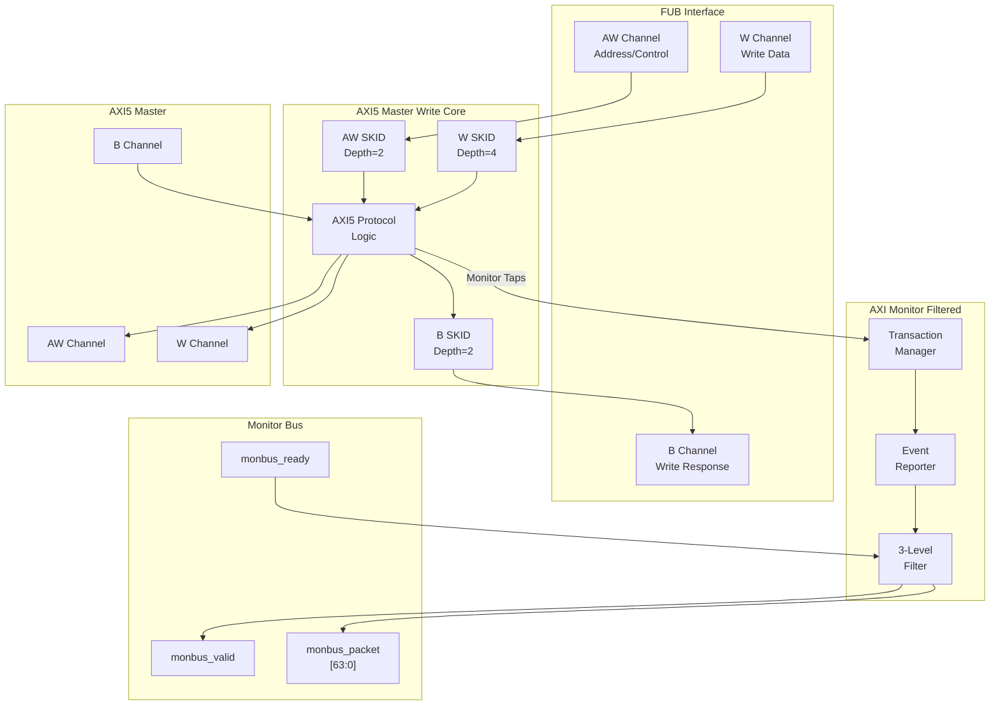

<!-- RTL Design Sherpa Documentation Header -->
<table>
<tr>
<td width="80">
  <a href="https://github.com/sean-galloway/RTLDesignSherpa">
    
  </a>
</td>
<td>
  <strong>RTL Design Sherpa</strong> · <em>Learning Hardware Design Through Practice</em><br>
  <sub>
    <a href="https://github.com/sean-galloway/RTLDesignSherpa">GitHub</a> ·
    <a href="https://github.com/sean-galloway/RTLDesignSherpa/blob/main/docs/DOCUMENTATION_INDEX.md">Documentation Index</a> ·
    <a href="https://github.com/sean-galloway/RTLDesignSherpa/blob/main/LICENSE">MIT License</a>
  </sub>
</td>
</tr>
</table>

---

<!-- End Header -->

# AXI5 Master Write with Monitor

**Module:** `axi5_master_wr_mon.sv`
**Location:** `rtl/amba/axi5/`
**Status:** Production Ready

---

## Overview

The AXI5 Master Write with Monitor module combines the standard `axi5_master_wr` core with an integrated `axi_monitor_filtered` for comprehensive write transaction monitoring and error detection. This module provides real-time visibility into AXI5 write operations with configurable packet filtering.

### Key Features

- Full AMBA AXI5 protocol compliance (wraps `axi5_master_wr`)
- **AWATOP:** Atomic operation support (compare-and-swap, atomic operations)
- **AWNSAID:** Non-secure access identifier for security domains
- **AWTRACE:** Trace signal for debug and performance monitoring
- **AWMPAM:** Memory Partitioning and Monitoring (PartID + PMG)
- **AWMECID:** Memory Encryption Context ID for secure memory
- **AWUNIQUE:** Unique ID indicator for cache operations
- **AWTAGOP:** Memory tag operation (MTE - Memory Tagging Extension)
- **AWTAG:** Memory tags on address channel
- **WPOISON:** Write data poison indicator for corrupted data detection
- **WTAG/WTAGUPDATE:** Memory tags and tag update control (MTE)
- **BTRACE/BTAG/BTAGMATCH:** Response trace and tag signals
- **Integrated AXI monitor** with 3-level filtering hierarchy
- **Error detection:** Protocol violations, SLVERR, DECERR
- **Timeout monitoring:** Stuck transactions, stalled channels
- **Performance metrics:** Latency, throughput, outstanding transactions
- **MonBus output:** Standardized 64-bit monitor packet format
- **Configuration validation:** Detects filter conflicts

---

## Module Architecture



---

## Parameters

| Parameter | Type | Default | Description |
|-----------|------|---------|-------------|
| SKID_DEPTH_AW | int | 2 | AW channel SKID buffer depth |
| SKID_DEPTH_W | int | 4 | W channel SKID buffer depth |
| SKID_DEPTH_B | int | 2 | B channel SKID buffer depth |
| AXI_ID_WIDTH | int | 8 | Transaction ID width |
| AXI_ADDR_WIDTH | int | 32 | Address bus width |
| AXI_DATA_WIDTH | int | 32 | Data bus width |
| AXI_USER_WIDTH | int | 1 | User signal width |
| AXI_WSTRB_WIDTH | int | DATA_WIDTH/8 | Write strobe width (calculated) |
| AXI_ATOP_WIDTH | int | 6 | Atomic operation width |
| AXI_NSAID_WIDTH | int | 4 | Non-secure access ID width |
| AXI_MPAM_WIDTH | int | 11 | MPAM width (PartID + PMG) |
| AXI_MECID_WIDTH | int | 16 | Memory encryption context ID width |
| AXI_TAG_WIDTH | int | 4 | Memory tag width per 16 bytes |
| AXI_TAGOP_WIDTH | int | 2 | Tag operation width |
| ENABLE_ATOMIC | bit | 1 | Enable atomic operations |
| ENABLE_NSAID | bit | 1 | Enable non-secure access ID |
| ENABLE_TRACE | bit | 1 | Enable trace signals |
| ENABLE_MPAM | bit | 1 | Enable memory partitioning |
| ENABLE_MECID | bit | 1 | Enable memory encryption context |
| ENABLE_UNIQUE | bit | 1 | Enable unique ID indicator |
| ENABLE_MTE | bit | 1 | Enable Memory Tagging Extension |
| ENABLE_POISON | bit | 1 | Enable poison indicator |
| **UNIT_ID** | int | 1 | Monitor unit identifier |
| **AGENT_ID** | int | 11 | Monitor agent identifier (default 11 for write) |
| **MAX_TRANSACTIONS** | int | 16 | Transaction table size |
| **ENABLE_FILTERING** | bit | 1 | Enable 3-level packet filtering |
| **ADD_PIPELINE_STAGE** | bit | 0 | Add pipeline stage in monitor |

---

## Ports

### Clock and Reset

| Port | Width | Direction | Description |
|------|-------|-----------|-------------|
| aclk | 1 | Input | AXI clock |
| aresetn | 1 | Input | AXI active-low reset |

### FUB AXI5 Interface (Slave Side)

Same as `axi5_master_wr` - see [AXI5 Master Write](axi5_master_wr.md) for complete port listing.

### Master AXI5 Interface (Output Side)

Same as `axi5_master_wr` - see [AXI5 Master Write](axi5_master_wr.md) for complete port listing.

### Monitor Configuration

Same as `axi5_master_rd_mon` - see [AXI5 Master Read Monitor](axi5_master_rd_mon.md) for complete configuration port listing.

### Monitor Bus Output

| Port | Width | Direction | Description |
|------|-------|-----------|-------------|
| monbus_valid | 1 | Output | Monitor packet valid |
| monbus_ready | 1 | Input | Monitor packet ready (backpressure) |
| monbus_packet | 64 | Output | Monitor packet data |

### Status Outputs

| Port | Width | Direction | Description |
|------|-------|-----------|-------------|
| busy | 1 | Output | Core busy indicator |
| active_transactions | 8 | Output | Number of outstanding write transactions |
| error_count | 16 | Output | Cumulative error count (placeholder) |
| transaction_count | 32 | Output | Total transaction count (placeholder) |
| cfg_conflict_error | 1 | Output | Configuration conflict detected |

---

## Functionality

### Monitor Bus Packet Format

Same 64-bit standardized format as read monitor - see [AXI5 Master Read Monitor](axi5_master_rd_mon.md).

### Write-Specific Monitoring Events

**Write Transaction Tracking:**
The monitor correlates three channels:
1. **AW:** Address and control (AWID, AWADDR, AWLEN, etc.)
2. **W:** Write data beats (WDATA, WSTRB, WLAST)
3. **B:** Write response (BID, BRESP)

**Event Timeline:**
```
1. AW handshake → Transaction started
2. W beats → Data transfer monitored
3. WLAST → Write data complete
4. B response → Transaction complete
```

**Error Detection Events:**

**Protocol Errors:**
- AW handshake violations
- W handshake violations
- Missing WLAST
- ID width mismatches
- Burst length violations
- Unaligned addresses
- Strobe violations

**Response Errors:**
- SLVERR (slave error response)
- DECERR (decode error response)
- Orphaned write response (no matching AW)
- ID mismatch (BID != AWID)

**Timeout Errors:**
- AW channel stall (no AWREADY)
- W channel stall (no WREADY)
- B channel stall (no BVALID)
- Transaction timeout (AW to B)

**Data Integrity:**
- WPOISON asserted (corrupted data)
- Tag mismatch (MTE)
- Atomic operation failures

**Threshold Violations:**
- Outstanding transaction count > threshold
- Transaction latency > cfg_latency_threshold

### Atomic Operation Monitoring

When `ENABLE_ATOMIC=1`, the monitor tracks:
- Atomic operation type (from AWATOP)
- Atomic sequence (read-modify-write)
- Success/failure (from BRESP)
- Tag validation (BTAGMATCH)

### Three-Level Filtering Hierarchy

Same as read monitor - see [AXI5 Master Read Monitor](axi5_master_rd_mon.md).

---

## Timing Diagrams

### Monitored Write Burst with Error

<!-- TODO: Add wavedrom timing diagram -->
```
TODO: Wavedrom timing diagram showing:
- ACLK
- AW channel: AWID, AWADDR, AWLEN, AWVALID, AWREADY
- W channel: WDATA, WSTRB, WLAST, WVALID, WREADY
- B channel: BID, BRESP (SLVERR), BVALID, BREADY
- Monitor bus: monbus_valid, monbus_packet showing ERROR packet
```

### Atomic Operation Monitoring

<!-- TODO: Add wavedrom timing diagram -->
```
TODO: Wavedrom timing diagram showing:
- AWATOP encoding (atomic type)
- AW/W channels
- B response with BTAG
- Monitor packets for atomic sequence
```

### Write Timeout Detection

<!-- TODO: Add wavedrom timing diagram -->
```
TODO: Wavedrom timing diagram showing:
- AW channel: AWVALID asserted, AWREADY stuck low
- Timeout counter incrementing
- cfg_timeout_cycles threshold
- Monitor bus: TIMEOUT packet generated
```

---

## Usage Example

### Functional Verification Configuration

```systemverilog
axi5_master_wr_mon #(
    .AXI_ID_WIDTH       (8),
    .AXI_ADDR_WIDTH     (32),
    .AXI_DATA_WIDTH     (64),
    .AXI_USER_WIDTH     (4),
    .SKID_DEPTH_AW      (2),
    .SKID_DEPTH_W       (4),
    .SKID_DEPTH_B       (2),
    // Enable AXI5 features
    .ENABLE_ATOMIC      (1),
    .ENABLE_NSAID       (1),
    .ENABLE_TRACE       (1),
    .ENABLE_MPAM        (1),
    .ENABLE_MECID       (1),
    .ENABLE_UNIQUE      (1),
    .ENABLE_MTE         (1),
    .ENABLE_POISON      (1),
    // Monitor configuration
    .UNIT_ID            (1),
    .AGENT_ID           (11),  // Write agent
    .MAX_TRANSACTIONS   (16),
    .ENABLE_FILTERING   (1)
) u_axi5_master_wr_mon (
    .aclk               (axi_clk),
    .aresetn            (axi_rst_n),

    // FUB interface (slave side)
    .fub_axi_awid       (fub_awid),
    .fub_axi_awaddr     (fub_awaddr),
    .fub_axi_awlen      (fub_awlen),
    .fub_axi_awsize     (fub_awsize),
    .fub_axi_awburst    (fub_awburst),
    .fub_axi_awlock     (fub_awlock),
    .fub_axi_awcache    (fub_awcache),
    .fub_axi_awprot     (fub_awprot),
    .fub_axi_awqos      (fub_awqos),
    .fub_axi_awuser     (fub_awuser),
    .fub_axi_awvalid    (fub_awvalid),
    .fub_axi_awready    (fub_awready),

    // AXI5 AW extensions
    .fub_axi_awatop     (fub_awatop),
    .fub_axi_awnsaid    (fub_awnsaid),
    .fub_axi_awtrace    (fub_awtrace),
    .fub_axi_awmpam     (fub_awmpam),
    .fub_axi_awmecid    (fub_awmecid),
    .fub_axi_awunique   (fub_awunique),
    .fub_axi_awtagop    (fub_awtagop),
    .fub_axi_awtag      (fub_awtag),

    // W channel
    .fub_axi_wdata      (fub_wdata),
    .fub_axi_wstrb      (fub_wstrb),
    .fub_axi_wlast      (fub_wlast),
    .fub_axi_wuser      (fub_wuser),
    .fub_axi_wvalid     (fub_wvalid),
    .fub_axi_wready     (fub_wready),

    // AXI5 W extensions
    .fub_axi_wpoison    (fub_wpoison),
    .fub_axi_wtag       (fub_wtag),
    .fub_axi_wtagupdate (fub_wtagupdate),

    // B channel
    .fub_axi_bid        (fub_bid),
    .fub_axi_bresp      (fub_bresp),
    .fub_axi_buser      (fub_buser),
    .fub_axi_bvalid     (fub_bvalid),
    .fub_axi_bready     (fub_bready),

    // AXI5 B extensions
    .fub_axi_btrace     (fub_btrace),
    .fub_axi_btag       (fub_btag),
    .fub_axi_btagmatch  (fub_btagmatch),

    // Master interface (output side)
    // ... (connect all m_axi_* signals)

    // Monitor configuration - FUNCTIONAL DEBUG MODE
    .cfg_monitor_enable (1'b1),        // Enable completions
    .cfg_error_enable   (1'b1),        // Enable errors
    .cfg_timeout_enable (1'b1),        // Enable timeouts
    .cfg_perf_enable    (1'b0),        // DISABLE (high traffic)
    .cfg_timeout_cycles (16'd1000),    // 1000 cycle timeout
    .cfg_latency_threshold (32'd500),  // 500 cycle threshold

    // Level 1: Enable ERROR, COMPL, TIMEOUT packets
    .cfg_axi_pkt_mask   (16'h0007),    // [2:0] = ERROR|COMPL|TIMEOUT

    // Level 2: Route errors to ERROR packets
    .cfg_axi_err_select (16'h0001),

    // Level 3: Enable all error events
    .cfg_axi_error_mask (16'hFFFF),
    .cfg_axi_timeout_mask (16'hFFFF),
    .cfg_axi_compl_mask (16'hFFFF),

    // Monitor bus output
    .monbus_valid       (mon_valid),
    .monbus_ready       (mon_ready),
    .monbus_packet      (mon_pkt),

    // Status
    .busy               (master_busy),
    .active_transactions (active_trans),
    .cfg_conflict_error (cfg_error)
);

// Downstream FIFO for monitor packets
gaxi_fifo_sync #(
    .DATA_WIDTH (64),
    .DEPTH      (256)
) u_mon_fifo (
    .i_clk      (axi_clk),
    .i_rst_n    (axi_rst_n),
    .i_valid    (mon_valid),
    .i_data     (mon_pkt),
    .o_ready    (mon_ready),
    .o_valid    (fifo_valid),
    .o_data     (fifo_pkt),
    .i_ready    (consumer_ready)
);

// Monitor packet decoder for write events
always_ff @(posedge axi_clk) begin
    if (fifo_valid && consumer_ready) begin
        case (fifo_pkt[63:60])  // Packet type
            4'h0: begin  // ERROR
                $display("Write Error: Type=%h, ID=%h, Addr=%h",
                    fifo_pkt[56:53], fifo_pkt[52:47], fifo_pkt[34:0]);
            end
            4'h1: begin  // COMPL
                $display("Write Complete: ID=%h, Latency=%d",
                    fifo_pkt[52:47], fifo_pkt[34:0]);
            end
            4'h2: begin  // TIMEOUT
                $display("Write Timeout: Channel=%h, ID=%h",
                    fifo_pkt[56:53], fifo_pkt[52:47]);
            end
        endcase
    end
end
```

---

## Design Notes

### Write vs. Read Monitoring Differences

| Aspect | Read Monitor | Write Monitor |
|--------|-------------|---------------|
| Channels monitored | 2 (AR, R) | 3 (AW, W, B) |
| Transaction ID | ARID → RID | AWID → BID |
| Data direction | Slave → Master | Master → Slave |
| Typical latency | Lower | Higher (write buffers) |
| Common errors | SLVERR on read data | SLVERR on write response |
| Atomic ops | Load atomics | Store/RMW atomics |

### Write Transaction Table Management

The transaction table tracks:
- **AW phase:** Allocate entry, store address/control
- **W phase:** Count beats, verify WLAST matches AWLEN
- **B phase:** Match BID to AWID, record response, deallocate entry

**Outstanding write tracking:**
```
Active transactions = (AW issued) - (B received)
```

### Write Latency Measurement

**Start:** AW handshake (AWVALID && AWREADY)
**End:** B handshake (BVALID && BREADY)
**Latency:** Clock cycles from start to end

Typical write latencies:
- Single-beat write: 5-20 cycles
- Burst write: 10-100 cycles
- Atomic operation: 20-200 cycles (includes read phase)

### Configuration Best Practices

Same as read monitor - see [AXI5 Master Read Monitor](axi5_master_rd_mon.md).

**Write-specific tip:** Writes often have higher latency variance than reads due to write buffering and posted writes. Set `cfg_latency_threshold` higher for write monitors.

---

## Related Documentation

- **[AXI5 Master Write](axi5_master_wr.md)** - Base module without monitoring
- **[AXI5 Master Write CG](axi5_master_wr_cg.md)** - With clock gating only
- **[AXI5 Master Write Monitor CG](axi5_master_wr_mon_cg.md)** - Monitor + clock gating
- **[AXI5 Master Read Monitor](axi5_master_rd_mon.md)** - Read variant
- **[AXI Monitor Filtered](../shared/axi_monitor_filtered.md)** - Monitor core specification
- **[Monitor Package Spec](../includes/monitor_package_spec.md)** - Packet format details
- **[AXI Monitor Configuration Guide](../../../../AXI_Monitor_Configuration_Guide.md)** - Complete configuration reference

---

## Navigation

- **[← Back to AXI5 Index](README.md)**
- **[← Back to RTLAmba Index](../index.md)**
- **[← Back to Main Documentation Index](../../index.md)**
