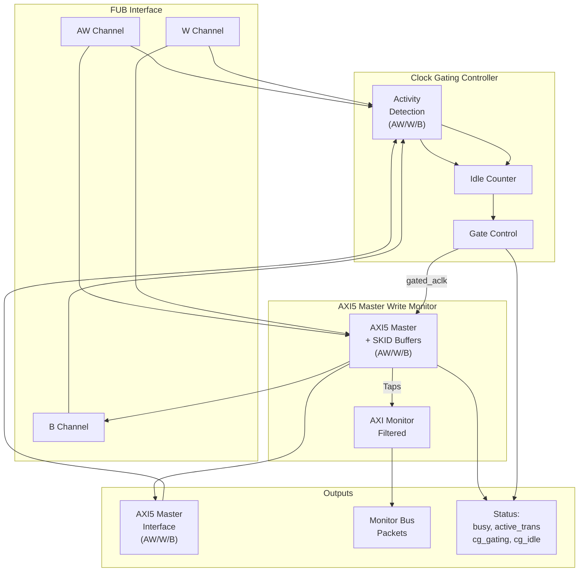

<!-- RTL Design Sherpa Documentation Header -->
<table>
<tr>
<td width="80">
  <a href="https://github.com/sean-galloway/RTLDesignSherpa">
    
  </a>
</td>
<td>
  <strong>RTL Design Sherpa</strong> · <em>Learning Hardware Design Through Practice</em><br>
  <sub>
    <a href="https://github.com/sean-galloway/RTLDesignSherpa">GitHub</a> ·
    <a href="https://github.com/sean-galloway/RTLDesignSherpa/blob/main/docs/DOCUMENTATION_INDEX.md">Documentation Index</a> ·
    <a href="https://github.com/sean-galloway/RTLDesignSherpa/blob/main/LICENSE">MIT License</a>
  </sub>
</td>
</tr>
</table>

---

<!-- End Header -->

# AXI5 Master Write with Monitor and Clock Gating

**Module:** `axi5_master_wr_mon_cg.sv`
**Location:** `rtl/amba/axi5/`
**Status:** Production Ready

---

## Overview

The AXI5 Master Write with Monitor and Clock Gating module combines `axi5_master_wr_mon` (AXI5 write master with integrated monitoring) with intelligent clock gating for power optimization. This provides comprehensive write transaction monitoring, error detection, and automatic power management.

### Key Features

- Full AMBA AXI5 protocol compliance
- **All AXI5 write extensions:** ATOP, NSAID, TRACE, MPAM, MECID, UNIQUE, MTE, POISON
- **Integrated AXI monitor** with 3-level filtering hierarchy
- **Error detection:** Protocol violations, SLVERR, DECERR
- **Timeout monitoring:** Stuck transactions, stalled channels
- **Performance metrics:** Latency, throughput, outstanding transactions
- **MonBus output:** Standardized 64-bit monitor packet format
- **Automatic clock gating** based on write activity detection
- **Configurable idle threshold** before clock gating activates
- **Power savings** during idle periods
- **Transparent operation** - no protocol changes
- **Dual status outputs:** Monitor status + clock gating status

---

## Module Architecture



---

## Parameters

| Parameter | Type | Default | Description |
|-----------|------|---------|-------------|
| SKID_DEPTH_AW | int | 2 | AW channel SKID buffer depth |
| SKID_DEPTH_W | int | 4 | W channel SKID buffer depth |
| SKID_DEPTH_B | int | 2 | B channel SKID buffer depth |
| AXI_ID_WIDTH | int | 8 | Transaction ID width |
| AXI_ADDR_WIDTH | int | 32 | Address bus width |
| AXI_DATA_WIDTH | int | 32 | Data bus width |
| AXI_USER_WIDTH | int | 1 | User signal width |
| AXI_ATOP_WIDTH | int | 6 | Atomic operation width |
| AXI_NSAID_WIDTH | int | 4 | Non-secure access ID width |
| AXI_MPAM_WIDTH | int | 11 | MPAM width (PartID + PMG) |
| AXI_MECID_WIDTH | int | 16 | Memory encryption context ID width |
| AXI_TAG_WIDTH | int | 4 | Memory tag width per 16 bytes |
| AXI_TAGOP_WIDTH | int | 2 | Tag operation width |
| ENABLE_ATOMIC | bit | 1 | Enable atomic operations |
| ENABLE_NSAID | bit | 1 | Enable non-secure access ID |
| ENABLE_TRACE | bit | 1 | Enable trace signals |
| ENABLE_MPAM | bit | 1 | Enable memory partitioning |
| ENABLE_MECID | bit | 1 | Enable memory encryption context |
| ENABLE_UNIQUE | bit | 1 | Enable unique ID indicator |
| ENABLE_MTE | bit | 1 | Enable Memory Tagging Extension |
| ENABLE_POISON | bit | 1 | Enable poison indicator |
| UNIT_ID | int | 1 | Monitor unit identifier |
| AGENT_ID | int | 11 | Monitor agent identifier (default 11 for write) |
| MAX_TRANSACTIONS | int | 16 | Transaction table size |
| ENABLE_FILTERING | bit | 1 | Enable 3-level packet filtering |
| ADD_PIPELINE_STAGE | bit | 0 | Add pipeline stage in monitor |
| **CG_IDLE_COUNT_WIDTH** | int | 4 | Width of idle counter (max 2^N-1 cycles) |

---

## Ports

### Clock and Reset

| Port | Width | Direction | Description |
|------|-------|-----------|-------------|
| aclk | 1 | Input | AXI clock (ungated) |
| aresetn | 1 | Input | AXI active-low reset |

### Clock Gating Configuration

| Port | Width | Direction | Description |
|------|-------|-----------|-------------|
| cfg_cg_enable | 1 | Input | Clock gating enable (1=enable, 0=always active) |
| cfg_cg_idle_count | CG_IDLE_COUNT_WIDTH | Input | Idle cycles before gating activates |

### FUB AXI5 Interface (Slave Side)

Same as `axi5_master_wr_mon` - see [AXI5 Master Write Monitor](axi5_master_wr_mon.md).

### Master AXI5 Interface (Output Side)

Same as `axi5_master_wr_mon` - see [AXI5 Master Write Monitor](axi5_master_wr_mon.md).

### Monitor Configuration

Same as `axi5_master_wr_mon` - see [AXI5 Master Write Monitor](axi5_master_wr_mon.md).

### Monitor Bus Output

| Port | Width | Direction | Description |
|------|-------|-----------|-------------|
| monbus_valid | 1 | Output | Monitor packet valid |
| monbus_ready | 1 | Input | Monitor packet ready (backpressure) |
| monbus_packet | 64 | Output | Monitor packet data (64-bit format) |

### Status Outputs

| Port | Width | Direction | Description |
|------|-------|-----------|-------------|
| busy | 1 | Output | Core busy indicator |
| active_transactions | 8 | Output | Number of outstanding write transactions |
| error_count | 16 | Output | Cumulative error count (placeholder) |
| transaction_count | 32 | Output | Total transaction count (placeholder) |
| cfg_conflict_error | 1 | Output | Configuration conflict detected |
| **cg_gating** | 1 | Output | Clock gating active (1=gated, 0=running) |
| **cg_idle** | 1 | Output | Interface idle (1=no activity) |

---

## Functionality

### Combined Write Monitoring and Power Management

This module provides the ultimate combination for AXI5 write paths:

**Monitoring (from axi5_master_wr_mon):**
- Real-time write transaction monitoring (AW/W/B)
- Error and timeout detection
- Performance metrics collection
- Atomic operation tracking
- Configurable packet filtering
- MonBus output for system integration

**Power Management (from axi5_master_wr_cg):**
- Automatic clock gating during write idle periods
- Configurable idle threshold
- Activity-based wake-up
- Status outputs for power monitoring

### Clock Gating with Write Monitor Active

The clock gating logic considers all three write channels plus monitor activity:

```systemverilog
user_valid = fub_axi_awvalid || fub_axi_wvalid || fub_axi_bready || int_busy;
axi_valid = m_axi_awvalid || m_axi_wvalid || m_axi_bvalid;

// Clock remains active if:
// - AW channel active (address phase)
// - W channel active (data phase)
// - B channel active (response phase)
// - Internal busy (transactions in flight)
// - Monitor has pending packets (implicit in int_busy)
```

The monitor continues operating during clock gating transitions, ensuring no write events are lost.

### Ready Signal Control During Gating

When clock gating is active, all write channel ready signals are forced low:

```systemverilog
fub_axi_awready = cg_gating ? 1'b0 : int_awready;
fub_axi_wready = cg_gating ? 1'b0 : int_wready;
m_axi_bready = cg_gating ? 1'b0 : int_bready;
```

This ensures protocol compliance during power management across all write phases.

---

## Timing Diagrams

### Clock Gating with Write Burst and Monitoring

<!-- TODO: Add wavedrom timing diagram -->
```
TODO: Wavedrom timing diagram showing:
- ACLK (ungated)
- GATED_ACLK (gated clock)
- AW channel: AWVALID, AWREADY
- W channel: WDATA, WLAST, WVALID, WREADY
- B channel: BVALID, BREADY
- Monitor packets generated
- Idle period detection after B phase
- cg_gating activation
- Monitor quiescent before clock stops
```

### Atomic Operation with Monitor + Clock Gating

<!-- TODO: Add wavedrom timing diagram -->
```
TODO: Wavedrom timing diagram showing:
- AWATOP encoding
- Atomic write sequence
- Monitor packet for atomic operation
- B response with BTAGMATCH
- Clock gating after atomic completion
```

---

## Usage Example

### Comprehensive Write Debug + Power Optimization

```systemverilog
axi5_master_wr_mon_cg #(
    .AXI_ID_WIDTH       (8),
    .AXI_ADDR_WIDTH     (32),
    .AXI_DATA_WIDTH     (64),
    .AXI_USER_WIDTH     (4),
    .SKID_DEPTH_AW      (2),
    .SKID_DEPTH_W       (4),
    .SKID_DEPTH_B       (2),
    // Enable all AXI5 write features
    .ENABLE_ATOMIC      (1),
    .ENABLE_NSAID       (1),
    .ENABLE_TRACE       (1),
    .ENABLE_MPAM        (1),
    .ENABLE_MECID       (1),
    .ENABLE_UNIQUE      (1),
    .ENABLE_MTE         (1),
    .ENABLE_POISON      (1),
    // Monitor configuration
    .UNIT_ID            (1),
    .AGENT_ID           (11),  // Write agent
    .MAX_TRANSACTIONS   (16),
    .ENABLE_FILTERING   (1),
    // Clock gating configuration
    .CG_IDLE_COUNT_WIDTH (4)
) u_axi5_master_wr_mon_cg (
    .aclk               (axi_clk),
    .aresetn            (axi_rst_n),

    // Clock gating configuration
    .cfg_cg_enable      (power_save_enable),
    .cfg_cg_idle_count  (4'd3),  // Gate after 4 idle cycles

    // FUB and Master interfaces
    // ... (connect all AXI5 signals - AW, W, B channels)

    // Monitor configuration - FUNCTIONAL DEBUG MODE
    .cfg_monitor_enable (1'b1),        // Completions
    .cfg_error_enable   (1'b1),        // Errors
    .cfg_timeout_enable (1'b1),        // Timeouts
    .cfg_perf_enable    (1'b0),        // DISABLED
    .cfg_timeout_cycles (16'd1000),
    .cfg_latency_threshold (32'd800),  // Higher for writes

    // Filtering configuration
    .cfg_axi_pkt_mask   (16'h0007),    // ERROR|COMPL|TIMEOUT
    .cfg_axi_err_select (16'h0001),
    .cfg_axi_error_mask (16'hFFFF),
    .cfg_axi_timeout_mask (16'hFFFF),
    .cfg_axi_compl_mask (16'hFFFF),

    // Monitor bus
    .monbus_valid       (mon_valid),
    .monbus_ready       (mon_ready),
    .monbus_packet      (mon_pkt),

    // Status outputs
    .busy               (master_busy),
    .active_transactions (active_trans),
    .cfg_conflict_error (cfg_error),
    .cg_gating          (clock_gated),
    .cg_idle            (interface_idle)
);

// Monitor packet consumer with write-specific handling
logic [31:0] write_count, write_errors, write_timeouts;
logic [63:0] total_write_latency;

always_ff @(posedge axi_clk or negedge axi_rst_n) begin
    if (!axi_rst_n) begin
        write_count <= '0;
        write_errors <= '0;
        write_timeouts <= '0;
        total_write_latency <= '0;
        power_cycles_saved <= '0;
    end else begin
        // Process monitor packets
        if (mon_valid && mon_ready) begin
            case (mon_pkt[63:60])  // Packet type
                4'h0: begin  // ERROR
                    write_errors <= write_errors + 1;
                    $display("Write Error: Type=%h, ID=%h, Addr=%h",
                        mon_pkt[56:53], mon_pkt[52:47], mon_pkt[34:0]);
                end
                4'h1: begin  // COMPL
                    write_count <= write_count + 1;
                    total_write_latency <= total_write_latency + mon_pkt[34:0];
                end
                4'h2: begin  // TIMEOUT
                    write_timeouts <= write_timeouts + 1;
                    $display("Write Timeout: Channel=%h, ID=%h",
                        mon_pkt[56:53], mon_pkt[52:47]);
                end
            endcase
        end

        // Track power savings
        if (clock_gated)
            power_cycles_saved <= power_cycles_saved + 1;
    end
end

// Calculate average write latency
logic [31:0] avg_write_latency;
assign avg_write_latency = (write_count > 0) ?
    (total_write_latency / write_count) : 32'd0;

// Alert on configuration conflicts
assert property (@(posedge axi_clk) disable iff (!axi_rst_n)
    !cfg_error
) else $error("Write monitor configuration conflict detected!");

// Downstream FIFO for monitor packets
gaxi_fifo_sync #(
    .DATA_WIDTH (64),
    .DEPTH      (256)
) u_mon_fifo (
    .i_clk      (axi_clk),
    .i_rst_n    (axi_rst_n),
    .i_valid    (mon_valid),
    .i_data     (mon_pkt),
    .o_ready    (mon_ready),
    .o_valid    (fifo_valid),
    .o_data     (fifo_pkt),
    .i_ready    (consumer_ready)
);
```

---

## Design Notes

### When to Use This Module

**Ideal for:**
- Battery-powered systems with write-intensive workloads
- Systems with bursty write traffic and significant idle periods
- Designs requiring comprehensive write path visibility
- Production systems needing runtime monitoring + power optimization
- Write-heavy cache implementations
- DMA engines with intermittent activity

**Consider alternatives if:**
- Continuous streaming writes (clock gating ineffective)
- Ultra-low write latency requirements (avoid gating overhead)
- Area-constrained designs (monitor + CG adds ~12% area)
- Simple write-through caches (simpler monitoring sufficient)

### Write-Specific Configuration Strategy

**Write Path Characteristics:**

| Aspect | Typical Value | Impact on Configuration |
|--------|--------------|------------------------|
| Write latency | 10-100 cycles | Set higher cfg_latency_threshold |
| Burst length | 4-16 beats | Longer monitoring windows |
| Response delay | 5-50 cycles | Longer idle count before gating |
| Atomic operations | 20-200 cycles | Extended timeout thresholds |

**Recommended Configuration:**

```systemverilog
// For write path (vs. read path adjustments)
.cfg_cg_idle_count      (4'd5),    // Longer than read (B latency)
.cfg_timeout_cycles     (16'd2000), // 2x read timeout
.cfg_latency_threshold  (32'd800)   // Higher variance than reads
```

### Monitor + Clock Gating Interaction for Writes

**Key Write-Specific Considerations:**

1. **Three-channel coordination:**
   - Monitor tracks AW, W, B phases independently
   - All three must be idle before gating
   - Longer idle detection time than read (2 channels)

2. **Write buffering impact:**
   - Posted writes may delay B responses
   - Clock gating may activate between W and B
   - Monitor ensures B responses still tracked after wake

3. **Atomic operation handling:**
   - Atomic ops have read+write phases
   - Longer latency prevents premature gating
   - Monitor tracks full atomic sequence

4. **Power savings accounting:**
   - Writes typically 60-70% traffic vs. reads (system dependent)
   - Write-specific gating saves 15-30% total power
   - Combined with read path CG: 40-60% total savings

### Verification Recommendations for Write Path

1. **Test write burst + gating:**
   ```systemverilog
   // Phase 1: Short bursts with gating between
   for (int i = 0; i < 100; i++) begin
       write_burst(addr, len=4);
       wait_idle_cycles(10);  // Allow gating
       check_monitor_packets();
   end
   ```

2. **Test atomic operations:**
   ```systemverilog
   // Verify atomic ops don't get interrupted by gating
   atomic_compare_swap(addr, old_val, new_val);
   check_no_premature_gating();
   verify_atomic_completion_monitored();
   ```

3. **Test write errors with gating:**
   ```systemverilog
   // Trigger SLVERR, verify monitored correctly
   write_to_protected_address();
   wait_error_packet();
   check_gating_after_error_handled();
   ```

### Performance Analysis with Write Monitoring

The monitor provides valuable write path metrics:

```systemverilog
// Extract write performance from monitor packets
always_comb begin
    write_bandwidth = (write_count * data_width) / elapsed_cycles;
    write_efficiency = (active_write_cycles) / total_cycles;
    avg_outstanding = total_outstanding_samples / sample_count;
end

// Compare with/without clock gating
$display("Write Perf: BW=%d GB/s, Efficiency=%d%%, Power saved=%d%%",
    write_bandwidth, write_efficiency,
    (power_cycles_saved * 100) / total_cycles);
```

---

## Related Documentation

- **[AXI5 Master Write](axi5_master_wr.md)** - Base module
- **[AXI5 Master Write CG](axi5_master_wr_cg.md)** - Clock gating only
- **[AXI5 Master Write Monitor](axi5_master_wr_mon.md)** - Monitor only
- **[AXI5 Master Read Monitor CG](axi5_master_rd_mon_cg.md)** - Read variant
- **[AXI Monitor Configuration Guide](../../../../AXI_Monitor_Configuration_Guide.md)** - Monitor setup
- **[AMBA Clock Gate Controller](../shared/amba_clock_gate_ctrl.md)** - Clock gating details

---

## Navigation

- **[← Back to AXI5 Index](README.md)**
- **[← Back to RTLAmba Index](../index.md)**
- **[← Back to Main Documentation Index](../../index.md)**
