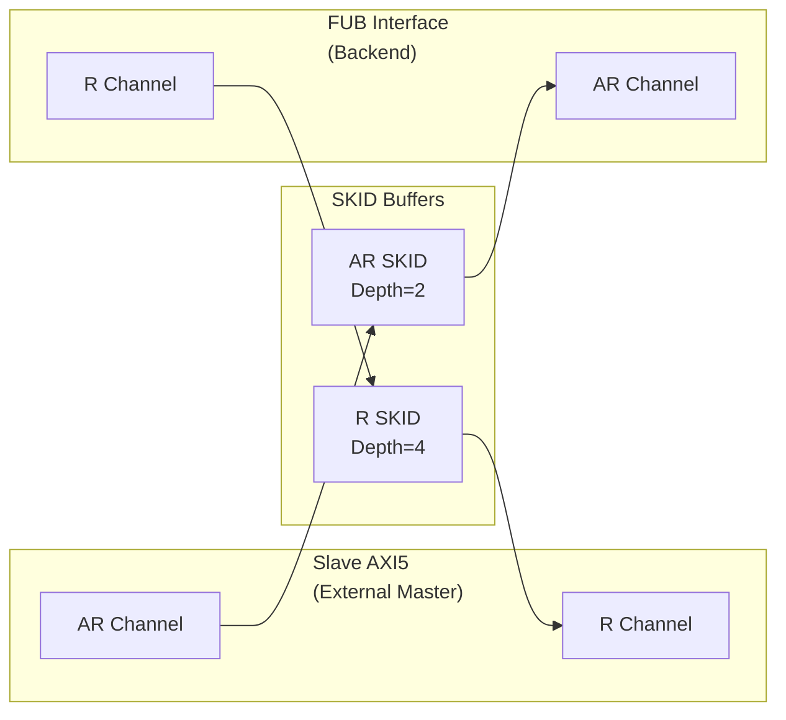

<!-- RTL Design Sherpa Documentation Header -->
<table>
<tr>
<td width="80">
  <a href="https://github.com/sean-galloway/RTLDesignSherpa">
    
  </a>
</td>
<td>
  <strong>RTL Design Sherpa</strong> · <em>Learning Hardware Design Through Practice</em><br>
  <sub>
    <a href="https://github.com/sean-galloway/RTLDesignSherpa">GitHub</a> ·
    <a href="https://github.com/sean-galloway/RTLDesignSherpa/blob/main/docs/DOCUMENTATION_INDEX.md">Documentation Index</a> ·
    <a href="https://github.com/sean-galloway/RTLDesignSherpa/blob/main/LICENSE">MIT License</a>
  </sub>
</td>
</tr>
</table>

---

<!-- End Header -->

# AXI5 Slave Read

**Module:** `axi5_slave_rd.sv`
**Location:** `rtl/amba/axi5/`
**Status:** Production Ready

---

## Overview

The AXI5 Slave Read module implements a complete AMBA AXI5 slave read interface with full AXI5 protocol support. It receives read requests from external masters and forwards them to backend memory/logic (FUB interface).

### Key Features

- Full AMBA AXI5 slave protocol compliance
- **ARNSAID:** Non-secure access identifier reception
- **ARTRACE:** Trace signal support
- **ARMPAM:** Memory Partitioning and Monitoring reception
- **ARMECID:** Memory Encryption Context ID reception
- **ARUNIQUE:** Unique ID indicator reception
- **ARCHUNKEN:** Chunking enable reception
- **ARTAGOP:** Memory tag operation reception (MTE)
- **RTRACE/RPOISON:** Response extensions
- **RCHUNKV/RCHUNKNUM/RCHUNKSTRB:** Chunking support
- **RTAG/RTAGMATCH:** Memory tag responses (MTE)
- SKID buffering for AR and R channels
- Busy signal for power management

---

## Module Architecture



---

## Parameters

| Parameter | Type | Default | Description |
|-----------|------|---------|-------------|
| SKID_DEPTH_AR | int | 2 | AR channel SKID buffer depth |
| SKID_DEPTH_R | int | 4 | R channel SKID buffer depth |
| AXI_ID_WIDTH | int | 8 | Transaction ID width |
| AXI_ADDR_WIDTH | int | 32 | Address bus width |
| AXI_DATA_WIDTH | int | 32 | Data bus width |
| AXI_USER_WIDTH | int | 1 | User signal width |
| AXI_NSAID_WIDTH | int | 4 | Non-secure access ID width |
| AXI_MPAM_WIDTH | int | 11 | MPAM width |
| AXI_MECID_WIDTH | int | 16 | Memory encryption context width |
| AXI_TAG_WIDTH | int | 4 | Memory tag width per 16 bytes |
| AXI_TAGOP_WIDTH | int | 2 | Tag operation width |
| AXI_CHUNKNUM_WIDTH | int | 4 | Chunk number width |
| ENABLE_NSAID | bit | 1 | Enable non-secure access ID |
| ENABLE_TRACE | bit | 1 | Enable trace signals |
| ENABLE_MPAM | bit | 1 | Enable memory partitioning |
| ENABLE_MECID | bit | 1 | Enable memory encryption |
| ENABLE_UNIQUE | bit | 1 | Enable unique ID indicator |
| ENABLE_CHUNKING | bit | 1 | Enable data chunking |
| ENABLE_MTE | bit | 1 | Enable Memory Tagging Extension |
| ENABLE_POISON | bit | 1 | Enable poison indicator |

---

## Ports

### Clock and Reset

| Port | Width | Direction | Description |
|------|-------|-----------|-------------|
| aclk | 1 | Input | AXI clock |
| aresetn | 1 | Input | AXI active-low reset |

### Slave AXI5 Interface (External Master Input)

#### AR Channel (Input)

| Port | Width | Direction | Description |
|------|-------|-----------|-------------|
| s_axi_arid | IW | Input | Read address ID |
| s_axi_araddr | AW | Input | Read address |
| s_axi_arlen | 8 | Input | Burst length |
| s_axi_arsize | 3 | Input | Burst size |
| s_axi_arburst | 2 | Input | Burst type |
| s_axi_arlock | 1 | Input | Lock type |
| s_axi_arcache | 4 | Input | Cache attributes |
| s_axi_arprot | 3 | Input | Protection attributes |
| s_axi_arqos | 4 | Input | Quality of Service |
| s_axi_aruser | UW | Input | User-defined signal |
| s_axi_arvalid | 1 | Input | Read address valid |
| s_axi_arready | 1 | Output | Read address ready |
| s_axi_arnsaid | AXI_NSAID_WIDTH | Input | Non-secure access ID (AXI5) |
| s_axi_artrace | 1 | Input | Trace signal (AXI5) |
| s_axi_armpam | AXI_MPAM_WIDTH | Input | Memory partitioning (AXI5) |
| s_axi_armecid | AXI_MECID_WIDTH | Input | Memory encryption context (AXI5) |
| s_axi_arunique | 1 | Input | Unique ID indicator (AXI5) |
| s_axi_archunken | 1 | Input | Chunking enable (AXI5) |
| s_axi_artagop | AXI_TAGOP_WIDTH | Input | Tag operation (AXI5 MTE) |

#### R Channel (Output)

| Port | Width | Direction | Description |
|------|-------|-----------|-------------|
| s_axi_rid | IW | Output | Read data ID |
| s_axi_rdata | DW | Output | Read data |
| s_axi_rresp | 2 | Output | Read response |
| s_axi_rlast | 1 | Output | Last transfer in burst |
| s_axi_ruser | UW | Output | User-defined signal |
| s_axi_rvalid | 1 | Output | Read data valid |
| s_axi_rready | 1 | Input | Read data ready |
| s_axi_rtrace | 1 | Output | Trace signal (AXI5) |
| s_axi_rpoison | 1 | Output | Data poison indicator (AXI5) |
| s_axi_rchunkv | 1 | Output | Chunk valid (AXI5) |
| s_axi_rchunknum | AXI_CHUNKNUM_WIDTH | Output | Chunk number (AXI5) |
| s_axi_rchunkstrb | CHUNK_STRB_WIDTH | Output | Chunk strobe (AXI5) |
| s_axi_rtag | TW | Output | Memory tags (AXI5 MTE) |
| s_axi_rtagmatch | 1 | Output | Tag match response (AXI5 MTE) |

### FUB Interface (Backend Memory/Logic Output)

Same signals as slave interface but with `fub_axi_*` prefix and reversed directions for AR (output) and R (input).

### Status Outputs

| Port | Width | Direction | Description |
|------|-------|-----------|-------------|
| busy | 1 | Output | Module busy indicator |

---

## Functionality

This slave module acts as an adapter between:
- **External AXI5 master** (s_axi_* interface)
- **Backend memory or functional unit block** (fub_axi_* interface)

**Signal Flow:**
1. AR channel: External master → SKID → Backend
2. R channel: Backend → SKID → External master

**SKID Buffering:** Provides elasticity and breaks combinational paths for timing closure.

---

## Timing Diagrams

### Basic Read Transaction

<!-- TODO: Add wavedrom timing diagram -->
```
TODO: Wavedrom showing AR request from external master
      flowing through to backend FUB interface
```

---

## Usage Example

```systemverilog
axi5_slave_rd #(
    .AXI_ID_WIDTH       (8),
    .AXI_ADDR_WIDTH     (32),
    .AXI_DATA_WIDTH     (64),
    .SKID_DEPTH_AR      (2),
    .SKID_DEPTH_R       (4),
    .ENABLE_NSAID       (1),
    .ENABLE_TRACE       (1),
    .ENABLE_MPAM        (1),
    .ENABLE_MECID       (1),
    .ENABLE_UNIQUE      (1),
    .ENABLE_CHUNKING    (1),
    .ENABLE_MTE         (1),
    .ENABLE_POISON      (1)
) u_axi5_slave_rd (
    .aclk               (axi_clk),
    .aresetn            (axi_rst_n),

    // Slave interface (from external master)
    .s_axi_arid         (s_axi_arid),
    .s_axi_araddr       (s_axi_araddr),
    .s_axi_arlen        (s_axi_arlen),
    // ... (connect all slave AR signals)
    .s_axi_arnsaid      (s_axi_arnsaid),
    .s_axi_artrace      (s_axi_artrace),
    // ... (connect AXI5 extensions)

    .s_axi_rid          (s_axi_rid),
    .s_axi_rdata        (s_axi_rdata),
    // ... (connect all slave R signals)

    // FUB interface (to backend)
    .fub_axi_arid       (mem_arid),
    .fub_axi_araddr     (mem_araddr),
    // ... (connect to memory controller)

    .busy               (slave_rd_busy)
);
```

---

## Design Notes

- Use when you need AXI5 slave functionality with SKID buffering
- Backend FUB interface can connect to memory controller, SRAM, or functional units
- SKID buffers improve timing by breaking long combinational paths
- Feature enables allow area optimization by disabling unused AXI5 extensions

---

## Related Documentation

- **[AXI5 Slave Write](axi5_slave_wr.md)** - Slave write interface
- **[AXI5 Master Read](axi5_master_rd.md)** - Master read interface
- **[AXI5 Slave Read CG](axi5_slave_rd_cg.md)** - Clock-gated variant
- **[AXI5 Slave Read Monitor](axi5_slave_rd_mon.md)** - With integrated monitoring

---

## Navigation

- **[← Back to AXI5 Index](README.md)**
- **[← Back to RTLAmba Index](../index.md)**
- **[← Back to Main Documentation Index](../../index.md)**
