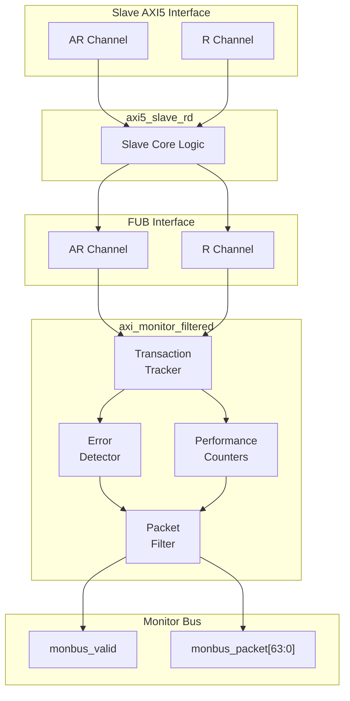

<!-- RTL Design Sherpa Documentation Header -->
<table>
<tr>
<td width="80">
  <a href="https://github.com/sean-galloway/RTLDesignSherpa">
    
  </a>
</td>
<td>
  <strong>RTL Design Sherpa</strong> · <em>Learning Hardware Design Through Practice</em><br>
  <sub>
    <a href="https://github.com/sean-galloway/RTLDesignSherpa">GitHub</a> ·
    <a href="https://github.com/sean-galloway/RTLDesignSherpa/blob/main/docs/DOCUMENTATION_INDEX.md">Documentation Index</a> ·
    <a href="https://github.com/sean-galloway/RTLDesignSherpa/blob/main/LICENSE">MIT License</a>
  </sub>
</td>
</tr>
</table>

---

<!-- End Header -->

# AXI5 Slave Read Monitor

**Module:** `axi5_slave_rd_mon.sv`
**Location:** `rtl/amba/axi5/`
**Status:** Production Ready

---

## Overview

The AXI5 Slave Read Monitor module combines the `axi5_slave_rd` interface with integrated transaction monitoring. It provides real-time visibility into slave read operations with configurable packet filtering and error detection.

### Key Features

- Full AMBA AXI5 slave read protocol compliance
- **Integrated filtered monitoring** - no external monitor needed
- All AXI5 extensions supported (NSAID, TRACE, MPAM, MECID, UNIQUE, CHUNKING, MTE, POISON)
- Transaction tracking with configurable table size
- Error detection (SLVERR, timeout, orphan transactions)
- Performance metrics (latency, throughput)
- Configurable packet filtering to reduce bandwidth
- 64-bit monitor bus packet output
- Active transaction count tracking

---

## Module Architecture



---

## Parameters

| Parameter | Type | Default | Description |
|-----------|------|---------|-------------|
| SKID_DEPTH_AR | int | 2 | AR channel SKID buffer depth |
| SKID_DEPTH_R | int | 4 | R channel SKID buffer depth |
| AXI_ID_WIDTH | int | 8 | Transaction ID width |
| AXI_ADDR_WIDTH | int | 32 | Address bus width |
| AXI_DATA_WIDTH | int | 32 | Data bus width |
| AXI_USER_WIDTH | int | 1 | User signal width |
| AXI_NSAID_WIDTH | int | 4 | Non-secure access ID width |
| AXI_MPAM_WIDTH | int | 11 | MPAM width |
| AXI_MECID_WIDTH | int | 16 | Memory encryption context width |
| AXI_TAG_WIDTH | int | 4 | Memory tag width per 16 bytes |
| AXI_TAGOP_WIDTH | int | 2 | Tag operation width |
| AXI_CHUNKNUM_WIDTH | int | 4 | Chunk number width |
| ENABLE_NSAID | bit | 1 | Enable non-secure access ID |
| ENABLE_TRACE | bit | 1 | Enable trace signals |
| ENABLE_MPAM | bit | 1 | Enable memory partitioning |
| ENABLE_MECID | bit | 1 | Enable memory encryption |
| ENABLE_UNIQUE | bit | 1 | Enable unique ID indicator |
| ENABLE_CHUNKING | bit | 1 | Enable data chunking |
| ENABLE_MTE | bit | 1 | Enable Memory Tagging Extension |
| ENABLE_POISON | bit | 1 | Enable poison indicator |
| UNIT_ID | int | 1 | Monitoring unit identifier |
| AGENT_ID | int | 12 | Agent identifier |
| MAX_TRANSACTIONS | int | 16 | Transaction table size |
| ENABLE_FILTERING | bit | 1 | Enable packet filtering |
| ADD_PIPELINE_STAGE | bit | 0 | Add pipeline stage for timing |

---

## Ports

### Clock and Reset

| Port | Width | Direction | Description |
|------|-------|-----------|-------------|
| aclk | 1 | Input | AXI clock |
| aresetn | 1 | Input | AXI active-low reset |

### Slave AXI5 Interface

Same as `axi5_slave_rd` - see [AXI5 Slave Read](axi5_slave_rd.md) for complete port list.

### FUB Interface

Same as `axi5_slave_rd` - see [AXI5 Slave Read](axi5_slave_rd.md) for complete port list.

### Monitor Configuration

| Port | Width | Direction | Description |
|------|-------|-----------|-------------|
| cfg_monitor_enable | 1 | Input | Enable completion packets |
| cfg_error_enable | 1 | Input | Enable error packets |
| cfg_timeout_enable | 1 | Input | Enable timeout packets |
| cfg_perf_enable | 1 | Input | Enable performance packets |
| cfg_timeout_cycles | 16 | Input | Timeout threshold (cycles) |
| cfg_latency_threshold | 32 | Input | High latency threshold (cycles) |
| cfg_axi_pkt_mask | 16 | Input | Packet type filter mask |
| cfg_axi_err_select | 16 | Input | Error selection mask |
| cfg_axi_error_mask | 16 | Input | Error event filter |
| cfg_axi_timeout_mask | 16 | Input | Timeout event filter |
| cfg_axi_compl_mask | 16 | Input | Completion event filter |
| cfg_axi_thresh_mask | 16 | Input | Threshold event filter |
| cfg_axi_perf_mask | 16 | Input | Performance event filter |
| cfg_axi_addr_mask | 16 | Input | Address event filter |
| cfg_axi_debug_mask | 16 | Input | Debug event filter |

### Monitor Bus Output

| Port | Width | Direction | Description |
|------|-------|-----------|-------------|
| monbus_valid | 1 | Output | Monitor packet valid |
| monbus_ready | 1 | Input | Monitor packet ready |
| monbus_packet | 64 | Output | Monitor packet data |

### Status Outputs

| Port | Width | Direction | Description |
|------|-------|-----------|-------------|
| busy | 1 | Output | Module busy indicator |
| active_transactions | 8 | Output | Current outstanding transactions |
| error_count | 16 | Output | Total errors detected |
| transaction_count | 32 | Output | Total transactions completed |
| cfg_conflict_error | 1 | Output | Configuration conflict detected |

---

## Functionality

### Monitor Packet Format

**64-bit Monitor Packet Structure:**
```
[63:60] Packet Type  (0=ERROR, 1=COMPL, 2=TIMEOUT, 3=THRESH, 4=PERF)
[59:57] Protocol     (0=AXI)
[56:53] Event Code
[52:47] Channel ID
[46:43] Unit ID
[42:35] Agent ID
[34:0]  Event Data   (address, latency, error info, etc.)
```

### Event Types

#### Error Packets (Type=0)

| Event Code | Description | Event Data |
|------------|-------------|------------|
| 0x1 | SLVERR response | Transaction ID, address[18:0] |
| 0x2 | DECERR response | Transaction ID, address[18:0] |
| 0x3 | Orphan data | Transaction ID |
| 0x4 | Protocol violation | Violation code |
| 0x5 | Poison detected | Transaction ID, beat number |
| 0x6 | Tag mismatch | Transaction ID, expected/actual tags |

#### Completion Packets (Type=1)

| Event Code | Description | Event Data |
|------------|-------------|------------|
| 0x0 | Read completion | Transaction ID, burst length, latency |

#### Timeout Packets (Type=2)

| Event Code | Description | Event Data |
|------------|-------------|------------|
| 0x1 | AR channel timeout | Transaction ID, cycles elapsed |
| 0x2 | R channel timeout | Transaction ID, cycles elapsed |

#### Performance Packets (Type=4)

| Event Code | Description | Event Data |
|------------|-------------|------------|
| 0x1 | High latency | Transaction ID, latency (cycles) |
| 0x2 | Bandwidth sample | Bytes transferred, time window |
| 0x3 | Outstanding count | Max outstanding, average |

---

## Configuration Guide

### Common Configurations

#### Functional Verification Mode
```systemverilog
.cfg_monitor_enable     (1'b1),  // Track completions
.cfg_error_enable       (1'b1),  // Catch errors
.cfg_timeout_enable     (1'b1),  // Detect stalls
.cfg_perf_enable        (1'b0),  // Disable (reduces traffic)
.cfg_timeout_cycles     (16'd1000),
.cfg_latency_threshold  (32'd500)
```

#### Performance Analysis Mode
```systemverilog
.cfg_monitor_enable     (1'b0),  // Disable completions
.cfg_error_enable       (1'b1),  // Still catch errors
.cfg_timeout_enable     (1'b0),  // Disable
.cfg_perf_enable        (1'b1),  // Enable performance metrics
.cfg_latency_threshold  (32'd100)
```

#### Debug Mode
```systemverilog
.cfg_monitor_enable     (1'b1),  // Track all transactions
.cfg_error_enable       (1'b1),  // All errors
.cfg_timeout_enable     (1'b1),  // All timeouts
.cfg_perf_enable        (1'b0),  // Disable perf (too much data)
.cfg_axi_pkt_mask       (16'hFFFF)  // All packet types
```

### Filter Masks

**cfg_axi_pkt_mask bits:**
- [0]: Error packets
- [1]: Completion packets
- [2]: Timeout packets
- [3]: Threshold packets
- [4]: Performance packets
- [15:5]: Reserved

**Example:** `cfg_axi_pkt_mask = 16'h0007` enables error, completion, and timeout packets only.

---

## Usage Example

```systemverilog
axi5_slave_rd_mon #(
    .AXI_ID_WIDTH       (8),
    .AXI_ADDR_WIDTH     (32),
    .AXI_DATA_WIDTH     (64),
    .UNIT_ID            (1),
    .AGENT_ID           (12),
    .MAX_TRANSACTIONS   (16),
    .ENABLE_FILTERING   (1),
    .ENABLE_NSAID       (1),
    .ENABLE_TRACE       (1),
    .ENABLE_MPAM        (1),
    .ENABLE_MECID       (1),
    .ENABLE_UNIQUE      (1),
    .ENABLE_CHUNKING    (1),
    .ENABLE_MTE         (1),
    .ENABLE_POISON      (1)
) u_axi5_slave_rd_mon (
    .aclk               (axi_clk),
    .aresetn            (axi_rst_n),

    // Slave interface (from external master)
    .s_axi_arid         (s_axi_arid),
    .s_axi_araddr       (s_axi_araddr),
    // ... (connect all slave AR/R signals)

    // FUB interface (to backend)
    .fub_axi_arid       (mem_arid),
    .fub_axi_araddr     (mem_araddr),
    // ... (connect to memory controller)

    // Monitor configuration
    .cfg_monitor_enable (1'b1),
    .cfg_error_enable   (1'b1),
    .cfg_timeout_enable (1'b1),
    .cfg_perf_enable    (1'b0),
    .cfg_timeout_cycles (16'd1000),
    .cfg_latency_threshold (32'd500),
    .cfg_axi_pkt_mask   (16'h0007),

    // Monitor bus (connect to FIFO or consumer)
    .monbus_valid       (mon_valid),
    .monbus_ready       (mon_ready),
    .monbus_packet      (mon_packet),

    // Status
    .busy               (slave_rd_busy),
    .active_transactions(active_txns),
    .error_count        (total_errors),
    .transaction_count  (total_txns),
    .cfg_conflict_error (cfg_conflict)
);

// Downstream packet handling
gaxi_fifo_sync #(.DATA_WIDTH(64), .DEPTH(256)) u_mon_fifo (
    .i_clk      (axi_clk),
    .i_rst_n    (axi_rst_n),
    .i_valid    (mon_valid),
    .i_data     (mon_packet),
    .o_ready    (mon_ready),
    .o_valid    (fifo_valid),
    .o_data     (fifo_data),
    .i_ready    (consumer_ready)
);
```

---

## Design Notes

- Monitor packets provide real-time transaction visibility without external logic
- Filtering reduces monitor bus bandwidth - critical for high-throughput systems
- Transaction table size (MAX_TRANSACTIONS) must accommodate peak outstanding transactions
- Performance packets can generate high traffic - use sparingly or with filtering
- UNIT_ID and AGENT_ID identify this monitor in multi-agent systems
- Error count saturates at max value (does not wrap)

---

## Related Documentation

- **[AXI5 Slave Read](axi5_slave_rd.md)** - Non-monitored version
- **[AXI5 Slave Read Monitor CG](axi5_slave_rd_mon_cg.md)** - Clock-gated variant
- **[AXI5 Slave Write Monitor](axi5_slave_wr_mon.md)** - Write monitor
- **[AXI Monitor Filtered](../shared/axi_monitor_filtered.md)** - Monitor core
- **[Monitor Package Spec](../includes/monitor_package_spec.md)** - Packet format details

---

## Navigation

- **[← Back to AXI5 Index](README.md)**
- **[← Back to RTLAmba Index](../index.md)**
- **[← Back to Main Documentation Index](../../index.md)**
