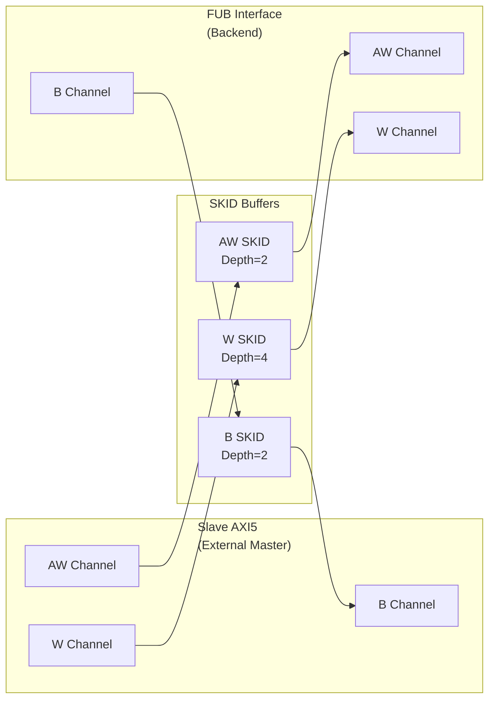

<!-- RTL Design Sherpa Documentation Header -->
<table>
<tr>
<td width="80">
  <a href="https://github.com/sean-galloway/RTLDesignSherpa">
    
  </a>
</td>
<td>
  <strong>RTL Design Sherpa</strong> · <em>Learning Hardware Design Through Practice</em><br>
  <sub>
    <a href="https://github.com/sean-galloway/RTLDesignSherpa">GitHub</a> ·
    <a href="https://github.com/sean-galloway/RTLDesignSherpa/blob/main/docs/DOCUMENTATION_INDEX.md">Documentation Index</a> ·
    <a href="https://github.com/sean-galloway/RTLDesignSherpa/blob/main/LICENSE">MIT License</a>
  </sub>
</td>
</tr>
</table>

---

<!-- End Header -->

# AXI5 Slave Write

**Module:** `axi5_slave_wr.sv`
**Location:** `rtl/amba/axi5/`
**Status:** Production Ready

---

## Overview

The AXI5 Slave Write module implements a complete AMBA AXI5 slave write interface with full AXI5 protocol support. It receives write requests from external masters and forwards them to backend memory/logic (FUB interface).

### Key Features

- Full AMBA AXI5 slave protocol compliance
- **AWATOP:** Atomic transaction operation type
- **AWNSAID:** Non-secure access identifier reception
- **AWTRACE:** Trace signal support
- **AWMPAM:** Memory Partitioning and Monitoring reception
- **AWMECID:** Memory Encryption Context ID reception
- **AWUNIQUE:** Unique ID indicator reception
- **AWTAGOP/AWTAG:** Memory tag operation reception (MTE)
- **WPOISON:** Write data poison indicator
- **WTAG/WTAGUPDATE:** Write data memory tags (MTE)
- **BTRACE/BTAG/BTAGMATCH:** Response extensions
- SKID buffering for AW, W, and B channels
- Busy signal for power management
- Deprecated AWREGION removed (not recommended for new designs)

---

## Module Architecture



---

## Parameters

| Parameter | Type | Default | Description |
|-----------|------|---------|-------------|
| SKID_DEPTH_AW | int | 2 | AW channel SKID buffer depth |
| SKID_DEPTH_W | int | 4 | W channel SKID buffer depth |
| SKID_DEPTH_B | int | 2 | B channel SKID buffer depth |
| AXI_ID_WIDTH | int | 8 | Transaction ID width |
| AXI_ADDR_WIDTH | int | 32 | Address bus width |
| AXI_DATA_WIDTH | int | 32 | Data bus width |
| AXI_USER_WIDTH | int | 1 | User signal width |
| AXI_ATOP_WIDTH | int | 6 | Atomic operation width |
| AXI_NSAID_WIDTH | int | 4 | Non-secure access ID width |
| AXI_MPAM_WIDTH | int | 11 | MPAM width |
| AXI_MECID_WIDTH | int | 16 | Memory encryption context width |
| AXI_TAG_WIDTH | int | 4 | Memory tag width per 16 bytes |
| AXI_TAGOP_WIDTH | int | 2 | Tag operation width |
| ENABLE_ATOMIC | bit | 1 | Enable atomic operations |
| ENABLE_NSAID | bit | 1 | Enable non-secure access ID |
| ENABLE_TRACE | bit | 1 | Enable trace signals |
| ENABLE_MPAM | bit | 1 | Enable memory partitioning |
| ENABLE_MECID | bit | 1 | Enable memory encryption |
| ENABLE_UNIQUE | bit | 1 | Enable unique ID indicator |
| ENABLE_MTE | bit | 1 | Enable Memory Tagging Extension |
| ENABLE_POISON | bit | 1 | Enable poison indicator |

---

## Ports

### Clock and Reset

| Port | Width | Direction | Description |
|------|-------|-----------|-------------|
| aclk | 1 | Input | AXI clock |
| aresetn | 1 | Input | AXI active-low reset |

### Slave AXI5 Interface (External Master Input)

#### AW Channel (Input)

| Port | Width | Direction | Description |
|------|-------|-----------|-------------|
| s_axi_awid | IW | Input | Write address ID |
| s_axi_awaddr | AW | Input | Write address |
| s_axi_awlen | 8 | Input | Burst length |
| s_axi_awsize | 3 | Input | Burst size |
| s_axi_awburst | 2 | Input | Burst type |
| s_axi_awlock | 1 | Input | Lock type |
| s_axi_awcache | 4 | Input | Cache attributes |
| s_axi_awprot | 3 | Input | Protection attributes |
| s_axi_awqos | 4 | Input | Quality of Service |
| s_axi_awuser | UW | Input | User-defined signal |
| s_axi_awvalid | 1 | Input | Write address valid |
| s_axi_awready | 1 | Output | Write address ready |
| s_axi_awatop | AXI_ATOP_WIDTH | Input | Atomic operation (AXI5) |
| s_axi_awnsaid | AXI_NSAID_WIDTH | Input | Non-secure access ID (AXI5) |
| s_axi_awtrace | 1 | Input | Trace signal (AXI5) |
| s_axi_awmpam | AXI_MPAM_WIDTH | Input | Memory partitioning (AXI5) |
| s_axi_awmecid | AXI_MECID_WIDTH | Input | Memory encryption context (AXI5) |
| s_axi_awunique | 1 | Input | Unique ID indicator (AXI5) |
| s_axi_awtagop | AXI_TAGOP_WIDTH | Input | Tag operation (AXI5 MTE) |
| s_axi_awtag | TW | Input | Memory tags (AXI5 MTE) |

#### W Channel (Input)

| Port | Width | Direction | Description |
|------|-------|-----------|-------------|
| s_axi_wdata | DW | Input | Write data |
| s_axi_wstrb | SW | Input | Write strobes |
| s_axi_wlast | 1 | Input | Last transfer in burst |
| s_axi_wuser | UW | Input | User-defined signal |
| s_axi_wvalid | 1 | Input | Write data valid |
| s_axi_wready | 1 | Output | Write data ready |
| s_axi_wpoison | 1 | Input | Data poison indicator (AXI5) |
| s_axi_wtag | TW | Input | Write data memory tags (AXI5 MTE) |
| s_axi_wtagupdate | NUM_TAGS | Input | Tag update mask (AXI5 MTE) |

#### B Channel (Output)

| Port | Width | Direction | Description |
|------|-------|-----------|-------------|
| s_axi_bid | IW | Output | Write response ID |
| s_axi_bresp | 2 | Output | Write response |
| s_axi_buser | UW | Output | User-defined signal |
| s_axi_bvalid | 1 | Output | Write response valid |
| s_axi_bready | 1 | Input | Write response ready |
| s_axi_btrace | 1 | Output | Trace signal (AXI5) |
| s_axi_btag | TW | Output | Memory tags (AXI5 MTE) |
| s_axi_btagmatch | 1 | Output | Tag match response (AXI5 MTE) |

### FUB Interface (Backend Memory/Logic Output)

Same signals as slave interface but with `fub_axi_*` prefix and reversed directions for AW/W (output) and B (input).

### Status Outputs

| Port | Width | Direction | Description |
|------|-------|-----------|-------------|
| busy | 1 | Output | Module busy indicator |

---

## Functionality

This slave module acts as an adapter between:
- **External AXI5 master** (s_axi_* interface)
- **Backend memory or functional unit block** (fub_axi_* interface)

**Signal Flow:**
1. AW channel: External master → SKID → Backend
2. W channel: External master → SKID → Backend
3. B channel: Backend → SKID → External master

**SKID Buffering:** Provides elasticity and breaks combinational paths for timing closure.

**Busy Signal:** Asserted when any SKID buffer has data or handshakes are pending.

---

## Timing Diagrams

### Basic Write Transaction

<!-- TODO: Add wavedrom timing diagram -->
```
TODO: Wavedrom showing AW/W request from external master
      flowing through to backend FUB interface
```

### Write with Poison Indicator

<!-- TODO: Add wavedrom timing diagram -->
```
TODO: Wavedrom showing write transaction with WPOISON asserted
```

---

## Usage Example

```systemverilog
axi5_slave_wr #(
    .AXI_ID_WIDTH       (8),
    .AXI_ADDR_WIDTH     (32),
    .AXI_DATA_WIDTH     (64),
    .SKID_DEPTH_AW      (2),
    .SKID_DEPTH_W       (4),
    .SKID_DEPTH_B       (2),
    .ENABLE_ATOMIC      (1),
    .ENABLE_NSAID       (1),
    .ENABLE_TRACE       (1),
    .ENABLE_MPAM        (1),
    .ENABLE_MECID       (1),
    .ENABLE_UNIQUE      (1),
    .ENABLE_MTE         (1),
    .ENABLE_POISON      (1)
) u_axi5_slave_wr (
    .aclk               (axi_clk),
    .aresetn            (axi_rst_n),

    // Slave interface (from external master)
    .s_axi_awid         (s_axi_awid),
    .s_axi_awaddr       (s_axi_awaddr),
    .s_axi_awlen        (s_axi_awlen),
    // ... (connect all slave AW signals)
    .s_axi_awatop       (s_axi_awatop),
    .s_axi_awnsaid      (s_axi_awnsaid),
    .s_axi_awtrace      (s_axi_awtrace),
    // ... (connect AXI5 extensions)

    .s_axi_wdata        (s_axi_wdata),
    .s_axi_wstrb        (s_axi_wstrb),
    // ... (connect all slave W signals)

    .s_axi_bid          (s_axi_bid),
    .s_axi_bresp        (s_axi_bresp),
    // ... (connect all slave B signals)

    // FUB interface (to backend)
    .fub_axi_awid       (mem_awid),
    .fub_axi_awaddr     (mem_awaddr),
    // ... (connect to memory controller)

    .busy               (slave_wr_busy)
);
```

---

## Design Notes

- Use when you need AXI5 slave write functionality with SKID buffering
- Backend FUB interface can connect to memory controller, SRAM, or functional units
- SKID buffers improve timing by breaking long combinational paths
- W channel SKID depth typically larger than AW/B due to burst data
- Feature enables allow area optimization by disabling unused AXI5 extensions
- AWREGION deprecated in AXI5 (not recommended for new designs)

---

## Related Documentation

- **[AXI5 Slave Read](axi5_slave_rd.md)** - Slave read interface
- **[AXI5 Master Write](axi5_master_wr.md)** - Master write interface
- **[AXI5 Slave Write CG](axi5_slave_wr_cg.md)** - Clock-gated variant
- **[AXI5 Slave Write Monitor](axi5_slave_wr_mon.md)** - With integrated monitoring

---

## Navigation

- **[← Back to AXI5 Index](README.md)**
- **[← Back to RTLAmba Index](../index.md)**
- **[← Back to Main Documentation Index](../../index.md)**
