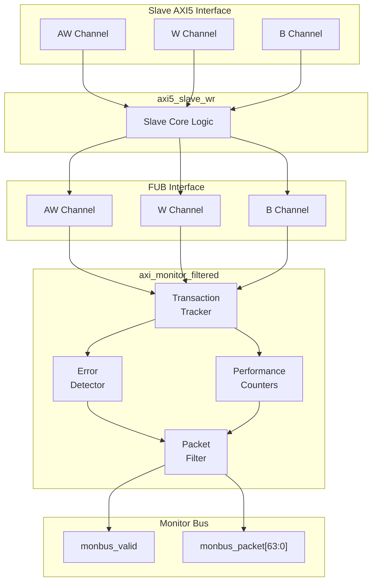

<!-- RTL Design Sherpa Documentation Header -->
<table>
<tr>
<td width="80">
  <a href="https://github.com/sean-galloway/RTLDesignSherpa">
    
  </a>
</td>
<td>
  <strong>RTL Design Sherpa</strong> · <em>Learning Hardware Design Through Practice</em><br>
  <sub>
    <a href="https://github.com/sean-galloway/RTLDesignSherpa">GitHub</a> ·
    <a href="https://github.com/sean-galloway/RTLDesignSherpa/blob/main/docs/DOCUMENTATION_INDEX.md">Documentation Index</a> ·
    <a href="https://github.com/sean-galloway/RTLDesignSherpa/blob/main/LICENSE">MIT License</a>
  </sub>
</td>
</tr>
</table>

---

<!-- End Header -->

# AXI5 Slave Write Monitor

**Module:** `axi5_slave_wr_mon.sv`
**Location:** `rtl/amba/axi5/`
**Status:** Production Ready

---

## Overview

The AXI5 Slave Write Monitor module combines the `axi5_slave_wr` interface with integrated transaction monitoring. It provides real-time visibility into slave write operations with configurable packet filtering and error detection.

### Key Features

- Full AMBA AXI5 slave write protocol compliance
- **Integrated filtered monitoring** - no external monitor needed
- All AXI5 extensions supported (ATOMIC, NSAID, TRACE, MPAM, MECID, UNIQUE, MTE, POISON)
- Transaction tracking with configurable table size
- Error detection (SLVERR, timeout, orphan transactions, poison data)
- Performance metrics (latency, throughput)
- Configurable packet filtering to reduce bandwidth
- 128-bit monitor bus packet output paired with 64-bit side-band timestamp
- Active transaction count tracking

---

## Module Architecture



---

## Parameters

| Parameter | Type | Default | Description |
|-----------|------|---------|-------------|
| SKID_DEPTH_AW | int | 2 | AW channel SKID buffer depth |
| SKID_DEPTH_W | int | 4 | W channel SKID buffer depth |
| SKID_DEPTH_B | int | 2 | B channel SKID buffer depth |
| AXI_ID_WIDTH | int | 8 | Transaction ID width |
| AXI_ADDR_WIDTH | int | 32 | Address bus width |
| AXI_DATA_WIDTH | int | 32 | Data bus width |
| AXI_USER_WIDTH | int | 1 | User signal width |
| AXI_ATOP_WIDTH | int | 6 | Atomic operation width |
| AXI_NSAID_WIDTH | int | 4 | Non-secure access ID width |
| AXI_MPAM_WIDTH | int | 11 | MPAM width |
| AXI_MECID_WIDTH | int | 16 | Memory encryption context width |
| AXI_TAG_WIDTH | int | 4 | Memory tag width per 16 bytes |
| AXI_TAGOP_WIDTH | int | 2 | Tag operation width |
| ENABLE_ATOMIC | bit | 1 | Enable atomic operations |
| ENABLE_NSAID | bit | 1 | Enable non-secure access ID |
| ENABLE_TRACE | bit | 1 | Enable trace signals |
| ENABLE_MPAM | bit | 1 | Enable memory partitioning |
| ENABLE_MECID | bit | 1 | Enable memory encryption |
| ENABLE_UNIQUE | bit | 1 | Enable unique ID indicator |
| ENABLE_MTE | bit | 1 | Enable Memory Tagging Extension |
| ENABLE_POISON | bit | 1 | Enable poison indicator |
| UNIT_ID | int | 1 | Monitoring unit identifier |
| AGENT_ID | int | 13 | Agent identifier |
| MAX_TRANSACTIONS | int | 16 | Transaction table size |
| ENABLE_FILTERING | bit | 1 | Enable packet filtering |
| ADD_PIPELINE_STAGE | bit | 0 | Add pipeline stage for timing |
| USE_MONITOR | bit | 1 | Synthesis-time monitor enable. 0 = omit monitor and tie outputs to safe non-blocking defaults; 1 = full monitor functionality. |
| N_ADDR_RANGES | int | 0 | Number of address-range comparators. 0 = checker omitted (zero area). >0 = N independent [low, high] ranges; hits emit PktTypeError + AXI_ERR_ADDR_RANGE on monbus. |
| ENABLE_ERROR_LOGIC | bit | 1 | Compile-in the error-detection cone (0 drops it for area). |
| ENABLE_TIMEOUT_LOGIC | bit | 1 | Compile-in the timeout cone and the `axi_monitor_timeout` instance. |
| ENABLE_COMPL_LOGIC | bit | 1 | Compile-in the completion cone. |
| ENABLE_THRESHOLD_LOGIC | bit | 1 | Compile-in the threshold cone. |
| ENABLE_PERF_LOGIC | bit | 1 | Compile-in the perfmon measurement window and utilization/throughput counters. |
| ENABLE_DEBUG_LOGIC | bit | 0 | Compile-in the debug cone (off by default). |

> **Synthesis-cone note:** the six `ENABLE_*_LOGIC` parameters gate each detection cone at synthesis via generate-if, so unused logic drops to zero area (classic cones default on, debug off). Inside the wrapper's `axi_monitor_filtered` instance the perf/debug master switches are fixed (`ENABLE_PERF_PACKETS = 1`, `ENABLE_DEBUG_MODULE = 0`). The former `CAM_PIPELINE` / `TRANS_CAM_PIPELINE` parameters were removed — the transaction CAM is now always pipelined.

---

## Monitor Backpressure (block_ready)

The monitor exposes a `block_ready` signal that goes low when its internal FIFO is saturated and cannot accept a new in-flight transaction. The wrapper ANDs `block_ready` into the upstream-facing `s_axi_awready` so a saturated monitor stalls new transactions on the wire instead of dropping events.

- **Where the stall lands**: the upstream `s_axi_awready` is forced low until the monitor drains.
- **When `USE_MONITOR=0`**: `block_ready` is internally tied high, so the wrapper imposes no stall and runs at full bandwidth.
- **For axi5 slave variants**: the monitor watches the FUB-side handshake, so there is a `SKID_DEPTH_AW` cycle lag between block_ready going low and new events ceasing. `MAX_TRANSACTIONS` should be sized to cover this margin.

This replaces a previous bug where `block_ready` was left unconnected and a full monitor FIFO would silently lose events.

---

## Address-Range Checker

The wrapper can be parameterized with `N_ADDR_RANGES > 0` to instantiate an N-comparator address-range checker that watches every accepted AW handshake and emits a `PktTypeError` monbus packet (event code `AXI_ERR_ADDR_RANGE = 8'h0D`) when an address falls inside any of the configured `[low, high]` inclusive ranges.

**Config inputs (active only when `N_ADDR_RANGES > 0`):**
- `cfg_addr_check_enable` — master on/off for the checker.
- `cfg_addr_range_enable[N-1:0]` — per-range enable bit.
- `cfg_addr_range_low[N-1:0][AXI_ADDR_WIDTH-1:0]` — inclusive low bound for each range.
- `cfg_addr_range_high[N-1:0][AXI_ADDR_WIDTH-1:0]` — inclusive high bound for each range.

**Event encoding** (within the standard 128-bit `monitor_packet_t`, event_data field):
- `packet_type` = `PktTypeError` (4'h0)
- `protocol`    = AXI (3'b000)
- `event_code`  = `AXI_ERR_ADDR_RANGE` (8'h0D)
- `event_data[63:60]` = `range_index` (4 bits; supports up to 16 ranges)
- `event_data[59:0]`  = full matched address (up to 60 bits, zero-padded if narrower)

**Exact match:** set `cfg_addr_range_low[i] == cfg_addr_range_high[i]`.

**Filtering:** the existing `cfg_axi_error_mask[13]` bit masks this event code; set it high to suppress range packets without disabling other errors. No new mask wiring needed.

**Per-range coalescing:** if a range hits again before its packet has been emitted, the latched address is overwritten (latest hit wins). One packet per cycle drains the pending mask via a lowest-index priority encoder. Distinct ranges never lose events; under sustained per-range bursts, only the latest address per range is reported per emission cycle.

---

## Ports

### Clock and Reset

| Port | Width | Direction | Description |
|------|-------|-----------|-------------|
| aclk | 1 | Input | AXI clock |
| aresetn | 1 | Input | AXI active-low reset |

### Slave AXI5 Interface

Same as `axi5_slave_wr` - see [AXI5 Slave Write](axi5_slave_wr.md) for complete port list.

### FUB Interface

Same as `axi5_slave_wr` - see [AXI5 Slave Write](axi5_slave_wr.md) for complete port list.

### Monitor Configuration

| Port | Width | Direction | Description |
|------|-------|-----------|-------------|
| cfg_monitor_enable | 1 | Input | Enable completion packets |
| cam_clear | 1 | Input | Synchronous clear of the monitor transaction CAM (driven from the harness clear control bit, e.g. CTRL[4]) |
| cfg_error_enable | 1 | Input | Enable error packets |
| cfg_timeout_enable | 1 | Input | Enable timeout packets |
| cfg_perf_enable | 1 | Input | Enable performance packets (see [Performance Monitoring](#performance-monitoring)) |
| cfg_compl_enable | 1 | Input | Enable transaction-completion packets |
| cfg_threshold_enable | 1 | Input | Enable threshold-crossed packets |
| cfg_debug_enable | 1 | Input | Enable debug/trace packets (gates the debug cone — the 6th reporter sub-block) |
| cfg_timeout_cycles | 16 | Input | Timeout threshold (cycles) |
| cfg_latency_threshold | 32 | Input | High latency threshold (cycles) |
| cfg_axi_pkt_mask | 16 | Input | Packet type filter mask |
| cfg_axi_err_select | 16 | Input | Error selection mask |
| cfg_axi_error_mask | 16 | Input | Error event filter |
| cfg_axi_timeout_mask | 16 | Input | Timeout event filter |
| cfg_axi_compl_mask | 16 | Input | Completion event filter |
| cfg_axi_thresh_mask | 16 | Input | Threshold event filter |
| cfg_axi_perf_mask | 16 | Input | Performance event filter |
| cfg_axi_addr_mask | 16 | Input | Address event filter |
| cfg_axi_debug_mask | 16 | Input | Debug event filter |

> **Detection-cone enables:** `cfg_compl_enable`, `cfg_threshold_enable`, and `cfg_debug_enable` turn on the completion, threshold, and debug reporter sub-blocks respectively. `cfg_debug_enable` gates the **debug cone** — the 6th reporter sub-block (`axi_monitor_reporter_debug`). In this wrapper the debug module's `cfg_debug_level` (4), `cfg_debug_mask` (16), and `cfg_active_trans_threshold` (16) inputs are tied to their defaults (`4'h0` / `16'h0` / `16'd8`) and are not exposed as wrapper ports.

### Monitor Bus Output

| Port | Width | Direction | Description |
|------|-------|-----------|-------------|
| monbus_valid | 1 | Output | Monitor packet valid |
| monbus_ready | 1 | Input | Monitor packet ready |
| monbus_packet | 128 | Output | `monitor_packet_t` (see format below) |
| monbus_timestamp | 64 | Output | `monbus_timestamp_t` paired atomically with `monbus_packet` |
| i_mon_time | 64 | Input | Free-running counter from `monbus_axil_group`, sampled at packet emission |

### Status Outputs

| Port | Width | Direction | Description |
|------|-------|-----------|-------------|
| busy | 1 | Output | Module busy indicator |
| active_transactions | 8 | Output | Current outstanding transactions |
| error_count | 16 | Output | Total errors detected |
| transaction_count | 32 | Output | Total transactions completed |
| cfg_conflict_error | 1 | Output | Configuration conflict detected |

---

## Performance Monitoring

When performance tracking is compiled in (`ENABLE_PERF_LOGIC = 1`, the wrapper default, with `ENABLE_PERF_PACKETS` fixed to 1 inside the monitor instance) and `cfg_perf_enable` is asserted at runtime, the monitor runs a **measurement-window state machine** plus a bank of data-channel utilization counters. All counters accumulate **only while a window is open** (`window_active = 1`) and hold their values between windows so the host can read a completed window's totals.

### The measurement window

A window is opened by a **start event** and closed by an **end event**. The event sources are selected by `cfg_start_event_sel` / `cfg_end_event_sel` (3-bit; e.g. `3'b010` selects the `cfg_perf_enable` edge) and can also be fired directly by the `cfg_start_trigger` / `cfg_end_trigger` pulses (from an engine or CSR write). `cfg_window_force_close` is a software override that closes the window immediately. While the window is open:

- `window_active` is high.
- `window_cycles` free-runs, counting every clock elapsed inside the window.

### Utilization buckets (W data channel)

Every cycle inside the window is classified by the **W** data channel's valid/ready handshake into exactly one of four buckets:

| Output | Width | Condition | Meaning |
|--------|:-----:|-----------|---------|
| `perf_prod_cycles`  | 32 | `wvalid && wready`   | productive beat transferred |
| `perf_bp_cycles`    | 32 | `wvalid && !wready`  | back-pressure (data offered, sink not ready) |
| `perf_starv_cycles` | 32 | `!wvalid && wready`  | starvation (sink ready, no data) |
| `perf_idle_cycles`  | 32 | `!wvalid && !wready` | idle |

The four buckets sum to `window_cycles`, so utilization = `perf_prod_cycles / window_cycles`.

### Throughput counters

| Output | Width | Meaning |
|--------|:-----:|---------|
| `perf_beat_count`  | 32 | W data beats transferred (= `perf_prod_cycles`, 1 beat/cycle) |
| `perf_byte_count`  | 64 | bytes transferred = beats x (1 << latched AWSIZE), using the AWSIZE captured at the most recent AW address phase |
| `perf_burst_count` | 32 | AW address-phase handshakes |

Average burst length is `perf_beat_count / perf_burst_count`. (Transaction completion is still tracked on the B channel; the throughput counters measure the W data phase.)

### Performance Monitoring Ports

| Port | Width | Direction | Description |
|------|-------|-----------|-------------|
| cfg_perf_enable | 1 | Input | Enable performance-metric packet generation (also listed under Monitor Configuration) |
| cfg_start_event_sel | 3 | Input | Window **start** event source select |
| cfg_end_event_sel | 3 | Input | Window **end** event source select |
| cfg_start_trigger | 1 | Input | Pulse: open the measurement window |
| cfg_end_trigger | 1 | Input | Pulse: close the measurement window |
| cfg_window_force_close | 1 | Input | Software override: force the window closed |
| window_active | 1 | Output | High while a measurement window is open |
| window_cycles | 32 | Output | Cycles elapsed in the current window |
| perf_prod_cycles | 32 | Output | `wvalid && wready` cycles |
| perf_bp_cycles | 32 | Output | `wvalid && !wready` cycles (back-pressure) |
| perf_starv_cycles | 32 | Output | `!wvalid && wready` cycles (starvation) |
| perf_idle_cycles | 32 | Output | `!wvalid && !wready` cycles |
| perf_beat_count | 32 | Output | W data beats transferred |
| perf_byte_count | 64 | Output | bytes transferred |
| perf_burst_count | 32 | Output | AW address-phase handshakes |

When `USE_MONITOR = 0` (or `ENABLE_PERF_LOGIC = 0`) all perfmon outputs are tied to 0.

---

## Functionality

### Monitor Packet Format

The 128-bit `monbus_packet` (paired with the 64-bit `monbus_timestamp` side-band signal) follows the standardized AMBA monitor bus format:

```
Bits [127:124] - Packet Type:
  0x0 = ERROR      Error events (SLVERR, DECERR, protocol violations)
  0x1 = COMPL      Completion events (transaction finished)
  0x2 = THRESH     Threshold events
  0x3 = TIMEOUT    Timeout events
  0x4 = PERF       Performance metrics
  0x8 = ADDR_MATCH Address match events
  0x9 = APB        APB-specific events
  0xF = DEBUG      Debug events
Bits [123:109] - Reserved (15 bits, forward-compat slack)
Bits [108:105] - Protocol (4 bits): 0x0=AXI, 0x1=AXIS, 0x2=APB, 0x3=ARB, 0x4=CORE
Bits [104:97]  - Event Code (8 bits, protocol-specific)
Bits [96:88]   - Channel ID (9 bits — AXI ID or channel index)
Bits [87:72]   - Agent ID (16 bits, from AGENT_ID parameter)
Bits [71:64]   - Unit ID (8 bits, from UNIT_ID parameter)
Bits [63:0]    - Event Data (64 bits — full address, latency, etc.)
```

### Event Types

#### Error Packets (Type=0)

| Event Code | Description | Event Data |
|------------|-------------|------------|
| 0x1 | SLVERR response | Transaction ID, address[18:0] |
| 0x2 | DECERR response | Transaction ID, address[18:0] |
| 0x3 | Orphan data | Transaction ID, beat count |
| 0x4 | Protocol violation | Violation code |
| 0x5 | Poison detected | Transaction ID, beat number |
| 0x6 | Tag mismatch | Transaction ID, expected/actual tags |
| 0x7 | Missing WLAST | Transaction ID, beat count |

#### Completion Packets (Type=1)

| Event Code | Description | Event Data |
|------------|-------------|------------|
| 0x0 | Write completion | Transaction ID, burst length, latency |

#### Timeout Packets (Type=2)

| Event Code | Description | Event Data |
|------------|-------------|------------|
| 0x1 | AW channel timeout | Transaction ID, cycles elapsed |
| 0x2 | W channel timeout | Transaction ID, cycles elapsed |
| 0x3 | B channel timeout | Transaction ID, cycles elapsed |

#### Performance Packets (Type=4)

| Event Code | Description | Event Data |
|------------|-------------|------------|
| 0x1 | High latency | Transaction ID, latency (cycles) |
| 0x2 | Bandwidth sample | Bytes transferred, time window |
| 0x3 | Outstanding count | Max outstanding, average |

---

## Configuration Guide

### Common Configurations

#### Functional Verification Mode
```systemverilog
.cfg_monitor_enable     (1'b1),  // Track completions
.cfg_error_enable       (1'b1),  // Catch errors
.cfg_timeout_enable     (1'b1),  // Detect stalls
.cfg_perf_enable        (1'b0),  // Disable (reduces traffic)
.cfg_timeout_cycles     (16'd1000),
.cfg_latency_threshold  (32'd500)
```

#### Performance Analysis Mode
```systemverilog
.cfg_monitor_enable     (1'b0),  // Disable completions
.cfg_error_enable       (1'b1),  // Still catch errors
.cfg_timeout_enable     (1'b0),  // Disable
.cfg_perf_enable        (1'b1),  // Enable performance metrics
.cfg_latency_threshold  (32'd100)
```

#### Debug Mode
```systemverilog
.cfg_monitor_enable     (1'b1),  // Track all transactions
.cfg_error_enable       (1'b1),  // All errors
.cfg_timeout_enable     (1'b1),  // All timeouts
.cfg_perf_enable        (1'b0),  // Disable perf (too much data)
.cfg_axi_pkt_mask       (16'hFFFF)  // All packet types
```

### Filter Masks

**cfg_axi_pkt_mask bits:**
- [0]: Error packets
- [1]: Completion packets
- [2]: Timeout packets
- [3]: Threshold packets
- [4]: Performance packets
- [15:5]: Reserved

**Example:** `cfg_axi_pkt_mask = 16'h0007` enables error, completion, and timeout packets only.

---

## Usage Example

```systemverilog
axi5_slave_wr_mon #(
    .AXI_ID_WIDTH       (8),
    .AXI_ADDR_WIDTH     (32),
    .AXI_DATA_WIDTH     (64),
    .UNIT_ID            (1),
    .AGENT_ID           (13),
    .MAX_TRANSACTIONS   (16),
    .ENABLE_FILTERING   (1),
    .ENABLE_ATOMIC      (1),
    .ENABLE_NSAID       (1),
    .ENABLE_TRACE       (1),
    .ENABLE_MPAM        (1),
    .ENABLE_MECID       (1),
    .ENABLE_UNIQUE      (1),
    .ENABLE_MTE         (1),
    .ENABLE_POISON      (1)
) u_axi5_slave_wr_mon (
    .aclk               (axi_clk),
    .aresetn            (axi_rst_n),

    // Slave interface (from external master)
    .s_axi_awid         (s_axi_awid),
    .s_axi_awaddr       (s_axi_awaddr),
    // ... (connect all slave AW/W/B signals)

    // FUB interface (to backend)
    .fub_axi_awid       (mem_awid),
    .fub_axi_awaddr     (mem_awaddr),
    // ... (connect to memory controller)

    // Monitor configuration
    .cfg_monitor_enable (1'b1),
    .cfg_error_enable   (1'b1),
    .cfg_timeout_enable (1'b1),
    .cfg_perf_enable    (1'b0),
    .cfg_timeout_cycles (16'd1000),
    .cfg_latency_threshold (32'd500),
    .cfg_axi_pkt_mask   (16'h0007),

    // Monitor bus (connect to FIFO or consumer)
    .monbus_valid       (mon_valid),
    .monbus_ready       (mon_ready),
    .monbus_packet      (mon_packet),

    // Status
    .busy               (slave_wr_busy),
    .active_transactions(active_txns),
    .error_count        (total_errors),
    .transaction_count  (total_txns),
    .cfg_conflict_error (cfg_conflict)
);

// Downstream packet handling
gaxi_fifo_sync #(.DATA_WIDTH(64), .DEPTH(256)) u_mon_fifo (
    .i_clk      (axi_clk),
    .i_rst_n    (axi_rst_n),
    .i_valid    (mon_valid),
    .i_data     (mon_packet),
    .o_ready    (mon_ready),
    .o_valid    (fifo_valid),
    .o_data     (fifo_data),
    .i_ready    (consumer_ready)
);
```

---

## Design Notes

### Write-Specific Monitoring

**Poison Detection:**
- WPOISON indicator tracked per beat
- Generates error packet when poison detected
- Critical for data integrity validation

**Burst Completions:**
- Tracks AWLEN to verify complete bursts
- Detects missing WLAST errors
- Monitors AW/W channel synchronization

**Atomic Operations:**
- Monitors AWATOP field when ENABLE_ATOMIC=1
- Tracks atomic transaction latency
- Detects atomic operation failures

### Best Practices

- Monitor packets provide real-time transaction visibility without external logic
- Filtering reduces monitor bus bandwidth - critical for high-throughput systems
- Transaction table size (MAX_TRANSACTIONS) must accommodate peak outstanding transactions
- Performance packets can generate high traffic - use sparingly or with filtering
- UNIT_ID and AGENT_ID identify this monitor in multi-agent systems
- Error count saturates at max value (does not wrap)

---

## Related Documentation

- **[AXI5 Slave Write](axi5_slave_wr.md)** - Non-monitored version
- **[AXI5 Slave Write Monitor CG](axi5_slave_wr_mon_cg.md)** - Clock-gated variant
- **[AXI5 Slave Read Monitor](axi5_slave_rd_mon.md)** - Read monitor
- **[AXI Monitor Filtered](../shared/axi_monitor_filtered.md)** - Monitor core
- **[Monitor Package Spec](../includes/monitor_package_spec.md)** - Packet format details

---

## Navigation

- **[← Back to AXI5 Index](README.md)**
- **[← Back to RTLAmba Index](../index.md)**
- **[← Back to Main Documentation Index](../../index.md)**
