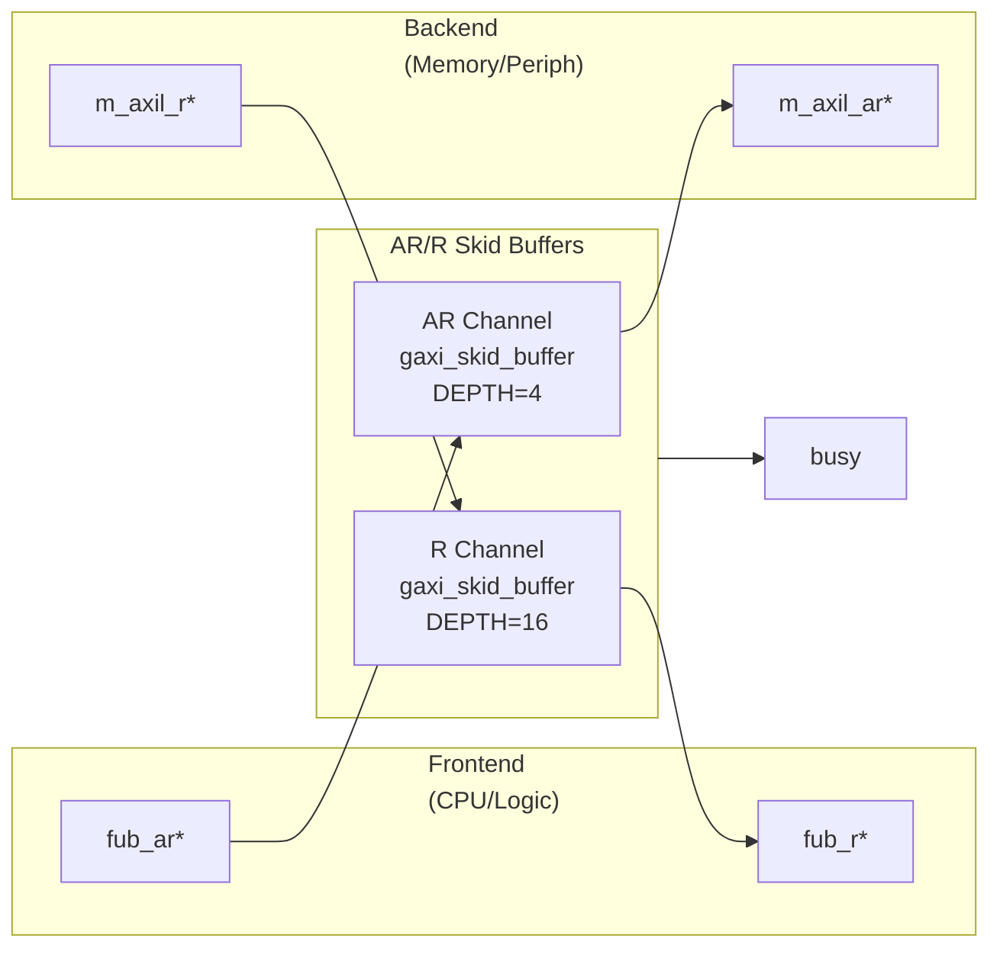

<!-- RTL Design Sherpa Documentation Header -->
<table>
<tr>
<td width="80">
  <a href="https://github.com/sean-galloway/RTLDesignSherpa">
    
  </a>
</td>
<td>
  <strong>RTL Design Sherpa</strong> · <em>Learning Hardware Design Through Practice</em><br>
  <sub>
    <a href="https://github.com/sean-galloway/RTLDesignSherpa">GitHub</a> ·
    <a href="https://github.com/sean-galloway/RTLDesignSherpa/blob/main/docs/DOCUMENTATION_INDEX.md">Documentation Index</a> ·
    <a href="https://github.com/sean-galloway/RTLDesignSherpa/blob/main/LICENSE">MIT License</a>
  </sub>
</td>
</tr>
</table>

---

<!-- End Header -->

# AXIL4 Master Read

**Module:** `axil4_master_rd.sv`
**Location:** `rtl/amba/axil4/`
**Status:** ✅ Production Ready

---

## Overview

The AXIL4 Master Read module provides a buffered AXI4-Lite read interface for master devices. AXI4-Lite is a simplified subset of AXI4 designed for control register access with reduced signal count and single-beat transactions only.

### Key Features

- ✅ **AXI4-Lite Protocol:** Simplified read-only interface (AR and R channels)
- ✅ **Single-Beat Transactions:** No burst support (always 1 transfer)
- ✅ **Buffered Channels:** Configurable skid buffers for timing closure
- ✅ **Elastic Buffering:** Decouples frontend and backend timing
- ✅ **Activity Monitoring:** Busy signal for clock gating
- ✅ **Minimal Latency:** 1-cycle buffer overhead per channel

---

## Parameters

| Parameter | Type | Default | Description |
|-----------|------|---------|-------------|
| `AXIL_ADDR_WIDTH` | int | 32 | Address bus width (typically 32) |
| `AXIL_DATA_WIDTH` | int | 32 | Data bus width (32 or 64) |
| `SKID_DEPTH_AR` | int | 2 | AR channel buffer depth (2^N entries) |
| `SKID_DEPTH_R` | int | 4 | R channel buffer depth (2^N entries) |

### Derived Parameters

| Parameter | Calculation | Description |
|-----------|-------------|-------------|
| `AW` | AXIL_ADDR_WIDTH | Internal address width alias |
| `DW` | AXIL_DATA_WIDTH | Internal data width alias |
| `ARSize` | AW+3 | AR packet size (addr + prot) |
| `RSize` | DW+2 | R packet size (data + resp) |

---

## Port Groups

### Clock and Reset

| Port | Direction | Width | Description |
|------|-----------|-------|-------------|
| `aclk` | Input | 1 | AXI clock |
| `aresetn` | Input | 1 | Active-low asynchronous reset |

### Frontend AXI4-Lite Read Interface (Input Side)

**Read Address Channel (AR):**
| Port | Direction | Width | Description |
|------|-----------|-------|-------------|
| `fub_araddr` | Input | AW | Read address |
| `fub_arprot` | Input | 3 | Protection attributes |
| `fub_arvalid` | Input | 1 | Address valid |
| `fub_arready` | Output | 1 | Address ready (from buffer) |

**Read Data Channel (R):**
| Port | Direction | Width | Description |
|------|-----------|-------|-------------|
| `fub_rdata` | Output | DW | Read data |
| `fub_rresp` | Output | 2 | Read response (OKAY, SLVERR, DECERR) |
| `fub_rvalid` | Output | 1 | Data valid (from buffer) |
| `fub_rready` | Input | 1 | Data ready |

### Backend AXI4-Lite Master Interface (Output Side)

**Read Address Channel (AR):**
| Port | Direction | Width | Description |
|------|-----------|-------|-------------|
| `m_axil_araddr` | Output | AW | Read address (to slave) |
| `m_axil_arprot` | Output | 3 | Protection attributes |
| `m_axil_arvalid` | Output | 1 | Address valid (from buffer) |
| `m_axil_arready` | Input | 1 | Address ready (from slave) |

**Read Data Channel (R):**
| Port | Direction | Width | Description |
|------|-----------|-------|-------------|
| `m_axil_rdata` | Input | DW | Read data (from slave) |
| `m_axil_rresp` | Input | 2 | Read response |
| `m_axil_rvalid` | Input | 1 | Data valid (from slave) |
| `m_axil_rready` | Output | 1 | Data ready (to slave) |

### Status Outputs

| Port | Direction | Width | Description |
|------|-----------|-------|-------------|
| `busy` | Output | 1 | Interface active (for clock gating) |

---

## Module Architecture



---

## Signal Flow

### Read Transaction Sequence

```
Cycle 1:  fub_araddr=0x1000, fub_arvalid=1, fub_arprot=0
          fub_arready=1 (buffer accepts)

Cycle 2:  AR buffer forwards to backend:
          m_axil_araddr=0x1000, m_axil_arvalid=1
          m_axil_arready=1 (slave accepts)

Cycle 3-5: Slave processes read

Cycle 6:  m_axil_rdata=0xDEADBEEF, m_axil_rresp=OKAY
          m_axil_rvalid=1, m_axil_rready=1 (R buffer accepts)

Cycle 7:  R buffer forwards to frontend:
          fub_rdata=0xDEADBEEF, fub_rresp=OKAY
          fub_rvalid=1, fub_rready=1 (frontend accepts)
```

---

## Usage Example

### Basic Integration

```systemverilog
axil4_master_rd #(
    .AXIL_ADDR_WIDTH(32),
    .AXIL_DATA_WIDTH(32),
    .SKID_DEPTH_AR(2),      // 4 entries
    .SKID_DEPTH_R(4)        // 16 entries
) u_axil_master_rd (
    .aclk           (axi_clk),
    .aresetn        (axi_resetn),

    // Frontend interface (from CPU)
    .fub_araddr     (cpu_araddr),
    .fub_arprot     (cpu_arprot),
    .fub_arvalid    (cpu_arvalid),
    .fub_arready    (cpu_arready),

    .fub_rdata      (cpu_rdata),
    .fub_rresp      (cpu_rresp),
    .fub_rvalid     (cpu_rvalid),
    .fub_rready     (cpu_rready),

    // Backend interface (to peripheral/memory)
    .m_axil_araddr  (periph_araddr),
    .m_axil_arprot  (periph_arprot),
    .m_axil_arvalid (periph_arvalid),
    .m_axil_arready (periph_arready),

    .m_axil_rdata   (periph_rdata),
    .m_axil_rresp   (periph_rresp),
    .m_axil_rvalid  (periph_rvalid),
    .m_axil_rready  (periph_rready),

    // Status
    .busy           (rd_busy)
);
```

### Register Read Example

```systemverilog
// Read from control register at 0x1000
initial begin
    @(posedge aclk);
    fub_araddr  = 32'h1000;
    fub_arprot  = 3'b000;  // Unprivileged, secure, data access
    fub_arvalid = 1'b1;

    @(posedge aclk);
    while (!fub_arready) @(posedge aclk);  // Wait for buffer accept
    fub_arvalid = 1'b0;

    // Wait for read data
    fub_rready = 1'b1;
    @(posedge aclk);
    while (!fub_rvalid) @(posedge aclk);

    $display("Read data: 0x%08x, RRESP: %0d", fub_rdata, fub_rresp);
end
```

---

## Design Notes

### AXI4-Lite Protocol Constraints

**Single-Beat Only:**
- No burst support (implicitly ARLEN=0, ARSIZE=log2(DW/8))
- Each AR transaction results in exactly 1 R transaction
- No RLAST signal (always last)

**No Out-of-Order:**
- No ARID/RID signals
- Responses always in order
- Simpler transaction tracking

**Reduced Signals:**
- No ARCACHE, ARQOS, ARREGION, ARLOCK, ARSIZE, ARLEN, ARBURST
- Only ARADDR and ARPROT for control

### Buffer Depth Selection

**AR Channel (Addresses):**
- **SKID_DEPTH_AR = 2** (4 entries): Typical for control registers
- Increase if many back-to-back reads with slow slave response

**R Channel (Data):**
- **SKID_DEPTH_R = 4** (16 entries): Accommodates pipeline latency
- Increase for high-latency backends (DRAM, off-chip peripherals)

### Busy Signal

**Asserted when:**
- AR buffer has pending addresses (`int_ar_count > 0`)
- R buffer has pending data (`int_r_count > 0`)
- Frontend presenting new address (`fub_arvalid`)
- Backend presenting new data (`m_axil_rvalid`)

**Use for:**
- Clock gating control (see `axil4_master_rd_cg`)
- Power management
- Interface idle detection

### PROT Encoding

| ARPROT[2:0] | Privilege | Security | Type |
|-------------|-----------|----------|------|
| 3'b000 | Unprivileged | Secure | Data |
| 3'b001 | Unprivileged | Secure | Instruction |
| 3'b010 | Unprivileged | Non-secure | Data |
| 3'b011 | Unprivileged | Non-secure | Instruction |
| 3'b100 | Privileged | Secure | Data |
| 3'b101 | Privileged | Secure | Instruction |
| 3'b110 | Privileged | Non-secure | Data |
| 3'b111 | Privileged | Non-secure | Instruction |

**Typical:** `3'b000` (unprivileged secure data) for most peripherals

---

## Performance Characteristics

### Latency

| Path | Cycles | Notes |
|------|--------|-------|
| Frontend → Backend (AR) | 1 | Skid buffer overhead |
| Backend → Frontend (R) | 1 | Skid buffer overhead |
| Total read latency | Slave latency + 2 | AR + Slave + R |

### Throughput

| Scenario | Rate | Notes |
|----------|------|-------|
| Back-to-back reads | 1 read/cycle | If buffers not stalled |
| Typical peripheral | 1 read/N cycles | N = slave response time |

### Resource Usage

| Resource | Count | Notes |
|----------|-------|-------|
| LUTs | ~200 | Approximate (32-bit) |
| FFs | ~150 | Buffer state + control |
| BRAM | 0 | Uses distributed RAM |

---

## Related Modules

### Core Modules
- **[axil4_master_wr](axil4_master_wr.md)** - Write master counterpart
- **[axil4_slave_rd](axil4_slave_rd.md)** - Slave read interface
- **[axil4_slave_wr](axil4_slave_wr.md)** - Slave write interface

### Monitor Modules
- **[axil4_master_rd_mon](axil4_master_rd_mon.md)** - Master read with monitoring

### Clock-Gated Variants
- **[axil4_master_rd_cg](axil4_clock_gating_guide.md)** - Clock-gated version

### Supporting Infrastructure
- **gaxi_skid_buffer** - Elastic buffering (rtl/amba/gaxi/)

---

## References

### Specifications
- ARM IHI 0022E: AMBA AXI and ACE Protocol Specification
- Chapter 4: AXI4-Lite (simplified subset)

### Documentation
- **[RTLAmba Overview](../overview.md)** - Complete AMBA subsystem
- **[AXI4 Master Read](../axi4/axi4_master_rd.md)** - Full AXI4 comparison

### Source Code
- RTL: `rtl/amba/axil4/axil4_master_rd.sv`
- Tests: `val/amba/test_axil4_master_rd.py`
- Framework: `bin/CocoTBFramework/components/axil4/`

---

**Last Updated:** 2025-10-20

---

## Navigation

- **[← Back to AXIL4 Index](README.md)**
- **[← Back to RTLAmba Index](../index.md)**
- **[← Back to Main Documentation Index](../../index.md)**
