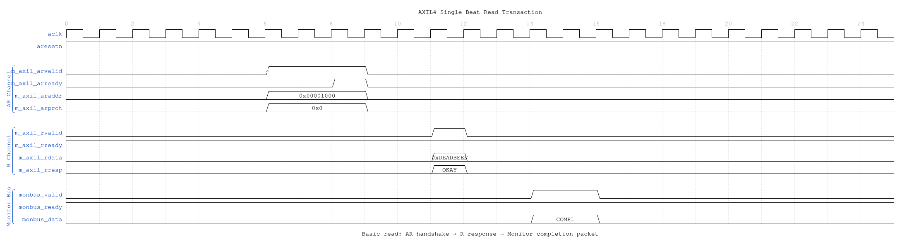
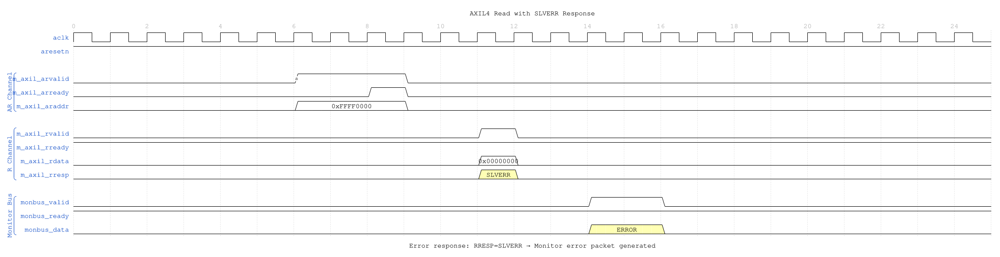
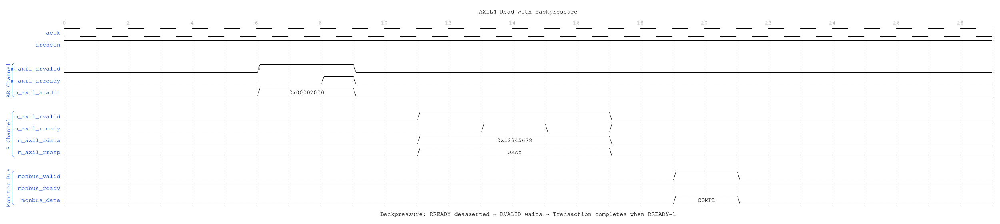

<!-- RTL Design Sherpa Documentation Header -->
<table>
<tr>
<td width="80">
  <a href="https://github.com/sean-galloway/RTLDesignSherpa">
    
  </a>
</td>
<td>
  <strong>RTL Design Sherpa</strong> · <em>Learning Hardware Design Through Practice</em><br>
  <sub>
    <a href="https://github.com/sean-galloway/RTLDesignSherpa">GitHub</a> ·
    <a href="https://github.com/sean-galloway/RTLDesignSherpa/blob/main/docs/DOCUMENTATION_INDEX.md">Documentation Index</a> ·
    <a href="https://github.com/sean-galloway/RTLDesignSherpa/blob/main/LICENSE">MIT License</a>
  </sub>
</td>
</tr>
</table>

---

<!-- End Header -->

# AXIL4 Master Read with Monitoring

**Module:** `axil4_master_rd_mon.sv`
**Location:** `rtl/amba/axil4/`
**Status:** ✅ Production Ready

---

## Overview

Combines **[axil4_master_rd](axil4_master_rd.md)** with the core **axi_monitor_filtered** for transaction monitoring. Simplified for AXI4-Lite (single-beat, no burst, fixed ID=0).

### Key Features

- ✅ All features of base **axil4_master_rd** module
- ✅ **Integrated Monitoring:** Uses shared axi_monitor_filtered (rtl/amba/shared/)
- ✅ **3-Level Filtering:** Packet type masks, error routing, event masking
- ✅ **Error Detection:** Protocol violations, timeouts, orphans
- ✅ **64-bit Monitor Bus:** Standardized packet format
- ✅ **Reduced Complexity:** MAX_TRANSACTIONS=8 (vs 16-32 for AXI4)

---

## Additional Parameters (Beyond Base Module)

| Parameter | Type | Default | Description |
|-----------|------|---------|-------------|
| `UNIT_ID` | int | 1 | 4-bit unit identifier (masters typically=1) |
| `AGENT_ID` | int | 10 | 8-bit agent identifier for this monitor |
| `MAX_TRANSACTIONS` | int | 8 | Max outstanding transactions (reduced for AXIL) |
| `ENABLE_FILTERING` | bit | 1 | Enable 3-level packet filtering |
| `ADD_PIPELINE_STAGE` | bit | 0 | Add register stage for timing closure |

---

## Additional Ports (Beyond Base Module)

### Monitor Configuration
| Port | Direction | Width | Description |
|------|-----------|-------|-------------|
| `cfg_monitor_enable` | Input | 1 | Enable monitoring |
| `cfg_error_enable` | Input | 1 | Enable error packets |
| `cfg_timeout_enable` | Input | 1 | Enable timeout detection |
| `cfg_perf_enable` | Input | 1 | Enable performance packets |
| `cfg_timeout_cycles` | Input | 16 | Timeout threshold (cycles) |
| `cfg_latency_threshold` | Input | 32 | Latency alert threshold |

### Filtering Masks (7 masks total)
| Port | Description |
|------|-------------|
| `cfg_axi_pkt_mask` | Drop mask for packet types |
| `cfg_axi_err_select` | Error select mask |
| `cfg_axi_timeout_mask` | Timeout event mask |
| `cfg_axi_compl_mask` | Completion event mask |
| `cfg_axi_perf_mask` | Performance event mask |
| `cfg_axi_debug_mask` | Debug event mask |
| `cfg_axi_full_mask` | Full event mask |

### Monitor Bus Output
| Port | Direction | Width | Description |
|------|-----------|-------|-------------|
| `monbus_pkt_valid` | Output | 1 | Monitor packet valid |
| `monbus_pkt_ready` | Input | 1 | Downstream ready |
| `monbus_pkt_data` | Output | 64 | Monitor packet (64-bit format) |

### Status
| Port | Direction | Width | Description |
|------|-----------|-------|-------------|
| `busy` | Output | 1 | Interface active |
| `active_transactions` | Output | 8 | Current outstanding count |
| `error_count` | Output | 16 | Cumulative error count |

---

## Usage Example

```systemverilog
axil4_master_rd_mon #(
    // Base parameters
    .AXIL_ADDR_WIDTH(32),
    .AXIL_DATA_WIDTH(32),
    .SKID_DEPTH_AR(2),
    .SKID_DEPTH_R(4),

    // Monitor parameters
    .UNIT_ID(1),
    .AGENT_ID(10),
    .MAX_TRANSACTIONS(8),
    .ENABLE_FILTERING(1)
) u_axil_rd_mon (
    .aclk(axi_clk),
    .aresetn(axi_resetn),

    // AXIL interfaces (same as axil4_master_rd)
    .fub_axil_araddr(cpu_araddr),
    // ... other AR/R signals ...

    // Monitor configuration
    .cfg_monitor_enable(1'b1),
    .cfg_error_enable(1'b1),
    .cfg_timeout_enable(1'b1),
    .cfg_perf_enable(1'b0),      // Avoid congestion
    .cfg_timeout_cycles(16'd1000),
    .cfg_latency_threshold(32'd500),

    // Filtering masks
    .cfg_axi_pkt_mask(16'b1111_1111_0000_0011),
    // ... other masks ...

    // Monitor bus
    .monbus_pkt_valid(mon_valid),
    .monbus_pkt_ready(mon_ready),
    .monbus_pkt_data(mon_data)
);
```

---

## Timing Diagrams

### Scenario 1: Single-Beat Read Transaction



**WaveJSON:** [single_beat_read_001.json](../../assets/WAVES/axil4_master_rd_mon/single_beat_read_001.json)

**Key Observations:**
- AR channel handshake: ARVALID asserted, ARREADY responds
- R channel response: Slave returns data with RRESP=OKAY
- Monitor generates completion packet when R phase completes
- Single-beat transaction: No burst length (implicit ARLEN=0)

### Scenario 2: Read Error (SLVERR)



**WaveJSON:** [read_error_slverr_001.json](../../assets/WAVES/axil4_master_rd_mon/read_error_slverr_001.json)

**Key Observations:**
- Invalid address triggers RRESP=SLVERR
- Monitor detects error response and generates ERROR packet
- Transaction completes despite error (data may be undefined)
- Error packet includes address and response code

### Scenario 3: Read with Backpressure



**WaveJSON:** [read_backpressure_001.json](../../assets/WAVES/axil4_master_rd_mon/read_backpressure_001.json)

**Key Observations:**
- Master not ready: RREADY deasserted
- Slave holds RVALID until RREADY=1
- Monitor tracks extended latency
- Completion packet generated after handshake

---

## AXI4-Lite Simplifications

**vs Full AXI4 Monitoring:**
- **Fixed ID:** Always ID=0 (no out-of-order tracking)
- **Single-Beat:** No burst handling (ARLEN implicitly 0)
- **Reduced Tables:** MAX_TRANSACTIONS=8 (vs 16-32 for AXI4)
- **Same Infrastructure:** Uses axi_monitor_filtered like AXI4

---

## Related Documentation

### Base Module
- **[axil4_master_rd](axil4_master_rd.md)** - Functional module documentation

### Monitor Infrastructure
- **[AXI4 Master Read Mon](../axi4/axi4_master_rd_mon.md)** - Full AXI4 monitoring (detailed reference)
- **axi_monitor_filtered** - Core monitor engine (rtl/amba/shared/)
- **[Monitor Configuration Guide](../../AXI_Monitor_Configuration_Guide.md)** - Configuration strategies

### Related Modules
- **[axil4_master_wr_mon](axil4_master_wr_mon.md)** - Master write with monitoring
- **[axil4_slave_rd_mon](axil4_slave_rd_mon.md)** - Slave read with monitoring

---

**Last Updated:** 2025-10-24

---

## Navigation

- **[← Back to AXIL4 Index](README.md)**
- **[← Back to RTLAmba Index](../README.md)**
