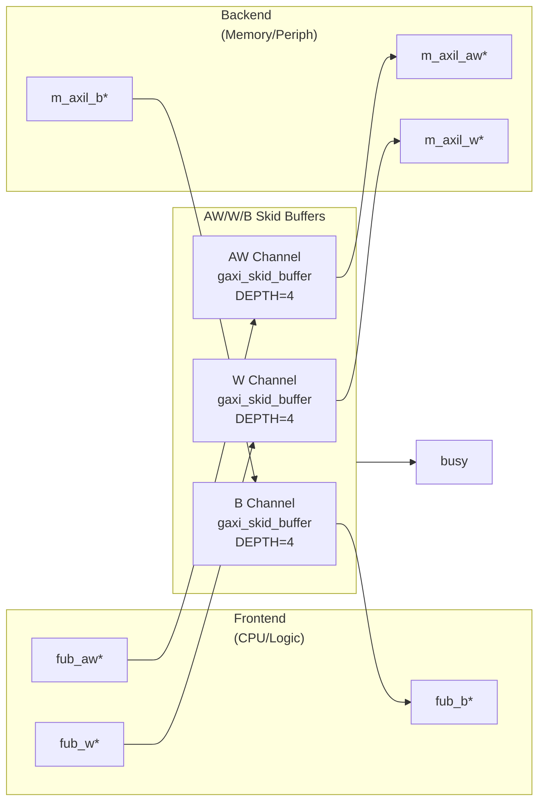

<!-- RTL Design Sherpa Documentation Header -->
<table>
<tr>
<td width="80">
  <a href="https://github.com/sean-galloway/RTLDesignSherpa">
    
  </a>
</td>
<td>
  <strong>RTL Design Sherpa</strong> · <em>Learning Hardware Design Through Practice</em><br>
  <sub>
    <a href="https://github.com/sean-galloway/RTLDesignSherpa">GitHub</a> ·
    <a href="https://github.com/sean-galloway/RTLDesignSherpa/blob/main/docs/DOCUMENTATION_INDEX.md">Documentation Index</a> ·
    <a href="https://github.com/sean-galloway/RTLDesignSherpa/blob/main/LICENSE">MIT License</a>
  </sub>
</td>
</tr>
</table>

---

<!-- End Header -->

# AXIL4 Master Write

**Module:** `axil4_master_wr.sv`
**Location:** `rtl/amba/axil4/`
**Status:** ✅ Production Ready

---

## Overview

The AXIL4 Master Write module provides a buffered AXI4-Lite write interface for master devices. AXI4-Lite is a simplified subset of AXI4 designed for control register access with reduced signal count and single-beat transactions only.

### Key Features

- ✅ **AXI4-Lite Protocol:** Simplified write-only interface (AW, W, B channels)
- ✅ **Single-Beat Transactions:** No burst support (always 1 transfer)
- ✅ **Buffered Channels:** Configurable skid buffers for all 3 channels
- ✅ **Byte Strobes:** WSTRB support for partial word writes
- ✅ **Elastic Buffering:** Decouples frontend and backend timing
- ✅ **Activity Monitoring:** Busy signal for clock gating
- ✅ **Minimal Latency:** 1-cycle buffer overhead per channel

---

## Parameters

| Parameter | Type | Default | Description |
|-----------|------|---------|-------------|
| `AXIL_ADDR_WIDTH` | int | 32 | Address bus width (typically 32) |
| `AXIL_DATA_WIDTH` | int | 32 | Data bus width (32 or 64) |
| `SKID_DEPTH_AW` | int | 2 | AW channel buffer depth (2^N entries) |
| `SKID_DEPTH_W` | int | 2 | W channel buffer depth (2^N entries) |
| `SKID_DEPTH_B` | int | 2 | B channel buffer depth (2^N entries) |

### Derived Parameters

| Parameter | Calculation | Description |
|-----------|-------------|-------------|
| `AW` | AXIL_ADDR_WIDTH | Internal address width alias |
| `DW` | AXIL_DATA_WIDTH | Internal data width alias |
| `AWSize` | AW+3 | AW packet size (addr + prot) |
| `WSize` | DW+(DW/8) | W packet size (data + strb) |
| `BSize` | 2 | B packet size (resp only) |

---

## Port Groups

### Clock and Reset

| Port | Direction | Width | Description |
|------|-----------|-------|-------------|
| `aclk` | Input | 1 | AXI clock |
| `aresetn` | Input | 1 | Active-low asynchronous reset |

### Frontend AXI4-Lite Write Interface (Input Side)

**Write Address Channel (AW):**
| Port | Direction | Width | Description |
|------|-----------|-------|-------------|
| `fub_awaddr` | Input | AW | Write address |
| `fub_awprot` | Input | 3 | Protection attributes |
| `fub_awvalid` | Input | 1 | Address valid |
| `fub_awready` | Output | 1 | Address ready (from buffer) |

**Write Data Channel (W):**
| Port | Direction | Width | Description |
|------|-----------|-------|-------------|
| `fub_wdata` | Input | DW | Write data |
| `fub_wstrb` | Input | DW/8 | Write strobes (byte lane enables) |
| `fub_wvalid` | Input | 1 | Data valid |
| `fub_wready` | Output | 1 | Data ready (from buffer) |

**Write Response Channel (B):**
| Port | Direction | Width | Description |
|------|-----------|-------|-------------|
| `fub_bresp` | Output | 2 | Write response (OKAY, SLVERR, DECERR) |
| `fub_bvalid` | Output | 1 | Response valid (from buffer) |
| `fub_bready` | Input | 1 | Response ready |

### Backend AXI4-Lite Master Interface (Output Side)

**Write Address Channel (AW):**
| Port | Direction | Width | Description |
|------|-----------|-------|-------------|
| `m_axil_awaddr` | Output | AW | Write address (to slave) |
| `m_axil_awprot` | Output | 3 | Protection attributes |
| `m_axil_awvalid` | Output | 1 | Address valid (from buffer) |
| `m_axil_awready` | Input | 1 | Address ready (from slave) |

**Write Data Channel (W):**
| Port | Direction | Width | Description |
|------|-----------|-------|-------------|
| `m_axil_wdata` | Output | DW | Write data (to slave) |
| `m_axil_wstrb` | Output | DW/8 | Write strobes |
| `m_axil_wvalid` | Output | 1 | Data valid (from buffer) |
| `m_axil_wready` | Input | 1 | Data ready (from slave) |

**Write Response Channel (B):**
| Port | Direction | Width | Description |
|------|-----------|-------|-------------|
| `m_axil_bresp` | Input | 2 | Write response (from slave) |
| `m_axil_bvalid` | Input | 1 | Response valid (from slave) |
| `m_axil_bready` | Output | 1 | Response ready (to slave) |

### Status Outputs

| Port | Direction | Width | Description |
|------|-----------|-------|-------------|
| `busy` | Output | 1 | Interface active (for clock gating) |

---

## Module Architecture



---

## Signal Flow

### Write Transaction Sequence

```
Cycle 1:  fub_awaddr=0x2000, fub_awvalid=1, fub_awprot=0
          fub_wdata=0xCAFEBABE, fub_wstrb=4'b1111, fub_wvalid=1
          fub_awready=1, fub_wready=1 (buffers accept)

Cycle 2:  Buffers forward to backend:
          m_axil_awaddr=0x2000, m_axil_awvalid=1
          m_axil_wdata=0xCAFEBABE, m_axil_wstrb=4'b1111, m_axil_wvalid=1
          m_axil_awready=1, m_axil_wready=1 (slave accepts)

Cycle 3-5: Slave processes write

Cycle 6:  m_axil_bresp=OKAY, m_axil_bvalid=1
          m_axil_bready=1 (B buffer accepts)

Cycle 7:  B buffer forwards to frontend:
          fub_bresp=OKAY, fub_bvalid=1
          fub_bready=1 (frontend accepts)
```

---

## Usage Example

### Basic Integration

```systemverilog
axil4_master_wr #(
    .AXIL_ADDR_WIDTH(32),
    .AXIL_DATA_WIDTH(32),
    .SKID_DEPTH_AW(2),      // 4 entries
    .SKID_DEPTH_W(2),       // 4 entries
    .SKID_DEPTH_B(2)        // 4 entries
) u_axil_master_wr (
    .aclk           (axi_clk),
    .aresetn        (axi_resetn),

    // Frontend interface (from CPU)
    .fub_awaddr     (cpu_awaddr),
    .fub_awprot     (cpu_awprot),
    .fub_awvalid    (cpu_awvalid),
    .fub_awready    (cpu_awready),

    .fub_wdata      (cpu_wdata),
    .fub_wstrb      (cpu_wstrb),
    .fub_wvalid     (cpu_wvalid),
    .fub_wready     (cpu_wready),

    .fub_bresp      (cpu_bresp),
    .fub_bvalid     (cpu_bvalid),
    .fub_bready     (cpu_bready),

    // Backend interface (to peripheral/memory)
    .m_axil_awaddr  (periph_awaddr),
    .m_axil_awprot  (periph_awprot),
    .m_axil_awvalid (periph_awvalid),
    .m_axil_awready (periph_awready),

    .m_axil_wdata   (periph_wdata),
    .m_axil_wstrb   (periph_wstrb),
    .m_axil_wvalid  (periph_wvalid),
    .m_axil_wready  (periph_wready),

    .m_axil_bresp   (periph_bresp),
    .m_axil_bvalid  (periph_bvalid),
    .m_axil_bready  (periph_bready),

    // Status
    .busy           (wr_busy)
);
```

### Register Write Example

```systemverilog
// Write to control register at 0x2000
initial begin
    @(posedge aclk);

    // Present address and data simultaneously
    fub_awaddr  = 32'h2000;
    fub_awprot  = 3'b000;
    fub_awvalid = 1'b1;

    fub_wdata   = 32'hDEADBEEF;
    fub_wstrb   = 4'b1111;  // All bytes valid
    fub_wvalid  = 1'b1;

    @(posedge aclk);
    while (!(fub_awready && fub_wready)) @(posedge aclk);
    fub_awvalid = 1'b0;
    fub_wvalid  = 1'b0;

    // Wait for write response
    fub_bready = 1'b1;
    @(posedge aclk);
    while (!fub_bvalid) @(posedge aclk);

    $display("Write response: BRESP=%0d", fub_bresp);
end
```

### Partial Write Example (Byte Strobes)

```systemverilog
// Write only upper 16 bits to 32-bit register
fub_awaddr  = 32'h2004;
fub_awprot  = 3'b000;
fub_awvalid = 1'b1;

fub_wdata   = 32'hABCD0000;  // Data in upper half
fub_wstrb   = 4'b1100;       // Only upper 2 bytes valid
fub_wvalid  = 1'b1;

// Result: Register[31:16] = 0xABCD, Register[15:0] unchanged
```

---

## Design Notes

### AXI4-Lite Protocol Constraints

**Single-Beat Only:**
- No burst support (implicitly AWLEN=0, AWSIZE=log2(DW/8))
- Each AW+W transaction results in exactly 1 B response
- No WLAST signal (always last and only beat)

**No Out-of-Order:**
- No AWID/BID signals
- Responses always in order
- AW and W can arrive in any order (no dependency)

**Reduced Signals:**
- No AWCACHE, AWQOS, AWREGION, AWLOCK, AWSIZE, AWLEN, AWBURST
- Only AWADDR and AWPROT for control

### Buffer Depth Selection

**AW Channel (Addresses):**
- **SKID_DEPTH_AW = 2** (4 entries): Typical for control registers
- Increase if many back-to-back writes with slow slave

**W Channel (Data):**
- **SKID_DEPTH_W = 2** (4 entries): Matches AW depth
- Should be >= SKID_DEPTH_AW to avoid W channel stalls

**B Channel (Responses):**
- **SKID_DEPTH_B = 2** (4 entries): Responses are single-beat
- Smaller depth acceptable if frontend can always accept

### Write Strobe (WSTRB) Usage

**32-bit Data Width:**
| WSTRB[3:0] | Bytes Written | Use Case |
|------------|---------------|----------|
| 4'b0001 | [7:0] | Byte write to offset 0 |
| 4'b0010 | [15:8] | Byte write to offset 1 |
| 4'b0011 | [15:0] | Half-word write |
| 4'b1100 | [31:16] | Upper half-word |
| 4'b1111 | [31:0] | Full word write |

**64-bit Data Width:**
| WSTRB[7:0] | Bytes Written | Use Case |
|------------|---------------|----------|
| 8'b0000_0001 | [7:0] | Byte write |
| 8'b0000_1111 | [31:0] | Lower word |
| 8'b1111_0000 | [63:32] | Upper word |
| 8'b1111_1111 | [63:0] | Full double-word |

### Busy Signal

**Asserted when:**
- AW buffer has pending addresses (`int_aw_count > 0`)
- W buffer has pending data (`int_w_count > 0`)
- B buffer has pending responses (`int_b_count > 0`)
- Frontend presenting new transaction (`fub_awvalid || fub_wvalid`)
- Backend presenting response (`m_axil_bvalid`)

**Use for:**
- Clock gating control (see `axil4_master_wr_cg`)
- Power management
- Interface idle detection

---

## Performance Characteristics

### Latency

| Path | Cycles | Notes |
|------|--------|-------|
| Frontend → Backend (AW) | 1 | Skid buffer overhead |
| Frontend → Backend (W) | 1 | Skid buffer overhead |
| Backend → Frontend (B) | 1 | Skid buffer overhead |
| Total write latency | Slave latency + 3 | AW + W + Slave + B |

### Throughput

| Scenario | Rate | Notes |
|----------|------|-------|
| Back-to-back writes | 1 write/cycle | If buffers not stalled |
| Typical peripheral | 1 write/N cycles | N = slave response time |

### Resource Usage

| Resource | Count | Notes |
|----------|-------|-------|
| LUTs | ~300 | Approximate (32-bit, 3 channels) |
| FFs | ~250 | Buffer state + control |
| BRAM | 0 | Uses distributed RAM |

---

## Related Modules

### Core Modules
- **[axil4_master_rd](axil4_master_rd.md)** - Read master counterpart
- **[axil4_slave_rd](axil4_slave_rd.md)** - Slave read interface
- **[axil4_slave_wr](axil4_slave_wr.md)** - Slave write interface

### Monitor Modules
- **[axil4_master_wr_mon](axil4_master_wr_mon.md)** - Master write with monitoring

### Clock-Gated Variants
- **[axil4_master_wr_cg](axil4_clock_gating_guide.md)** - Clock-gated version

### Supporting Infrastructure
- **gaxi_skid_buffer** - Elastic buffering (rtl/amba/gaxi/)

---

## References

### Specifications
- ARM IHI 0022E: AMBA AXI and ACE Protocol Specification
- Chapter 4: AXI4-Lite (simplified subset)

### Documentation
- **[RTLAmba Overview](../overview.md)** - Complete AMBA subsystem
- **[AXI4 Master Write](../axi4/axi4_master_wr.md)** - Full AXI4 comparison

### Source Code
- RTL: `rtl/amba/axil4/axil4_master_wr.sv`
- Tests: `val/amba/test_axil4_master_wr.py`
- Framework: `bin/CocoTBFramework/components/axil4/`

---

**Last Updated:** 2025-10-20

---

## Navigation

- **[← Back to AXIL4 Index](README.md)**
- **[← Back to RTLAmba Index](../README.md)**
- **[← Back to Main Documentation Index](../../index.md)**
