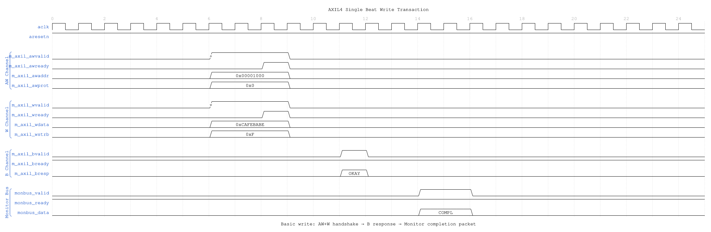
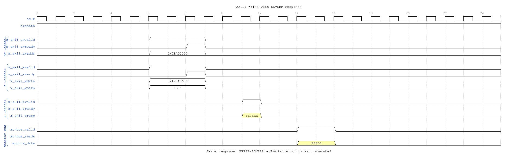
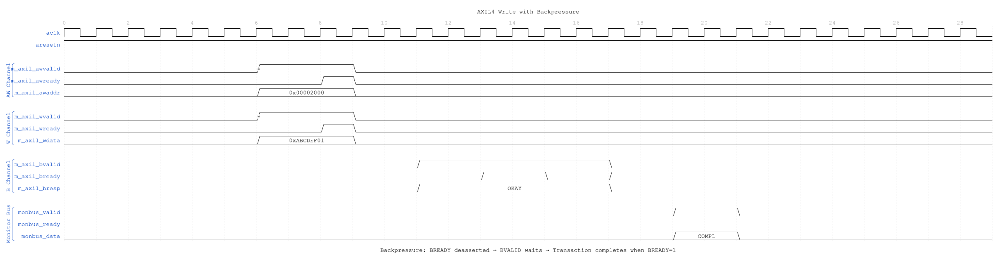

# AXIL4 Master Write with Monitoring

**Module:** `axil4_master_wr_mon.sv`
**Location:** `rtl/amba/axil4/`
**Status:** ✅ Production Ready

---

## Overview

Combines **[axil4_master_wr](axil4_master_wr.md)** with **axi_monitor_filtered** for write transaction monitoring.

### Key Features

- ✅ All features of **axil4_master_wr**
- ✅ Integrated write monitoring (AW, W, B channels)
- ✅ 3-level filtering and error detection
- ✅ Simplified for AXI4-Lite (MAX_TRANSACTIONS=8)

---

## Additional Parameters

Identical to **[axil4_master_rd_mon](axil4_master_rd_mon.md)**:
- `UNIT_ID`, `AGENT_ID`, `MAX_TRANSACTIONS`, `ENABLE_FILTERING`, `ADD_PIPELINE_STAGE`

---

## Additional Ports

Same as **[axil4_master_rd_mon](axil4_master_rd_mon.md)**:
- Monitor configuration inputs (7 cfg signals)
- Filtering masks (7 masks)
- Monitor bus output (valid/ready/data)
- Status outputs (busy, active_transactions, error_count)

---

## Usage

```systemverilog
axil4_master_wr_mon #(
    .AXIL_ADDR_WIDTH(32),
    .AXIL_DATA_WIDTH(32),
    .UNIT_ID(1),
    .AGENT_ID(11),  // Different from read monitor
    .MAX_TRANSACTIONS(8)
) u_axil_wr_mon (
    // AXIL write interfaces (AW, W, B)
    // Monitor configuration and bus
    // Same pattern as axil4_master_rd_mon
);
```

---

## Timing Diagrams

### Scenario 1: Single-Beat Write Transaction



**WaveJSON:** [single_beat_write_001.json](../../assets/WAVES/axil4_master_wr_mon/single_beat_write_001.json)

**Key Observations:**
- AW and W channels handshake simultaneously (common in AXIL)
- B channel response: Slave returns BRESP=OKAY
- Monitor generates completion packet when B phase completes
- WSTRB indicates which byte lanes are valid

### Scenario 2: Write Error (SLVERR)



**WaveJSON:** [write_error_slverr_001.json](../../assets/WAVES/axil4_master_wr_mon/write_error_slverr_001.json)

**Key Observations:**
- Invalid address triggers BRESP=SLVERR
- Monitor detects error response and generates ERROR packet
- Write data sent but not committed by slave
- Error packet includes address and response code

### Scenario 3: Write with Backpressure



**WaveJSON:** [write_backpressure_001.json](../../assets/WAVES/axil4_master_wr_mon/write_backpressure_001.json)

**Key Observations:**
- Master not ready: BREADY deasserted
- Slave holds BVALID until BREADY=1
- Monitor tracks extended write latency
- Completion packet generated after B handshake

---

## Related Modules

- **[axil4_master_wr](axil4_master_wr.md)** - Base functional module
- **[axil4_master_rd_mon](axil4_master_rd_mon.md)** - Read monitor counterpart
- **[AXI4 Master Write Mon](../axi4/axi4_master_wr_mon.md)** - Full AXI4 reference

---

**Last Updated:** 2025-10-24
