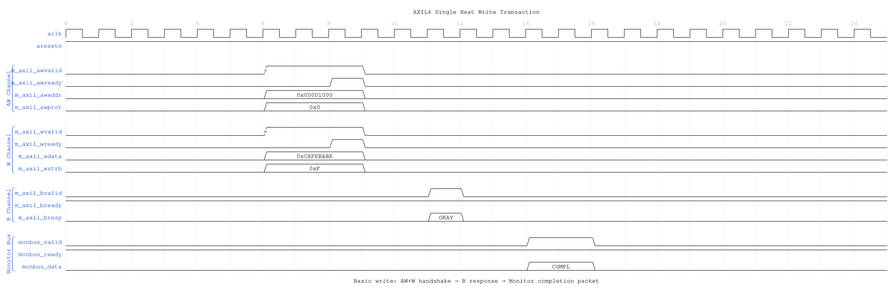
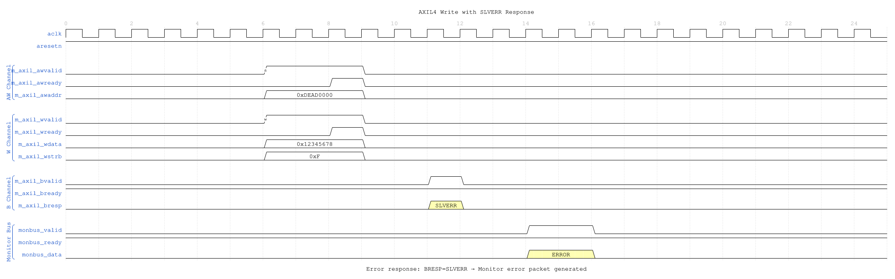
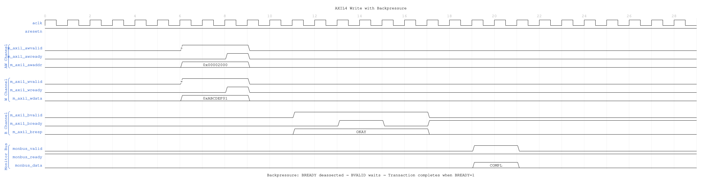

<!-- RTL Design Sherpa Documentation Header -->
<table>
<tr>
<td width="80">
  <a href="https://github.com/sean-galloway/RTLDesignSherpa">
    
  </a>
</td>
<td>
  <strong>RTL Design Sherpa</strong> · <em>Learning Hardware Design Through Practice</em><br>
  <sub>
    <a href="https://github.com/sean-galloway/RTLDesignSherpa">GitHub</a> ·
    <a href="https://github.com/sean-galloway/RTLDesignSherpa/blob/main/docs/DOCUMENTATION_INDEX.md">Documentation Index</a> ·
    <a href="https://github.com/sean-galloway/RTLDesignSherpa/blob/main/LICENSE">MIT License</a>
  </sub>
</td>
</tr>
</table>

---

<!-- End Header -->

# AXIL4 Master Write with Monitoring

**Module:** `axil4_master_wr_mon.sv`
**Location:** `rtl/amba/axil4/`
**Status:** ✅ Production Ready

---

## Overview

Combines **[axil4_master_wr](axil4_master_wr.md)** with **axi_monitor_filtered** for write transaction monitoring.

### Key Features

- ✅ All features of **axil4_master_wr**
- ✅ Integrated write monitoring (AW, W, B channels)
- ✅ 3-level filtering and error detection
- ✅ Simplified for AXI4-Lite (MAX_TRANSACTIONS=8)

---

## Additional Parameters

Identical to **[axil4_master_rd_mon](axil4_master_rd_mon.md)** including:
- `UNIT_ID`, `AGENT_ID`, `MAX_TRANSACTIONS`, `ENABLE_FILTERING`, `ADD_PIPELINE_STAGE`, `USE_MONITOR`, `N_ADDR_RANGES`

See **[axil4_master_rd_mon](axil4_master_rd_mon.md#additional-parameters)** for complete parameter descriptions.

---

## Monitor Backpressure (block_ready)

The monitor exposes a `block_ready` signal that goes low when its internal FIFO is saturated and cannot accept a new in-flight transaction. The wrapper ANDs `block_ready` into the upstream-facing `fub_axil_awready` so a saturated monitor stalls new transactions on the wire instead of dropping events.

- **Where the stall lands**: the upstream `fub_axil_awready` is forced low until the monitor drains.
- **When `USE_MONITOR=0`**: `block_ready` is internally tied high, so the wrapper imposes no stall and runs at full bandwidth.

This replaces a previous bug where `block_ready` was left unconnected and a full monitor FIFO would silently lose events.

---

## Address-Range Checker

Identical to **[axil4_master_rd_mon](axil4_master_rd_mon.md#address-range-checker)** except the checker watches AW (write address) handshakes instead of AR (read address) handshakes. The `cfg_addr_*` configuration inputs and monbus event encoding are the same. See the read monitor's Address-Range Checker section for full details.

---

## Additional Ports

Same as **[axil4_master_rd_mon](axil4_master_rd_mon.md)**:
- Monitor configuration inputs (7 cfg signals)
- Filtering masks (7 masks)
- Monitor bus output (valid/ready/data)
- Status outputs (busy, active_transactions, error_count)

---

## Usage

```systemverilog
axil4_master_wr_mon #(
    .AXIL_ADDR_WIDTH(32),
    .AXIL_DATA_WIDTH(32),
    .UNIT_ID(1),
    .AGENT_ID(11),  // Different from read monitor
    .MAX_TRANSACTIONS(8)
) u_axil_wr_mon (
    // AXIL write interfaces (AW, W, B)
    // Monitor configuration and bus
    // Same pattern as axil4_master_rd_mon
);
```

---

## Timing Diagrams

### Scenario 1: Single-Beat Write Transaction



**WaveJSON:** [single_beat_write_001.json](../../assets/WAVES/axil4_master_wr_mon/single_beat_write_001.json)

**Key Observations:**
- AW and W channels handshake simultaneously (common in AXIL)
- B channel response: Slave returns BRESP=OKAY
- Monitor generates completion packet when B phase completes
- WSTRB indicates which byte lanes are valid

### Scenario 2: Write Error (SLVERR)



**WaveJSON:** [write_error_slverr_001.json](../../assets/WAVES/axil4_master_wr_mon/write_error_slverr_001.json)

**Key Observations:**
- Invalid address triggers BRESP=SLVERR
- Monitor detects error response and generates ERROR packet
- Write data sent but not committed by slave
- Error packet includes address and response code

### Scenario 3: Write with Backpressure



**WaveJSON:** [write_backpressure_001.json](../../assets/WAVES/axil4_master_wr_mon/write_backpressure_001.json)

**Key Observations:**
- Master not ready: BREADY deasserted
- Slave holds BVALID until BREADY=1
- Monitor tracks extended write latency
- Completion packet generated after B handshake

---

## Related Modules

- **[axil4_master_wr](axil4_master_wr.md)** - Base functional module
- **[axil4_master_rd_mon](axil4_master_rd_mon.md)** - Read monitor counterpart
- **[AXI4 Master Write Mon](../axi4/axi4_master_wr_mon.md)** - Full AXI4 reference

---

**Last Updated:** 2025-10-24
