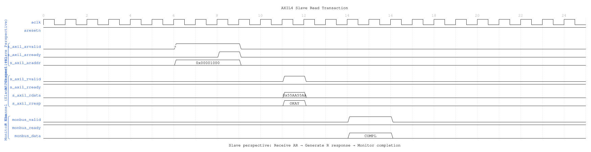
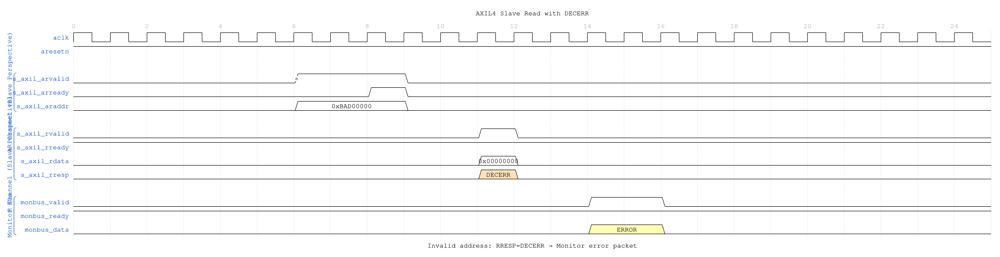
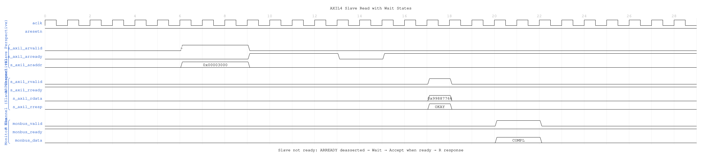

# AXIL4 Slave Read with Monitoring

**Module:** `axil4_slave_rd_mon.sv`
**Location:** `rtl/amba/axil4/`
**Status:** ✅ Production Ready

---

## Overview

Combines **[axil4_slave_rd](axil4_slave_rd.md)** with **axi_monitor_filtered** for slave-side read monitoring.

### Key Features

- ✅ All features of **axil4_slave_rd**
- ✅ Slave-side monitoring (backend latency tracking)
- ✅ 3-level filtering and error detection
- ✅ Simplified for AXI4-Lite (MAX_TRANSACTIONS=8)

---

## Additional Parameters

Identical to master monitors, but typically:
- `UNIT_ID = 2` (slaves use different unit ID)
- `AGENT_ID = 20` (slave agent IDs)

---

## Additional Ports

Same as **[axil4_master_rd_mon](axil4_master_rd_mon.md)**

---

## Usage

```systemverilog
axil4_slave_rd_mon #(
    .AXIL_ADDR_WIDTH(32),
    .AXIL_DATA_WIDTH(32),
    .UNIT_ID(2),    // Slave unit ID
    .AGENT_ID(20),  // Slave agent ID
    .MAX_TRANSACTIONS(8)
) u_axil_slave_rd_mon (
    // Slave AXIL interfaces (s_axil_*, fub_*)
    // Monitor configuration and bus
);
```

---

## Timing Diagrams

### Scenario 1: Slave Read Transaction



**WaveJSON:** [slave_read_basic_001.json](../../assets/WAVES/axil4_slave_rd_mon/slave_read_basic_001.json)

**Key Observations:**
- Slave perspective: Receive AR request from master
- Slave generates R response with data
- Monitor tracks backend read latency (AR → R delay)
- Completion packet indicates successful read

### Scenario 2: Slave Read Error (DECERR)



**WaveJSON:** [slave_read_decerr_001.json](../../assets/WAVES/axil4_slave_rd_mon/slave_read_decerr_001.json)

**Key Observations:**
- Invalid address detected by slave address decoder
- Slave returns RRESP=DECERR (decode error)
- Monitor generates ERROR packet
- Data value is don't-care when error occurs

### Scenario 3: Slave Read with Wait States



**WaveJSON:** [slave_read_wait_001.json](../../assets/WAVES/axil4_slave_rd_mon/slave_read_wait_001.json)

**Key Observations:**
- Slave not ready: ARREADY deasserted (wait states)
- Master holds ARVALID until slave accepts
- Backend read takes multiple cycles
- Monitor tracks full transaction latency

---

## Related Modules

- **[axil4_slave_rd](axil4_slave_rd.md)** - Base functional module
- **[axil4_slave_wr_mon](axil4_slave_wr_mon.md)** - Write monitor counterpart
- **[AXI4 Slave Read Mon](../axi4/axi4_slave_rd_mon.md)** - Full AXI4 reference

---

**Last Updated:** 2025-10-24
